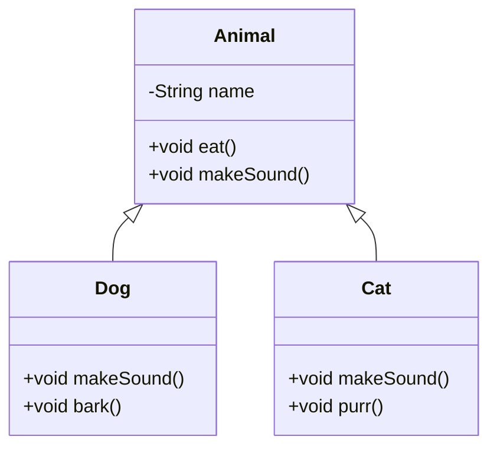

# Chapter 01 — OOP Refresher

## What & Why

Object-Oriented Programming (OOP) is the foundation of all Low-Level Design. Before diving into design patterns and SOLID principles, you need rock-solid OOP fundamentals.

**Real-world analogy:** Think of a **car blueprint** (class) vs an **actual car** (object). The blueprint defines properties (color, engine type) and behaviors (start, brake). Every car built from that blueprint is an instance with its own state.

---

## The 4 Pillars of OOP

### 1. Encapsulation
**What:** Bundle data (fields) and methods that operate on that data into a single unit (class), and restrict direct access to internals.

**Why:** Protects object state from unintended modification. You control *how* data is accessed/changed.

```java
// BAD — public fields, no control
class BankAccount {
    public double balance;  // anyone can set this to -1000
}

// GOOD — encapsulated
class BankAccount {
    private double balance;

    public double getBalance() { return balance; }

    public void deposit(double amount) {
        if (amount > 0) balance += amount;
    }
}
```

**Access Modifiers:**
| Modifier | Class | Package | Subclass | World |
|----------|-------|---------|----------|-------|
| `private` | ✅ | ❌ | ❌ | ❌ |
| default (none) | ✅ | ✅ | ❌ | ❌ |
| `protected` | ✅ | ✅ | ✅ | ❌ |
| `public` | ✅ | ✅ | ✅ | ✅ |

---

### 2. Inheritance
**What:** A class (child/subclass) inherits fields and methods from another class (parent/superclass).

**Why:** Code reuse. Define common behavior once, specialize in subclasses.

```java
class Animal {
    String name;
    void eat() { System.out.println(name + " is eating"); }
}

class Dog extends Animal {
    void bark() { System.out.println(name + " says Woof!"); }
}
```

**Key rules:**
- Java supports **single inheritance** only (one parent class)
- Use `super` to call parent constructor/methods
- A subclass *is-a* parent (`Dog` is-a `Animal`)

**When NOT to use:** Don't inherit just for code reuse — use composition if there's no true *is-a* relationship. (More on this in Chapter 04.)

---

### 3. Polymorphism
**What:** One interface, many implementations. The same method call behaves differently depending on the actual object type.

#### Compile-time (Method Overloading)
Same method name, different parameter lists. Resolved at compile time.

```java
class Calculator {
    int add(int a, int b) { return a + b; }
    double add(double a, double b) { return a + b; }
    int add(int a, int b, int c) { return a + b + c; }
}
```

#### Runtime (Method Overriding)
Subclass provides its own implementation of a parent method. Resolved at runtime via dynamic dispatch.

```java
class Animal {
    void makeSound() { System.out.println("Some sound"); }
}

class Dog extends Animal {
    @Override
    void makeSound() { System.out.println("Woof!"); }
}

class Cat extends Animal {
    @Override
    void makeSound() { System.out.println("Meow!"); }
}

// Runtime polymorphism in action
Animal a = new Dog();
a.makeSound();  // prints "Woof!" — decided at runtime
```

**Why this matters for LLD:** Polymorphism is the backbone of almost every design pattern. It lets you write code that works with abstractions, not concrete types.

---

### 4. Abstraction
**What:** Hide complex implementation details, expose only what's necessary.

**Two tools in Java:**

#### Abstract Classes
- Can have both abstract (no body) and concrete methods
- Can have fields, constructors
- A class can extend only ONE abstract class

```java
abstract class Shape {
    String color;

    abstract double area();        // subclasses MUST implement
    
    void printColor() {            // concrete method — inherited as-is
        System.out.println("Color: " + color);
    }
}
```

#### Interfaces
- Pure contract — only method signatures (before Java 8)
- Since Java 8: can have `default` and `static` methods
- A class can implement MULTIPLE interfaces

```java
interface Drawable {
    void draw();                            // abstract by default
    default void print() {                  // default method
        System.out.println("Printing...");
    }
}
```

#### When to use which?

| Use Abstract Class when... | Use Interface when... |
|---|---|
| Subclasses share common state/fields | You need multiple inheritance of type |
| You want to provide some default behavior | You're defining a capability/contract |
| Classes are closely related (is-a) | Unrelated classes share a behavior |

---

## Other Essential Concepts

### Constructors & `this`
```java
class Student {
    private String name;
    private int age;

    // Parameterized constructor
    Student(String name, int age) {
        this.name = name;    // 'this' distinguishes field from parameter
        this.age = age;
    }

    // Constructor chaining
    Student(String name) {
        this(name, 18);      // calls the other constructor
    }
}
```

### `super` keyword
```java
class Animal {
    String name;
    Animal(String name) { this.name = name; }
}

class Dog extends Animal {
    String breed;
    Dog(String name, String breed) {
        super(name);          // MUST be first line — calls parent constructor
        this.breed = breed;
    }
}
```

### `final` keyword
- `final` variable → constant, can't reassign
- `final` method → can't override in subclass
- `final` class → can't extend (e.g., `String`)

---

## UML Class Diagram (Preview)



---

## Common Pitfalls

1. **Overusing inheritance** — Don't create deep hierarchies. Prefer composition when possible.
2. **Public fields** — Always encapsulate. Even if it's "just a simple class."
3. **Confusing overloading with overriding** — Overloading = same class, different params. Overriding = subclass, same signature.
4. **Forgetting `@Override`** — Always annotate. The compiler catches mistakes (typos in method name, wrong params).
5. **Abstract class vs Interface confusion** — If you just need a contract with no shared state, use an interface.

---

## What's Next

Study the code examples in `src/`, then tackle the assignments in `assignments/`. Once done, we move to **Chapter 02 — UML & Class Diagrams**.
