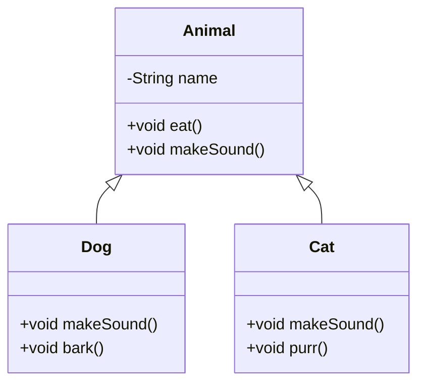

# Chapter 01 — OOP Refresher

## What & Why

Object-Oriented Programming (OOP) is the foundation of all Low-Level Design. Before diving into design patterns and SOLID principles, you need rock-solid OOP fundamentals.

**Real-world analogy:** Think of a **car blueprint** (class) vs an **actual car** (object). The blueprint defines properties (color, engine type) and behaviors (start, brake). Every car built from that blueprint is an instance with its own state.

---

## The 4 Pillars of OOP

### 1. Encapsulation
**What:** Bundle data (fields) and methods that operate on that data into a single unit (class), and restrict direct access to internals.

**Why:** Protects object state from unintended modification. You control *how* data is accessed/changed.

```java
// BAD — public fields, no control
class BankAccount {
    public double balance;  // anyone can set this to -1000
}

// GOOD — encapsulated
class BankAccount {
    private double balance;

    public double getBalance() { return balance; }

    public void deposit(double amount) {
        if (amount > 0) balance += amount;
    }
}
```

**Access Modifiers:**
| Modifier | Class | Package | Subclass | World |
|----------|-------|---------|----------|-------|
| `private` | ✅ | ❌ | ❌ | ❌ |
| default (none) | ✅ | ✅ | ❌ | ❌ |
| `protected` | ✅ | ✅ | ✅ | ❌ |
| `public` | ✅ | ✅ | ✅ | ✅ |

#### The same thing in C++

```cpp
class BankAccount {
private:                                    // `class` members are private by default
    double balance = 0.0;
public:
    double getBalance() const { return balance; }   // `const` = this method won't mutate state

    void deposit(double amount) {
        if (amount > 0) balance += amount;
    }
};
```

**Key differences vs Java:**

| Concept | Java | C++ |
|---------|------|-----|
| Access levels | `private` / default / `protected` / `public` | only `private` / `protected` / `public` — **no package level** |
| How access is written | keyword **per member** | **labeled sections** (`public:` … `private:` …) |
| Default visibility | package-private | **`class` → private**, **`struct` → public** (that's the only class/struct difference) |
| Selective access | package / nested classes | the **`friend`** keyword grants another class/function access |
| Read-only guarantee | none | mark methods **`const`**; the compiler enforces no mutation |

- A C++ **`struct`** is just a `class` whose members default to `public` — commonly used for plain data holders.
- There's no package-private level; when one class needs privileged access to another, C++ uses `friend` instead.

---

### 2. Inheritance
**What:** A class (child/subclass) inherits fields and methods from another class (parent/superclass).

**Why:** Code reuse. Define common behavior once, specialize in subclasses.

```java
class Animal {
    String name;
    void eat() { System.out.println(name + " is eating"); }
}

class Dog extends Animal {
    void bark() { System.out.println(name + " says Woof!"); }
}
```

**Key rules (Java):**
- Java supports **single inheritance** only (one parent class)
- Use `super` to call parent constructor/methods
- A subclass *is-a* parent (`Dog` is-a `Animal`)

#### The same thing in C++

```cpp
#include <iostream>
#include <string>

class Animal {
protected:                      // visible to subclasses, not the outside world
    std::string name;
public:
    explicit Animal(std::string n) : name(std::move(n)) {}
    virtual ~Animal() = default;                 // ALWAYS give a base a virtual destructor
    void eat() const { std::cout << name << " is eating\n"; }
};

class Dog : public Animal {     // ": public Animal" keeps is-a; the mode matters (see below)
public:
    explicit Dog(std::string n) : Animal(std::move(n)) {}   // call base ctor in the init list
    void bark() const { std::cout << name << " says Woof!\n"; }
};
```

**Key differences vs Java:**

| Concept | Java | C++ |
|---------|------|-----|
| Multiple base classes | ❌ single inheritance only | ✅ **multiple inheritance** allowed (`class C : public A, public B`) |
| Call the parent constructor | `super(args)` | member **initializer list**: `Dog(...) : Animal(args) {}` |
| Call a parent method | `super.method()` | qualify with the class name: `Animal::eat()` |
| Inheritance "mode" | always public-like | `public` / `protected` / `private` inheritance changes the is-a relationship |
| Runtime overriding | every method is virtual by default | only methods marked **`virtual`** are polymorphic; use `override` on the child |
| Base cleanup | GC handles it | base needs a **`virtual ~Base()`** or you get undefined behavior when deleting via a base pointer |

- **`public` inheritance = "is-a"** (`Dog` is-an `Animal`). `protected`/`private` inheritance means "implemented-in-terms-of" — *not* substitutable, so a `Base*` can't point to it. Java has no equivalent; default to `public`.
- **`virtual` is opt-in.** In Java `dog.makeSound()` is dynamically dispatched automatically; in C++ it's a normal (static) call **unless** the base declares the method `virtual`. Forgetting `virtual` is the #1 C++ polymorphism bug.
- **Object slicing** — a C++ gotcha with no Java analogue: assigning a `Dog` into an `Animal` *by value* copies only the `Animal` part and loses the `Dog` behavior. Use pointers/references (`Animal&`, `Animal*`, `std::unique_ptr<Animal>`) for polymorphism, never by-value.

**When NOT to use (both languages):** Don't inherit just for code reuse — use composition if there's no true *is-a* relationship. (More on this in Chapter 04.)

---

### 3. Polymorphism
**What:** One interface, many implementations. The same method call behaves differently depending on the actual object type.

#### Compile-time (Method Overloading)
Same method name, different parameter lists. Resolved at compile time.

```java
class Calculator {
    int add(int a, int b) { return a + b; }
    double add(double a, double b) { return a + b; }
    int add(int a, int b, int c) { return a + b + c; }
}
```

In **C++** overloading works the same way:

```cpp
class Calculator {
public:
    int add(int a, int b) { return a + b; }
    double add(double a, double b) { return a + b; }
    int add(int a, int b, int c) { return a + b + c; }
};
```

> C++ adds two related tools Java lacks: **operator overloading** (`operator+`) and **default arguments** (`int add(int a, int b, int c = 0)`). Default arguments can overlap with overloading, so pick one to avoid ambiguity.

#### Runtime (Method Overriding)
Subclass provides its own implementation of a parent method. Resolved at runtime via dynamic dispatch.

```java
class Animal {
    void makeSound() { System.out.println("Some sound"); }
}

class Dog extends Animal {
    @Override
    void makeSound() { System.out.println("Woof!"); }
}

class Cat extends Animal {
    @Override
    void makeSound() { System.out.println("Meow!"); }
}

// Runtime polymorphism in action
Animal a = new Dog();
a.makeSound();  // prints "Woof!" — decided at runtime
```

The **C++** version — note `virtual`, `override`, and that polymorphism happens **through a pointer/reference**:

```cpp
class Animal {
public:
    virtual ~Animal() = default;
    virtual void makeSound() const { std::cout << "Some sound\n"; }  // virtual = overridable
};

class Dog : public Animal {
public:
    void makeSound() const override { std::cout << "Woof!\n"; }
};

class Cat : public Animal {
public:
    void makeSound() const override { std::cout << "Meow!\n"; }
};

// Runtime polymorphism — via a pointer or reference, NOT by value
std::unique_ptr<Animal> a = std::make_unique<Dog>();
a->makeSound();   // "Woof!" — dynamic dispatch, because makeSound is virtual
```

- **`virtual` is required** — without it, `a->makeSound()` would call `Animal`'s version.
- Use **`override`** on the child so the compiler verifies you're actually overriding (catches signature typos — the C++ equivalent of Java's `@Override`).
- Polymorphism only works through `Animal*` / `Animal&` / smart pointers. `Animal a = someDog;` **slices** off the `Dog` part.

**Why this matters for LLD:** Polymorphism is the backbone of almost every design pattern. It lets you write code that works with abstractions, not concrete types.

---

### 4. Abstraction
**What:** Hide complex implementation details, expose only what's necessary.

**Two tools** (Java terms; C++ expresses both with pure virtual classes — shown below):

#### Abstract Classes
- Can have both abstract (no body) and concrete methods
- Can have fields, constructors
- A class can extend only ONE abstract class

```java
abstract class Shape {
    String color;

    abstract double area();        // subclasses MUST implement
    
    void printColor() {            // concrete method — inherited as-is
        System.out.println("Color: " + color);
    }
}
```

**C++** — an abstract class uses a **pure virtual** function (`= 0`):

```cpp
class Shape {
protected:
    std::string color;
public:
    virtual ~Shape() = default;
    virtual double area() const = 0;      // "= 0" → PURE virtual → makes Shape abstract
    void printColor() const {             // concrete method — inherited as-is
        std::cout << "Color: " << color << "\n";
    }
};
```

- A class with **any** pure virtual (`= 0`) method is abstract and can't be instantiated — same as Java `abstract`.

#### Interfaces
- Pure contract — only method signatures (before Java 8)
- Since Java 8: can have `default` and `static` methods
- A class can implement MULTIPLE interfaces

```java
interface Drawable {
    void draw();                            // abstract by default
    default void print() {                  // default method
        System.out.println("Printing...");
    }
}
```

**C++ has no `interface` keyword** — an interface is simply a class where every method is pure virtual and there's no state:

```cpp
class Drawable {
public:
    virtual ~Drawable() = default;
    virtual void draw() = 0;      // all methods pure virtual + no data = an "interface"
};

// A class "implements" multiple interfaces via multiple inheritance:
class Button : public Drawable, public Clickable { /* override draw(), click() */ };
```

**Key differences vs Java:**

| Concept | Java | C++ |
|---------|------|-----|
| Interface keyword | `interface` | none — use an all-pure-virtual class |
| Abstract method | `abstract void f();` | `virtual void f() = 0;` |
| Implement many | `implements A, B` | **multiple inheritance**: `: public A, public B` |
| Default methods | `default` methods (Java 8+) | just give the base class a normal concrete method |

#### When to use which?

| Use Abstract Class when... | Use Interface when... |
|---|---|
| Subclasses share common state/fields | You need multiple inheritance of type |
| You want to provide some default behavior | You're defining a capability/contract |
| Classes are closely related (is-a) | Unrelated classes share a behavior |

---

## Other Essential Concepts

### Constructors & `this`
```java
class Student {
    private String name;
    private int age;

    // Parameterized constructor
    Student(String name, int age) {
        this.name = name;    // 'this' distinguishes field from parameter
        this.age = age;
    }

    // Constructor chaining
    Student(String name) {
        this(name, 18);      // calls the other constructor
    }
}
```

**C++** — prefer the **member initializer list**; chaining is a **delegating constructor**:

```cpp
class Student {
    std::string name;
    int age;
public:
    Student(std::string name, int age)
        : name(std::move(name)), age(age) {}      // init list, not `this->name = name`

    explicit Student(std::string name)
        : Student(std::move(name), 18) {}          // delegating ctor (like this(name, 18))
};
```

- Use the **initializer list** (`: name(...), age(...)`) — it initializes members directly and is *required* for `const` and reference members. Assigning in the body constructs-then-overwrites.
- `this` is a **pointer** in C++ (`this->name`), not a reference; you rarely need it because the init list disambiguates.
- Mark single-argument constructors **`explicit`** to block silent implicit conversions (a common C++ footgun; Java has no equivalent).

### `super` keyword
```java
class Animal {
    String name;
    Animal(String name) { this.name = name; }
}

class Dog extends Animal {
    String breed;
    Dog(String name, String breed) {
        super(name);          // MUST be first line — calls parent constructor
        this.breed = breed;
    }
}
```

**C++ has no `super`.** Call the base constructor in the initializer list, and base methods with `Base::method()`:

```cpp
class Animal {
protected:
    std::string name;
public:
    explicit Animal(std::string name) : name(std::move(name)) {}
};

class Dog : public Animal {
    std::string breed;
public:
    Dog(std::string name, std::string breed)
        : Animal(std::move(name)),        // like super(name) — base ctor in the init list
          breed(std::move(breed)) {}
};
```

- No `super` — name the base explicitly. With **multiple inheritance** there could be several bases, so C++ requires `Animal::` / `Base::` qualification instead of one `super`.

### `final` keyword
- `final` variable → constant, can't reassign
- `final` method → can't override in subclass
- `final` class → can't extend (e.g., `String`)

**C++** has `final` too (C++11), but for *constants* it uses `const`/`constexpr`:

```cpp
class Base {
public:
    virtual void f() final;    // can't be overridden further (only valid on virtual methods)
};

class Widget final { };         // can't be inherited from

const int MAX_USERS = 100;      // Java's `final` variable ≈ C++ `const`
constexpr int SIZE = 8;         // compile-time constant
```

| Java | C++ equivalent |
|------|----------------|
| `final` variable | `const` / `constexpr` |
| `final` method | `final` (on a `virtual` method) |
| `final` class | `final` (on the class) |

---

## UML Class Diagram (Preview)



---

## Common Pitfalls

1. **Overusing inheritance** — Don't create deep hierarchies. Prefer composition when possible.
2. **Public fields** — Always encapsulate. Even if it's "just a simple class."
3. **Confusing overloading with overriding** — Overloading = same class, different params. Overriding = subclass, same signature.
4. **Forgetting `@Override`** — Always annotate. The compiler catches mistakes (typos in method name, wrong params).
5. **Abstract class vs Interface confusion** — If you just need a contract with no shared state, use an interface.

### C++-specific pitfalls
6. **Missing `virtual` destructor** — deleting a derived object through a `Base*` without a `virtual ~Base()` is **undefined behavior** (the derived part isn't destroyed). Rule: any class with a virtual method needs a virtual destructor.
7. **Object slicing** — storing derived objects **by value** in a base variable or container (`std::vector<Animal>`) silently drops the derived part. Use pointers / `std::unique_ptr<Animal>`.
8. **Forgetting `virtual`** — a child method that doesn't match a `virtual` base method just *hides* it (no polymorphism). Add `override` so the compiler flags the mistake.
9. **Non-`explicit` single-arg constructors** — allow surprising implicit conversions. Mark them `explicit`.
10. **Ignoring `const` correctness** — mark non-mutating methods `const`; it documents intent and lets `const` objects call them.

---

## What's Next

Study the code examples in `src/`, then tackle the assignments in `assignments/`. Once done, we move to **Chapter 02 — UML & Class Diagrams**.
