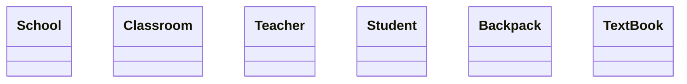

# School System — UML Class Diagram

> Fill in the Mermaid diagram and relationship explanations below.
> Refer to `02-UML-Class-Diagrams/notes.md` for syntax and relationship types.

## Class Diagram

## Relationship Explanations

| # | Relationship | Type | Multiplicity | Why? |
|---|-------------|------|-------------|------|
| 1 | School ↔ Classroom | TODO | TODO | TODO |
| 2 | Classroom ↔ Teacher | TODO | TODO | TODO |
| 3 | Classroom ↔ Student | TODO | TODO | TODO |
| 4 | Student ↔ Backpack | TODO | TODO | TODO |
| 5 | Backpack ↔ TextBook | TODO | TODO | TODO |

## Verification Checklist
- [ ] At least 5 classes with 2+ attributes each
- [ ] All relationships have the correct UML type
- [ ] Multiplicity is on every relationship
- [ ] Mermaid syntax renders correctly (preview in VS Code with Mermaid extension)
- [ ] Each explanation answers: "Why this type and not another?"
