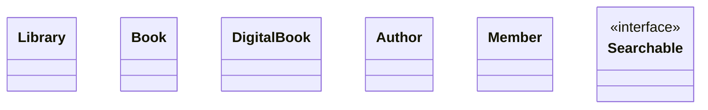

# Library System — Reverse-Engineered UML

> Study the code in `02-UML-Class-Diagrams/src/java/chapter02/` (or any language).
> Fill in the diagram, relationship table, and cross-language comparison below.

## Class Diagram

## Relationship Table

| # | Pair | Type | Multiplicity | Evidence from Code | Why this type? |
|---|------|------|-------------|-------------------|---------------|
| 1 | Library ↔ Book | TODO | TODO | TODO (what field? how created?) | TODO |
| 2 | Library ↔ Member | TODO | TODO | TODO | TODO |
| 3 | Book ↔ Author | TODO | TODO | TODO | TODO |
| 4 | DigitalBook ↔ Book | TODO | TODO | TODO | TODO |
| 5 | Library ↔ Searchable | TODO | TODO | TODO | TODO |
| 6 | Member ↔ Book | TODO | TODO | TODO | TODO |

## Cross-Language Comparison

How is each relationship expressed in code?

| Relationship | Java | C++ | Rust | Go |
|-------------|------|-----|------|----|
| Composition (Library→Book) | TODO | TODO | TODO | TODO |
| Aggregation (Library→Member) | TODO | TODO | TODO | TODO |
| Association (Book→Author) | TODO | TODO | TODO | TODO |
| Inheritance (DigitalBook→Book) | TODO | TODO | TODO | TODO |
| Realization (Library→Searchable) | TODO | TODO | TODO | TODO |
| Dependency (Member→Book) | TODO | TODO | TODO | TODO |

> Hint: Look for keywords like `extends`, `implements`, `unique_ptr`, `Box`, embedding, trait, etc.

## Verification Checklist
- [ ] All 6 relationships identified
- [ ] Multiplicity on every relationship
- [ ] "Evidence from Code" column cites specific fields/methods
- [ ] Cross-language table has 24 cells filled (6 relationships × 4 languages)
- [ ] Mermaid syntax renders correctly
