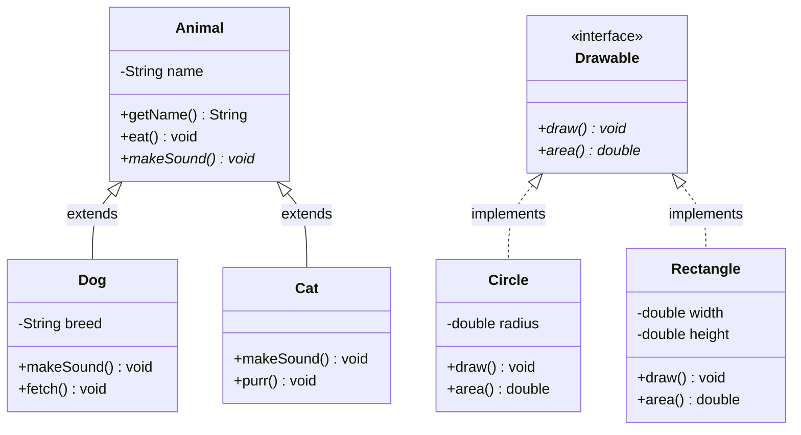
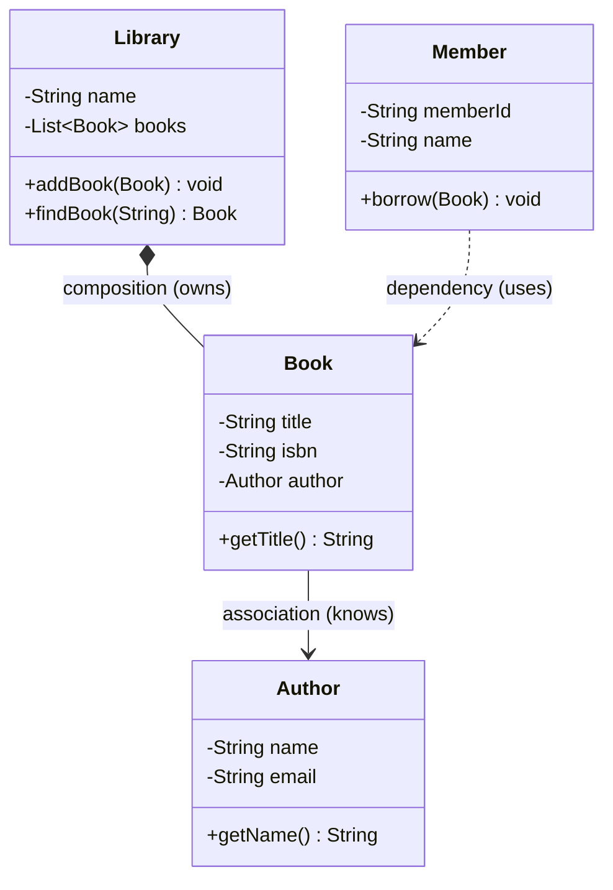

# Chapter 02 — UML & Class Diagrams

## What & Why

**UML (Unified Modeling Language)** is a visual language for designing software systems before writing code. In LLD interviews and real projects, you sketch class diagrams to communicate design decisions.

**Real-world analogy:** An architect draws blueprints before building a house. UML class diagrams are blueprints for your code — they show classes, their attributes, methods, and how they relate to each other.

**Why learn this?**
- Every LLD interview expects class diagrams
- Design patterns are explained using UML
- It forces you to think about structure before coding
- It's a universal language — works across Java, C++, Rust, Go

---

## Class Diagram Basics

A **class** in UML is a box with 3 sections:

```
┌──────────────────────┐
│      ClassName        │  ← Name
├──────────────────────┤
│ - privateField: Type  │  ← Attributes
│ + publicField: Type   │
├──────────────────────┤
│ + publicMethod(): Ret │  ← Methods
│ - privateMethod(): Ret│
└──────────────────────┘
```

### Visibility Modifiers

| Symbol | Meaning | Java | C++ | Go | Rust |
|--------|---------|------|-----|----|------|
| `+` | Public | `public` | `public:` | `Uppercase` | `pub` |
| `-` | Private | `private` | `private:` | `lowercase` | (default) |
| `#` | Protected | `protected` | `protected:` | N/A | `pub(crate)` |
| `~` | Package | default (no modifier) | N/A | same package | `pub(super)` |

---

## Relationships

This is the most important part. There are 6 types of relationships:

### 1. Association (knows-a)
A class **uses** or **knows about** another class.

```
┌─────────┐         ┌─────────┐
│ Teacher  │─────────│ Student │
└─────────┘         └─────────┘
```

- Solid line, no arrows or plain arrow
- Example: A `Teacher` teaches many `Student`s
- Both can exist independently

### 2. Aggregation (has-a, weak)
A class **contains** another, but the contained object can exist independently.

```
┌────────────┐  ◇────────┌──────────┐
│ Department  │           │ Employee  │
└────────────┘           └──────────┘
```

- **Empty diamond** (◇) on the container side
- Example: A `Department` has `Employee`s, but employees exist without the department
- "Has-a" but **doesn't own** the lifecycle

### 3. Composition (has-a, strong)
A class **owns** another. If the parent dies, the child dies.

```
┌─────────┐  ◆────────┌──────────┐
│  House   │           │   Room    │
└─────────┘           └──────────┘
```

- **Filled diamond** (◆) on the owner side
- Example: A `House` has `Room`s. Destroy the house → rooms are gone
- "Has-a" and **owns** the lifecycle

### 4. Inheritance / Generalization (is-a)
A class **extends** another class.

```
       ┌──────────┐
       │  Animal   │
       └────▲─────┘
            │
    ┌───────┴───────┐
┌───┴───┐      ┌────┴───┐
│  Dog   │      │  Cat   │
└────────┘      └────────┘
```

- **Solid line** with **hollow triangle arrow** pointing to parent
- UML: `Dog ──▷ Animal`
- **is-a** relationship

### 5. Realization / Implementation (implements)
A class **implements** an interface.

```
       ┌─ ─ ─ ─ ─ ┐
       │ Drawable   │   ← interface (dashed border or «interface»)
       └─ ─ ▲─ ─ ─┘
             │
    ┌────────┴────────┐
┌───┴───┐        ┌────┴───┐
│ Circle │        │Rectangle│
└────────┘        └────────┘
```

- **Dashed line** with **hollow triangle arrow** pointing to interface
- UML: `Circle ──▷ «interface» Drawable`

### 6. Dependency (uses temporarily)
A class **uses** another in a method parameter or local variable, but doesn't store it.

```
┌──────────┐  - - - - >  ┌──────────┐
│  Order    │             │  Printer  │
└──────────┘             └──────────┘
```

- **Dashed line** with **open arrow**
- Weakest relationship — just "uses"
- Example: `Order.print(Printer p)` — Order uses Printer but doesn't store it

---

## Multiplicity

Shows how many objects participate in a relationship:

| Notation | Meaning |
|----------|---------|
| `1` | Exactly one |
| `0..1` | Zero or one (optional) |
| `*` or `0..*` | Zero or more |
| `1..*` | One or more |
| `3..5` | Between 3 and 5 |

Example:
```
┌──────────┐ 1      * ┌──────────┐
│ Department│──────────│ Employee │
└──────────┘          └──────────┘
```
"One Department has many Employees"

---

## Mermaid Syntax (for diagrams in Markdown)

We use [Mermaid](https://mermaid.js.org/) to write diagrams as code:



### Mermaid Relationship Syntax

| Relationship | Mermaid Syntax | Arrow |
|-------------|----------------|-------|
| Inheritance | `A <\|-- B` | Solid + triangle |
| Implementation | `A <\|.. B` | Dashed + triangle |
| Association | `A -- B` | Solid line |
| Aggregation | `A o-- B` | Empty diamond |
| Composition | `A *-- B` | Filled diamond |
| Dependency | `A ..> B` | Dashed + arrow |

---

## Relationship Decision Flowchart

When deciding which relationship to use:

```
Is B a type of A?
├── Yes → INHERITANCE (B extends A)
│         Is A an interface?
│         ├── Yes → REALIZATION (B implements A)
│         └── No  → GENERALIZATION (B extends A)
└── No → Does A contain B?
         ├── Yes → Does B die when A dies?
         │         ├── Yes → COMPOSITION (filled diamond)
         │         └── No  → AGGREGATION (empty diamond)
         └── No → Does A use B?
                  ├── Stores B as field → ASSOCIATION
                  └── Uses B in method only → DEPENDENCY
```

---

## Example: Library System (UML → Code mapping)



- `Library *-- Book` → Composition: Library owns books. Delete library → books gone.
- `Book --> Author` → Association: Book knows its author. Author exists independently.
- `Member ..> Book` → Dependency: Member borrows a book (uses it, doesn't own it).

---

## Common Pitfalls

1. **Confusing Aggregation and Composition** — Ask: "If I delete the parent, does the child make sense alone?" If yes → Aggregation. If no → Composition.
2. **Overusing Inheritance** — Just because two classes share fields doesn't mean one should extend the other. Use composition when there's no true *is-a*.
3. **Forgetting multiplicity** — Always annotate how many objects are on each side.
4. **Too much detail** — UML diagrams should communicate design, not every getter/setter. Show key attributes and methods.
5. **Mixing dependency and association** — If you store a reference as a field, it's association. If you only use it as a parameter, it's dependency.

---

## When to Draw UML

| Situation | Draw UML? |
|-----------|-----------|
| LLD interview | **Always** — draw first, code second |
| Starting a new feature | Yes — sketch the classes involved |
| Explaining design to a teammate | Yes — visual > words |
| Simple bug fix | No — overkill |
| Refactoring | Sometimes — helps see the before/after |

---

## What's Next

Study the code examples in `src/` — they show a complete Library system that maps directly to the UML above. Then tackle the assignments in `assignments/`.
