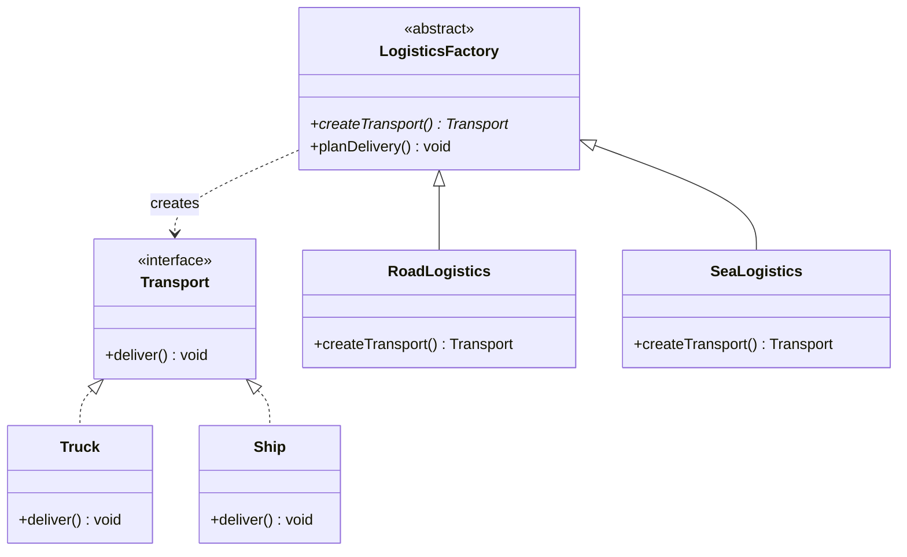

# Chapter 05 — Factory Method Pattern

## What & Why

The **Factory Method** pattern defines an interface for creating objects, but lets subclasses decide which class to instantiate. It moves the `new` keyword out of client code and into a dedicated creator.

**Real-world analogy:** A logistics company has trucks and ships. The HQ doesn't decide which vehicle to use — each regional office (factory) decides based on its geography. Mountain office creates trucks, coastal office creates ships. HQ just says "give me transport."

---

## The Problem

Without Factory Method, your code is littered with `new` and conditionals:

```java
// BAD: Client is tightly coupled to every concrete type
Transport transport;
if (type.equals("truck")) {
    transport = new Truck();
} else if (type.equals("ship")) {
    transport = new Ship();
} else if (type.equals("airplane")) {
    transport = new Airplane();  // every new type = edit this code
}
transport.deliver();
```

**Violations:** OCP (must modify to add types), DIP (depends on concretions), SRP (client knows creation logic).

The **C++** version has the same problem — and the same smell:

```cpp
// BAD: client coupled to every concrete type
std::unique_ptr<Transport> transport;
if (type == "truck") {
    transport = std::make_unique<Truck>();
} else if (type == "ship") {
    transport = std::make_unique<Ship>();
} else if (type == "airplane") {
    transport = std::make_unique<Airplane>();   // every new type = edit this code
}
transport->deliver();
```

---

## The Solution

```
Creator (abstract)              Product (interface)
├── createProduct(): Product    ├── operation()
│                               │
ConcreteCreatorA                ConcreteProductA
├── createProduct()             ├── operation()
│   → return new ProductA()     │
│                               │
ConcreteCreatorB                ConcreteProductB
├── createProduct()             ├── operation()
    → return new ProductB()
```

The **Creator** defines the factory method. Each **ConcreteCreator** overrides it to return a specific product. Client code works with the Creator interface — it never sees `new ConcreteProduct()`.

---

## UML Class Diagram



---

## Step-by-Step

1. **Define the Product interface** — what all products must do (`Transport.deliver()`)
2. **Create Concrete Products** — `Truck`, `Ship` each implement `Transport`
3. **Define the Creator (abstract)** — has the factory method `createTransport()` + business logic `planDelivery()`
4. **Create Concrete Creators** — `RoadLogistics.createTransport()` returns `new Truck()`, `SeaLogistics.createTransport()` returns `new Ship()`
5. **Client uses Creator** — calls `factory.planDelivery()`, doesn't know which transport is created

---

## Key Insight: The Template Method Inside

Notice that `planDelivery()` in the creator calls `createTransport()` — a method it doesn't implement. This is actually the **Template Method** pattern (Ch25) embedded inside Factory Method:

```java
abstract class LogisticsFactory {
    abstract Transport createTransport();  // factory method — subclass decides

    void planDelivery() {
        Transport t = createTransport();   // uses the product without knowing its type
        t.deliver();
    }
}
```

The **C++** creator — note it returns a `std::unique_ptr<Transport>` (the factory hands over *ownership*):

```cpp
// Creator (abstract) — factory method + business logic
class LogisticsFactory {
public:
    virtual ~LogisticsFactory() = default;
    virtual std::unique_ptr<Transport> createTransport() const = 0;   // subclass decides

    void planDelivery() const {
        auto transport = createTransport();   // works with the base type, never sees the concrete class
        transport->deliver();
    }
};

// Concrete Creators
class RoadLogistics : public LogisticsFactory {
public:
    std::unique_ptr<Transport> createTransport() const override {
        return std::make_unique<Truck>();
    }
};

class SeaLogistics : public LogisticsFactory {
public:
    std::unique_ptr<Transport> createTransport() const override {
        return std::make_unique<Ship>();
    }
};
```

where the product is a pure-virtual base:

```cpp
struct Transport {
    virtual ~Transport() = default;
    virtual void deliver() const = 0;
};

struct Truck : Transport { void deliver() const override { std::cout << "By land in a truck.\n"; } };
struct Ship  : Transport { void deliver() const override { std::cout << "By sea in a ship.\n"; } };
```

### C++ specifics

- **Return `std::unique_ptr<Product>`, not a raw `Product*`.** The factory *creates and hands over ownership* — `unique_ptr` makes that explicit and leak-free (whoever receives it owns it). Returning a raw pointer forces the caller to remember to `delete`.
- **The product base needs a `virtual` destructor** (`virtual ~Transport() = default;`) — the client deletes through a `Transport*`/`unique_ptr<Transport>`, so without it the concrete part leaks (undefined behavior).
- **`createTransport()` must be `virtual`** — that's what makes the subclass's version get called (Java methods are virtual by default; in C++ you say so).
- Java uses `new Truck()`; C++ uses **`std::make_unique<Truck>()`** — same idea, but it also allocates safely and returns the owning pointer in one step.

---

## Factory Method vs Simple Factory

| | Simple Factory | Factory Method |
|---|---------------|----------------|
| Structure | Static method with if/else | Abstract class + subclass overrides |
| OCP | Violates (must edit to add types) | Follows (add new subclass) |
| Use case | Few types, unlikely to change | Many types, likely to grow |
| Flexibility | Low | High |

Simple Factory (not a GoF pattern) is fine for small, stable sets. Factory Method shines when the product family grows.

---

## When to Use

- Object type is determined at runtime
- You want to decouple creation from usage
- New product types are expected in the future
- Different contexts need different products (road vs sea vs air logistics)

## When NOT to Use

- Only one product type — just use `new` directly (KISS, YAGNI)
- The set of types is small and stable — Simple Factory is simpler
- You're adding a pattern just because it's a pattern

---

## Common Pitfalls

1. **Over-engineering** — Don't use Factory Method if you only have one product. Start simple, refactor when a second type appears.
2. **Confusing with Abstract Factory** — Factory Method creates ONE product. Abstract Factory (Ch06) creates FAMILIES of related products.
3. **Forgetting the business logic** — The creator isn't just a factory. It should have business logic (`planDelivery()`) that uses the product. If it only creates, you might just need a simple factory.
4. **Making everything a factory** — Not every `new` needs a factory. Use it when the DECISION of what to create is complex or evolving.

---

## SOLID Connections

| Principle | How Factory Method applies |
|-----------|--------------------------|
| SRP | Creation logic is in the creator, not the client |
| OCP | New products = new creator subclass, no modification |
| DIP | Client depends on Creator and Product interfaces, not concretions |
| LSP | Any ConcreteCreator is substitutable for Creator |

---

## What's Next

Study the code examples in `src/` — a logistics system with Truck and Ship transport. Then tackle the assignments.
