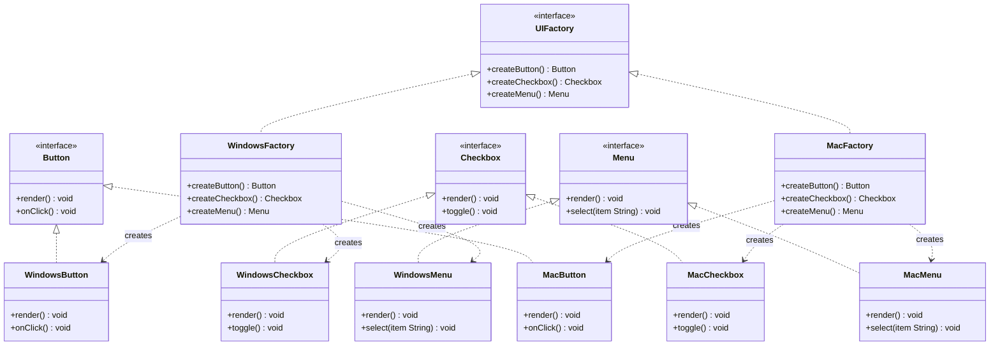

# Chapter 06 — Abstract Factory Pattern

## What & Why

The **Abstract Factory** pattern provides an interface for creating **families of related objects** without specifying their concrete classes. Instead of creating one product at a time (Factory Method), you create an entire **suite of products** that belong together.

**Real-world analogy:** A furniture store sells matching sets — Victorian chair + Victorian sofa + Victorian table, or Modern chair + Modern sofa + Modern table. You don't pick a Victorian chair with a Modern table — that's a mismatch. The abstract factory ensures everything in the set is **consistent**.

---

## The Problem

Without Abstract Factory, mixing products from different families causes bugs:

```java
// BAD: Nothing prevents mixing incompatible products
Button button = new WindowsButton();
Checkbox checkbox = new MacCheckbox();  // ❌ Windows button + Mac checkbox = broken UI
Menu menu = new LinuxMenu();            // ❌ Total chaos
```

Every time you add a new platform, you edit multiple places. There's no guarantee of consistency.

The **C++** version has the identical hazard:

```cpp
// BAD: nothing prevents mixing incompatible products
std::unique_ptr<Button>   button   = std::make_unique<WindowsButton>();
std::unique_ptr<Checkbox> checkbox = std::make_unique<MacCheckbox>();   // ❌ Windows + Mac = broken UI
```

---

## Factory Method vs Abstract Factory

| | Factory Method | Abstract Factory |
|---|---------------|-----------------|
| **Creates** | ONE product | A FAMILY of related products |
| **Structure** | Creator subclass per product | Factory subclass per family |
| **Example** | `RoadLogistics → Truck` | `WindowsFactory → WinButton + WinCheckbox + WinMenu` |
| **Relationship** | Abstract Factory USES Factory Methods internally |

**Key insight:** An Abstract Factory is essentially a **group of Factory Methods**, one per product type.

---

## The Solution

```
AbstractFactory                    AbstractProductA     AbstractProductB
├── createProductA(): A            ├── operationA()     ├── operationB()
├── createProductB(): B            │                    │
│                                  ConcreteA1           ConcreteB1
ConcreteFactory1                   ConcreteA2           ConcreteB2
├── createProductA() → A1
├── createProductB() → B1

ConcreteFactory2
├── createProductA() → A2
├── createProductB() → B2
```

Each **ConcreteFactory** creates a **complete family** — all products from the same variant. The client never mixes families.

---

## UML Class Diagram



---

## Step-by-Step

1. **Define Product interfaces** — `Button`, `Checkbox`, `Menu` — what each product type can do
2. **Create Concrete Products per family** — `WindowsButton`, `MacButton`, `WindowsCheckbox`, `MacCheckbox`, etc.
3. **Define the Abstract Factory interface** — `UIFactory` with one factory method per product type
4. **Create Concrete Factories** — `WindowsFactory` returns all Windows products, `MacFactory` returns all Mac products
5. **Client uses the factory** — receives a `UIFactory`, calls `createButton()`, `createCheckbox()`, `createMenu()` — never knows which platform

---

## Key Insight: Consistency Guarantee

The power of Abstract Factory is the **all-or-nothing** guarantee. Once you pick a factory, **every product comes from the same family**:

```java
UIFactory factory = new WindowsFactory();  // pick the family ONCE
Button button = factory.createButton();     // guaranteed Windows
Checkbox checkbox = factory.createCheckbox(); // guaranteed Windows
Menu menu = factory.createMenu();           // guaranteed Windows
// Impossible to get a MacCheckbox from a WindowsFactory
```

The **C++** factory is one pure-virtual method per product type; each concrete factory builds a whole family:

```cpp
// Abstract Factory — one factory method per product type
struct UIFactory {
    virtual ~UIFactory() = default;
    virtual std::unique_ptr<Button>   createButton()   const = 0;
    virtual std::unique_ptr<Checkbox> createCheckbox() const = 0;
    virtual std::unique_ptr<Menu>     createMenu()     const = 0;
};

class WindowsFactory : public UIFactory {
public:
    std::unique_ptr<Button>   createButton()   const override { return std::make_unique<WindowsButton>(); }
    std::unique_ptr<Checkbox> createCheckbox() const override { return std::make_unique<WindowsCheckbox>(); }
    std::unique_ptr<Menu>     createMenu()     const override { return std::make_unique<WindowsMenu>(); }
};

// Client: pick the family ONCE, everything downstream is consistent
std::unique_ptr<UIFactory> factory = std::make_unique<WindowsFactory>();
auto button   = factory->createButton();     // guaranteed Windows
auto checkbox = factory->createCheckbox();   // guaranteed Windows
auto menu     = factory->createMenu();       // guaranteed Windows
```

### C++ specifics

- **Every product base *and* `UIFactory` needs a `virtual` destructor** — all of them are deleted through base pointers.
- **Each `create*` returns `std::unique_ptr<Product>`** — the factory creates and transfers ownership; no manual `delete`, no leaks.
- **Own/store the chosen factory as `std::unique_ptr<UIFactory>`** — that's the variable that *holds* it and lets you **swap families at runtime** by reassigning it (e.g., Dark → Light theme); every later `create*` call follows the new family.
- **Pass it to functions as `const UIFactory&`** — a borrowed reference, no ownership transfer. Never pass or store a `UIFactory` *by value*: it would slice (and it's abstract, so it can't be copied anyway). In short: **own with `unique_ptr`, borrow with `&`.**

---

## When to Use

- You have **families of related products** that must be used together
- You want to enforce **consistency** — no mixing products from different families
- The system needs to support **multiple variants** (platforms, themes, regions)
- You want to swap entire families at runtime (e.g., switch theme from Dark to Light)

## When NOT to Use

- You only have **one product type** — use Factory Method instead
- Products from different families are **compatible** and can mix freely
- The number of product families is small and unlikely to grow — simple conditionals are fine
- Adding a new product TYPE (not family) requires changing every factory — this is the pattern's weakness

---

## Common Pitfalls

1. **Adding a new product type is expensive** — If you add a `Slider` interface, you must update EVERY concrete factory. This is the main trade-off. Abstract Factory makes adding new *families* easy but adding new *product types* hard.
2. **Confusing with Factory Method** — Factory Method = one product. Abstract Factory = a family. If your "factory" only has one `create` method, you probably just need Factory Method.
3. **God Factory** — Don't put 20 create methods in one factory. If the products aren't truly related, split into separate factories.
4. **Over-abstracting** — If you'll never have a second family, don't build an Abstract Factory. Start with Factory Method, upgrade when a second family appears.

---

## SOLID Connections

| Principle | How Abstract Factory applies |
|-----------|--------------------------|
| SRP | Each factory is responsible for creating one product family |
| OCP | New family = new factory class, no modification to existing code |
| DIP | Client depends on `UIFactory`, `Button`, `Checkbox` interfaces — not `WindowsButton` |
| LSP | Any concrete factory is substitutable for `UIFactory` |
| ISP | Product interfaces are small and focused (`Button`, `Checkbox`, `Menu` — not one giant `UIComponent`) |

---

## What's Next

Study the code examples in `src/` — a cross-platform UI toolkit with Windows and Mac components. Then tackle the assignments.
