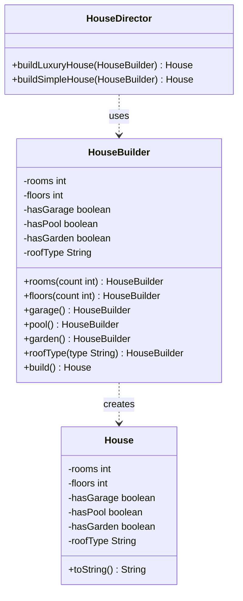

# Chapter 07 — Builder Pattern

## What & Why

The **Builder** pattern separates the construction of a complex object from its representation, allowing the same construction process to create different representations. It builds objects **step by step** instead of requiring all parameters upfront.

**Real-world analogy:** Ordering a custom meal at a restaurant. You don't say "give me a meal with bread type wheat, patty type beef, cheese type cheddar, lettuce true, tomato true, onion false, sauce ketchup, drink cola, size large." You say: "I'll have a beef burger, add cheddar, extra lettuce, hold the onion, with a cola." Each step is optional, and you build up the meal piece by piece.

---

## The Problem

Without Builder, constructors become unreadable and error-prone:

```java
// BAD: Telescoping constructor — which boolean is what?
House house = new House(4, 2, true, false, true, true, "tile", 2, true);
//                      ^rooms ^floors ^garage ^pool ^garden ^gym ^roof ^parking ^solar

// BAD: Many overloaded constructors
House(int rooms, int floors)
House(int rooms, int floors, boolean garage)
House(int rooms, int floors, boolean garage, boolean pool)
House(int rooms, int floors, boolean garage, boolean pool, boolean garden)
// ... explosion of constructors
```

**Problems:**
- Unreadable — you can't tell what each parameter means
- Fragile — adding a new optional param means another constructor overload
- Error-prone — easy to swap two booleans and get a silent bug

---

## The Solution

```
Product                    Builder
├── field1                 ├── setField1(val): Builder
├── field2                 ├── setField2(val): Builder
├── field3                 ├── setField3(val): Builder
│                          ├── build(): Product
│
Director (optional)
├── construct(Builder): Product
```

The **Builder** accumulates configuration step by step, then creates the **Product** in one final `build()` call. The optional **Director** encapsulates common construction sequences.

---

## UML Class Diagram



---

## Step-by-Step

1. **Define the Product** — `House` with many fields (some optional), ideally immutable once built
2. **Create the Builder** — `HouseBuilder` with setter methods that return `this` (fluent interface)
3. **Add `build()`** — validates and constructs the final `House` object
4. **Optionally add a Director** — `HouseDirector` with pre-defined construction recipes
5. **Client uses Builder** — chains method calls: `new HouseBuilder().rooms(4).floors(2).garage().build()`

---

## Key Insight: Fluent Interface / Method Chaining

Each setter returns the builder itself (`this`), enabling chaining:

```java
House house = new HouseBuilder()
    .rooms(4)
    .floors(2)
    .garage()
    .pool()
    .roofType("tile")
    .build();
```

This reads like a sentence. Compare with the telescoping constructor — night and day.

The **C++** builder returns **`*this` by reference** so the chain mutates one builder:

```cpp
class HouseBuilder {
    int rooms_ = 0, floors_ = 0;
    bool garage_ = false, pool_ = false;
    std::string roof_ = "flat";
public:
    HouseBuilder& rooms(int n)             { rooms_ = n;  return *this; }   // return *this to chain
    HouseBuilder& floors(int n)            { floors_ = n; return *this; }
    HouseBuilder& garage()                 { garage_ = true; return *this; }
    HouseBuilder& pool()                   { pool_ = true; return *this; }
    HouseBuilder& roofType(std::string t)  { roof_ = std::move(t); return *this; }

    House build() const { return House(rooms_, floors_, garage_, pool_, roof_); }
};

// Same fluent call site as Java:
House house = HouseBuilder()
    .rooms(4)
    .floors(2)
    .garage()
    .pool()
    .roofType("tile")
    .build();
```

---

## The Director: Optional but Powerful

The Director pre-defines common construction sequences:

```java
class HouseDirector {
    House buildLuxuryHouse(HouseBuilder builder) {
        return builder.rooms(6).floors(3).garage().pool().garden()
                      .roofType("slate").build();
    }

    House buildSimpleHouse(HouseBuilder builder) {
        return builder.rooms(2).floors(1).roofType("shingle").build();
    }
}
```

The **C++** director just takes the builder by reference and drives the same steps:

```cpp
class HouseDirector {
public:
    House buildLuxuryHouse(HouseBuilder& b) const {
        return b.rooms(6).floors(3).garage().pool().roofType("slate").build();
    }
    House buildSimpleHouse(HouseBuilder& b) const {
        return b.rooms(2).floors(1).roofType("shingle").build();
    }
};
```

### C++ specifics

- **Each setter returns `*this` by reference** (`HouseBuilder&`), not by value — returning a copy would chain against throwaway copies and lose your settings.
- **`build()` returns the product by value** (`House`). That's cheap in C++ thanks to move semantics / RVO — no heap allocation needed for a value object. Use `std::unique_ptr<House>` only if the product is polymorphic (a base with virtual methods).
- **True immutability = `const` data members** set once in the product's constructor initializer list, with the constructor kept `private` and the builder made a `friend`. Then a `House` genuinely can't be mutated after `build()`.
- Unlike Java, C++ has **default arguments** for the simple cases (`House(int rooms, int floors, bool garage = false)`), so reach for a full Builder only when there are many optional fields — the same KISS/YAGNI judgement.

Useful when:
- You have **recurring configurations** (luxury, budget, standard)
- You want to **encapsulate construction logic** away from the client
- Multiple clients need the **same build sequence**

Skip the Director when each object is unique.

---

## Builder vs Factory Method vs Abstract Factory

| | Factory Method | Abstract Factory | Builder |
|---|---------------|-----------------|---------|
| **Purpose** | Decide WHICH class to create | Create a FAMILY of objects | Build ONE complex object step by step |
| **Focus** | Type selection | Family consistency | Construction process |
| **Returns** | Complete object immediately | Multiple related objects | Object after multi-step configuration |
| **Use when** | Many subclasses | Related product families | Many optional parameters |

---

## When to Use

- Object has **many optional parameters** (5+ constructor params is a smell)
- You want **immutable objects** that can't be modified after creation
- Construction involves **multiple steps** with optional/conditional parts
- Same construction process should create **different representations**
- You want **readable object creation** code

## When NOT to Use

- Object is simple with few required parameters — just use a constructor
- Object is mutable — use setters directly (no need for a builder)
- Only one way to build the object — builder adds unnecessary complexity
- The class has 2-3 fields — YAGNI

---

## Common Pitfalls

1. **Forgetting validation in `build()`** — The builder should validate required fields before creating the product. Don't let invalid objects slip through.
2. **Making the product mutable** — If `House` has setters, the builder is pointless — anyone can change the object after creation. Make the product immutable.
3. **Builder with no optional params** — If every field is required, you're just moving the constructor into a builder for no benefit. Use builder when you genuinely have optional configuration.
4. **Over-building** — Not every class needs a builder. A `Point(x, y)` doesn't need one. Reserve it for objects with 4+ optional fields.

---

## Inner vs Outer Builder

**Inner Builder (Java common pattern):**
```java
House house = new House.Builder(4, 2)  // required params in constructor
    .garage()
    .pool()
    .build();
```
- Builder is a static inner class of the product
- Product constructor is private — can ONLY be created via builder
- Guarantees immutability

**Outer Builder:**
```java
House house = new HouseBuilder()
    .rooms(4)
    .floors(2)
    .build();
```
- Builder is a separate class
- More common in languages without inner classes (Go, Rust)
- Both approaches are valid — inner builder is more encapsulated

---

## SOLID Connections

| Principle | How Builder applies |
|-----------|--------------------------|
| SRP | Construction logic is in the builder, not the product or client |
| OCP | New build configurations don't modify existing builder code |
| DIP | Client depends on the builder interface, not the construction details |

---

## What's Next

Study the code examples in `src/` — a House builder with fluent interface and an optional Director for common configurations. Then tackle the assignments.
