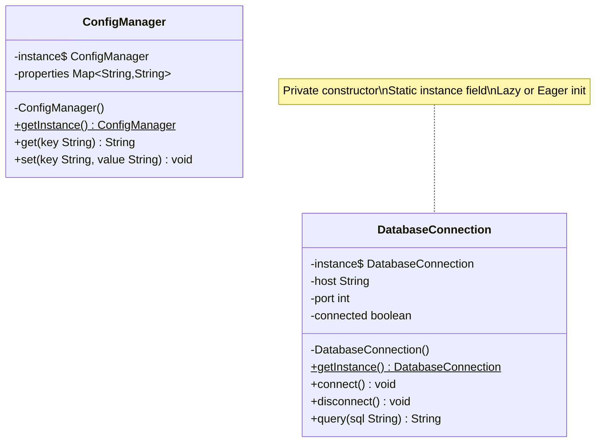

# Chapter 08 — Singleton Pattern

## What & Why

The **Singleton** pattern ensures a class has **exactly one instance** and provides a **global point of access** to it. It's the simplest creational pattern — and the most controversial.

**Real-world analogy:** A country has exactly one president at a time. No matter who asks "who is the president?", they all get the same person. You don't create a new president every time you need one — you access the existing one.

---

## The Problem

Some resources should exist only once:
- **Database connection pool** — creating multiple pools wastes connections
- **Configuration manager** — loading config files repeatedly is wasteful and inconsistent
- **Logger** — all parts of the app should write to the same log
- **Thread pool** — one shared pool, not one per class

Without Singleton:
```java
// BAD: Every class creates its own config — wasteful and inconsistent
class OrderService {
    Config config = new Config("app.properties"); // loads file again
}
class PaymentService {
    Config config = new Config("app.properties"); // loads file AGAIN
}
// What if they read different versions of the file?
```

---

## The Solution

1. Make the constructor **private** — nobody can `new` it
2. Store the single instance in a **private static field**
3. Provide a **public static method** (`getInstance()`) that returns the instance

---

## UML Class Diagram



---

## Singleton Implementations

### 1. Eager Initialization (Simplest)

Instance created **at class loading time** — before anyone asks for it.

```java
public class EagerSingleton {
    private static final EagerSingleton INSTANCE = new EagerSingleton();

    private EagerSingleton() {}

    public static EagerSingleton getInstance() {
        return INSTANCE;
    }
}
```

**Pros:** Thread-safe (JVM guarantees static init), simple
**Cons:** Instance created even if never used — wastes memory if initialization is expensive

---

### 2. Lazy Initialization (Not Thread-Safe)

Instance created **on first access**.

```java
public class LazySingleton {
    private static LazySingleton instance;

    private LazySingleton() {}

    public static LazySingleton getInstance() {
        if (instance == null) {
            instance = new LazySingleton();  // Race condition!
        }
        return instance;
    }
}
```

**Problem:** Two threads can both see `instance == null` and create two instances. **Never use in multi-threaded code.**

---

### 3. Thread-Safe with synchronized (Correct but Slow)

```java
public class SyncSingleton {
    private static SyncSingleton instance;

    private SyncSingleton() {}

    public static synchronized SyncSingleton getInstance() {
        if (instance == null) {
            instance = new SyncSingleton();
        }
        return instance;
    }
}
```

**Problem:** `synchronized` locks on **every call**, even after the instance exists. Unnecessary overhead after initialization.

---

### 4. Double-Checked Locking (Best Lazy Approach)

```java
public class DCLSingleton {
    private static volatile DCLSingleton instance;

    private DCLSingleton() {}

    public static DCLSingleton getInstance() {
        if (instance == null) {                    // 1st check (no lock)
            synchronized (DCLSingleton.class) {
                if (instance == null) {            // 2nd check (with lock)
                    instance = new DCLSingleton();
                }
            }
        }
        return instance;
    }
}
```

**Key:** `volatile` prevents instruction reordering — without it, a thread might see a partially constructed object.

**Pros:** Thread-safe, locks only during first creation
**Cons:** Verbose, easy to get wrong

---

### 5. Bill Pugh Singleton (Recommended for Java)

Uses a **static inner class** — loaded lazily by the JVM.

```java
public class BillPughSingleton {
    private BillPughSingleton() {}

    private static class Holder {
        private static final BillPughSingleton INSTANCE = new BillPughSingleton();
    }

    public static BillPughSingleton getInstance() {
        return Holder.INSTANCE;
    }
}
```

**Why it works:** The inner class `Holder` is not loaded until `getInstance()` is called. The JVM guarantees thread-safe class loading. Best of both worlds: lazy AND thread-safe without `synchronized`.

---

### 6. Enum Singleton (Java-specific, Bulletproof)

```java
public enum EnumSingleton {
    INSTANCE;

    private int count = 0;

    public void doSomething() {
        count++;
        System.out.println("Called " + count + " times");
    }
}
// Usage: EnumSingleton.INSTANCE.doSomething();
```

**Pros:** Immune to reflection attacks, serialization-safe, concise
**Cons:** Can't extend other classes, feels unusual, Java-only

---

## Breaking Singleton (and Prevention)

| Attack | How it breaks | Prevention |
|--------|--------------|------------|
| **Reflection** | `Constructor.setAccessible(true)` bypasses private | Throw exception in constructor if instance exists |
| **Serialization** | `ObjectInputStream` creates new object | Implement `readResolve()` returning existing instance |
| **Cloning** | `clone()` creates a copy | Override `clone()` to throw exception |

```java
// Reflection prevention
private Singleton() {
    if (instance != null) {
        throw new RuntimeException("Use getInstance()");
    }
}

// Serialization prevention
protected Object readResolve() {
    return getInstance();
}

// Clone prevention
@Override
protected Object clone() throws CloneNotSupportedException {
    throw new CloneNotSupportedException("Singleton cannot be cloned");
}
```

---

## Language-Specific Notes

### C++
- Use a **local static variable** inside `getInstance()` (Meyer's Singleton) — C++11 guarantees thread-safe initialization
- Delete copy constructor and assignment operator
- No garbage collection — consider lifetime carefully

### Rust
- No global mutable state by default — Rust makes singletons deliberately hard
- Use `std::sync::OnceLock` (stable since Rust 1.80) for lazy thread-safe initialization
- Or use the `lazy_static` / `once_cell` crates
- Singletons feel unnatural in Rust — consider passing shared state explicitly

### Go
- Use `sync.Once` — the idiomatic Go way to do lazy initialization
- `sync.Once.Do(func)` guarantees the function runs exactly once, even with concurrent goroutines
- Go has no constructors to make private — use unexported types + exported accessor

---

## Deep Dive: Instruction Reordering & Memory Ordering

Java's `volatile` prevents instruction reordering in DCL. But how do C++, Rust, and Go handle this same problem?

### The Core Problem (All Languages)

`instance = new Singleton()` compiles to 3 CPU instructions:

```
1. Allocate memory
2. Run constructor (initialize fields)
3. Assign the pointer/reference to `instance`
```

Without memory ordering guarantees, the CPU can reorder step 3 before step 2. Another thread sees a non-null pointer to a **half-constructed object** — fields may still be zero/null.

### C++ — Meyer's Singleton (Compiler Handles It)

```cpp
static Singleton& get_instance() {
    static Singleton instance;  // C++11 magic line
    return instance;
}
```

**Why you don't need `volatile` or manual barriers:**

The C++11 standard (§6.7) mandates that **local static initialization is thread-safe**. The compiler generates hidden synchronization code:

```cpp
// What the compiler actually generates (conceptually):
static Singleton& get_instance() {
    static bool initialized = false;
    static aligned_storage<Singleton> storage;

    if (!initialized) {                       // fast path — no lock
        acquire_lock();                       // compiler-inserted
        if (!initialized) {                   // double-check under lock
            new (&storage) Singleton();       // construct in-place
            std::atomic_thread_fence(std::memory_order_release);  // memory barrier!
            initialized = true;
        }
        release_lock();
    }
    std::atomic_thread_fence(std::memory_order_acquire);  // barrier before read
    return *reinterpret_cast<Singleton*>(&storage);
}
```

The compiler inserts memory fences **for you**. That's why Meyer's Singleton is the recommended C++ approach — you get DCL + volatile behavior without writing any of it.

**If you DID want manual DCL in C++ (don't do this — use Meyer's):**

```cpp
// C++ volatile does NOT prevent reordering (unlike Java volatile!)
// You need std::atomic instead:
static std::atomic<Singleton*> instance{nullptr};
static std::mutex mtx;

Singleton* get_instance() {
    Singleton* tmp = instance.load(std::memory_order_acquire);  // acquire barrier
    if (tmp == nullptr) {
        std::lock_guard<std::mutex> lock(mtx);
        tmp = instance.load(std::memory_order_relaxed);
        if (tmp == nullptr) {
            tmp = new Singleton();
            instance.store(tmp, std::memory_order_release);     // release barrier
        }
    }
    return tmp;
}
```

> **Critical difference:** C++ `volatile` means "don't optimize away reads/writes" (for hardware registers). It does **NOT** provide memory ordering. Java `volatile` provides both. In C++, use `std::atomic` for memory ordering.

### Rust — OnceLock (Language Enforces Safety)

```rust
static INSTANCE: OnceLock<Mutex<Singleton>> = OnceLock::new();

fn get_instance() -> &'static Mutex<Singleton> {
    INSTANCE.get_or_init(|| Mutex::new(Singleton::new()))
}
```

**Why you can't even create this bug in Rust:**

1. **No raw global mutable state.** You can't write `static mut INSTANCE: Option<Singleton>` and use it without `unsafe`. The compiler blocks the race condition at compile time.

2. **`OnceLock` uses `std::sync::Once` internally**, which contains an `AtomicU8` state and proper memory barriers:

```rust
// Inside OnceLock (simplified):
pub fn get_or_init<F: FnOnce() -> T>(&self, f: F) -> &T {
    // Fast path: already initialized — uses Acquire ordering
    if let Some(value) = self.get() {     // atomic load with Acquire
        return value;
    }
    // Slow path: initialize with lock
    self.once.call_once(|| {
        let value = f();
        // store with Release ordering — guarantees constructor
        // completes before the "initialized" flag is visible
        self.value.set(value);            // Release barrier
    });
    self.get().unwrap()
}
```

3. **The type system prevents partial reads.** You can't get a `&Singleton` until `OnceLock` transitions to the "initialized" state. There is no intermediate state where you hold a reference to an unconstructed object.

**Rust's memory ordering model** (same as C++):

| Ordering | Meaning |
|----------|---------|
| `Relaxed` | No ordering — just atomicity |
| `Acquire` | All reads after this see writes before the matching Release |
| `Release` | All writes before this are visible after the matching Acquire |
| `SeqCst` | Total global order (strongest, like Java volatile) |

`OnceLock` uses `Acquire`/`Release` — the minimum needed. Equivalent to Java's `volatile` but more precise.

### Go — sync.Once (Hidden Atomic + Barrier)

```go
var (
    instance *Singleton
    once     sync.Once
)

func GetInstance() *Singleton {
    once.Do(func() {
        instance = &Singleton{}
    })
    return instance
}
```

**How sync.Once prevents reordering internally:**

```go
// Go source (sync/once.go) simplified:
type Once struct {
    done atomic.Uint32    // 0 = not done, 1 = done
    m    Mutex
}

func (o *Once) Do(f func()) {
    // Fast path: atomic load with acquire semantics
    if o.done.Load() == 0 {              // atomic read
        o.doSlow(f)
    }
}

func (o *Once) doSlow(f func()) {
    o.m.Lock()
    defer o.m.Unlock()
    if o.done.Load() == 0 {              // double-check under lock
        defer o.done.Store(1)            // atomic store with release semantics
        f()                              // runs your initialization
    }
}
```

The key line is `o.done.Store(1)` happening **after** `f()` returns. Go's `atomic.Store` provides release semantics — the goroutine that reads `done == 1` via `atomic.Load` (acquire) is guaranteed to see the fully constructed `Singleton`.

**If you tried manual DCL in Go (don't — use sync.Once):**

```go
// BROKEN — Go does not have volatile keyword
var instance *Singleton
var mu sync.Mutex

func GetInstance() *Singleton {
    if instance == nil {          // non-atomic read — race condition!
        mu.Lock()
        if instance == nil {
            instance = &Singleton{}
        }
        mu.Unlock()
    }
    return instance               // may see half-initialized struct
}
```

```go
// CORRECT manual approach (but just use sync.Once)
var instance atomic.Pointer[Singleton]
var mu sync.Mutex

func GetInstance() *Singleton {
    if p := instance.Load(); p != nil {   // atomic acquire
        return p
    }
    mu.Lock()
    defer mu.Unlock()
    if p := instance.Load(); p != nil {
        return p
    }
    p := &Singleton{}
    instance.Store(p)                      // atomic release
    return p
}
```

---

## Summary: How Each Language Prevents Instruction Reordering

| Language | Keyword/Tool | Prevents Reordering How |
|----------|-------------|------------------------|
| **Java** | `volatile` | Provides happens-before (acquire/release) on every read/write |
| **C++** | `static` local (Meyer's) | Compiler inserts hidden lock + memory fences (C++11 guarantee) |
| **C++** | `std::atomic` | Explicit `memory_order_acquire` / `memory_order_release` |
| **Rust** | `OnceLock` | Internal `AtomicU8` with Acquire/Release + type system prevents misuse |
| **Go** | `sync.Once` | Internal `atomic.Uint32` with Acquire/Release semantics |

**The takeaway:** Every language solves the same instruction reordering problem. Java makes you add `volatile` manually. C++/Rust/Go bury the atomics inside `static`/`OnceLock`/`sync.Once` so you get correct behavior automatically.

---

## When to Use

- Resource that is **expensive to create** and only one instance is needed
- **Shared state** across the application (config, logging, connection pool)
- **Controlling access** to a shared resource (file handle, hardware device)

## When NOT to Use

- **Unit testing** — singletons introduce hidden global state, making tests dependent on order
- **Dependency injection** — frameworks manage object lifecycle better than singletons
- **When global state isn't needed** — ask "does this REALLY need to be a singleton?"
- **Multitenant systems** — one instance per tenant, not one globally

---

## Common Pitfalls

1. **Overusing Singleton** — It's the most abused pattern. Not every shared object needs to be a Singleton. Prefer dependency injection.
2. **Hidden dependencies** — Classes that call `Singleton.getInstance()` have a hidden dependency. Makes code harder to test and reason about.
3. **Forgetting thread safety** — The lazy `if (instance == null)` check is a race condition. Always use a thread-safe approach.
4. **God Singleton** — A Singleton that grows to manage everything. Violates SRP. Keep it focused.
5. **Assuming global = singleton** — Global access doesn't require the pattern. Sometimes a simple static reference is enough.

---

## Singleton vs Static Class

| | Singleton | Static Class |
|---|-----------|-------------|
| **State** | Has instance state | Only static fields |
| **Interfaces** | Can implement interfaces | Cannot (in most languages) |
| **Polymorphism** | Can be subclassed/mocked | Cannot |
| **Lazy init** | Yes | Depends on language |
| **Testability** | Can be mocked via interface | Very hard to mock |

**Rule of thumb:** If you need statefulness, interfaces, or testability — use Singleton. If it's pure utility functions with no state — static methods are fine.

---

## SOLID Connections

| Principle | How Singleton relates |
|-----------|----------------------|
| SRP | Singleton manages its own lifecycle — don't let it do more |
| OCP | Can extend via interface, but the pattern itself is closed |
| DIP | Clients should depend on an interface, not directly on `Singleton.getInstance()` — inject it |
| LSP | Singleton can implement an interface, allowing substitution in tests |

---

## What's Next

Study the code examples in `src/` — a `DatabaseConnection` singleton demonstrated with multiple approaches (eager, Bill Pugh, thread-safe). Then tackle the assignments.
