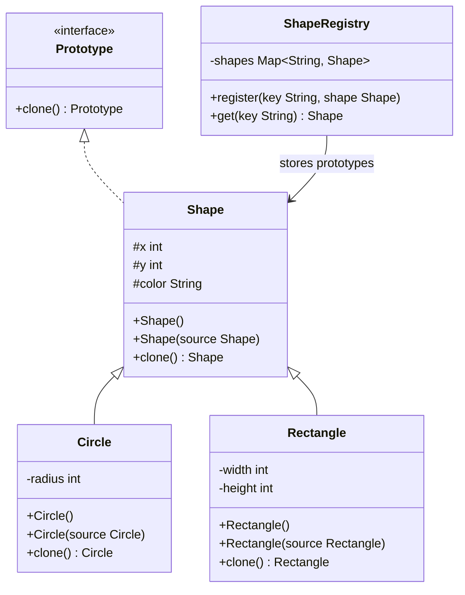

# Chapter 09 — Prototype Pattern

## What & Why

The **Prototype** pattern creates new objects by **cloning** an existing object (the prototype) instead of constructing from scratch. You copy a fully-configured object and tweak only what differs.

**Real-world analogy:** A cell divides by **mitosis** — it copies itself completely, then the two cells diverge. You don't build a new cell atom-by-atom from raw materials. Similarly, a printing shop uses a **master copy** — stamp out 500 copies, then customize each with a different name.

---

## The Problem

Sometimes creating an object is expensive or complex:

```java
// BAD: Creating every game enemy from scratch
Enemy boss1 = new Enemy();
boss1.setSprite(loadFromDisk("orc.png"));         // slow I/O
boss1.setHealth(500);
boss1.setAttack(30);
boss1.setDefense(20);
boss1.setAbilities(parseAbilityFile("orc.xml"));  // slow I/O
boss1.setPosition(100, 200);

// Need another orc? Do it ALL again?
Enemy boss2 = new Enemy();
boss2.setSprite(loadFromDisk("orc.png"));         // loads SAME file again
boss2.setHealth(500);
boss2.setAttack(30);
boss2.setDefense(20);
boss2.setAbilities(parseAbilityFile("orc.xml"));  // parses SAME file again
boss2.setPosition(300, 400);
```

**Problems:**
- **Expensive initialization** repeated unnecessarily (disk I/O, parsing, network calls)
- **Duplicate code** — same setup logic copy-pasted
- **Tight coupling** — client must know every detail of how to construct the object
- Sometimes you don't even know the concrete class — you just have a reference to an interface

---

## The Solution

Create one **prototype** object, then clone it:

```java
Enemy orcPrototype = createOrcPrototype();  // expensive, but only once

Enemy boss1 = orcPrototype.clone();  // instant copy — no disk I/O
boss1.setPosition(100, 200);

Enemy boss2 = orcPrototype.clone();  // instant copy
boss2.setPosition(300, 400);
```

---

## UML Class Diagram



---

## Step-by-Step

1. **Define a `Prototype` interface** with a `clone()` method
2. **Each class implements `clone()`** via a **copy constructor** — a constructor that takes an existing instance and copies its fields
3. **Create prototype instances** — fully configured template objects
4. **Clone when needed** — call `prototype.clone()` to get a copy, then customize
5. **Optional: Prototype Registry** — a map of named prototypes for easy lookup

---

## Shallow Copy vs Deep Copy (Critical!)

This is the most important concept in this chapter.

### Shallow Copy
Copies **primitives** by value, but copies **object references** — so both original and clone point to the **same** nested objects.

```java
class Document {
    String title;          // immutable — safe to share
    List<String> pages;    // mutable — DANGER!
}

Document original = new Document("Report", Arrays.asList("Page 1", "Page 2"));
Document copy = original.shallowClone();

copy.pages.add("Page 3");         // modifies the SHARED list
System.out.println(original.pages); // [Page 1, Page 2, Page 3] ← ALSO CHANGED!
```

```
MEMORY (Shallow Copy):
original ──→ [title: "Report"]
              [pages: ─────────→ ArrayList ["Page 1", "Page 2"]
copy ────→ [title: "Report"]        ↑
           [pages: ─────────────────┘  ← SAME object!
```

### Deep Copy
Copies **everything** — creates new instances of all nested objects recursively.

```java
Document copy = original.deepClone();

copy.pages.add("Page 3");
System.out.println(original.pages); // [Page 1, Page 2] ← UNCHANGED
```

```
MEMORY (Deep Copy):
original ──→ [title: "Report"]
              [pages: ─────────→ ArrayList ["Page 1", "Page 2"]

copy ────→ [title: "Report"]
           [pages: ─────────→ ArrayList ["Page 1", "Page 2"]  ← DIFFERENT object!
```

### When to Use Which

| | Shallow Copy | Deep Copy |
|---|---|---|
| **Speed** | Fast | Slower (copies nested objects) |
| **Safe with immutable fields** | Yes | Yes (but unnecessary overhead) |
| **Safe with mutable fields** | NO — shared mutation bug | Yes |
| **Use when** | All fields are primitives/immutable | Object has mutable nested objects |

**Rule of thumb:** Default to **deep copy**. Only use shallow copy when you're sure all nested objects are immutable (like `String` in Java).

---

## The Copy Constructor Pattern

The cleanest way to implement `clone()` in all 4 languages:

```java
class Circle extends Shape {
    private int radius;

    // Normal constructor
    public Circle(int x, int y, String color, int radius) {
        super(x, y, color);
        this.radius = radius;
    }

    // Copy constructor — takes an existing Circle and copies everything
    public Circle(Circle source) {
        super(source);               // copy parent fields
        this.radius = source.radius; // copy own fields
    }

    @Override
    public Circle clone() {
        return new Circle(this);     // delegate to copy constructor
    }
}
```

**Why copy constructor over Java's `Cloneable`?**
- Java's `Cloneable` interface is broken by design (Effective Java, Item 13)
- `Object.clone()` does shallow copy only
- No compile-time type safety
- Copy constructor is explicit, type-safe, and you control shallow vs deep

---

## Prototype Registry

A map that stores named prototypes for easy access:

```java
class ShapeRegistry {
    private Map<String, Shape> shapes = new HashMap<>();

    public void register(String key, Shape shape) {
        shapes.put(key, shape);
    }

    public Shape get(String key) {
        Shape prototype = shapes.get(key);
        if (prototype == null) {
            throw new IllegalArgumentException("Unknown shape: " + key);
        }
        return prototype.clone();  // always returns a CLONE, not the original
    }
}
```

```java
// Setup
ShapeRegistry registry = new ShapeRegistry();
registry.register("red-circle", new Circle(0, 0, "red", 10));
registry.register("blue-rect", new Rectangle(0, 0, "blue", 100, 50));

// Usage — don't need to know construction details
Shape s1 = registry.get("red-circle");   // cloned Circle
Shape s2 = registry.get("red-circle");   // another cloned Circle
Shape s3 = registry.get("blue-rect");    // cloned Rectangle
```

---

## Language-Specific Notes

### Java
- Avoid `Cloneable` / `Object.clone()` — use copy constructors instead
- `String` is immutable — safe to share in shallow copies
- Collections need explicit deep copy: `new ArrayList<>(original.list)`

### C++
- Copy constructor is a first-class language feature: `Circle(const Circle& other)`
- Watch for the **Rule of Three/Five** — if you define a copy constructor, also define copy assignment, destructor (and move constructor/move assignment in C++11+)
- Use `std::unique_ptr` with a virtual `clone()` method for polymorphic cloning
- Shallow copy of raw pointers creates **double-free** bugs

### Rust
- `Clone` trait is the standard way: `#[derive(Clone)]` or manual `impl Clone`
- `Clone` = explicit deep copy (you call `.clone()`)
- `Copy` trait = implicit shallow copy (stack values like `i32`, `bool`)
- Types with heap data (`String`, `Vec`) implement `Clone` but NOT `Copy`
- Rust's ownership model prevents accidental shared mutation — shallow copy bugs are compile errors

### Go
- No built-in clone mechanism — implement a `Clone()` method manually
- Assigning a struct copies it (value semantics) — but slices and maps are **reference types**
- Must explicitly copy slices: `copy(dst, src)` or `append([]T{}, src...)`
- Must explicitly copy maps: iterate and copy key-value pairs

---

## Prototype vs Other Creational Patterns

| | Factory Method | Builder | Prototype |
|---|---|---|---|
| **Creates from** | Class name (new) | Step-by-step config | Existing object (clone) |
| **When to use** | Know the type at runtime | Many optional params | Expensive init / unknown concrete type |
| **# of instances** | New instance each time | New instance each time | Copy of existing instance |
| **Knows concrete class?** | Factory does | Builder does | Nobody needs to — just clone |

---

## When to Use

- Object creation is **expensive** (disk I/O, network, heavy computation)
- You want to avoid **subclass proliferation** just for different configurations
- You need to clone objects **without knowing their concrete class** (only have an interface reference)
- **Prototype Registry** — pre-configured templates that users clone and customize

## When NOT to Use

- Objects are **cheap to create** — cloning adds unnecessary complexity
- Objects have **circular references** — deep copy becomes tricky
- Object has very **few fields** — just use a constructor
- Classes with **no mutable state** — immutable objects can be shared, not cloned

---

## Common Pitfalls

1. **Shallow copy when you need deep** — The #1 bug. Mutating a nested object in the clone changes the original. Always deep copy mutable fields.
2. **Forgetting to copy parent fields** — The copy constructor must call `super(source)` to copy inherited fields.
3. **Using Java's `Cloneable`** — It's a broken API. Use copy constructors instead.
4. **Cloning immutable objects** — Pointless. If the object can't change, just share the reference.
5. **Not updating the clone** — Cloning then forgetting to customize the copy (e.g., keeping the same ID).

---

## SOLID Connections

| Principle | How Prototype applies |
|-----------|----------------------|
| OCP | New object types can be cloned without modifying existing code |
| DIP | Client depends on the `Prototype` interface, not concrete classes |
| SRP | Each class handles its own cloning logic |
| LSP | Any `Prototype` subtype can be cloned through the interface |

---

## What's Next

Study the code examples in `src/` — a Shape hierarchy (Circle, Rectangle) with copy constructors, deep copy, and a ShapeRegistry. Then tackle the assignments.
