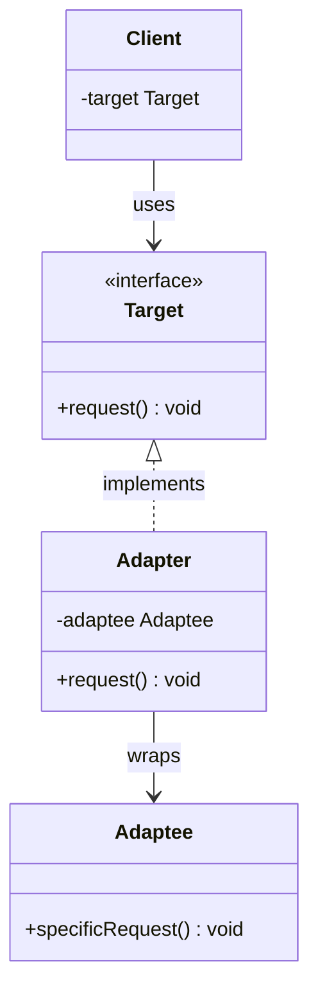
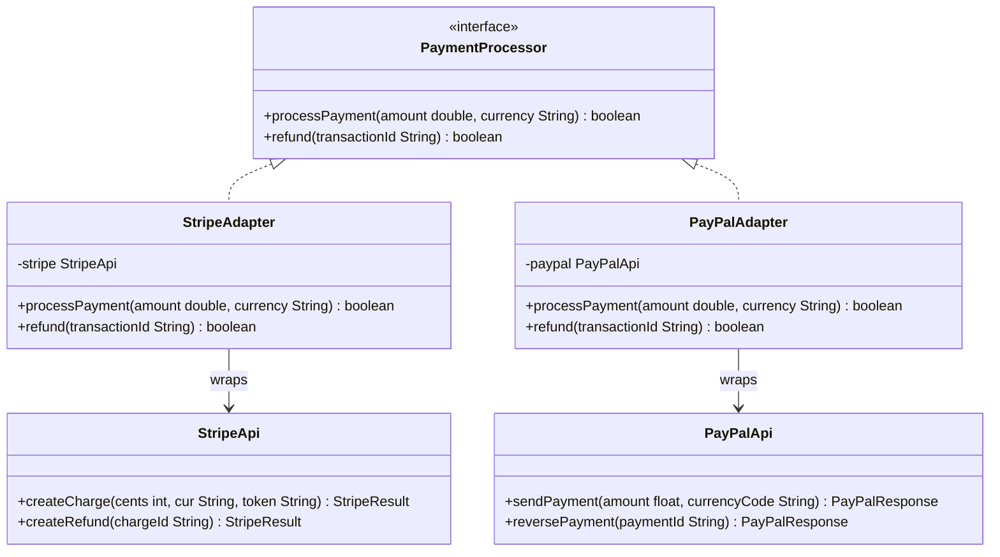

# Chapter 10 — Adapter Pattern

## What & Why

The **Adapter** pattern converts an interface of a class into another interface the client expects. It lets classes work together that otherwise couldn't because of **incompatible interfaces**.

**Real-world analogy:** A power outlet adapter. You have a US laptop charger (two flat prongs) and a European wall socket (two round holes). They're incompatible. A travel adapter sits between them — it "speaks" European on one side and US on the other. The adapter doesn't change the electricity or the charger — it just bridges the gap.

---

## The Problem

You have working code that expects **Interface A**, and a third-party library (or legacy class) that provides the same functionality but through **Interface B**:

```java
// Your code expects this interface
interface MediaPlayer {
    void play(String filename);
    void stop();
}

// Third-party library provides this — different method names, different signature
class VlcLibrary {
    void vlcPlay(String path, int volume) { ... }
    void vlcStop() { ... }
    void vlcPause() { ... }
}
```

**Problems:**
- You can't change `VlcLibrary` — it's third-party code
- You can't change `MediaPlayer` — existing code depends on it
- Direct coupling to `VlcLibrary` means switching to another library later is painful
- Your client code shouldn't know or care which underlying library is being used

---

## The Solution

Create an **Adapter** class that implements the expected interface and wraps the incompatible class:

```java
class VlcAdapter implements MediaPlayer {
    private VlcLibrary vlc;  // wraps the incompatible class

    VlcAdapter(VlcLibrary vlc) {
        this.vlc = vlc;
    }

    @Override
    public void play(String filename) {
        vlc.vlcPlay(filename, 100);  // translate the call
    }

    @Override
    public void stop() {
        vlc.vlcStop();
    }
}
```

Now client code only knows about `MediaPlayer` — it has no idea `VlcLibrary` exists.

The **C++** object adapter wraps the adaptee by composition:

```cpp
// Target — the interface the client expects
struct MediaPlayer {
    virtual ~MediaPlayer() = default;
    virtual void play(const std::string& filename) = 0;
    virtual void stop() = 0;
};

// Adaptee — third-party class with an incompatible interface (can't change it)
class VlcLibrary {
public:
    void vlc_play(const std::string& path, int volume) { /* ... */ }
    void vlc_stop() { /* ... */ }
};

// Adapter — implements Target, HOLDS the Adaptee (object adapter / composition)
class VlcAdapter : public MediaPlayer {
    VlcLibrary vlc_;                                  // HAS-A the incompatible class
public:
    void play(const std::string& filename) override { vlc_.vlc_play(filename, 100); }  // translate
    void stop() override { vlc_.vlc_stop(); }
};
```

### C++ specifics

- **Target is a pure-virtual base with a `virtual` destructor**; the client works with `MediaPlayer&` or `std::unique_ptr<MediaPlayer>`, never the concrete adapter.
- **Object adapter = hold the adaptee.** Own it **by value** (as above) if the adapter's lifetime owns it; hold a **reference/pointer** if the adaptee is external or shared — don't copy something you don't own.
- **C++ also supports the class adapter** via inheritance, and the idiomatic form is **`private` inheritance** (implemented-in-terms-of): `class VlcAdapter : public MediaPlayer, private VlcLibrary`. Still prefer the object adapter (composition over inheritance, Ch04).
- No `implements`/`extends` keywords — a single `: public Target` gives you the Target contract.

---

## UML Class Diagram



### Roles

| Role | Description | In our example |
|------|-------------|----------------|
| **Target** | Interface the client expects | `MediaPlayer` |
| **Adaptee** | Existing class with incompatible interface | `VlcLibrary` |
| **Adapter** | Bridges Target ↔ Adaptee | `VlcAdapter` |
| **Client** | Code that uses the Target interface | Your application |

---

## Two Flavors: Object Adapter vs Class Adapter

### Object Adapter (Composition) — Preferred

The adapter **wraps** the adaptee (holds a reference):

```java
class VlcAdapter implements MediaPlayer {
    private VlcLibrary vlc;          // composition — HAS-A

    VlcAdapter(VlcLibrary vlc) {
        this.vlc = vlc;
    }

    public void play(String filename) {
        vlc.vlcPlay(filename, 100);  // delegates
    }
}
```

### Class Adapter (Inheritance)

The adapter **extends** the adaptee AND implements the target:

```java
class VlcAdapter extends VlcLibrary implements MediaPlayer {
    // inherits vlcPlay, vlcStop, etc.

    public void play(String filename) {
        vlcPlay(filename, 100);      // calls inherited method
    }
}
```

### Which to Use?

| | Object Adapter (Composition) | Class Adapter (Inheritance) |
|---|---|---|
| **Flexibility** | Can adapt any subclass of Adaptee | Only adapts the specific class |
| **Multiple adaptees** | Can wrap multiple different objects | Single inheritance limits this |
| **Override behavior** | Must delegate explicitly | Can override adaptee methods |
| **Languages** | Works everywhere | C++ (full), Java (if Target is an interface), Rust/Go (no) |
| **Verdict** | **Preferred** — follows "composition over inheritance" (Ch04) | Rarely used |

**In Java:** Class adapter works when Target is an interface — `extends Adaptee implements Target`. Fails only if both are concrete classes.
**In C++:** Both always work (multiple inheritance). Object adapter still preferred.
**In Rust, Go:** Only object adapter — no inheritance mechanism at all.

---

## Step-by-Step Implementation

1. **Identify the Target interface** — what does the client expect?
2. **Identify the Adaptee** — what existing class has the functionality but wrong interface?
3. **Create the Adapter** — implements Target, wraps Adaptee
4. **Translate method calls** — map Target methods to Adaptee methods
5. **Client uses Target** — doesn't know about the Adaptee at all

---

## Practical Example: Payment Gateway

Your e-commerce app uses a `PaymentProcessor` interface. You need to integrate two different third-party payment APIs:



Each adapter translates:
- `processPayment(double, String)` → Stripe's `createCharge(int cents, ...)` or PayPal's `sendPayment(float, ...)`
- Different amount types (double → int cents for Stripe, double → float for PayPal)
- Different return types → normalized to `boolean`

---

## Data/Format Adapters

Adapters aren't just for classes — they also bridge **data formats**:

```java
// Your system works with JSON
interface DataProcessor {
    void process(String json);
}

// Legacy system produces XML
class LegacySystem {
    String fetchData() { return "<data><id>1</id></data>"; }
}

// Adapter converts XML → JSON
class XmlToJsonAdapter implements DataProcessor {
    private LegacySystem legacy;

    public void process(String json) {
        // In reality, you'd convert XML to JSON here
    }

    public String fetchAsJson() {
        String xml = legacy.fetchData();
        return convertXmlToJson(xml);
    }
}
```

---

## Real-World Examples

| Example | Target | Adaptee | What the adapter does |
|---------|--------|---------|----------------------|
| `Arrays.asList()` | `List<T>` | `T[]` | Wraps array as a List |
| JDBC drivers | `java.sql.Connection` | MySQL/Postgres native API | Translates SQL calls to vendor-specific protocol |
| SLF4J | `Logger` interface | Log4j, Logback, JUL | Adapts different logging frameworks to one API |
| `InputStreamReader` | `Reader` (char stream) | `InputStream` (byte stream) | Adapts bytes → characters |
| Go `http.HandlerFunc` | `Handler` interface | plain function | Adapts a function to the Handler interface |

---

## Language-Specific Notes

### Java
- Object adapter only (single inheritance)
- Interfaces make this natural — implement the target, compose the adaptee
- Common in the standard library (I/O streams, collections)

### C++
- Both object and class adapter (multiple inheritance available)
- Object adapter preferred — use composition with references or smart pointers
- Class adapter via multiple inheritance: `class Adapter : public Target, private Adaptee`

### Rust
- Implement the target trait on a wrapper struct
- Newtype pattern is Rust's idiomatic adapter: `struct VlcAdapter(VlcLibrary)`
- Rust's `From`/`Into` traits are built-in adapter mechanisms for type conversion

### Go
- Interfaces are implicitly satisfied — no `implements` keyword
- Adapter struct embeds or holds the adaptee
- Go's interface system makes adapters very lightweight
- Function adapters: `http.HandlerFunc` adapts a function to the `Handler` interface

---

## Adapter vs Other Structural Patterns

| Pattern | Purpose | Key Difference |
|---------|---------|---------------|
| **Adapter** | Make incompatible interfaces work together | Converts interface AFTER the fact |
| **Bridge** | Separate abstraction from implementation | Designed UP FRONT to vary independently |
| **Decorator** | Add behavior without modifying | Same interface, enhanced behavior |
| **Facade** | Simplify a complex subsystem | Defines a NEW simpler interface |
| **Proxy** | Control access to an object | Same interface, access control |

**Adapter vs Facade:** Adapter wraps ONE class to match an existing interface. Facade wraps MANY classes behind a new simplified interface.

**Adapter vs Decorator:** Adapter changes the interface. Decorator keeps the same interface but adds behavior.

---

## When to Use

- Integrating a **third-party library** with a different interface
- Supporting **multiple implementations** of the same functionality (payment gateways, loggers, databases)
- Working with **legacy code** that can't be modified
- **Data format conversion** (XML↔JSON, metric↔imperial)
- Making **unit testing** easier by adapting real services to test doubles

## When NOT to Use

- Interfaces are **already compatible** — just use them directly
- You **control both sides** — just design a common interface from the start
- Too many adapters piling up — might indicate a deeper design problem
- Simple **type conversion** — use a utility method, not a full adapter class

---

## Common Pitfalls

1. **Leaking the adaptee** — The adapter should fully hide the adaptee. Client should never access the adaptee directly.
2. **Too much logic in the adapter** — The adapter should only translate. Business logic belongs in the client or the adaptee, not the adapter.
3. **Adapter per method** — If you only need to adapt one method, consider a lambda or function reference instead of a full class.
4. **Not adapting error handling** — The adaptee may throw different exceptions or return different error types. The adapter must translate these too.
5. **Creating adapters you don't need** — If you control the library, fix the interface instead of wrapping it.

---

## SOLID Connections

| Principle | How Adapter applies |
|-----------|---------------------|
| SRP | Adapter's only job is interface translation — no business logic |
| OCP | Add new adapters for new third-party services without changing existing code |
| LSP | All adapters are substitutable through the Target interface |
| DIP | Client depends on the Target abstraction, not the Adaptee concretion |
| ISP | Target interface should be focused — don't force adapters to implement unused methods |

---

## What's Next

Study the code examples in `src/` — a payment processing system with Stripe and PayPal adapters. Then tackle the assignments.
