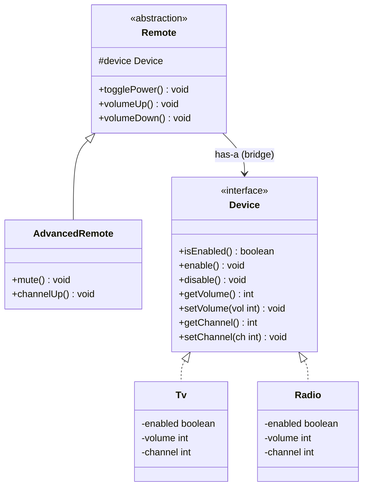

# Chapter 11 — Bridge Pattern

## What & Why

The **Bridge** pattern separates an **abstraction** from its **implementation** so the two can vary **independently**. It replaces inheritance with composition — connecting the two hierarchies through a "bridge" reference.

**Real-world analogy:** A TV remote control and the TV itself. The remote (abstraction) can be basic or advanced. The TV (implementation) can be Sony, Samsung, or LG. A basic remote works with any TV. An advanced remote works with any TV. They vary independently — you don't need `BasicSonyRemote`, `BasicSamsungRemote`, `AdvancedSonyRemote`, `AdvancedSamsungRemote`...

---

## The Problem: Cartesian Product Explosion

When you have two dimensions of variation and use inheritance, classes multiply:

```
Shape × Color = explosion

         Shape
        /     \
   Circle    Rectangle
   /   \      /    \
RedC  BlueC  RedR  BlueR    ← 4 classes for 2×2

Add Green:
RedC  BlueC  GreenC  RedR  BlueR  GreenR    ← 6 classes for 2×3

Add Triangle:
RedC  BlueC  GreenC  RedR  BlueR  GreenR  RedT  BlueT  GreenT  ← 9 classes for 3×3
```

**M shapes × N colors = M×N classes.** Adding one color means adding M new subclasses. Adding one shape means adding N new subclasses. This is unsustainable.

---

## The Solution: Bridge

Instead of encoding both dimensions in the class hierarchy, **separate** them:

```
Abstraction (Shape)  ──bridges──→  Implementation (Color)
    ├── Circle                         ├── Red
    └── Rectangle                      ├── Blue
                                       └── Green
```

Each Shape holds a **reference** to a Color. M shapes + N colors = **M + N classes** (not M × N).

```java
// 2 shapes + 3 colors = 5 classes instead of 9
Circle circle = new Circle(new Red());
Rectangle rect = new Rectangle(new Blue());
```

---

## UML Class Diagram



### Roles

| Role | Description | In our example |
|------|-------------|----------------|
| **Abstraction** | High-level control layer | `Remote` |
| **Refined Abstraction** | Extended abstraction with more features | `AdvancedRemote` |
| **Implementation** | Interface for the implementation side | `Device` |
| **Concrete Implementation** | Actual implementation | `Tv`, `Radio` |
| **Bridge** | The reference from Abstraction → Implementation | `Remote.device` field |

---

## Step-by-Step

1. **Identify two independent dimensions** that vary — e.g., Remote (basic/advanced) × Device (TV/Radio)
2. **Define the Implementation interface** — `Device` with low-level operations
3. **Build Concrete Implementations** — `Tv`, `Radio` implement `Device`
4. **Define the Abstraction** — `Remote` holds a reference to `Device` (the bridge)
5. **Build Refined Abstractions** — `AdvancedRemote` extends `Remote` with more features
6. **Client composes** — `new AdvancedRemote(new Tv())`

---

## Key Insight: Implementation ≠ Abstraction

The abstraction provides **user-facing** operations (press power, volume up). The implementation provides **device-level** operations (enable, set volume to X). The abstraction **delegates** to the implementation:

```java
class Remote {
    protected Device device;    // ← the bridge

    public void togglePower() {
        if (device.isEnabled()) {
            device.disable();       // delegates to implementation
        } else {
            device.enable();
        }
    }

    public void volumeUp() {
        device.setVolume(device.getVolume() + 10);  // delegates
    }
}
```

The remote doesn't know if it's controlling a TV or Radio. The device doesn't know if it's being controlled by a basic or advanced remote. **They vary independently.**

The **C++** version — the bridge is a `unique_ptr<Device>` member the abstraction owns:

```cpp
// Implementation side
struct Device {
    virtual ~Device() = default;
    virtual bool is_enabled() const = 0;
    virtual void enable() = 0;
    virtual void disable() = 0;
    virtual int  volume() const = 0;
    virtual void set_volume(int v) = 0;
};

class Tv    : public Device { /* ... */ };
class Radio : public Device { /* ... */ };

// Abstraction side — holds the bridge to an implementation
class Remote {
protected:
    std::unique_ptr<Device> device_;                 // the bridge (owns the device)
public:
    explicit Remote(std::unique_ptr<Device> device) : device_(std::move(device)) {}
    virtual ~Remote() = default;

    void toggle_power() {
        if (device_->is_enabled()) device_->disable();   // delegate to implementation
        else                       device_->enable();
    }
    void volume_up() { device_->set_volume(device_->volume() + 10); }
};

// Refined abstraction — more features, same bridge
class AdvancedRemote : public Remote {
public:
    using Remote::Remote;                            // inherit the base constructor
    void mute() { device_->set_volume(0); }
};

// Client composes the two INDEPENDENT hierarchies:
AdvancedRemote remote(std::make_unique<Tv>());
```

### C++ specifics

- **The bridge is a member `std::unique_ptr<Device>`** — the abstraction owns its implementation. Use a raw pointer/reference instead if the device is external or shared.
- **Both hierarchies are pure-virtual bases with `virtual` destructors** — `Device` and `Remote` are each deleted through base pointers.
- **`using Remote::Remote;`** inherits the base constructor so the refined abstraction doesn't re-declare it.
- Under the hood this is the same "depend on an interface pointer" wiring as DIP/Strategy — **Bridge is composition connecting two hierarchies**, which is why it beats the M×N inheritance explosion.

---

## Without Bridge vs With Bridge

### Without (Inheritance)

```
         Remote
        /      \
   TvRemote   RadioRemote
   /     \      /      \
BasicTV  AdvTV  BasicRadio  AdvRadio   ← 4 classes, grows as M×N
```

Adding a `Stereo` device → 2 more classes.
Adding a `ProRemote` → 3 more classes.

### With Bridge (Composition)

```
    Remote ──────→ Device
    ├── BasicRemote     ├── Tv
    └── AdvancedRemote  ├── Radio
                        └── Stereo

Add Stereo → 1 new class.
Add ProRemote → 1 new class.
```

---

## Bridge vs Adapter

This is a common interview question:

| | Bridge | Adapter |
|---|--------|---------|
| **When designed** | **Up front** — planned from the start | **After the fact** — retrofitting incompatible code |
| **Purpose** | Let abstraction and implementation vary independently | Make existing incompatible interfaces work together |
| **Relationship** | Both sides designed together | Adaptee already exists, can't be changed |
| **Hierarchies** | Two parallel hierarchies by design | One hierarchy adapting to another |

**Memory trick:** Bridge = planned separation. Adapter = emergency compatibility fix.

---

## Bridge vs Strategy

Both use composition to delegate behavior, but:

| | Bridge | Strategy |
|---|--------|----------|
| **Structure** | Two hierarchies (abstraction + implementation) | One context + interchangeable algorithms |
| **Intent** | Decouple orthogonal dimensions | Swap algorithms at runtime |
| **Scale** | Implementation has multiple methods forming a cohesive interface | Strategy typically has one method |
| **Relationship** | Abstraction doesn't make sense without implementation | Context works fine without strategy (can have a default) |

---

## Language-Specific Notes

### Java
- Abstraction is typically an abstract class (not interface) holding a reference to the implementation interface
- The bridge is the constructor-injected `Device` reference
- JDBC is a real-world Bridge: `DriverManager` (abstraction) bridges to `Driver` implementations (MySQL, Postgres)

### C++
- Use references or smart pointers for the bridge link
- Abstraction holds `std::unique_ptr<Device>` for ownership
- The Pimpl (Pointer to Implementation) idiom is a Bridge variant — hides implementation details behind a pointer

### Rust
- Use trait objects (`Box<dyn Device>`) for the bridge
- The abstraction struct holds a `Box<dyn Device>` field
- Rust's lack of inheritance makes Bridge natural — you compose traits rather than inheriting
- Generics (`Remote<D: Device>`) are an alternative to trait objects — resolved at compile time

### Go
- Interfaces are implicit — `Device` interface is just a set of methods
- Struct embedding can model the abstraction hierarchy (though composition is more idiomatic)
- Bridge is very natural in Go — composition is the language's primary mechanism

---

## When to Use

- You have **two (or more) orthogonal dimensions** of variation — don't let them multiply into M×N classes
- You want to **switch implementations at runtime** — e.g., change the rendering engine without changing the shapes
- You want to **hide implementation details** from the client — client only sees the abstraction
- A class hierarchy is **growing in two directions** — split it into two connected hierarchies

## When NOT to Use

- Only **one dimension** varies — just use polymorphism, no bridge needed
- The abstraction and implementation **always change together** — bridge adds unnecessary indirection
- The implementation is **trivial** — a bridge for `add(a, b)` is over-engineering
- You have only **one concrete implementation** — the bridge is pointless without choice

---

## Common Pitfalls

1. **Confusing Bridge with Adapter** — Bridge is designed up front for planned variation. Adapter is a retrofit. If you're wrapping existing code, it's probably Adapter.
2. **Too many bridges** — Not every composition is a Bridge pattern. Only use it when you genuinely have two independent hierarchies.
3. **Leaking implementation through abstraction** — The abstraction should provide high-level operations, not expose low-level implementation methods.
4. **One-sided hierarchy** — If only the implementation varies (no refined abstractions), you might just need Strategy instead.

---

## SOLID Connections

| Principle | How Bridge applies |
|-----------|-------------------|
| SRP | Abstraction handles high-level logic; implementation handles low-level details |
| OCP | Add new devices without changing remotes, and vice versa |
| DIP | Abstraction depends on the Device interface, not concrete Tv/Radio classes |
| LSP | Any Device implementation is substitutable — Remote works with all of them |

---

## What's Next

Study the code examples in `src/` — a Remote control system with Basic/Advanced remotes × TV/Radio devices. Then tackle the assignments.
