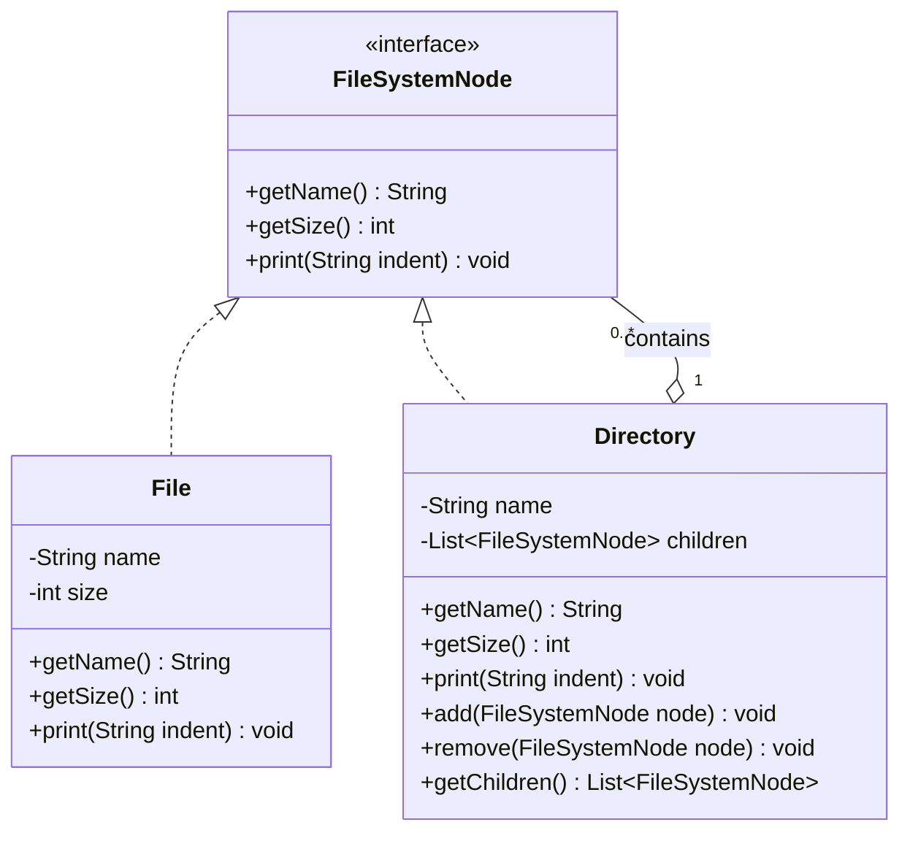

# Chapter 12 — Composite Pattern

## What & Why

The **Composite** pattern lets you treat **individual objects** and **groups of objects** uniformly through the same interface. It composes objects into **tree structures** to represent part-whole hierarchies.

**Real-world analogy:** A shipping box. A box can contain items (products) or other boxes (which contain more items or boxes). When you ask "what's the weight?", a product tells you directly, and a box sums up everything inside it — including nested boxes. You don't care whether you're asking an item or a box — same question, same interface.

---

## The Problem

You have a tree structure where **leaves** and **containers** must be handled differently:

```java
// BAD: Client must check types everywhere
if (node instanceof File) {
    System.out.println(((File) node).getSize());
} else if (node instanceof Directory) {
    int total = 0;
    for (Object child : ((Directory) node).getChildren()) {
        if (child instanceof File) {
            total += ((File) child).getSize();
        } else if (child instanceof Directory) {
            // recurse... nested instanceof nightmare
        }
    }
}
```

**Problems:**
- `instanceof` checks everywhere — fragile, violates OCP
- Adding a new node type (e.g., `Symlink`) means modifying every check
- Client must know the tree structure — tight coupling
- Recursive logic is scattered across client code

---

## The Solution

Define a **common interface** that both leaves and composites implement:

```java
interface FileSystemNode {
    int getSize();
    void print(String indent);
}
```

- A `File` (leaf) returns its own size
- A `Directory` (composite) sums up all children's sizes

Client code calls `node.getSize()` — works for files AND directories. No `instanceof`. No special cases.

The **C++** version — the composite **owns** its children via `unique_ptr`:

```cpp
// Component — common interface for leaves and composites
struct FileSystemNode {
    virtual ~FileSystemNode() = default;
    virtual int  get_size() const = 0;
    virtual void print(const std::string& indent) const = 0;
};

// Leaf — returns its own size directly
class File : public FileSystemNode {
    std::string name_;
    int size_;
public:
    File(std::string name, int size) : name_(std::move(name)), size_(size) {}
    int get_size() const override { return size_; }
    void print(const std::string& indent) const override {
        std::cout << indent << name_ << " (" << size_ << ")\n";
    }
};

// Composite — OWNS its children and aggregates their results
class Directory : public FileSystemNode {
    std::string name_;
    std::vector<std::unique_ptr<FileSystemNode>> children_;   // composite owns the tree
public:
    explicit Directory(std::string name) : name_(std::move(name)) {}

    void add(std::unique_ptr<FileSystemNode> node) { children_.push_back(std::move(node)); }

    int get_size() const override {
        int total = 0;
        for (const auto& child : children_) total += child->get_size();  // recursion via the structure
        return total;
    }
    void print(const std::string& indent) const override {
        std::cout << indent << name_ << "/\n";
        for (const auto& child : children_) child->print(indent + "  ");
    }
};
```

### C++ specifics

- **The composite owns its children with `std::vector<std::unique_ptr<FileSystemNode>>`** — when a directory is destroyed, its whole subtree is freed automatically (RAII). This is composition (Ch02) in its purest form.
- **`add()` takes a `std::unique_ptr` by value** and `std::move`s it in — the caller transfers ownership of the child into the tree.
- **The Component base needs a `virtual` destructor** — you delete children through `FileSystemNode*`, so without it the concrete `File`/`Directory` parts leak.
- Recursion is **built into the structure**: `Directory::get_size()` calls `get_size()` on each child polymorphically; a `File` returns its value (base case), a `Directory` recurses. No `dynamic_cast`, no type checks.

Client code calls `root.get_size()` — works for files AND directories, exactly like Java.

---

## UML Class Diagram



### Roles

| Role | Description | In our example |
|------|-------------|----------------|
| **Component** | Common interface for all nodes | `FileSystemNode` |
| **Leaf** | End node — no children | `File` |
| **Composite** | Node that contains other nodes | `Directory` |
| **Client** | Code that uses Component interface | Your application |

---

## Step-by-Step

1. **Define the Component interface** — operations that make sense for BOTH leaves and composites (e.g., `getSize()`, `print()`)
2. **Implement Leaf** — performs the operation directly on itself
3. **Implement Composite** — stores children, delegates operations by iterating and aggregating child results
4. **Composite manages children** — `add()`, `remove()`, `getChildren()`
5. **Client uses Component** — treats everything uniformly, never checks types

---

## The Key Insight: Recursive Composition

```
root/                          Directory.getSize() = sum of children
├── readme.txt (100)           File.getSize() = 100
├── src/                       Directory.getSize() = sum of children
│   ├── main.java (500)        File.getSize() = 500
│   └── util.java (300)        File.getSize() = 300
└── docs/                      Directory.getSize() = sum of children
    └── guide.txt (200)        File.getSize() = 200

root.getSize() = 100 + (500 + 300) + (200) = 1100
```

Each `Directory.getSize()` calls `getSize()` on its children. If a child is a `File`, it returns its size. If it's a `Directory`, it recursively sums its own children. The recursion is **built into the structure** — the client just calls `root.getSize()`.

---

## Transparency vs Safety

There are two approaches to where child-management methods live:

### Transparency (Component has add/remove)

```java
interface FileSystemNode {
    int getSize();
    void add(FileSystemNode node);      // in the interface
    void remove(FileSystemNode node);   // in the interface
}

class File implements FileSystemNode {
    public void add(FileSystemNode node) {
        throw new UnsupportedOperationException("Files can't have children");
    }
}
```

**Pro:** Client treats everything uniformly — never needs to know if it's a leaf or composite.
**Con:** Calling `add()` on a `File` throws at runtime — not type-safe.

### Safety (Only Composite has add/remove)

```java
interface FileSystemNode {
    int getSize();
    // No add/remove here
}

class Directory implements FileSystemNode {
    public void add(FileSystemNode node) { ... }     // only on Directory
    public void remove(FileSystemNode node) { ... }  // only on Directory
}
```

**Pro:** Compile-time safety — can't accidentally call `add()` on a `File`.
**Con:** Client must cast to `Directory` to add children — breaks uniform treatment.

### Which to use?

| | Transparency | Safety |
|---|---|---|
| **Uniform treatment** | ✓ Everything through Component | ✗ Must downcast for add/remove |
| **Type safety** | ✗ Runtime errors on leaves | ✓ Compile-time checks |
| **GoF recommendation** | Original book prefers this | Modern practice prefers this |
| **Best for** | Dynamic trees, UI frameworks | Static trees, file systems |

**Our examples use the Safety approach** — `add()`/`remove()` only on `Directory`. This is more practical and modern.

---

## Common Use Cases

| Use Case | Leaf | Composite | Operation |
|----------|------|-----------|-----------|
| **File system** | File | Directory | getSize(), print() |
| **UI framework** | Button, Label | Panel, Window | render(), resize() |
| **Organization chart** | Employee | Department | getSalary(), print() |
| **Menu system** | MenuItem | SubMenu | display(), click() |
| **Expression tree** | Number | AddExpr, MulExpr | evaluate() |
| **Graphics** | Circle, Line | Group | draw(), getBounds() |

---

## Language-Specific Notes

### Java
- Component is typically an interface or abstract class
- Use `List<Component>` for children in the composite
- `java.awt.Component` / `Container` is a real-world Composite

### C++
- Use `std::vector<std::unique_ptr<Component>>` for children — composite owns its children
- Virtual destructor on the Component base class is critical
- Smart pointers prevent memory leaks in the tree

### Rust
- Use `Vec<Box<dyn Component>>` for children (trait objects)
- Ownership is natural — composite owns its children via `Box`
- `enum` is an alternative to trait objects for closed hierarchies:
  ```rust
  enum FileSystemNode {
      File { name: String, size: u64 },
      Directory { name: String, children: Vec<FileSystemNode> },
  }
  ```
- The enum approach is more idiomatic for Rust when types are known at compile time

### Go
- Component is an interface; leaf and composite are structs
- Use a slice `[]Component` for children
- No inheritance — composition and interfaces are the only tools
- Go's simplicity makes Composite very clean

---

## Composite vs Related Patterns

| Pattern | Relationship |
|---------|-------------|
| **Iterator** (Ch19) | Iterates over a composite tree — often used together |
| **Visitor** (Ch26) | Adds operations to a composite tree without modifying node classes |
| **Decorator** (Ch13) | Both use recursive composition, but Decorator adds behavior while Composite aggregates |
| **Builder** (Ch07) | Can be used to construct complex composite trees step by step |

---

## When to Use

- You have a **tree structure** (part-whole hierarchy)
- You want clients to treat **individual objects and groups uniformly**
- The same operation should work on **leaves and containers** (getSize, render, evaluate)
- You want to **add new node types** without changing client code (OCP)

## When NOT to Use

- The structure is **flat** (just a list) — don't force a tree
- Leaves and composites have **completely different operations** — uniform interface doesn't make sense
- You only have **one level** of nesting — a simple container is enough
- The operations on leaves and composites are **fundamentally different** — forcing a common interface is awkward

---

## Common Pitfalls

1. **Forgetting the base case** — Recursive operations must terminate. A leaf's `getSize()` returns a value directly. A composite with no children returns 0. Without this, you get infinite recursion or stack overflow.
2. **Circular references** — If a directory can contain itself (directly or indirectly), recursive operations loop forever. Validate on `add()`.
3. **Adding non-tree operations to Component** — `add()`/`remove()` on leaves is awkward. Keep child-management on Composite only (Safety approach).
4. **Over-generalizing** — Not every hierarchy is a Composite. If the "leaves" and "composites" do fundamentally different things, don't force a common interface.
5. **Ignoring ownership** — In C++/Rust, the composite must own its children. Shared pointers or borrowed references create lifecycle complexity.

---

## SOLID Connections

| Principle | How Composite applies |
|-----------|----------------------|
| SRP | Each node class handles its own operation + the composite handles aggregation |
| OCP | Add new node types (e.g., `Symlink`) without modifying existing code |
| LSP | Any `FileSystemNode` — `File` or `Directory` — is substitutable |
| DIP | Client depends on the `FileSystemNode` abstraction, not concrete types |
| ISP | Component interface only has operations common to ALL nodes |

---

## What's Next

Study the code examples in `src/` — a file system with `File` and `Directory` nodes. Then tackle the assignments.
