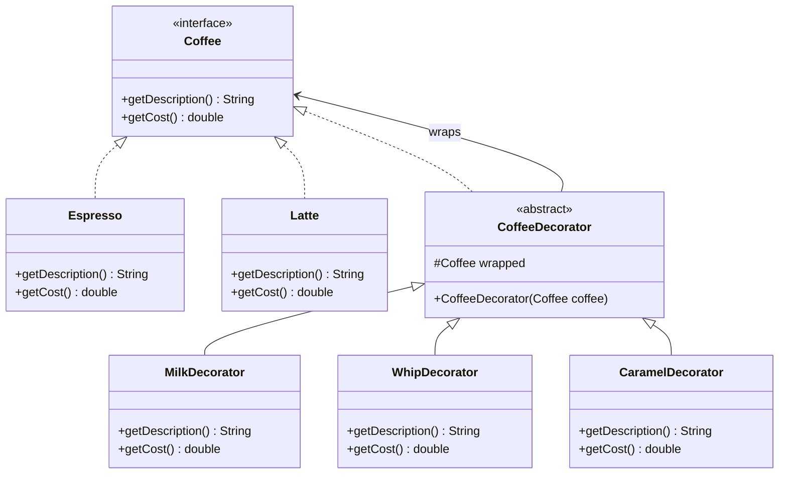

# Chapter 13 — Decorator Pattern

## What & Why

The **Decorator** pattern attaches **additional behavior** to an object **dynamically**, without modifying the object's class. It wraps an object in another object that adds functionality, and both share the **same interface**.

**Real-world analogy:** Ordering coffee. You start with a base espresso. Then you add milk (decorator), whipped cream (decorator), caramel drizzle (decorator). Each addition wraps around the previous one, adding cost and description. The barista doesn't make a separate `EspressoWithMilkAndWhipAndCaramel` class — they layer additions on top.

---

## The Problem: Subclass Explosion

You want to add optional features to objects. With inheritance, every **combination** of features needs its own subclass:

```
         Coffee
        /  |   \
  Espresso Latte  Mocha
   /    \    |
WithMilk WithWhip WithMilk
  |        |
WithMilkAndWhip  WithMilkAndCaramel ...
```

3 base types × 3 optional add-ons = potentially **27 subclasses** for every combination. Adding one new add-on (e.g., vanilla) doubles the number. This is unsustainable.

---

## The Solution: Wrapping

Instead of subclassing, **wrap** the object in a decorator that adds behavior:

```java
Coffee coffee = new Espresso();                   // $2.00
coffee = new MilkDecorator(coffee);               // $2.50 (adds $0.50)
coffee = new WhipDecorator(coffee);               // $3.20 (adds $0.70)
coffee = new CaramelDecorator(coffee);             // $3.80 (adds $0.60)

System.out.println(coffee.getDescription());       // "Espresso, Milk, Whip, Caramel"
System.out.println(coffee.getCost());              // 3.80
```

Each decorator:
1. **Wraps** the previous object
2. **Delegates** to it for base behavior
3. **Adds** its own behavior on top

---

## UML Class Diagram



### Roles

| Role | Description | In our example |
|------|-------------|----------------|
| **Component** | Interface defining the operations | `Coffee` |
| **Concrete Component** | Base object being decorated | `Espresso`, `Latte` |
| **Decorator** | Abstract wrapper — implements Component, holds a Component reference | `CoffeeDecorator` |
| **Concrete Decorator** | Adds specific behavior | `MilkDecorator`, `WhipDecorator` |

---

## Key Insight: Same Interface, Layered Behavior

The decorator **implements the same interface** as the object it wraps. This is what makes stacking possible:

```java
// Each decorator IS a Coffee AND HAS a Coffee
abstract class CoffeeDecorator implements Coffee {
    protected Coffee wrapped;    // ← the object being decorated

    CoffeeDecorator(Coffee wrapped) {
        this.wrapped = wrapped;
    }
}

class MilkDecorator extends CoffeeDecorator {
    MilkDecorator(Coffee wrapped) { super(wrapped); }

    public String getDescription() {
        return wrapped.getDescription() + ", Milk";   // delegate + add
    }

    public double getCost() {
        return wrapped.getCost() + 0.50;               // delegate + add
    }
}
```

The client doesn't know how many layers of decoration exist — it just calls `getCost()` on what it thinks is a `Coffee`.

The **C++** version — each decorator **owns** the component it wraps via `unique_ptr`:

```cpp
// Component
struct Coffee {
    virtual ~Coffee() = default;
    virtual std::string get_description() const = 0;
    virtual double get_cost() const = 0;
};

// Concrete component
class Espresso : public Coffee {
public:
    std::string get_description() const override { return "Espresso"; }
    double get_cost() const override { return 2.00; }
};

// Abstract decorator — IS a Coffee AND OWNS a Coffee
class CoffeeDecorator : public Coffee {
protected:
    std::unique_ptr<Coffee> wrapped_;
public:
    explicit CoffeeDecorator(std::unique_ptr<Coffee> wrapped) : wrapped_(std::move(wrapped)) {}
};

class MilkDecorator : public CoffeeDecorator {
public:
    using CoffeeDecorator::CoffeeDecorator;                              // inherit the constructor
    std::string get_description() const override { return wrapped_->get_description() + ", Milk"; }
    double get_cost() const override { return wrapped_->get_cost() + 0.50; }  // delegate + add
};

// Stacking — each decorator takes ownership of the one it wraps
std::unique_ptr<Coffee> coffee = std::make_unique<Espresso>();
coffee = std::make_unique<MilkDecorator>(std::move(coffee));
coffee = std::make_unique<WhipDecorator>(std::move(coffee));
std::cout << coffee->get_description() << " $" << coffee->get_cost() << "\n";
```

### C++ specifics

- **Each decorator owns its wrapped component via `std::unique_ptr<Coffee>`** — deleting the outermost decorator recursively frees the whole chain automatically (RAII).
- **Stacking uses `std::move`**: `make_unique<MilkDecorator>(std::move(coffee))` transfers ownership of the inner coffee into the new layer. The reassignment is safe because the right-hand side is fully evaluated (the old pointer moved out) before the assignment happens.
- **Component base needs a `virtual` destructor** — the chain is deleted through `Coffee*`.
- **Decorator vs Composite** (Ch12): identical recursive-ownership shape. A **Decorator wraps exactly one** component and *adds behavior*; a **Composite holds many** and *aggregates* them.

---

## Wrapping Visualized

```
CaramelDecorator
┌─────────────────────────────┐
│ wrapped:                    │
│  WhipDecorator              │
│  ┌──────────────────────┐   │
│  │ wrapped:             │   │
│  │  MilkDecorator       │   │
│  │  ┌───────────────┐   │   │
│  │  │ wrapped:      │   │   │
│  │  │  Espresso     │   │   │
│  │  │  cost: $2.00  │   │   │
│  │  │               │   │   │
│  │  └───────────────┘   │   │
│  │  adds: $0.50 (milk)  │   │
│  └──────────────────────┘   │
│  adds: $0.70 (whip)        │
└─────────────────────────────┘
adds: $0.60 (caramel)

getCost() call chain:
  Caramel.getCost()
    → Whip.getCost() + 0.60
      → Milk.getCost() + 0.70
        → Espresso.getCost() + 0.50
          → 2.00
        = 2.50
      = 3.20
    = 3.80
```

---

## Step-by-Step

1. **Define the Component interface** — operations that can be decorated (e.g., `getCost()`, `getDescription()`)
2. **Create Concrete Components** — base objects (`Espresso`, `Latte`)
3. **Create the abstract Decorator** — implements Component, holds a Component reference, delegates by default
4. **Create Concrete Decorators** — override methods to add behavior before/after delegating
5. **Client stacks decorators** — wraps the component in as many decorators as needed

---

## Decorator vs Inheritance

| | Inheritance | Decorator |
|---|---|---|
| **When decided** | Compile time (static) | Runtime (dynamic) |
| **Combinations** | One class per combination (M×N explosion) | Stack freely (M + N classes) |
| **Adding features** | New subclass needed | New decorator class — existing code unchanged |
| **Removing features** | Can't un-inherit | Just don't wrap |
| **Flexibility** | Fixed | Add/remove/reorder at runtime |

---

## Decorator vs Other Patterns

| Pattern | Same Interface? | Purpose |
|---------|----------------|---------|
| **Decorator** | Yes — wraps with same interface | **Add behavior** without modifying |
| **Adapter** | No — converts to different interface | **Convert** incompatible interfaces |
| **Proxy** | Yes — same interface | **Control access** (lazy load, auth, caching) |
| **Composite** | Yes — same interface | **Aggregate** into tree structures |

**Decorator vs Proxy:** Both wrap an object with the same interface. Decorator adds behavior. Proxy controls access. Decorator is usually stacked (multiple layers). Proxy is usually a single wrapper.

**Decorator vs Composite:** Both use recursive composition. Composite aggregates multiple children. Decorator wraps exactly one component.

---

## Real-World Examples

| Example | Component | Decorators |
|---------|-----------|------------|
| **Java I/O** | `InputStream` | `BufferedInputStream`, `DataInputStream`, `GZIPInputStream` |
| **Java Collections** | `List<T>` | `Collections.synchronizedList()`, `Collections.unmodifiableList()` |
| **Web middleware** | HTTP Handler | Logging, Auth, Compression, CORS |
| **Python** | Functions | `@staticmethod`, `@property`, `@cache` (function decorators) |

```java
// Java I/O — classic Decorator in the standard library
InputStream is = new FileInputStream("data.gz");          // base
is = new BufferedInputStream(is);                          // adds buffering
is = new GZIPInputStream(is);                              // adds decompression
// Each layer wraps the previous — same InputStream interface
```

---

## Language-Specific Notes

### Java
- Abstract decorator class extends the component interface
- Java's I/O streams are the textbook Decorator example
- Python-style `@annotations` are NOT the Decorator pattern — they're a language feature

### C++
- Use `std::unique_ptr<Component>` for the wrapped object — decorator owns it
- Virtual destructor on Component is critical
- Can also use templates for static (compile-time) decoration

### Rust
- Implement the trait for a wrapper struct that holds a `Box<dyn Component>`
- Rust closures can act as lightweight decorators for functions
- The newtype pattern works here too: `struct MilkDecorator(Box<dyn Coffee>)`

### Go
- Decorator struct holds the Component interface
- Function decorators are very common in Go: middleware pattern for HTTP handlers
- `http.HandlerFunc` wrapping is essentially a function decorator

---

## When to Use

- Add **responsibilities dynamically** without subclassing
- Need **mix-and-match** combinations of features (stacking)
- Want to follow **OCP** — add new behavior without modifying existing classes
- The set of optional features is **large or growing** — subclassing would explode
- Real-world: **middleware chains**, **I/O stream wrapping**, **UI component styling**

## When NOT to Use

- Only **one or two** fixed combinations — just subclass, it's simpler
- Order of decoration **matters significantly** and is confusing — consider a different pattern
- The interface has **many methods** — each decorator must delegate all of them (tedious)
- You need to **remove** a specific decorator from the middle of a stack — decorators don't support this well

---

## Common Pitfalls

1. **Forgetting to delegate** — A decorator must call `wrapped.method()` for every method it doesn't override. Missing one means the base behavior is lost.
2. **Identity checks break** — `espresso == decoratedEspresso` is false — they're different objects. Don't use `==` on decorated objects.
3. **Order sensitivity** — `Compress(Encrypt(data))` ≠ `Encrypt(Compress(data))`. Document the expected order.
4. **Too many small decorators** — 10 decorators stacked together are hard to debug. Consider if a Builder or configuration object is clearer.
5. **Decorator with state** — Be careful if a decorator caches or modifies data. The wrapped object may not expect it.

---

## SOLID Connections

| Principle | How Decorator applies |
|-----------|----------------------|
| SRP | Each decorator handles exactly one concern (milk, whip, caramel) |
| OCP | Add new decorators without modifying existing components or decorators |
| LSP | Decorators are substitutable for the Component — same interface |
| DIP | Client depends on the Coffee interface, not concrete classes |
| ISP | Component interface should be small — fewer methods = easier decorators |

---

## What's Next

Study the code examples in `src/` — a coffee shop ordering system with stackable decorators. Then tackle the assignments.
