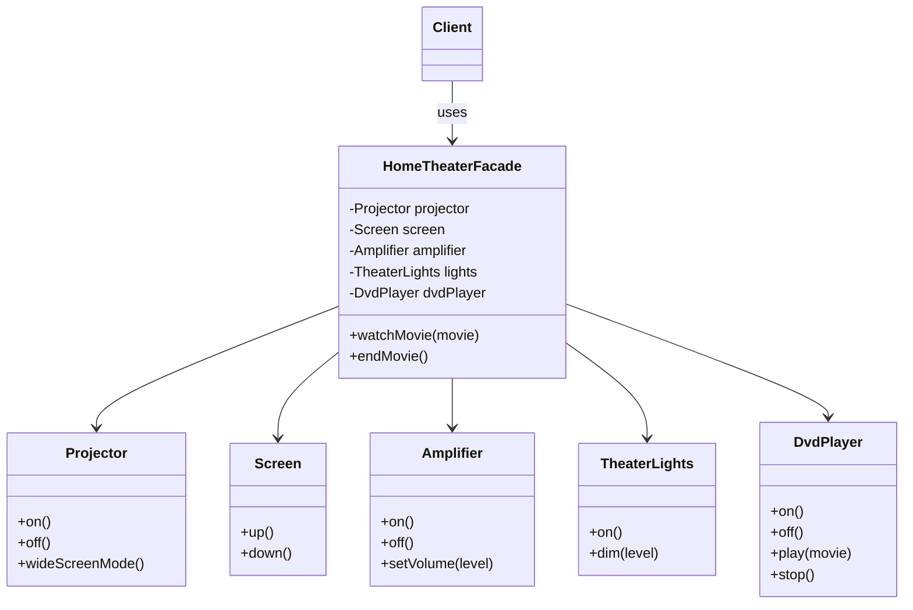

# Chapter 14 — Facade Pattern

## What & Why

The **Facade** pattern provides a **simplified, unified interface** to a complex subsystem. It defines a higher-level entry point that makes the subsystem easier to use, without hiding the subsystem's full capabilities from clients who need them.

**Real-world analogy:** A restaurant waiter. You don't walk into the kitchen and coordinate the chef, the grill, the fryer, and the dishwasher yourself. You tell the waiter "I'll have the steak" — and the waiter orchestrates all the kitchen subsystems for you. The waiter is a **facade** over the kitchen.

---

## The Problem: Subsystem Complexity

To watch a movie on a home theater, a client has to:

```java
projector.on();
projector.wideScreenMode();
screen.down();
amplifier.on();
amplifier.setVolume(8);
amplifier.setSource(dvdPlayer);
lights.dim(10);
dvdPlayer.on();
dvdPlayer.play("Inception");
```

Problems:
- The client must know **every** subsystem class and the **correct order** of calls.
- Client code is **tightly coupled** to subsystem internals — a change in any component ripples into every client.
- The same 9-line ritual is **duplicated** everywhere a movie starts.

---

## The Solution: A Single Entry Point

Wrap the orchestration in a **facade** that exposes simple operations:

```java
HomeTheaterFacade theater = new HomeTheaterFacade(projector, screen, amplifier, lights, dvdPlayer);

theater.watchMovie("Inception");  // does all 9 steps in order
theater.endMovie();               // tears everything down
```

The client talks to **one** object with **two** methods. The subsystem classes still exist and can be used directly by advanced clients — the facade doesn't lock them away.

The **C++** facade holds the subsystem objects and delegates in ordered method bodies:

```cpp
class HomeTheaterFacade {
    Projector& projector_;          // held by reference — owned elsewhere
    Screen& screen_;
    Amplifier& amplifier_;
    TheaterLights& lights_;
    DvdPlayer& dvd_;
public:
    HomeTheaterFacade(Projector& p, Screen& s, Amplifier& a, TheaterLights& l, DvdPlayer& d)
        : projector_(p), screen_(s), amplifier_(a), lights_(l), dvd_(d) {}

    void watch_movie(const std::string& movie) {
        projector_.on();
        projector_.wide_screen_mode();
        screen_.down();
        amplifier_.on();
        amplifier_.set_volume(8);
        lights_.dim(10);
        dvd_.on();
        dvd_.play(movie);
    }
    void end_movie() { /* tear everything down in reverse order */ }
};

// Client talks to ONE object with simple methods:
HomeTheaterFacade theater(projector, screen, amplifier, lights, dvd);
theater.watch_movie("Inception");
```

### C++ specifics

- **No `virtual`, no interface needed.** Unlike Adapter/Decorator, Facade doesn't rely on polymorphism — it's a plain class that *delegates*. That's the whole pattern.
- **Hold subsystems by reference** when they're owned elsewhere and outlive the facade (as above); hold them **by value or `unique_ptr`** if the facade should own them.
- Keep the subsystem headers public so advanced clients can still use `Projector` etc. directly — the facade *adds* a simple path, it doesn't wall off the components.

---

## Structure



**Roles:**
- **Facade** (`HomeTheaterFacade`) — knows which subsystem classes handle a request and delegates in the right order.
- **Subsystem classes** (`Projector`, `Amplifier`, ...) — do the real work; they know nothing about the facade.
- **Client** — talks to the facade instead of the subsystem directly.

---

## Step-by-Step

1. Identify a complex subsystem the client repeatedly interacts with.
2. Create a facade class that **holds references** to the subsystem components.
3. Add **coarse-grained methods** (`watchMovie`, `endMovie`) that encapsulate the multi-step workflows.
4. Point clients at the facade. Keep subsystem classes public so power users can still reach them.

---

## When to Use

- You want a **simple entry point** into a complex library or set of classes.
- You want to **decouple** clients from subsystem internals (layering).
- You're structuring a subsystem into layers — a facade defines the entry point to each layer.

## When NOT to Use

- The subsystem is already simple — a facade just adds a pointless indirection layer.
- Clients genuinely need fine-grained control over every component (though you can offer both).
- You're tempted to turn the facade into a **god object** that does everything — keep it thin; it should delegate, not implement business logic.

---

## Facade vs Adapter vs Proxy

| Pattern | Intent | Interface |
|---------|--------|-----------|
| **Facade** | Simplify a whole subsystem | Brand-new, simpler interface over many objects |
| **Adapter** | Make an incompatible interface usable | Converts one interface to another the client expects |
| **Proxy** | Control access to one object | Same interface as the object it wraps |

Key distinction: a **facade** wraps *many* objects to simplify; an **adapter** wraps *one* to convert; a **proxy** wraps *one* to control access.

---

## Common Pitfalls

- **God facade** — piling all business logic into the facade. It should *coordinate*, not *do*.
- **Hiding too much** — never remove access to subsystem classes advanced clients legitimately need.
- **Leaky facade** — exposing subsystem types in the facade's method signatures re-couples clients to internals.
- **One facade per client** — resist making a special facade for every caller; design around workflows, not callers.

---

## Language Notes

- **Java / C++** — facade holds references to concrete subsystem objects; delegates in ordered method bodies.
- **Go** — the facade is a struct embedding (or holding) subsystem structs; small interfaces keep it flexible. No inheritance needed.
- **Rust** — the facade owns its subsystem components (`struct` fields). Ownership makes the "facade owns the subsystem" relationship explicit and safe.
- Across all four: the facade adds **no new behavior** — it only sequences existing subsystem calls.
