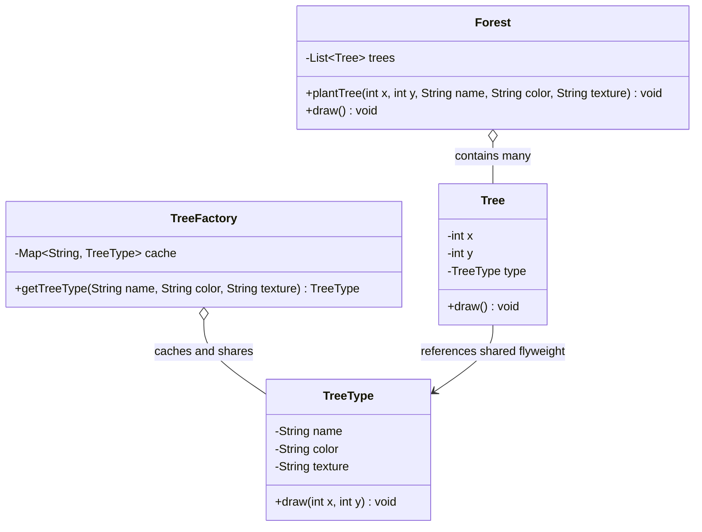

# Chapter 15 — Flyweight Pattern

## What & Why

The **Flyweight** pattern minimizes memory usage by **sharing** as much data as possible between many similar objects. When you need a huge number of objects that differ only in a small part of their state, you extract the **shared, unchanging** part into a single reused object (the flyweight) and keep only the **unique** part per object.

**Real-world analogy:** A forest game with a million trees. Every oak tree shares the same name, bark texture, and leaf color — that data is identical across all oaks. What differs is each tree's **position** (x, y) and maybe its height. Instead of storing the 2 MB texture a million times, you store it **once** and every tree just points to it. A million trees, but only a handful of distinct "tree types" in memory.

---

## The Problem: Too Many Heavy Objects

Imagine rendering a forest where each tree stores everything:

```java
class Tree {
    int x, y;                 // unique per tree — 8 bytes
    String name;              // "Oak" — repeated a million times
    String color;             // "Green" — repeated a million times
    byte[] texture;           // 2 MB bark image — repeated a million times!
}
```

Plant 1,000,000 trees → ~2 **terabytes** of duplicated texture data. The `name`, `color`, and `texture` are **identical** for every oak, yet each object holds its own copy. This is catastrophic memory waste.

---

## The Solution: Split Intrinsic vs Extrinsic State

The core idea is to divide an object's state into two categories:

| State | Meaning | Example (tree) | Storage |
|-------|---------|----------------|---------|
| **Intrinsic** | Shared, immutable, context-independent | name, color, texture | Stored **once** in the flyweight |
| **Extrinsic** | Unique, varies per object, context-dependent | x, y position | Stored per object (the context) |

Extract intrinsic state into a shared **flyweight**:

```java
// Flyweight — holds ONLY intrinsic (shared) state. Immutable.
class TreeType {
    final String name;
    final String color;
    final byte[] texture;   // stored ONCE, shared by all trees of this type

    void draw(int x, int y) {   // extrinsic state passed IN
        // render texture at (x, y)
    }
}

// Context — holds extrinsic state + a reference to the shared flyweight
class Tree {
    int x, y;              // extrinsic — unique per tree
    TreeType type;         // pointer to the shared flyweight
}
```

Now 1,000,000 trees share a handful of `TreeType` objects. Memory drops from terabytes to megabytes.

---

## Structure



**Roles:**
- **Flyweight** (`TreeType`) — stores intrinsic (shared) state; immutable; receives extrinsic state as method arguments.
- **Flyweight Factory** (`TreeFactory`) — creates and **caches** flyweights; returns an existing one if it already exists, so identical intrinsic state is never duplicated.
- **Context** (`Tree`) — stores extrinsic state and a reference to a flyweight.
- **Client** (`Forest`) — uses the factory to obtain flyweights and holds the contexts.

---

## The Flyweight Factory — the Heart of the Pattern

The factory guarantees flyweights are **shared, not duplicated**:

```java
class TreeFactory {
    private final Map<String, TreeType> cache = new HashMap<>();

    TreeType getTreeType(String name, String color, String texture) {
        String key = name + "-" + color + "-" + texture;
        // Return the existing flyweight, or create it once and cache it
        return cache.computeIfAbsent(key, k -> new TreeType(name, color, texture));
    }
}
```

Ask for an "Oak-Green" tree a million times → you get the **same** `TreeType` instance every time. The `new` happens only once per distinct combination.

The **C++** version uses **`std::shared_ptr<const TreeType>`** — the one place shared ownership is clearly the right default, since every context *shares* the flyweight:

```cpp
// Flyweight — intrinsic (shared) state only; immutable
class TreeType {
    std::string name_, color_, texture_;
public:
    TreeType(std::string name, std::string color, std::string texture)
        : name_(std::move(name)), color_(std::move(color)), texture_(std::move(texture)) {}
    void draw(int x, int y) const { /* render texture_ at (x, y) */ }
};

// Flyweight Factory — caches and SHARES flyweights
class TreeFactory {
    std::unordered_map<std::string, std::shared_ptr<const TreeType>> cache_;
public:
    std::shared_ptr<const TreeType> get_tree_type(const std::string& name,
                                                  const std::string& color,
                                                  const std::string& texture) {
        std::string key = name + "-" + color + "-" + texture;
        auto it = cache_.find(key);
        if (it != cache_.end()) return it->second;                 // return the SHARED instance
        auto type = std::make_shared<const TreeType>(name, color, texture);
        cache_[key] = type;                                        // create once, cache
        return type;
    }
};

// Context — extrinsic state + a shared pointer to the flyweight
struct Tree {
    int x, y;                                    // extrinsic — unique per tree
    std::shared_ptr<const TreeType> type;        // shared flyweight (8-byte pointer, not a copy)
    void draw() const { type->draw(x, y); }
};
```

### C++ specifics

- **`std::shared_ptr<const TreeType>` is the idiomatic fit.** The flyweight is *shared-owned* by every context, so `shared_ptr` (not `unique_ptr`) is correct here — one of the few cases where shared ownership is the right default. The `const` guarantees no context can mutate the shared state.
- A million `Tree`s each hold an **8-byte pointer + coords**, not a copy of the texture; the factory's cache keeps the handful of distinct `TreeType`s alive.
- **Make the flyweight immutable** (`const` members, methods `const`, stored as `shared_ptr<const T>`) — mutating a shared flyweight would corrupt every context that shares it.
- For a small closed set of flyweights you can also intern them as `static` singletons; the `shared_ptr` + factory cache is the general, dynamic form.

---

## Step-by-Step

1. **Identify a class with many instances** that eats memory.
2. **Split its fields** into intrinsic (shared, same across instances) and extrinsic (unique per instance).
3. **Create the Flyweight class** holding only intrinsic state; make it immutable. Extrinsic state is passed into its methods.
4. **Create the Flyweight Factory** that caches and returns shared flyweight instances by key.
5. **Refactor the context** to store extrinsic state plus a reference to a flyweight.
6. **Route all creation through the factory** so sharing actually happens.

---

## When to Use

- The app must spawn a **huge number** of objects (thousands to millions).
- Storage costs are high because of that object count.
- Most object state can be made **extrinsic** (moved out and passed in).
- Objects' intrinsic state has **many duplicates** — few distinct values shared widely.
- Object **identity doesn't matter** — clients accept shared instances.

## When NOT to Use

- You have few objects — the factory and indirection add complexity for no gain.
- State can't be cleanly split into intrinsic/extrinsic.
- Each object's shared state is genuinely **unique** — nothing to share.
- The extra CPU cost of computing/passing extrinsic state outweighs the memory savings.

---

## Intrinsic vs Extrinsic — the Key Discipline

The single most important rule: **flyweights must be immutable and self-contained on intrinsic state only.** Because a flyweight is shared by thousands of contexts, mutating it would corrupt every context that shares it.

```java
// WRONG — storing extrinsic state inside the flyweight defeats the purpose
class TreeType {
    int x, y;   // ✗ now this can't be shared — every position needs its own object!
}

// RIGHT — extrinsic state is passed in when needed
class TreeType {
    void draw(int x, int y) { ... }   // ✓ x, y come from the context
}
```

---

## Common Pitfalls

1. **Leaking extrinsic state into the flyweight** — the moment a "shared" object holds per-instance data, sharing breaks. Keep flyweights immutable.
2. **Bypassing the factory** — calling `new Flyweight(...)` directly defeats caching. All creation must go through the factory.
3. **Mutable flyweights** — a shared, mutable object is a concurrency and correctness nightmare. Make intrinsic state `final`/`const`.
4. **Weak keys** — a poor cache key (e.g., ignoring `color`) returns the wrong flyweight. The key must capture *all* intrinsic fields.
5. **Premature optimization** — Flyweight adds indirection. Only apply it when profiling shows object count is a real memory problem.

---

## Flyweight vs Related Patterns

| Pattern | Intent | Difference |
|---------|--------|-----------|
| **Flyweight** | Share fine-grained objects to save memory | Many contexts share few immutable flyweights |
| **Singleton** (Ch08) | Exactly one instance of a class | Flyweight has *many* shared instances (one per intrinsic value) |
| **Object Pool** | Reuse expensive objects | Pool reuses mutable objects one-at-a-time; Flyweight shares immutable ones simultaneously |
| **Factory** (Ch05) | Encapsulate creation | Flyweight Factory *also caches and shares*, not just creates |

---

## Language Notes

- **Java** — factory holds a `HashMap`; flyweights are immutable objects with `final` fields. Java interns String literals — itself a built-in Flyweight (`String.intern()`), as is `Integer.valueOf()` caching -128..127.
- **C++** — share flyweights via `std::shared_ptr<const TreeType>`; the factory owns a `std::unordered_map<std::string, std::shared_ptr<TreeType>>`. `const` enforces immutability.
- **Rust** — share via `Rc<TreeType>` (or `Arc` across threads). The factory caches `Rc` clones in a `HashMap`; cloning an `Rc` bumps a refcount, not the data. Immutability is the default.
- **Go** — share via pointers (`*TreeType`); the factory holds `map[string]*TreeType`. No enforced immutability, so keep flyweight fields unexported and never mutate them.

Across all four: **intrinsic state lives once in the flyweight; extrinsic state is passed as arguments or held by the context.**
