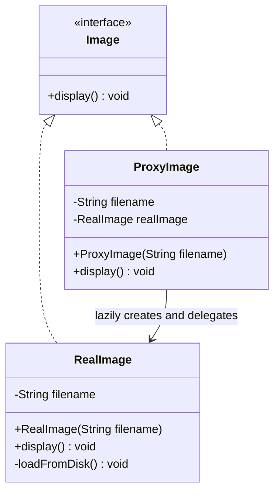

# Chapter 16 — Proxy Pattern

## What & Why

The **Proxy** pattern provides a **surrogate or placeholder** for another object to **control access** to it. The proxy implements the **same interface** as the real object, so clients can't tell the difference — but the proxy can add logic *before* or *after* forwarding the call to the real object.

**Real-world analogy:** A credit card is a proxy for your bank account. It exposes the same "pay" operation as cash, but it sits in front of the account and adds checks (is the card valid? is there enough balance? is this fraud?) before actually moving money. You interact with the card exactly as you would with cash — same interface — but access to the real account is *controlled*.

---

## The Problem: You Can't Always Touch the Real Object Directly

Sometimes talking straight to the real object is wasteful or unsafe:

- The object is **expensive to create** (a 20 MB image loaded from disk) but you may never actually use it.
- The object needs **access control** (only admins may call `delete()`).
- The object lives on a **remote server** and every call is a network request.
- Results are **cacheable** and re-fetching is wasteful.

Putting this logic inside the real object violates SRP (the image shouldn't know about permissions) and OCP (you'd modify it for every new concern). You need something *in front*.

---

## The Solution: A Same-Interface Stand-In

Create a proxy that implements the subject's interface, holds a reference to (or lazily creates) the real object, and adds control logic around the delegation:

```java
interface Image {
    void display();
}

// Real object — expensive to create
class RealImage implements Image {
    RealImage(String filename) { loadFromDisk(filename); }   // heavy!
    public void display() { /* render */ }
}

// Proxy — same interface, defers the expensive work
class ProxyImage implements Image {
    private final String filename;
    private RealImage real;              // not created yet

    public void display() {
        if (real == null) {
            real = new RealImage(filename);   // create on first use only
        }
        real.display();
    }
}
```

The client codes against `Image` and never knows whether it holds a `RealImage` or a `ProxyImage`.

The **C++** virtual proxy owns the real subject via `unique_ptr` and creates it lazily:

```cpp
struct Image {
    virtual ~Image() = default;
    virtual void display() = 0;
};

// Real object — expensive to create
class RealImage : public Image {
    std::string filename_;
public:
    explicit RealImage(std::string filename) : filename_(std::move(filename)) {
        /* heavy: load_from_disk(filename_) */
    }
    void display() override { /* render */ }
};

// Proxy — same interface, defers the expensive work
class ProxyImage : public Image {
    std::string filename_;
    std::unique_ptr<RealImage> real_;                 // not created yet
public:
    explicit ProxyImage(std::string filename) : filename_(std::move(filename)) {}
    void display() override {
        if (!real_) real_ = std::make_unique<RealImage>(filename_);   // create on first use only
        real_->display();
    }
};

// Client codes against Image — blind to proxy vs real:
std::unique_ptr<Image> img = std::make_unique<ProxyImage>("photo.png");
img->display();   // loads from disk now
img->display();   // reuses the already-loaded image
```

### C++ specifics

- **The proxy owns the real subject via `std::unique_ptr<RealImage>`** and lazily constructs it; RAII destroys it automatically. (A remote proxy holds a connection instead; a caching proxy holds a memo map.)
- **Subject is a pure-virtual base with a `virtual` destructor**; the client holds `std::unique_ptr<Image>` and can't tell proxy from real.
- **Lazy init is a data race under concurrency** — the naive `if (!real_)` has the same problem as Singleton DCL. Guard it with `std::once_flag` + `std::call_once` (or a mutex). This is the C++ analogue of the `volatile`/DCL discussion in Ch08.
- **Protection proxy** = check permissions before delegating; **caching proxy** = look up a member cache first; **remote proxy** = the delegate call becomes a network request — all the same "same interface + controlled delegation" shape.

---

## Structure



**Roles:**
- **Subject** (`Image`) — the common interface shared by the real object and the proxy.
- **RealSubject** (`RealImage`) — the actual object doing the real work.
- **Proxy** (`ProxyImage`) — same interface, holds a reference to the RealSubject, controls access to it.
- **Client** — codes against Subject; unaware whether it holds a proxy or the real thing.

---

## The Four Kinds of Proxy

| Type | Purpose | Example |
|------|---------|---------|
| **Virtual Proxy** | Delay creating an expensive object until it's actually needed (lazy loading) | Image that loads from disk only on first `display()` |
| **Protection Proxy** | Control access based on permissions | Only `ADMIN` may call `delete()` |
| **Remote Proxy** | Local stand-in for an object on another machine | RPC/gRPC stub, REST client |
| **Caching Proxy** | Store results of expensive operations and reuse them | Memoized DB query, HTTP cache |

They all share one mechanism (same interface + controlled delegation) but differ in *what* control they add.

---

## Step-by-Step

1. **Define (or reuse) the Subject interface** shared by real object and proxy.
2. **Implement the RealSubject** — the object that does the actual work.
3. **Create the Proxy** implementing the same interface, holding a field for the RealSubject.
4. **Add control logic** in the proxy's methods — lazy creation, permission checks, caching, remote calls — then delegate to the real object.
5. **Give clients the proxy** where the Subject type is expected. No client code changes.

---

## When to Use

- **Virtual**: object creation is expensive and may not be needed.
- **Protection**: different callers should have different access rights.
- **Remote**: the object lives in another address space / machine.
- **Caching**: repeated expensive calls with reusable results.
- **Logging/metrics**: you want to record access without touching the real object.

## When NOT to Use

- The added indirection provides no real benefit — you're just forwarding calls.
- The control logic belongs *inside* the real object's domain (then it's not a cross-cutting concern).
- Latency of the extra hop matters and there's nothing to gain from it.

---

## Proxy vs Decorator vs Adapter vs Facade

All four "wrap" an object, but their **intent** differs — this is a classic interview question:

| Pattern | Interface vs wrapped | Primary intent |
|---------|----------------------|----------------|
| **Proxy** | **Same** interface | **Control access** to one object (lazy, auth, remote, cache) |
| **Decorator** | **Same** interface | **Add behavior**, typically stacked in layers |
| **Adapter** | **Different** interface | **Convert** an incompatible interface to the one the client expects |
| **Facade** | **New, simpler** interface | **Simplify** access to a whole subsystem of many objects |

**Proxy vs Decorator** — the trickiest pair. Both keep the same interface and hold a reference to the wrapped object. Difference of intent:
- A **decorator** *adds new behavior* and is meant to be **stacked** (milk + whip + caramel).
- A **proxy** *controls access* to a single real object and usually **isn't stacked**; it often **manages the lifecycle** of the real object (creating it lazily), which a decorator never does.

---

## Common Pitfalls

1. **Proxy diverging from the interface** — if the proxy adds public methods the Subject doesn't have, clients start depending on the concrete proxy and transparency is lost.
2. **Thread safety in virtual proxies** — lazy creation (`if (real == null)`) is a race condition under concurrency. Guard it (synchronization, double-checked locking, or `Lazy`/`OnceCell`).
3. **Stale caches** — caching proxies must have an invalidation strategy, or clients see outdated data.
4. **Hidden cost** — a remote proxy makes network calls look like local calls; callers may not realize each call is expensive.
5. **Confusing Proxy with Decorator** — if you're *adding behavior*, it's a Decorator; if you're *controlling access/lifecycle*, it's a Proxy.

---

## Real-World Examples

| Context | Proxy |
|---------|-------|
| **Hibernate / JPA** | Lazy-loaded entity proxies (data fetched on first access) |
| **Java RMI / gRPC** | Client stub is a remote proxy for a server object |
| **Spring AOP** | Proxies wrap beans to add transactions, security, logging |
| **HTTP** | Caching/forward proxies sit in front of origin servers |
| **Operating systems** | Copy-on-write memory pages (a write triggers the real copy) |

---

## Language Notes

- **Java** — proxy is a class implementing the same interface. The JDK even has `java.lang.reflect.Proxy` for *dynamic* proxies generated at runtime (the basis of Spring AOP).
- **C++** — proxy holds a `std::unique_ptr` to the real object, created lazily. `operator->` overloading can make a smart-pointer-style proxy transparent.
- **Rust** — the proxy struct implements the same trait. Lazy creation uses `Option<Box<RealSubject>>` (or `OnceCell`/`RefCell` for interior mutability, since `display(&self)` can't reassign a field without it).
- **Go** — proxy struct satisfies the same interface. Lazy init is a nil-check on a pointer field (use `sync.Once` for thread-safe lazy loading).

Across all four: **the proxy is interchangeable with the real object because they share the Subject type; it just intercepts the call.**

---

## What's Next

Study the code in `src/` — a virtual (lazy-loading) image proxy that defers the expensive disk load until the image is first displayed. Then tackle the assignments (a protection proxy and a caching proxy).
