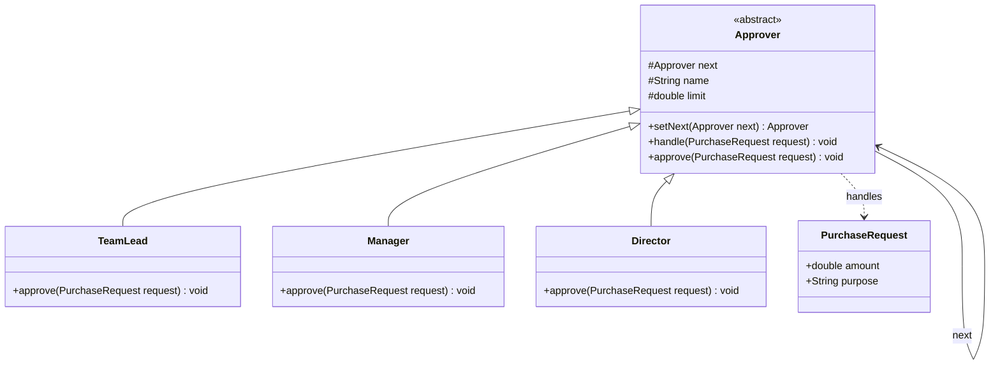

# Chapter 17 — Chain of Responsibility

> **Phase 4 begins: Behavioral Patterns.** Where creational patterns are about *object creation* and structural patterns about *object composition*, behavioral patterns are about *how objects communicate and distribute responsibility*.

## What & Why

The **Chain of Responsibility** pattern passes a request along a **chain of handlers**. Each handler decides either to **process** the request or to **pass it to the next** handler in the chain. The sender doesn't know or care which handler ultimately handles it.

**Real-world analogy:** Expense approval at a company. You submit a $3,000 purchase request. Your team lead can approve up to $1,000 — too big, so they pass it up. The manager approves up to $5,000 — they handle it. You (the sender) didn't need to know *who* had the authority; you just handed the request to the chain and it found the right approver.

---

## The Problem: A Sender Coupled to Every Handler

Without the pattern, the sender must know every possible handler and decide who processes the request:

```java
// BAD: sender hard-codes all the routing logic
void approve(PurchaseRequest r) {
    if (r.amount <= 1000) {
        teamLead.approve(r);
    } else if (r.amount <= 5000) {
        manager.approve(r);
    } else if (r.amount <= 20000) {
        director.approve(r);
    } else {
        System.out.println("Rejected");
    }
}
```

**Problems:**
- The sender is coupled to **every** handler and their limits.
- Adding a new approver (e.g., a VP tier) means **modifying** this method — violates OCP.
- The routing rules are duplicated everywhere a request is submitted.
- You can't reorder or reconfigure the chain at runtime.

---

## The Solution: Link Handlers Together

Give each handler a reference to the **next** handler. Each one either handles the request or forwards it:

```java
abstract class Approver {
    protected Approver next;              // the next link in the chain

    public Approver setNext(Approver next) {
        this.next = next;
        return next;                      // return next → enables fluent chaining
    }

    public void handle(PurchaseRequest r) {
        if (canApprove(r)) {
            approve(r);                   // I handle it
        } else if (next != null) {
            next.handle(r);               // pass it along
        } else {
            System.out.println("No one could approve " + r);
        }
    }

    protected abstract boolean canApprove(PurchaseRequest r);
    protected abstract void approve(PurchaseRequest r);
}
```

The client builds the chain once and fires requests at the head:

```java
teamLead.setNext(manager).setNext(director);
teamLead.handle(new PurchaseRequest(3000, "Laptops"));   // manager approves
```

The **C++** version — each handler **owns the next link** via `unique_ptr` (the same shape as the coin/denomination chains in the ATM and vending-machine case studies):

```cpp
class Approver {
protected:
    std::unique_ptr<Approver> next_;                 // owns the next link
    std::string name_;
    double limit_;
public:
    Approver(std::string name, double limit) : name_(std::move(name)), limit_(limit) {}
    virtual ~Approver() = default;

    Approver* set_next(std::unique_ptr<Approver> next) {
        next_ = std::move(next);
        return next_.get();                          // return raw ptr → fluent chaining
    }

    void handle(const PurchaseRequest& r) {
        if (can_approve(r))      approve(r);         // I handle it
        else if (next_)          next_->handle(r);   // pass it along
        else std::cout << "No one could approve " << r.purpose << "\n";
    }

protected:
    virtual bool can_approve(const PurchaseRequest& r) const = 0;
    virtual void approve(const PurchaseRequest& r) const = 0;
};

// Build the chain once (head owns manager, which owns director):
auto team_lead = std::make_unique<TeamLead>("Lead", 1000);
team_lead->set_next(std::make_unique<Manager>("Mgr", 5000))
         ->set_next(std::make_unique<Director>("Dir", 20000));
team_lead->handle(PurchaseRequest{3000, "Laptops"});   // manager approves
```

### C++ specifics

- **Each handler owns the next via `std::unique_ptr<Approver>`** — deleting the head frees the whole chain (RAII). This is exactly the coin/denomination-chain shape from Ch35/Ch36.
- **`set_next` returns a raw `Approver*`** so you can fluently chain without moving ownership back out; the `unique_ptr` still owns the link.
- **Handler base needs a `virtual` destructor**; `can_approve`/`approve` are pure virtual.
- If handlers are **owned elsewhere** (say, stored in a `vector`), use non-owning raw `Approver* next_` links instead of `unique_ptr` — owning vs non-owning is the design choice, same as association vs composition (Ch02).

---

## Structure



**Roles:**
- **Handler** (`Approver`) — declares the interface for handling requests and holds a reference to the next handler.
- **Concrete Handlers** (`TeamLead`, `Manager`, `Director`) — handle requests they're responsible for; otherwise forward.
- **Client** — builds the chain and submits a request to the first handler.
- **Request** (`PurchaseRequest`) — the data passed along the chain.

---

## Step-by-Step

1. **Define the Handler** interface/abstract class with a `handle(request)` method and a `next` reference.
2. **Implement the forwarding logic** in a base class: if I can handle it, do so; else delegate to `next`.
3. **Create Concrete Handlers**, each deciding what it can process.
4. **Link them** into a chain (`a.setNext(b).setNext(c)`).
5. **Client submits** the request to the head of the chain and stays ignorant of who handles it.

---

## Two Flavors of the Chain

| Flavor | Behavior | Example |
|--------|----------|---------|
| **Pure** | Exactly **one** handler processes the request, then the chain stops | Expense approval — one approver signs off |
| **Impure** | **Every** matching handler processes it, and it keeps flowing | Logging (log to console **and** file **and** email), middleware pipelines |

Both are valid — the difference is whether a handler `return`s after handling or always calls `next` too.

---

## When to Use

- **More than one object** may handle a request, and the handler isn't known in advance.
- You want to **decouple** the sender from the receiver.
- The set of handlers (and their order) should be **configurable at runtime**.
- You want to issue a request to one of several objects **without specifying the receiver explicitly**.

## When NOT to Use

- Every request has exactly one known handler — a direct call or a map lookup is simpler.
- The chain could leave a request **unhandled** and that's unacceptable (add a guaranteed default/tail handler).
- Long chains hurt performance or make debugging hard (a request silently traverses many links).

---

## Chain of Responsibility vs Related Patterns

| Pattern | Relationship |
|---------|-------------|
| **Decorator** (Ch13) | Both link objects recursively. Decorator **always** delegates and adds behavior; CoR **may stop** at any handler. |
| **Command** (Ch18) | A request can be a Command object passed *along* a chain. |
| **Composite** (Ch12) | A chain can be built over a composite tree (a handler forwards to its parent). |
| **Mediator** (Ch20) | CoR passes a request *linearly*; Mediator centralizes *many-to-many* communication in a hub. |

---

## Common Pitfalls

1. **Broken/unterminated chain** — if no handler processes the request and there's no default tail, it vanishes silently. Always handle the "end of chain" case.
2. **Circular chains** — `a → b → a` causes infinite recursion. Validate when wiring the chain.
3. **Wrong order** — handlers are order-sensitive; a too-permissive handler early in the chain may swallow requests meant for a later one.
4. **Fat handlers** — a handler that knows too much about other handlers reintroduces coupling. Each should only know its own responsibility and its `next`.
5. **Hard-to-trace flow** — with long chains, add logging so you can see the path a request took.

---

## Real-World Examples

| Context | Chain |
|---------|-------|
| **Servlet / HTTP middleware** | `FilterChain` — auth → logging → compression → handler |
| **Java logging** | `java.util.logging` levels; log records flow up through handlers |
| **Try/catch** | Exception propagation up the call stack is a built-in CoR |
| **Event bubbling (DOM)** | A click event bubbles up through parent elements until handled |
| **Spring Security** | The `FilterChainProxy` is a literal chain of security filters |

---

## Language Notes

- **Java** — abstract base holds `next`; `setNext` returns the next handler for fluent wiring.
- **C++** — `next` is a `std::unique_ptr<Approver>` (the chain owns its links); the base provides forwarding, subclasses override the check.
- **Rust** — each handler holds `next: Option<Box<dyn Approver>>`. Ownership makes the chain a nicely-nested structure built from the tail toward the head. No nulls — the `Option` *is* the end-of-chain marker.
- **Go** — each handler holds a `next Handler` interface field; an embedded base struct supplies `SetNext` and the "pass to next" helper, while each concrete type implements its own `Handle`.

Across all four: **each handler knows only its own job and its successor — never the whole chain.**

---

## What's Next

Study the code in `src/` — a purchase-approval chain (Team Lead → Manager → Director). Then tackle the assignments (an authentication middleware chain and a support-ticket escalation system).
