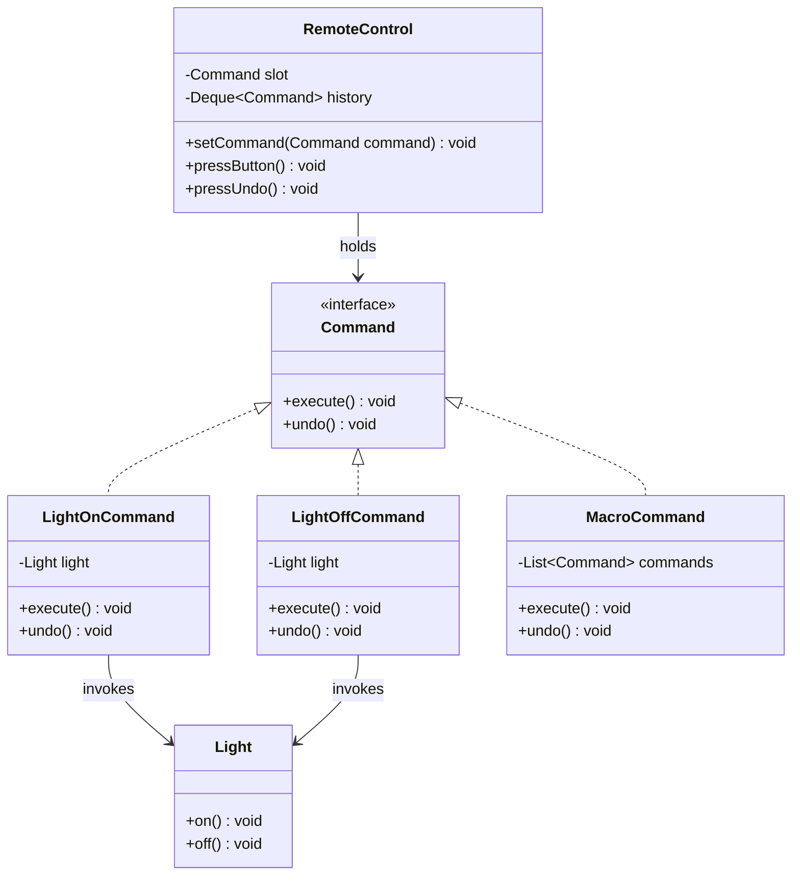

# Chapter 18 — Command Pattern

## What & Why

The **Command** pattern turns a **request into a standalone object** that contains everything needed to perform an action. This lets you parameterize objects with operations, queue or log requests, and — most powerfully — support **undo/redo**.

**Real-world analogy:** A restaurant order slip. When you order, the waiter writes your request on a slip (a *command object*). The slip travels to the kitchen where the chef (the *receiver*) executes it. The waiter (the *invoker*) doesn't cook and doesn't know how — they just carry and queue slips. The slip decouples *who requests* from *who performs*, and it can be stacked, queued, or cancelled.

---

## The Problem: Hard-Wired Requests

Imagine a remote control whose buttons directly call device methods:

```java
// BAD: the invoker is coupled to every concrete device and action
class RemoteControl {
    private Light light;
    private Fan fan;

    void button1Pressed() { light.on(); }
    void button2Pressed() { fan.setSpeed(3); }
    // ...a new method + recompile for every new device or action
}
```

**Problems:**
- The remote is coupled to **every** device type and method.
- You **can't undo** — there's no record of what was done.
- You **can't queue, log, or schedule** actions — they're just method calls.
- Adding a device means **modifying** the remote (violates OCP).

---

## The Solution: Wrap the Request in an Object

Define a `Command` interface with `execute()` (and `undo()`). Each concrete command binds a **receiver** to an **action**:

```java
interface Command {
    void execute();
    void undo();
}

class LightOnCommand implements Command {
    private final Light light;               // the receiver
    LightOnCommand(Light light) { this.light = light; }

    public void execute() { light.on(); }    // do
    public void undo()    { light.off(); }   // reverse
}
```

The **invoker** (remote) holds commands, not devices, and can record history for undo:

```java
class RemoteControl {
    private final Deque<Command> history = new ArrayDeque<>();

    void submit(Command command) {
        command.execute();
        history.push(command);               // remember it for undo
    }

    void undoLast() {
        if (!history.isEmpty()) history.pop().undo();
    }
}
```

Now the remote knows nothing about lights or fans — only about `Command`.

The **C++** version — the invoker **owns** the commands in its history via `unique_ptr`:

```cpp
struct Command {
    virtual ~Command() = default;
    virtual void execute() = 0;
    virtual void undo() = 0;
};

class LightOnCommand : public Command {
    Light& light_;                                   // the receiver (owned elsewhere)
public:
    explicit LightOnCommand(Light& light) : light_(light) {}
    void execute() override { light_.on(); }         // do
    void undo() override    { light_.off(); }        // reverse
};

// Invoker holds commands, not devices, and records history for undo
class RemoteControl {
    std::vector<std::unique_ptr<Command>> history_;
public:
    void submit(std::unique_ptr<Command> command) {
        command->execute();
        history_.push_back(std::move(command));      // own it for undo
    }
    void undo_last() {
        if (!history_.empty()) {
            history_.back()->undo();
            history_.pop_back();
        }
    }
};
```

### C++ specifics

- **The invoker owns its commands via `std::vector<std::unique_ptr<Command>>`** — `submit` takes ownership by value + `move`; the history keeps them alive for undo, and clears them on destruction (RAII).
- **A command holds its receiver by reference** (`Light&`) because the receiver is owned elsewhere and outlives the command.
- **Command base needs a `virtual` destructor.**
- **Modern shortcut:** for fire-and-forget actions with no undo, a command can just be a **`std::function<void()>`** (a lambda capturing the receiver). Reach for the full `execute()`/`undo()` class when you need reversal, queuing, or logging — the things a bare lambda can't give you.

---

## Structure



**Roles:**
- **Command** — declares `execute()` (and often `undo()`).
- **Concrete Command** (`LightOnCommand`) — binds a receiver to an action; implements `execute`/`undo` by calling the receiver.
- **Receiver** (`Light`) — knows how to perform the actual work.
- **Invoker** (`RemoteControl`) — holds and triggers commands; keeps history for undo. Knows nothing about receivers.
- **Client** — creates concrete commands and configures the invoker.

---

## Step-by-Step

1. **Define the Command interface** with `execute()` (add `undo()` if you need reversal).
2. **Identify the Receiver(s)** — the objects that do the real work.
3. **Create Concrete Commands**, each holding a receiver and implementing `execute`/`undo`.
4. **Build the Invoker** — it stores commands and triggers them; optionally records a history stack.
5. **The Client wires it up** — creates commands with their receivers and hands them to the invoker.

---

## Undo, Redo, and Macro Commands

The pattern shines because a command is a first-class object you can **store**:

| Capability | How |
|-----------|-----|
| **Undo** | Each command implements `undo()`; the invoker keeps a history **stack** and pops+undoes. |
| **Redo** | Keep a second stack of undone commands; re-execute on redo. |
| **Macro** | A `MacroCommand` holds a list of commands; `execute()` runs them in order, `undo()` reverses them (in **reverse** order). This is the Command pattern combined with **Composite** (Ch12). |
| **Stateful undo** | If an action overwrites state (e.g. set fan speed 3→5), the command must **remember the previous value** to restore it. |

```java
// MacroCommand — Command + Composite
class MacroCommand implements Command {
    private final List<Command> commands;
    public void execute() { commands.forEach(Command::execute); }
    public void undo() {
        // reverse order so state unwinds correctly
        for (int i = commands.size() - 1; i >= 0; i--) commands.get(i).undo();
    }
}
```

---

## When to Use

- You want to **parameterize** objects with actions (pass behavior as data).
- You need **undo/redo**, or to **queue**, **schedule**, or **log** operations.
- You want to support **transactions** (execute a set of commands, roll back on failure).
- You want to **decouple** the object that invokes an operation from the one that performs it.

## When NOT to Use

- The action is a simple, one-off call with no need for undo/queue/logging — a plain method call or lambda is simpler.
- You'd create a command class for every trivial operation with no reuse — overkill.
- The extra indirection obscures rather than clarifies the flow.

---

## Command vs Related Patterns

| Pattern | Relationship |
|---------|-------------|
| **Composite** (Ch12) | A `MacroCommand` *is* a Composite of commands. |
| **Memento** (Ch21) | Undo can be implemented by restoring a Memento instead of a reverse operation. |
| **Strategy** (Ch22) | Both wrap behavior in an object; Strategy swaps *how* something is done, Command captures *a request to do it* (with a receiver, and often undo). |
| **Chain of Responsibility** (Ch17) | A request modeled as a Command can be passed along a chain. |

---

## Common Pitfalls

1. **Undo that forgets state** — for actions that overwrite a value, `undo()` must restore the **previous** value, so store it in the command at `execute()` time.
2. **Macro undo in wrong order** — undo the sub-commands in **reverse** of execution order, or state unwinds incorrectly.
3. **Fat commands** — a command should *delegate* to a receiver, not contain the business logic itself.
4. **Leaking receivers through the invoker** — the invoker should depend only on `Command`, never on concrete receivers.
5. **Unbounded history** — an ever-growing undo stack can leak memory; cap it if needed.

---

## Real-World Examples

| Context | Command |
|---------|---------|
| **GUI toolkits** | Every menu item / button action is a command (Swing `Action`, WPF `ICommand`) |
| **Text editors / IDEs** | Undo/redo stacks are command histories |
| **Job queues** | A queued task is a command executed later by a worker |
| **Transactions** | Database operations wrapped as commands, rolled back on failure |
| **`java.lang.Runnable`** | A parameterless command executed by a thread or executor |

---

## Language Notes

- **Java** — `Command` is an interface; `Runnable`/`Callable` are built-in command-like types. Lambdas can serve as simple commands (`() -> light.on()`).
- **C++** — commands are classes implementing a base with virtual `execute`/`undo`; store them as `std::shared_ptr<Command>`. `std::function<void()>` works for undo-free commands.
- **Rust** — a `Command` trait with `execute`/`undo`. Receivers that must be mutated are shared via `Rc<RefCell<Receiver>>`; the invoker keeps `Vec<Rc<dyn Command>>` history. Closures (`Box<dyn Fn()>`) are lightweight commands.
- **Go** — `Command` is an interface with `Execute()`/`Undo()`; a `func()` value is the simplest command. The invoker stores a `[]Command` history slice.

Across all four: **a command bundles *what to do* + *who does it* into an object you can store, queue, and reverse.**

---

## What's Next

Study the code in `src/` — a remote control with a `Light` receiver, `execute`/`undo`, an undo-history stack, and a `MacroCommand`. Then tackle the assignments (a light/fan remote, an undoable transaction system, and a task scheduler).
