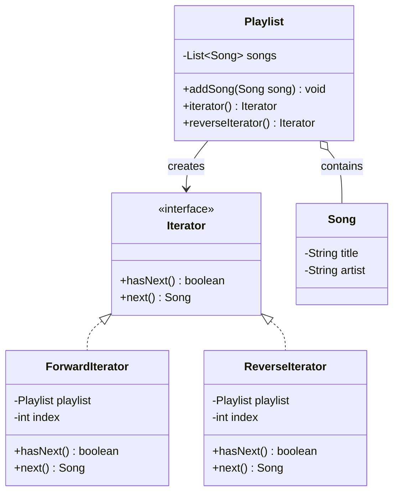

# Chapter 19 — Iterator Pattern

## What & Why

The **Iterator** pattern provides a way to access the elements of a collection **sequentially** without exposing its underlying representation. The collection hands out an *iterator* object that knows how to walk the elements — the client just asks "is there a next one?" and "give me the next one," never touching the internal array, list, or tree.

**Real-world analogy:** A TV remote's channel button. You press "next channel" and the TV moves to the following station. You don't know or care whether channels are stored in an array, a linked list, or a hash map — the remote (iterator) handles the traversal. You could also have a "previous channel" button (a different iterator) over the *same* set of channels.

---

## The Problem: Exposing the Collection's Guts

Without an iterator, clients must know how the collection stores its data:

```java
// BAD: client is coupled to the internal array + its indexing
Playlist playlist = new Playlist();
Song[] songs = playlist.getSongsArray();       // leaks the internal array
for (int i = 0; i < playlist.getCount(); i++) {
    System.out.println(songs[i]);
}
```

**Problems:**
- The client depends on the **internal structure** (an array with integer indexing).
- If you switch the storage to a `LinkedList` or a tree, **every client breaks**.
- Traversal logic is **duplicated** in every client.
- You can't offer **alternative traversals** (reverse, filtered, sorted) cleanly.
- It breaks **encapsulation** — the collection's internals are public.

---

## The Solution: A Separate Iterator Object

Define an `Iterator` with `hasNext()` and `next()`. The collection creates iterators; clients use them uniformly:

```java
interface Iterator<T> {
    boolean hasNext();
    T next();
}

// Client code — identical no matter how Playlist stores songs
Iterator<Song> it = playlist.iterator();
while (it.hasNext()) {
    System.out.println(it.next());
}
```

Want to walk backwards? The same collection can vend a **different** iterator:

```java
Iterator<Song> rev = playlist.reverseIterator();   // same interface, different order
while (rev.hasNext()) System.out.println(rev.next());
```

The client code is **the same shape** for both — only the iterator differs.

The **C++** GoF-style iterator mirrors Java:

```cpp
template <typename T>
struct Iterator {
    virtual ~Iterator() = default;
    virtual bool has_next() const = 0;
    virtual T next() = 0;
};

std::unique_ptr<Iterator<Song>> it = playlist.iterator();
while (it->has_next()) {
    std::cout << it->next().title() << "\n";
}
```

…but **idiomatic C++ builds iterators into the language** via `begin()`/`end()`, unlocking range-based `for` and the whole `<algorithm>` library:

```cpp
// Expose begin()/end() returning cursor objects with operator++, operator*, operator!=
for (const Song& song : playlist) {           // uses playlist.begin()/end()
    std::cout << song.title() << "\n";
}

auto it = std::find_if(playlist.begin(), playlist.end(),
                       [](const Song& s) { return s.artist() == "Radiohead"; });
```

### C++ specifics

- **Java's `hasNext()`/`next()` maps to the C++ iterator concept**: a small cursor class with `operator++` (advance), `operator*` (current element), and `operator!=` (compare to end).
- **Implementing `begin()`/`end()` is the payoff** — it makes your type work with **range-based `for`** and every `<algorithm>` (`std::find`, `std::for_each`, `std::count_if`) for free. Java only got this ergonomic with `Iterable` + for-each; C++ bakes it into the syntax.
- **Reverse traversal** = provide `rbegin()`/`rend()`; **filtered/transformed** views = C++20 ranges (`playlist | std::views::filter(...)`).
- **Return iterators by value** — they're tiny cursors. Only use the heap-allocated virtual `Iterator<T>` (via `unique_ptr`) when you must hide the concrete iterator type behind an interface (type erasure).

---

## Structure



**Roles:**
- **Iterator** — declares `hasNext()` / `next()`.
- **Concrete Iterator** (`ForwardIterator`, `ReverseIterator`) — implements the traversal and tracks the current position.
- **Aggregate / Iterable** (`Playlist`) — the collection; creates iterators over itself.
- **Client** — uses the iterator interface, unaware of the collection's internals.

---

## Step-by-Step

1. **Define the Iterator interface** with `hasNext()` and `next()`.
2. **Implement a Concrete Iterator** that holds a reference to the collection and a cursor (index/node).
3. **Give the collection a factory method** (`iterator()`) that returns a fresh iterator.
4. **Add alternative iterators** (reverse, filtered, sorted) as needed — each is a new Concrete Iterator, no change to the collection's storage.
5. **Clients traverse** via the interface only.

---

## Key Insight: Traversal State Lives in the Iterator, Not the Collection

Each iterator carries **its own cursor**, so you can have **multiple independent traversals** of the same collection at once:

```java
Iterator<Song> a = playlist.iterator();
Iterator<Song> b = playlist.iterator();
a.next();          // a is at position 1
                   // b is still at position 0 — independent
```

If the collection itself stored the "current position," you could only have one traversal at a time. Externalizing it into the iterator is what makes concurrent, reusable traversal possible.

---

## External vs Internal Iterators

| | External (active) | Internal (passive) |
|---|---|---|
| **Who drives** | The client calls `next()` | The collection calls your function per element |
| **Example** | `while (it.hasNext()) it.next()` | `list.forEach(song -> ...)` |
| **Control** | Client can pause, skip, combine iterators | Collection controls the loop |
| **Flexibility** | More control, more verbose | Concise, less control |

The GoF pattern describes the **external** iterator. `forEach`/`map` are **internal** iterators — also valid and common in modern languages.

---

## When to Use

- You want to **traverse a collection without exposing its internals**.
- You need **multiple or alternative traversals** (forward, reverse, filtered, depth-first vs breadth-first).
- You want a **uniform traversal interface** across different collection types.
- You want **multiple simultaneous** traversals of the same collection.

## When NOT to Use

- The collection is trivial and the language's built-in iteration already covers it — don't hand-roll an iterator you don't need.
- You only ever do one simple forward loop and the structure is stable — native `for`/`for-each` is enough.
- The traversal needs to know *and* mutate structural internals heavily — an iterator may fight the design.

---

## Iterator vs Related Patterns

| Pattern | Relationship |
|---------|-------------|
| **Composite** (Ch12) | Iterators are often used to traverse a composite tree (BFS/DFS iterators). |
| **Factory Method** (Ch05) | `iterator()` is a factory method that creates the right iterator. |
| **Visitor** (Ch26) | Visitor performs an operation across elements; Iterator just yields them. Sometimes combined. |
| **Strategy** (Ch22) | Different iterators are like different traversal *strategies* over the same data. |

---

## Common Pitfalls

1. **Concurrent modification** — changing the collection while iterating can corrupt the cursor. Java throws `ConcurrentModificationException` (fail-fast); decide on fail-fast vs snapshot semantics.
2. **Leaking internals through `next()`** — returning a mutable reference to an internal node re-exposes structure. Return values or read-only views.
3. **Stateful collection cursor** — storing "current position" in the collection instead of the iterator prevents multiple simultaneous traversals.
4. **Calling `next()` without `hasNext()`** — must define behavior at the end (exception vs sentinel). Java throws `NoSuchElementException`.
5. **Infinite/incorrect bounds** — off-by-one in the cursor is the classic iterator bug; test empty, single-element, and full collections.

---

## Real-World Examples

| Context | Iterator |
|---------|----------|
| **Java** | `java.util.Iterator` + `Iterable`; the `for-each` loop desugars to iterator calls |
| **C++ STL** | `begin()` / `end()` iterators over every container |
| **Rust** | The `Iterator` trait (`next() -> Option<T>`) powers `for` loops and adapters (`map`, `filter`) |
| **Go** | `range` over slices/maps/channels; explicit iterator structs when needed |
| **Databases** | A cursor over a result set is an iterator |

---

## Language Notes

- **Java** — `Iterator<T>` (`hasNext`/`next`) and `Iterable<T>` (`iterator()`) are built in; implementing `Iterable` unlocks the `for-each` loop. Our example rolls the interface by hand to show the pattern from scratch.
- **C++** — the STL iterator model uses `begin()`/`end()` and `operator++`/`operator*`. Our example uses an explicit `has_next()`/`next()` interface to mirror the GoF shape; the notes below map it to STL style.
- **Rust** — the standard `Iterator` trait *is* this pattern: implement `fn next(&mut self) -> Option<Song>` and you get `for`, `map`, `filter`, `rev`, etc. for free. `next() -> Option` fuses `hasNext` + `next` into one call.
- **Go** — Go favors `range` and, since 1.23, function-based iterators (`iter.Seq`). Our example uses an explicit iterator struct with `HasNext`/`Next` to show the classic pattern.

Across all four: **the iterator owns the traversal cursor; the collection just yields iterators.**

---

## What's Next

Study the code in `src/` — a `Playlist` collection with `ForwardIterator` and `ReverseIterator`, showing two traversal strategies over identical client code. Then tackle the assignments (a playlist iterator and a filtered iterator).
