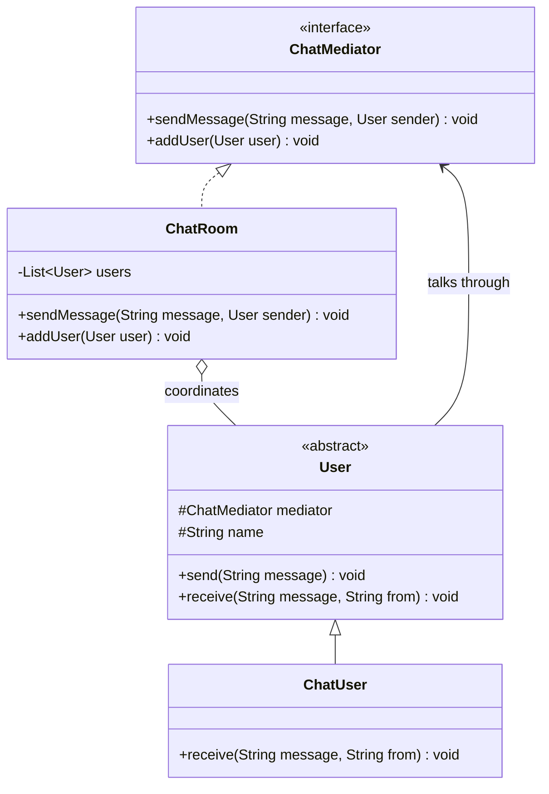

# Chapter 20 — Mediator Pattern

## What & Why

The **Mediator** pattern centralizes complex communication between objects into a single **mediator** object. Instead of many objects referring to and talking to each other directly (a tangled web), they all talk **through the mediator**. This turns a **many-to-many** mesh of dependencies into a clean **hub-and-spoke** structure.

**Real-world analogy:** Air traffic control. Planes don't negotiate landing order by talking to each other directly — that would be chaos. Every plane talks only to the control tower (the mediator), which coordinates who lands when. The planes (colleagues) stay simple; all the coordination logic lives in the tower.

---

## The Problem: A Web of Direct References

When objects communicate directly, every object ends up knowing about many others:

```java
// BAD: each component wires itself to every other component
class Button {
    private TextBox textBox;
    private Checkbox checkbox;
    private Label label;
    void onClick() {
        if (checkbox.isChecked()) textBox.enable();
        label.setText("Clicked");
        // ...this button now depends on 3 other widgets
    }
}
```

**Problems:**
- **N objects → up to N×(N-1) connections** — a combinatorial explosion of coupling.
- Each object is **hard to reuse** because it drags its collaborators along.
- Interaction logic is **scattered** across every object.
- Changing one interaction means touching **many** classes.

---

## The Solution: Route Everything Through a Mediator

Each colleague knows only the **mediator**. When something happens, it notifies the mediator, which coordinates the rest:

```java
interface ChatMediator {
    void sendMessage(String message, User sender);
    void addUser(User user);
}

abstract class User {
    protected final ChatMediator mediator;   // the ONLY thing a user knows
    protected final String name;

    void send(String message) {
        mediator.sendMessage(message, this);  // don't touch other users directly
    }
    abstract void receive(String message, String from);
}
```

The mediator holds the colleagues and coordinates them:

```java
class ChatRoom implements ChatMediator {
    private final List<User> users = new ArrayList<>();

    public void sendMessage(String message, User sender) {
        for (User user : users) {
            if (user != sender) user.receive(message, sender.getName());
        }
    }
}
```

Now users have **zero** references to each other — only to the room.

The **C++** version — note the **bidirectional** link (users know the mediator, the mediator lists users) is modeled with **non-owning raw pointers** to avoid an ownership cycle:

```cpp
class User;   // forward declaration

struct ChatMediator {
    virtual ~ChatMediator() = default;
    virtual void send_message(const std::string& message, User* sender) = 0;
    virtual void add_user(User* user) = 0;
};

// Colleague — knows ONLY the mediator
class User {
protected:
    ChatMediator* mediator_;                         // non-owning back-pointer
    std::string name_;
public:
    User(ChatMediator* mediator, std::string name)
        : mediator_(mediator), name_(std::move(name)) {}
    virtual ~User() = default;
    const std::string& name() const { return name_; }
    void send(const std::string& message) { mediator_->send_message(message, this); }
    virtual void receive(const std::string& message, const std::string& from) = 0;
};

// Concrete mediator coordinates the colleagues
class ChatRoom : public ChatMediator {
    std::vector<User*> users_;                        // non-owning references
public:
    void add_user(User* user) override { users_.push_back(user); }
    void send_message(const std::string& message, User* sender) override {
        for (auto* user : users_)
            if (user != sender) user->receive(message, sender->name());
    }
};
```

### C++ specifics

- **The mediator↔colleague link is bidirectional, so at most one side can own.** Model both links as **non-owning raw pointers** (objects owned by whoever created them — `main`, a container). Making *both* sides `unique_ptr` would be an impossible ownership cycle; making both `shared_ptr` would **leak** (a reference cycle) — the classic case where you'd need `std::weak_ptr`.
- **The clean ownership choice:** let the mediator own the colleagues (`std::vector<std::unique_ptr<User>>`) and give each `User` a plain `ChatMediator*` back-pointer. One direction owns, the other borrows — the standard fix for any parent↔child relationship in C++.
- Both `ChatMediator` and `User` are pure-virtual bases with **`virtual` destructors**.

---

## Structure



**Roles:**
- **Mediator** (`ChatMediator`) — declares how colleagues communicate.
- **Concrete Mediator** (`ChatRoom`) — holds the colleagues and implements the coordination logic.
- **Colleague** (`User`) — knows only the mediator; sends events to it and reacts to callbacks.
- **Concrete Colleague** (`ChatUser`) — a specific participant.

---

## Step-by-Step

1. **Identify a set of tightly-coupled objects** that all talk to each other.
2. **Define a Mediator interface** with methods for the interactions.
3. **Move the interaction logic** out of the colleagues and into a Concrete Mediator.
4. **Give each colleague a reference to the mediator** (and only the mediator).
5. **Colleagues notify the mediator** of events; the mediator decides who else needs to know.

---

## Key Insight: Coupling Moves, It Doesn't Vanish

The Mediator doesn't eliminate coupling — it **relocates** it. The colleagues become simple and decoupled, but the mediator becomes the one place that knows about everyone.

- **Benefit:** interaction logic is centralized, easy to find, change, and test.
- **Risk:** the mediator can grow into a **god object** if you cram too much unrelated logic into it. Keep each mediator focused on one cohesive set of interactions.

---

## When to Use

- A set of objects communicate in **well-defined but complex ways** (many-to-many).
- Reusing an object is hard because it depends on **many others**.
- Behavior spread across several classes should be **customizable without subclassing them all**.
- You have a UI with many widgets whose behavior depends on each other (the classic "dialog" case).

## When NOT to Use

- The interactions are **simple** or one-directional — a mediator is overkill.
- Only **two** objects talk — direct reference is clearer.
- The mediator would become a **god object** that's harder to maintain than the mesh it replaced.

---

## Mediator vs Observer (the key comparison)

These two are often confused:

| | **Mediator** | **Observer** (Ch23) |
|---|---|---|
| **Intent** | Centralize **who talks to whom** | Notify many subscribers of **state changes** |
| **Direction** | Usually **bi-directional** coordination | Usually **one-way** (subject → observers) |
| **Knowledge** | Colleagues know the mediator | Observers know the subject (or just a callback) |
| **Structure** | Hub coordinates peers | Publisher broadcasts to subscribers |
| **Example** | Chat room, ATC tower, UI dialog | Event listeners, model→view updates |

A chat room *feels* like Observer (broadcast), but it's Mediator because the room **coordinates two-way interaction** between peers, not just pushing one object's state out.

---

## Mediator vs Facade

| Pattern | Difference |
|---------|-----------|
| **Facade** (Ch14) | One-way, simplifies access to a subsystem; the subsystem doesn't know the facade. |
| **Mediator** | Multi-directional; colleagues actively **depend on** the mediator and call into it. |

---

## Common Pitfalls

1. **God-object mediator** — the biggest risk. If the mediator knows too much, split it into focused mediators.
2. **Colleagues bypassing the mediator** — if colleagues still hold direct references to each other, you've lost the benefit.
3. **Hidden control flow** — centralized coordination can make the flow harder to trace; log or document interactions.
4. **Tight mediator–colleague coupling** — the mediator often ends up depending on concrete colleague types; use interfaces/callbacks to loosen it.
5. **Overuse** — not every group of collaborating objects needs a mediator; reserve it for genuine many-to-many complexity.

---

## Real-World Examples

| Context | Mediator |
|---------|----------|
| **Chat servers** | The server relays messages between clients |
| **Air traffic control** | The tower coordinates aircraft |
| **UI frameworks** | A dialog/controller coordinates its widgets |
| **Message brokers** | Kafka/RabbitMQ mediate producers and consumers |
| **`java.util.concurrent`** | An executor mediates tasks and worker threads |

---

## Language Notes

- **Java** — mediator and colleagues are interfaces/classes with mutual references; straightforward with GC handling the object graph.
- **C++** — colleagues hold a `Mediator*` (non-owning back-pointer); the mediator holds the colleagues. Watch ownership: typically one party owns, the other refers.
- **Rust** — the mutual-reference graph fights the borrow checker. Options: `Rc<RefCell<>>` with `Weak` back-pointers to break the cycle, or (cleaner) **pass the mediator into the colleague's method** rather than storing it. Our example uses the pass-in approach for clarity and notes the tradeoff.
- **Go** — mediator and colleagues are interfaces; the colleague stores the mediator interface. Identity comparison (`user != sender`) works on interface values holding pointers.

Across all four: **colleagues depend only on the mediator; the mediator owns the interaction logic.**

---

## What's Next

Study the code in `src/` — a chat room mediating messages between users, where no user references another user directly. Then tackle the assignments (an auction system and a smart-home controller).
