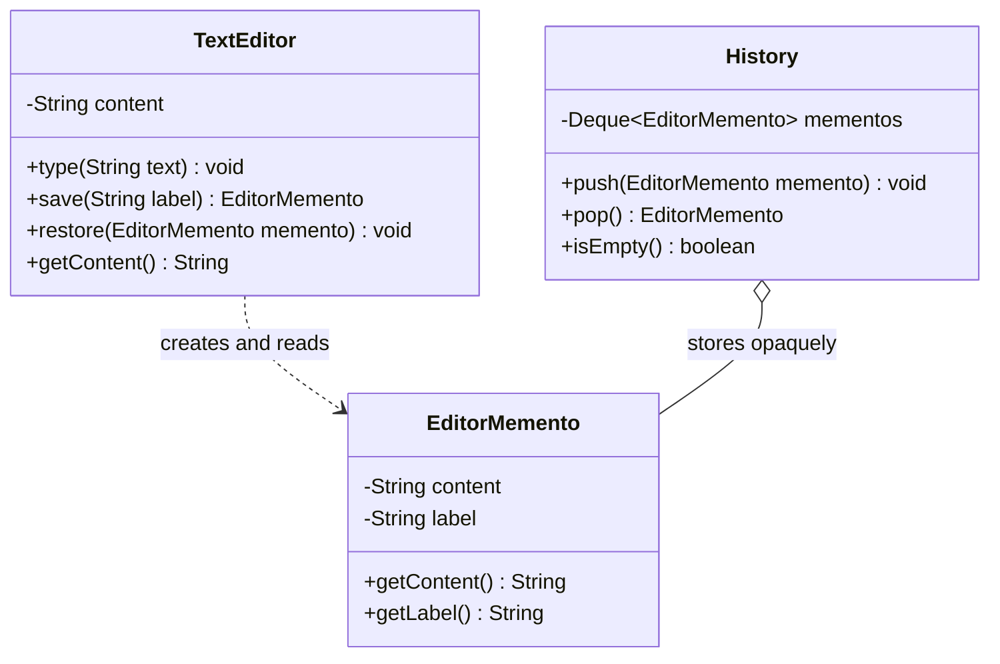

# Chapter 21 — Memento Pattern

## What & Why

The **Memento** pattern captures an object's internal state so it can be **restored later**, **without exposing** that object's internals. It's the pattern behind **undo/redo**, **save points**, and **checkpoints**: you snapshot state now, keep the snapshot somewhere, and roll back to it when needed.

**Real-world analogy:** A video game save point. When you save, the game bundles up your entire state (health, position, inventory) into a save file (the *memento*). You don't get to peek inside or edit the save file — it's opaque. Later, "Load Game" hands that file back to the game, which restores itself. The save manager (the *caretaker*) just stores files; it never reads what's inside them.

---

## The Problem: Undo Without Breaking Encapsulation

You want to undo changes to an object. The naive fix is to expose all its fields so someone else can save and reset them:

```java
// BAD: to support undo, the editor leaks all its internals
class TextEditor {
    public String content;      // now public
    public int cursorPos;       // now public
    public String fontName;     // now public
}

// External undo code pokes at the guts — encapsulation destroyed
String savedContent = editor.content;
int savedCursor = editor.cursorPos;
// ...later...
editor.content = savedContent;      // fragile, error-prone, tightly coupled
editor.cursorPos = savedCursor;
```

**Problems:**
- The object's **internals become public** just to enable undo.
- Undo code is **tightly coupled** to every field; add a field and it breaks.
- Nothing stops other code from **corrupting** the state.

---

## The Solution: An Opaque Snapshot

Let the object produce a **memento** — a sealed snapshot only *it* knows how to read — and hand it to a **caretaker** for safekeeping:

```java
class TextEditor {                     // Originator
    private String content = "";

    public EditorMemento save() {
        return new EditorMemento(content);     // snapshot my own state
    }

    public void restore(EditorMemento m) {
        this.content = m.getContent();         // restore from a snapshot
    }
}
```

The caretaker stores mementos but never looks inside:

```java
class History {                        // Caretaker
    private final Deque<EditorMemento> stack = new ArrayDeque<>();
    public void push(EditorMemento m) { stack.push(m); }  // just holds it
    public EditorMemento pop()        { return stack.pop(); }
}
```

The editor's fields stay private; only the editor reads/writes its own state.

The **C++** version uses **`friend`** to make the memento truly opaque — the caretaker holds it but *cannot* read it:

```cpp
// Memento — opaque snapshot; only the Originator can construct or read it
class EditorMemento {
    std::string content_;
    explicit EditorMemento(std::string content) : content_(std::move(content)) {}
    friend class TextEditor;                         // ONLY the originator gets access
};

// Originator
class TextEditor {
    std::string content_;
public:
    void type(const std::string& text) { content_ += text; }
    const std::string& content() const { return content_; }

    EditorMemento save() const { return EditorMemento(content_); }      // snapshot my own state
    void restore(const EditorMemento& m) { content_ = m.content_; }     // read via friendship
};

// Caretaker — stores mementos, never inspects them
class History {
    std::vector<EditorMemento> stack_;
public:
    void push(EditorMemento m) { stack_.push_back(std::move(m)); }
    EditorMemento pop() { auto m = std::move(stack_.back()); stack_.pop_back(); return m; }
    bool empty() const { return stack_.empty(); }
};
```

### C++ specifics

- **`friend class TextEditor` is the enforcement mechanism.** The memento's fields and constructor are `private`, and only the originator (a friend) can build or read one. The `History` caretaker holds `EditorMemento` values but literally has no way to read `content_` — the compiler guarantees the encapsulation rule. (Java uses a private nested class; C++ uses `friend`.)
- **Mementos are value types** stored by value in the caretaker's `vector` — cheap to copy/move for small state. For large state, store `std::unique_ptr<EditorMemento>` or snapshot **diffs** instead of full copies.
- Because the constructor is private, **no external code can forge a snapshot** — only `save()` produces valid mementos.

---

## Structure



**Roles:**
- **Originator** (`TextEditor`) — the object whose state we snapshot; it creates mementos and restores from them.
- **Memento** (`EditorMemento`) — the immutable snapshot. Its state is readable by the originator, but **opaque** to everyone else.
- **Caretaker** (`History`) — keeps mementos (often a stack for undo) but never inspects or modifies their contents.

---

## Step-by-Step

1. **Identify the Originator's state** that must be saved/restored.
2. **Create the Memento** to hold a copy of that state — make it **immutable**.
3. **Add `save()`** to the originator that returns a new memento of its current state.
4. **Add `restore(memento)`** that resets the originator from a memento.
5. **Add a Caretaker** that stores mementos (typically a stack) and requests save/restore — without ever reading the memento's contents.

---

## The Encapsulation Rule (the heart of the pattern)

The whole point is that **only the originator can read a memento's state**; the caretaker treats it as a sealed token. Languages enforce this differently:

| Language | How to keep the memento opaque to the caretaker |
|----------|-------------------------------------------------|
| **Java** | Make the Memento a **nested class** of the Originator with `private` state, or expose only a narrow interface to the caretaker |
| **C++** | Make the Originator a **`friend`** of the Memento so only it can read the private state |
| **Rust** | Keep the memento's fields **private to its module**; expose read accessors only via `pub(crate)` or a method the originator calls |
| **Go** | Put the Memento in a package where its fields are **unexported**; the caretaker holds it but can't read the fields |

Our examples keep it simple (accessor methods) and note where a stricter design would seal the state further. The caretaker code **must never** call the state accessor — that's the discipline.

---

## When to Use

- You need **undo/redo**, **checkpoints**, or **rollback**.
- You want to snapshot state **without exposing** the object's internals.
- A direct interface to the state would **violate encapsulation**.
- You want **transactional** behavior: save, try changes, restore on failure.

## When NOT to Use

- The state is huge and snapshotting it is **expensive** (memory/time) — consider storing *diffs* (command-based undo) instead.
- The object's state is trivial/public anyway — a plain copy is simpler.
- Undo can be expressed as **reverse operations** more cheaply (then use **Command** undo, Ch18).

---

## Memento vs Command (two ways to undo)

| Approach | How undo works | Best when |
|----------|----------------|-----------|
| **Memento** (Ch21) | Restore a **full snapshot** of prior state | State is small; reversing operations is hard |
| **Command** (Ch18) | Apply the **inverse operation** | Operations have clean inverses; state is large |

Real systems often **combine** them: Command for the action log, Memento for snapshots that are hard to reverse.

---

## Memory Strategies

Snapshotting everything on every change can be wasteful. Common optimizations:

- **Incremental / diffs** — store only what changed since the last memento.
- **Capped history** — keep only the last N mementos.
- **Copy-on-write** — share unchanged data between mementos.
- **Snapshot intervals** — save periodically plus a command log between snapshots.

---

## Common Pitfalls

1. **Leaky memento** — if the caretaker (or anyone but the originator) can read/modify the state, you've lost the pattern's benefit.
2. **Shallow copy** — a memento that stores a *reference* to mutable state isn't a snapshot; later mutations corrupt it. Copy deeply.
3. **Mutable memento** — the snapshot must be immutable, or it isn't a reliable restore point.
4. **Unbounded history** — undo stacks grow forever; cap them or use diffs.
5. **Expensive full snapshots** — for large state, prefer Command-based (diff) undo.

---

## Real-World Examples

| Context | Memento |
|---------|---------|
| **Text editors / IDEs** | Undo history snapshots |
| **Games** | Save files and checkpoints |
| **Databases** | Transaction savepoints / rollback |
| **Version control** | A commit is a snapshot of the tree |
| **Browsers** | Session/state restore |

---

## Language Notes

- **Java** — classic form nests the Memento inside the Originator so its fields are private to it; the caretaker holds `Object`/a marker interface. Our version uses a separate class with accessors for clarity.
- **C++** — the Originator is declared a `friend` of the Memento, so only it can read the private snapshot. Return mementos by value (they're small, immutable copies).
- **Rust** — an immutable struct with private fields; `save` clones the state into it, `restore` reads it back. Ownership makes "the caretaker holds it but can't mutate the originator" natural.
- **Go** — the memento's fields are unexported; the caretaker stores `*Memento` opaquely. The originator (same package) reads the fields.

Across all four: **the originator snapshots and restores itself; the caretaker only stores the sealed snapshots.**

---

## What's Next

Study the code in `src/` — a text editor that saves labeled snapshots to a history stack and undoes back through them. Then tackle the assignments (a calculator with undo and a document version-history system).
