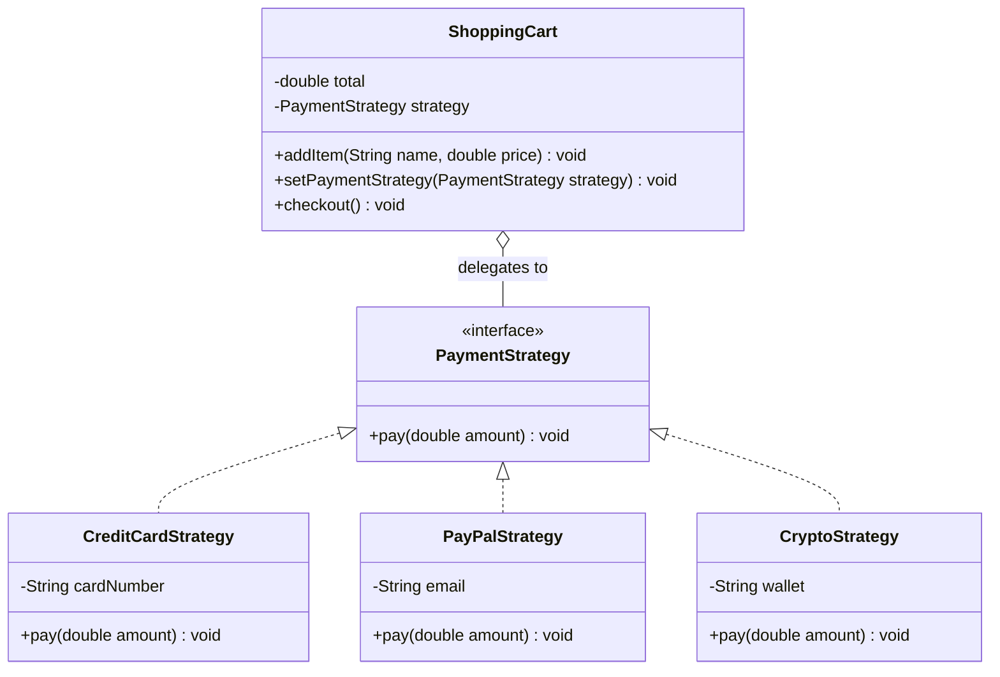

# Chapter 22 — Strategy Pattern

## What & Why

The **Strategy** pattern defines a **family of interchangeable algorithms**, encapsulates each one behind a common interface, and lets you **swap them at runtime**. The object using the algorithm (the *context*) delegates to a strategy object instead of hard-coding the behavior.

**Real-world analogy:** Getting to the airport. The goal is fixed (arrive at the airport), but you can choose a strategy: drive, take a taxi, ride the train, or bike. Each is a different algorithm for "get there," interchangeable depending on cost, time, and weather. You pick one at the moment you travel — and can pick a different one next time.

---

## The Problem: Algorithms Baked in with Conditionals

Without Strategy, varying behavior lives in a growing `if/else` or `switch`:

```java
// BAD: every payment method hard-coded into one method
class ShoppingCart {
    void checkout(String method) {
        if (method.equals("creditcard")) {
            // credit card logic
        } else if (method.equals("paypal")) {
            // paypal logic
        } else if (method.equals("crypto")) {
            // crypto logic
        }
        // add a new method → edit this method again (violates OCP)
    }
}
```

**Problems:**
- Adding an algorithm means **modifying** the context (violates OCP).
- The context is **bloated** with unrelated algorithm details.
- You **can't switch** algorithms at runtime cleanly.
- Algorithms **can't be reused or tested** independently.

---

## The Solution: Encapsulate Each Algorithm

Define a `Strategy` interface; implement each algorithm as its own class; let the context hold a reference and delegate:

```java
interface PaymentStrategy {
    void pay(double amount);
}

class CreditCardStrategy implements PaymentStrategy {
    public void pay(double amount) { /* charge card */ }
}
class PayPalStrategy implements PaymentStrategy {
    public void pay(double amount) { /* PayPal API */ }
}

class ShoppingCart {                 // Context
    private PaymentStrategy strategy;
    public void setPaymentStrategy(PaymentStrategy s) { this.strategy = s; }
    public void checkout(double total) {
        strategy.pay(total);          // delegate — no idea which algorithm
    }
}
```

Swap freely at runtime:

```java
cart.setPaymentStrategy(new CreditCardStrategy("1234"));
cart.checkout(99.90);
cart.setPaymentStrategy(new PayPalStrategy("me@x.com"));   // switched!
cart.checkout(20.00);
```

The **C++** context owns its strategy via `unique_ptr` and swaps it at runtime:

```cpp
struct PaymentStrategy {
    virtual ~PaymentStrategy() = default;
    virtual void pay(double amount) = 0;
};

class CreditCardStrategy : public PaymentStrategy {
public:
    void pay(double amount) override { /* charge card */ }
};
class PayPalStrategy : public PaymentStrategy {
public:
    void pay(double amount) override { /* PayPal API */ }
};

class ShoppingCart {                                 // Context
    std::unique_ptr<PaymentStrategy> strategy_;
public:
    void set_payment_strategy(std::unique_ptr<PaymentStrategy> s) { strategy_ = std::move(s); }
    void checkout(double total) { strategy_->pay(total); }       // delegate — no idea which algorithm
};

// Swap freely at runtime:
cart.set_payment_strategy(std::make_unique<CreditCardStrategy>());
cart.checkout(99.90);
cart.set_payment_strategy(std::make_unique<PayPalStrategy>());   // switched!
cart.checkout(20.00);
```

### C++ specifics

- **The context owns the strategy via `std::unique_ptr<PaymentStrategy>`**; the setter takes ownership by value + `move`, so swapping also frees the old strategy.
- **Strategy base needs a `virtual` destructor.**
- **Modern C++ shortcut:** for a single-method, stateless strategy, skip the class hierarchy and use **`std::function<void(double)>`** — a lambda *is* the strategy:
  ```cpp
  std::function<void(double)> strategy = [](double amt) { /* charge card */ };
  strategy = [](double amt) { /* PayPal */ };   // swap at runtime, zero boilerplate
  ```
  Keep the polymorphic interface when strategies **carry state** or have **multiple methods**; reach for `std::function` when they're simple callables. Java approximates this with functional interfaces + lambdas.

---

## Structure



**Roles:**
- **Strategy** (`PaymentStrategy`) — the common interface for all algorithms.
- **Concrete Strategy** (`CreditCardStrategy`, ...) — a specific algorithm implementation.
- **Context** (`ShoppingCart`) — holds a strategy and delegates the work to it; can swap strategies at runtime.
- **Client** — chooses which concrete strategy to plug in.

---

## Step-by-Step

1. **Identify the varying behavior** — the algorithm that has multiple interchangeable versions.
2. **Define the Strategy interface** capturing that behavior.
3. **Extract each variant** into its own Concrete Strategy class.
4. **Give the Context a strategy field** plus a setter (or constructor param).
5. **Delegate** from the context to the strategy; the client picks the strategy.

---

## Key Insight: Composition Over Inheritance

Strategy is the poster child for **"favor composition over inheritance"** (Ch04). Instead of subclassing the context for each behavior variant (`CreditCardCart`, `PayPalCart` — an explosion), you **compose** the context with a strategy object. Behavior becomes a **plug-in**, swappable at runtime, rather than fixed at compile time by the class hierarchy.

---

## Strategy vs State (the key comparison)

Structurally these two patterns look almost identical — an interface with interchangeable implementations. The difference is **intent**:

| | **Strategy** | **State** (Ch25) |
|---|---|---|
| **Intent** | Choose an **algorithm** | Change **behavior as internal state changes** |
| **Who swaps** | The **client** sets the strategy | The **states** transition themselves (or the context does) |
| **Awareness** | Strategies are **independent**, unaware of each other | States often **know the next state** and trigger transitions |
| **Example** | Pick a sorting/payment algorithm | A vending machine moving through NoCoin → HasCoin → Sold |

Rule of thumb: **Strategy** is about *how* to do something (pick one); **State** is about *what mode* you're in (it changes over time).

---

## Strategy vs Related Patterns

| Pattern | Relationship |
|---------|-------------|
| **State** (Ch25) | Same structure, different intent (see above). |
| **Template Method** (Ch24) | Template Method varies steps via **inheritance** (subclass overrides); Strategy varies the whole algorithm via **composition**. |
| **Command** (Ch18) | Both wrap behavior in an object; Command captures a *request* (often with undo/receiver), Strategy captures an *algorithm*. |
| **Factory** (Ch05) | A factory often decides **which strategy** to instantiate. |

---

## When to Use

- You have **multiple variants** of an algorithm and want to switch between them.
- You want to **avoid conditionals** that select behavior.
- You want algorithms to be **reusable and independently testable**.
- Behavior should be **configurable at runtime** (or by the client).

## When NOT to Use

- There's only **one** algorithm and no realistic variants — YAGNI.
- The variants are **trivial** — a lambda or a simple `if` is clearer than a class hierarchy.
- The strategies need **deep access** to the context's internals (passing everything in gets awkward).

---

## Modern Twist: Strategies as Functions

In languages with first-class functions, a strategy is often just a **function/lambda** — no class needed:

```java
// Java: a strategy can be a functional interface / lambda
cart.setPaymentStrategy(amount -> System.out.println("Paid " + amount + " by Apple Pay"));
```

This is the same pattern; the "concrete strategy" is a closure instead of a named class. Great for simple, stateless algorithms.

---

## Common Pitfalls

1. **Leaky context coupling** — a strategy that needs lots of the context's data suggests the split is wrong; pass a clear parameter object.
2. **Strategy explosion** — dozens of tiny classes for trivial variants; use lambdas for simple cases.
3. **Client must know the strategies** — the client picks the concrete strategy, so it's coupled to them; a Factory can hide this.
4. **Stateful strategies shared unsafely** — if a strategy holds mutable state, sharing one instance across contexts/threads can corrupt it. Prefer stateless strategies.
5. **Confusing with State** — if the object transitions between behaviors on its own, you likely want **State**, not Strategy.

---

## Real-World Examples

| Context | Strategy |
|---------|----------|
| **Sorting** | `Comparator` in Java's `Collections.sort(list, comparator)` |
| **Compression** | ZIP vs GZIP vs LZ4 algorithms behind one interface |
| **Payments** | Credit card / PayPal / crypto processors |
| **Routing / navigation** | Fastest vs shortest vs no-tolls route |
| **Validation / pricing** | Pluggable discount or tax rules |

---

## Language Notes

- **Java** — `Strategy` is an interface; lambdas work directly if it's a `@FunctionalInterface`. `Comparator` is the canonical built-in strategy.
- **C++** — hold the strategy as `std::unique_ptr<Strategy>` (or `std::function<void(double)>` for function strategies). Swap via a setter.
- **Rust** — a `Strategy` trait with `Box<dyn Strategy>` in the context, or a **closure** (`Box<dyn Fn(f64)>`) for lightweight strategies. Enums also model a closed set of strategies idiomatically.
- **Go** — a `Strategy` interface, or simply a **function type** (`type PayFunc func(amount float64)`) — Go idiom often prefers the function form.

Across all four: **the context delegates to a swappable algorithm object; it never hard-codes which one.**

---

## What's Next

Study the code in `src/` — a shopping cart that pays via interchangeable payment strategies swapped at runtime. Then tackle the assignments (a sorting/comparator strategy and a shipping-cost calculator).
