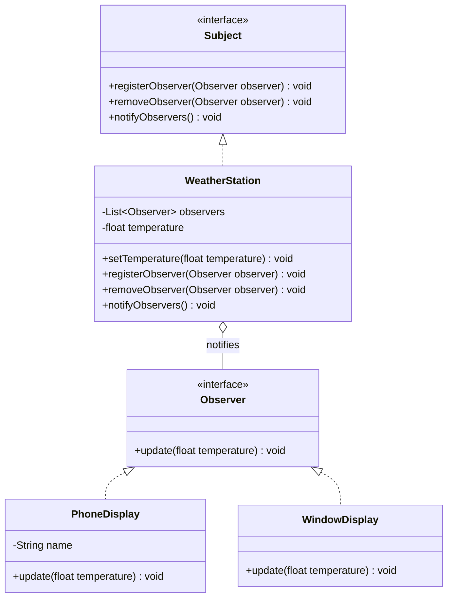

# Chapter 23 — Observer Pattern

## What & Why

The **Observer** pattern defines a **one-to-many** dependency between objects so that when one object (the **subject**) changes state, all its dependents (the **observers**) are **notified automatically**. It's the foundation of event systems, publish/subscribe, and reactive UIs.

**Real-world analogy:** A newspaper subscription. The publisher (subject) doesn't know or care who its readers are individually — when a new edition comes out, everyone subscribed automatically gets a copy. Readers can subscribe or unsubscribe anytime, and the publisher just pushes updates to the current subscriber list.

---

## The Problem: Polling and Tight Coupling

Without Observer, dependents must constantly **ask** the subject if something changed, or the subject must **hard-code** who to update:

```java
// BAD: the subject is wired to every concrete display
class WeatherStation {
    private PhoneDisplay phone;
    private WindowDisplay window;

    void setTemperature(float t) {
        this.temperature = t;
        phone.update(t);      // must know about PhoneDisplay
        window.update(t);     // must know about WindowDisplay
        // add a new display → edit this method (violates OCP)
    }
}
```

**Problems:**
- The subject is **coupled** to every concrete observer.
- Adding/removing an observer means **editing the subject** (violates OCP).
- Observers can't **subscribe/unsubscribe at runtime**.
- The alternative — observers **polling** the subject — wastes cycles and adds lag.

---

## The Solution: Subscribe and Get Notified

The subject keeps a **list of observers** behind an interface and notifies them all on change. Observers register/unregister themselves:

```java
interface Observer {
    void update(float temperature);
}

interface Subject {
    void registerObserver(Observer o);
    void removeObserver(Observer o);
    void notifyObservers();
}

class WeatherStation implements Subject {
    private final List<Observer> observers = new ArrayList<>();
    private float temperature;

    public void setTemperature(float t) {
        this.temperature = t;
        notifyObservers();                     // push to everyone subscribed
    }
    public void notifyObservers() {
        for (Observer o : observers) o.update(temperature);
    }
    public void registerObserver(Observer o) { observers.add(o); }
    public void removeObserver(Observer o)   { observers.remove(o); }
}
```

The station knows only the `Observer` interface — never the concrete displays.

The **C++** subject holds **non-owning** observer pointers and notifies them:

```cpp
struct Observer {
    virtual ~Observer() = default;
    virtual void update(float temperature) = 0;
};

class WeatherStation {
    std::vector<Observer*> observers_;               // NON-owning — observers live elsewhere
    float temperature_ = 0.0f;
public:
    void register_observer(Observer* o) { observers_.push_back(o); }
    void remove_observer(Observer* o) {
        observers_.erase(std::remove(observers_.begin(), observers_.end(), o), observers_.end());
    }
    void set_temperature(float t) { temperature_ = t; notify(); }   // push to everyone
    void notify() { for (auto* o : observers_) o->update(temperature_); }
};
```

### C++ specifics

- **The subject does NOT own its observers** — it holds non-owning raw `Observer*` (a display widget is owned elsewhere and outlives/varies independently of the station). This is association, not composition (Ch02).
- **The lifetime footgun Java's GC hides:** if an observer is destroyed while still registered, the subject holds a **dangling pointer** → undefined behavior on the next `notify()`. Two fixes:
  - the observer **unregisters itself in its destructor** (it keeps a back-pointer to the subject), or
  - the subject stores **`std::weak_ptr<Observer>`** (observers held as `shared_ptr`) and skips any that have `expired()`.
- **`Observer` base needs a `virtual` destructor.**
- **Modern alternative:** observers as **`std::function` callbacks** (a signals/slots system like Qt or `boost::signals2`) — subscribers register lambdas instead of implementing an interface.

---

## Structure



**Roles:**
- **Subject** — maintains the observer list and provides register/remove/notify.
- **Concrete Subject** (`WeatherStation`) — holds the state; notifies observers when it changes.
- **Observer** — the update interface all subscribers implement.
- **Concrete Observer** (`PhoneDisplay`, `WindowDisplay`) — reacts to notifications.

---

## Step-by-Step

1. **Define the Observer interface** with an `update(...)` method.
2. **Define the Subject** with register/remove/notify.
3. **Implement the Concrete Subject** — store observers, call `notifyObservers()` whenever relevant state changes.
4. **Implement Concrete Observers** — react in `update(...)`.
5. **Wire it up** — observers subscribe; changing the subject pushes updates to all of them automatically.

---

## Push vs Pull Model

How much data does the subject send in `update()`?

| Model | `update()` signature | Trade-off |
|-------|----------------------|-----------|
| **Push** | `update(temperature, humidity, ...)` — subject sends the data | Simple for observers; but sends data they may not need, and changing the data means changing every observer |
| **Pull** | `update(subject)` — observer asks the subject for what it needs | Flexible; observers fetch only what they use; but observers need a reference back to the subject |

Our example uses **push** (`update(float temperature)`) for clarity. Real frameworks often use **pull** (pass the subject/event and let observers query it).

---

## When to Use

- A change to one object requires **updating an unknown number of others**.
- You want **loose coupling** — the subject shouldn't know observer concrete types.
- Observers should **subscribe/unsubscribe dynamically** at runtime.
- You're building **events, notifications, or reactive data flows** (model → view).

## When NOT to Use

- There's exactly **one** dependent that never changes — a direct call is simpler.
- Notifications could trigger **cascading/cyclic updates** that are hard to reason about.
- Update order matters and must be strict — Observer doesn't guarantee order.

---

## Observer vs Mediator (the key comparison)

| | **Observer** (Ch23) | **Mediator** (Ch20) |
|---|---|---|
| **Intent** | Broadcast **state changes** to subscribers | Coordinate **complex interactions** between peers |
| **Direction** | One-way: subject → observers | Multi-directional coordination |
| **Coupling** | Observers know the subject (or a callback) | Colleagues know the mediator |
| **Shape** | Publisher → many subscribers | Hub coordinating peers |

A chat room is **Mediator** (two-way peer coordination); a stock ticker feeding many dashboards is **Observer** (one-way broadcast).

---

## Observer vs Pub/Sub

| | **Observer** | **Publish/Subscribe** |
|---|---|---|
| **Coupling** | Subject holds direct references to observers | A **message broker** sits between publishers and subscribers |
| **Knowledge** | Subject calls observers directly | Publishers/subscribers don't know each other at all |
| **Scope** | In-process, synchronous (usually) | Often cross-process, asynchronous |

Observer is the in-process, synchronous ancestor of the fully-decoupled Pub/Sub model used by message queues.

---

## Common Pitfalls

1. **Lapsed listener / memory leak** — observers that never unregister keep the subject alive (and vice versa). Unsubscribe, or use weak references.
2. **Notification storms** — one change triggers many updates, which trigger more changes — cascades and infinite loops. Guard against re-entrancy.
3. **Order dependence** — never assume observers are notified in a particular order.
4. **Modifying the observer list during notification** — an observer that unsubscribes itself mid-notify can corrupt the loop; iterate over a copy.
5. **Doing heavy work in `update()`** — a slow observer blocks the whole notification; offload async if needed.

---

## Real-World Examples

| Context | Observer |
|---------|----------|
| **GUI events** | Button click listeners, `addEventListener` |
| **Java** | `java.beans.PropertyChangeListener`; (legacy `Observable`) |
| **Reactive** | RxJava/Rx observables, Kotlin `Flow`, JS signals |
| **MVC** | Views observe the model and re-render on change |
| **Spring** | `ApplicationEvent` / `@EventListener` |

---

## Language Notes

- **Java** — `Observer`/`Subject` as interfaces; lambdas work if `Observer` is functional. The old `java.util.Observable` is deprecated — roll your own or use `PropertyChangeSupport`.
- **C++** — subject holds `std::vector<Observer*>` (non-owning) or `weak_ptr` to avoid lifetime cycles; a raw callback is `std::function`.
- **Rust** — observers as `Rc<dyn Observer>` in a `Vec`; remove via `Rc::ptr_eq`. Because a subject↔observer cycle can leak, use `Weak` when observers also point back. Channels (`mpsc`) are an idiomatic alternative.
- **Go** — `Observer` interface + a slice on the subject; a `func(temperature float64)` callback is the idiomatic lightweight form. Channels are the Go-native pub/sub mechanism.

Across all four: **the subject notifies an abstract observer list; it never depends on concrete observers.**

---

## What's Next

Study the code in `src/` — a weather station that pushes temperature updates to any number of displays, with runtime subscribe/unsubscribe. Then tackle the assignments (a stock ticker and a newsletter with typed events).
