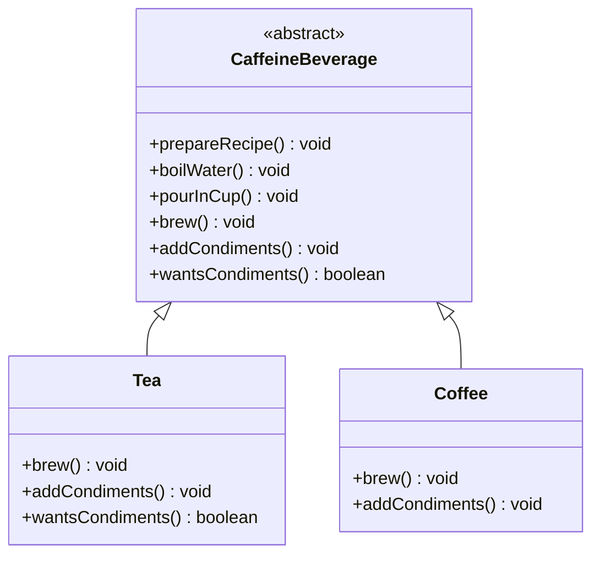

# Chapter 24 — Template Method Pattern

## What & Why

The **Template Method** pattern defines the **skeleton of an algorithm** in a base class method, deferring some steps to subclasses. Subclasses **override specific steps** without changing the algorithm's overall structure and order.

**Real-world analogy:** A recipe framework for hot drinks. Every caffeinated beverage follows the same steps: boil water → brew → pour into cup → add condiments. The *structure* is fixed, but *how* you brew (steep tea vs drip coffee) and *what* condiments you add (lemon vs milk) vary by drink. The framework nails down the sequence; each drink fills in the variable steps.

---

## The Problem: Duplicated Algorithm Structure

Two classes do almost the same thing, with the same steps in the same order — but you copy-paste the whole procedure and tweak a couple of steps:

```java
// BAD: Tea and Coffee duplicate the entire procedure
class Tea {
    void prepare() {
        boilWater();          // duplicated
        steepTeaBag();        // different
        pourInCup();          // duplicated
        addLemon();           // different
    }
}
class Coffee {
    void prepare() {
        boilWater();          // duplicated (again)
        brewCoffeeGrounds();  // different
        pourInCup();          // duplicated (again)
        addSugarAndMilk();    // different
    }
}
```

**Problems:**
- The shared steps and **the ordering** are duplicated in every class.
- Fixing a shared step (e.g., boiling) means editing **every** copy.
- Nothing enforces that all beverages follow the **same sequence**.

---

## The Solution: A Fixed Skeleton with Overridable Steps

Put the algorithm's skeleton in a base-class **template method** (which you don't override), and let subclasses supply only the varying steps:

```java
abstract class CaffeineBeverage {
    // The template method — defines the algorithm's skeleton. final = fixed.
    public final void prepareRecipe() {
        boilWater();
        brew();                          // subclass step
        pourInCup();
        if (wantsCondiments()) {         // hook — optional step
            addCondiments();             // subclass step
        }
    }

    private void boilWater() { System.out.println("Boiling water"); }
    private void pourInCup() { System.out.println("Pouring into cup"); }

    protected abstract void brew();          // must override
    protected abstract void addCondiments(); // must override
    protected boolean wantsCondiments() { return true; }  // hook: override optional
}
```

Subclasses fill in only what differs:

```java
class Tea extends CaffeineBeverage {
    protected void brew() { System.out.println("Steeping the tea"); }
    protected void addCondiments() { System.out.println("Adding lemon"); }
}
```

The sequence lives in **one** place; subclasses can't reorder it.

The **C++** version is the **Non-Virtual Interface (NVI) idiom** — a public non-virtual skeleton calling private virtual steps:

```cpp
class CaffeineBeverage {
public:
    virtual ~CaffeineBeverage() = default;

    // The template method — NON-virtual, so subclasses can't reorder it
    void prepare_recipe() {
        boil_water();
        brew();                               // subclass step
        pour_in_cup();
        if (wants_condiments()) add_condiments();   // hook-gated step
    }

private:
    void boil_water() { std::cout << "Boiling water\n"; }
    void pour_in_cup() { std::cout << "Pouring into cup\n"; }

    virtual void brew() = 0;                  // must override (private virtual)
    virtual void add_condiments() = 0;
    virtual bool wants_condiments() { return true; }   // hook — override optional
};

class Tea : public CaffeineBeverage {
    void brew() override { std::cout << "Steeping the tea\n"; }
    void add_condiments() override { std::cout << "Adding lemon\n"; }
};
```

### C++ specifics

- **This is the Non-Virtual Interface (NVI) idiom.** The public `prepare_recipe()` is **non-virtual** (the fixed skeleton), and the steps it calls are **private `virtual`**. Java locks the template method with `final`; C++ locks it by simply *not* making it virtual.
- **Private virtual methods can still be overridden by subclasses** — access control doesn't affect overriding. So the base controls the flow and subclasses only fill in steps: exactly the Hollywood Principle, enforced by the compiler.
- **The base needs a `virtual` destructor** (deleted through a base pointer).
- **Template Method vs Strategy in C++:** Template Method varies steps via **inheritance + virtual overrides** (bound to the subclass); Strategy varies the whole algorithm via **composition** (a swappable `unique_ptr`/`std::function`). Same "vary part of an algorithm" goal, opposite mechanisms.

---

## Structure



**Roles:**
- **Abstract Class** (`CaffeineBeverage`) — defines the **template method** (the fixed skeleton) plus concrete steps, abstract steps, and hooks.
- **Template Method** (`prepareRecipe`) — the non-overridable method that calls the steps in order.
- **Concrete Class** (`Tea`, `Coffee`) — implements the abstract steps and optionally overrides hooks.

---

## Step-by-Step

1. **Identify the algorithm** with a fixed sequence but varying steps.
2. **Write the template method** in the base class, calling the steps in order (make it `final`/non-virtual so it can't be overridden).
3. **Implement the invariant steps** as concrete methods in the base class.
4. **Declare the varying steps abstract** so subclasses must provide them.
5. **Add hooks** — methods with a default (often empty/true) implementation subclasses *may* override to influence the algorithm.

---

## Hooks: Optional Extension Points

A **hook** is a method in the base class with a default implementation that subclasses can *optionally* override to affect the algorithm — like `wantsCondiments()` above. Abstract steps say "you **must** fill this in"; hooks say "you **may** tweak this."

```java
class BlackCoffee extends CaffeineBeverage {
    protected void brew() { System.out.println("Brewing coffee"); }
    protected void addCondiments() { /* none */ }
    @Override protected boolean wantsCondiments() { return false; }  // skip the step
}
```

---

## The Hollywood Principle

Template Method embodies the **Hollywood Principle**: *"Don't call us, we'll call you."* The high-level base class controls the flow and **calls down** into the subclass's step implementations — not the other way around. Subclasses plug into the framework; they don't drive it. This inversion of control is the essence of frameworks.

---

## Template Method vs Strategy (the key comparison)

Both let you vary part of an algorithm, but differently:

| | **Template Method** (Ch24) | **Strategy** (Ch22) |
|---|---|---|
| **Mechanism** | **Inheritance** — subclass overrides steps | **Composition** — swap a strategy object |
| **Binding** | Compile-time (fixed by the subclass) | Runtime (swap freely) |
| **Scope** | Varies **individual steps** of one algorithm | Varies the **whole algorithm** |
| **Reuse** | Shares the skeleton via a base class | Shares nothing; each strategy is standalone |

Rule of thumb: **Template Method** changes *parts* of an algorithm via subclassing; **Strategy** replaces the *entire* algorithm via a plugged-in object.

---

## When to Use

- Several classes share an algorithm with the **same structure** but differing steps.
- You want to **avoid duplicating** the invariant parts and enforce a fixed sequence.
- You're building a **framework** where user subclasses fill in specific behavior.
- You want to control **exactly which parts** subclasses can change.

## When NOT to Use

- The steps vary so much there's **no meaningful shared skeleton**.
- You need to swap behavior **at runtime** — use **Strategy** instead.
- Deep inheritance hierarchies would result — prefer composition.
- The language/team favors composition over inheritance for flexibility.

---

## Common Pitfalls

1. **Overridable template method** — if subclasses can override the skeleton itself, the guarantee is lost. Make it `final`/non-virtual.
2. **Too many abstract steps** — forcing subclasses to implement many methods is a burden; use hooks with sensible defaults.
3. **Fragile base class** — changing the base algorithm can break all subclasses; keep the contract stable.
4. **Inheritance overuse** — deep hierarchies for small variations; Strategy (composition) may be cleaner.
5. **Steps that need lots of shared data** — passing state between steps via fields can get messy; keep steps cohesive.

---

## Real-World Examples

| Context | Template Method |
|---------|-----------------|
| **Java `AbstractList`** | Defines list operations; you implement `get()`/`size()` |
| **Java `InputStream.read(byte[])`** | Skeleton calls the abstract `read()` |
| **`java.util.AbstractMap`** | Framework methods built on a few abstract ones |
| **Servlet `HttpServlet.service()`** | Calls `doGet()`/`doPost()` hooks you override |
| **Testing frameworks** | `setUp()` / `test` / `tearDown()` lifecycle hooks |
| **Build/CI pipelines** | Fixed phases; each project fills in steps |

---

## Language Notes

- **Java** — abstract base class; the template method is `final`, steps are `abstract`, hooks have defaults. The classic form.
- **C++** — the **Non-Virtual Interface (NVI)** idiom: a public **non-virtual** template method calls **private/protected virtual** steps. This enforces the skeleton while letting subclasses override steps.
- **Rust** — a **trait with a default method** *is* the template method: the default `prepare_recipe` calls the trait's other (required) methods and any hooks (methods with default bodies). No inheritance needed — the idiomatic realization.
- **Go** — no inheritance, so the template is a **function that takes an interface** of the varying steps, or a struct embedding where the skeleton function calls interface methods. Go can't dispatch a base method to an embedded child override, so the "template as a function over an interface" form is idiomatic.

Across all four: **the skeleton and step order are fixed in one place; only the marked steps vary.**

---

## What's Next

Study the code in `src/` — a caffeine-beverage recipe framework where `Tea` and `Coffee` fill in the brew and condiment steps, plus a hook to skip condiments. Then tackle the assignments (a data-processing pipeline and a game turn framework).
