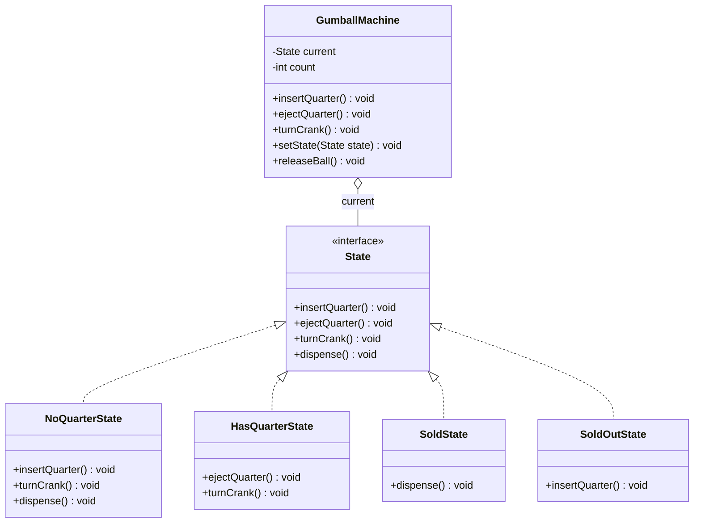

# Chapter 25 — State Pattern

## What & Why

The **State** pattern lets an object **alter its behavior when its internal state changes** — the object appears to *change its class*. Instead of a giant conditional switching on a state variable, each state becomes its own object that knows how to behave and how to **transition** to the next state.

**Real-world analogy:** A vending machine. The same button press does completely different things depending on the machine's state: with no coin inserted, turning the crank does nothing; with a coin in, it dispenses; when sold out, it refuses. The machine's behavior for the *same action* depends entirely on which state it's in — and each action can move it to a new state.

---

## The Problem: Sprawling State Conditionals

Without the pattern, every action is a conditional on a state field, and adding a state means editing every method:

```java
// BAD: every method switches on the current state
class GumballMachine {
    static final int SOLD_OUT = 0, NO_QUARTER = 1, HAS_QUARTER = 2, SOLD = 3;
    int state = NO_QUARTER;

    void insertQuarter() {
        if (state == HAS_QUARTER)      System.out.println("Already have a quarter");
        else if (state == SOLD_OUT)    System.out.println("Sold out");
        else if (state == NO_QUARTER)  { state = HAS_QUARTER; ... }
        else if (state == SOLD)        System.out.println("Wait, dispensing");
    }
    // turnCrank(), dispense() ... each repeats the SAME 4-way conditional
}
```

**Problems:**
- The **same conditional** is duplicated in every action method.
- Adding a state means editing **every** method (violates OCP).
- Transition logic is **scattered** and hard to follow.
- It's error-prone — easy to miss a case or a transition.

---

## The Solution: Each State Is an Object

Extract each state into a class implementing a common `State` interface. The context delegates every action to its **current state object**; states perform the behavior and switch the context to the next state:

```java
interface State {
    void insertQuarter();
    void turnCrank();
    void dispense();
}

class NoQuarterState implements State {
    private final GumballMachine machine;
    public void insertQuarter() {
        System.out.println("Quarter accepted");
        machine.setState(machine.getHasQuarterState());   // transition!
    }
    public void turnCrank()  { System.out.println("Pay first"); }
    public void dispense()   { System.out.println("Pay first"); }
}

class GumballMachine {                 // Context
    private State current;
    public void insertQuarter() { current.insertQuarter(); }  // just delegate
    public void setState(State s) { this.current = s; }
}
```

No conditionals — the current state object *is* the behavior.

The **C++** version — the context owns its states via `unique_ptr`; states hold a `Context&` and switch it. The state↔context reference cycle is broken by a forward declaration + defining the context constructor out-of-line (in a `.cpp`), the exact trick used in the ATM and vending-machine case studies:

```cpp
class GumballMachine;   // forward declaration

struct State {
    virtual ~State() = default;
    virtual void insert_quarter() = 0;
    virtual void turn_crank() = 0;
    virtual void dispense() = 0;
};

class NoQuarterState : public State {
    GumballMachine& machine_;
public:
    explicit NoQuarterState(GumballMachine& machine) : machine_(machine) {}
    void insert_quarter() override;      // defined out-of-line (needs full GumballMachine)
    void turn_crank() override { std::cout << "Pay first\n"; }
    void dispense() override   { std::cout << "Pay first\n"; }
};

class GumballMachine {                   // Context
    std::unique_ptr<State> no_quarter_, has_quarter_, sold_, sold_out_;
    State* current_ = nullptr;
public:
    GumballMachine();                    // ctor defined in the .cpp, where states are complete
    void insert_quarter() { current_->insert_quarter(); }   // just delegate
    void set_state(State* s) { current_ = s; }
    State* has_quarter_state() { return has_quarter_.get(); }
};

// In the .cpp, where GumballMachine is a complete type:
void NoQuarterState::insert_quarter() {
    std::cout << "Quarter accepted\n";
    machine_.set_state(machine_.has_quarter_state());       // transition!
}
```

### C++ specifics

- **The context owns the state objects via `std::unique_ptr<State>`**, and holds a non-owning `State* current_` pointing at whichever is active. Transitions are just `set_state(other.get())`.
- **The state↔context cycle** (context owns states, states reference the context) is resolved with a **forward declaration** plus defining the methods/constructor that need the full type **out-of-line in a `.cpp`**. This is the recurring case-study pattern (Ch35/Ch36).
- **Alternative (used in Ch37):** make states **stateless singletons** that take `Context&` as a *parameter* instead of storing it — then there's no per-context state object and no cycle.
- `State` base needs a **`virtual` destructor**.

---

## Structure



**Roles:**
- **Context** (`GumballMachine`) — holds a reference to the current state and delegates all actions to it; exposes a `setState` for transitions.
- **State** — the interface declaring the state-dependent actions.
- **Concrete States** (`NoQuarterState`, `HasQuarterState`, `SoldState`, `SoldOutState`) — implement behavior for one state and trigger transitions.

---

## Step-by-Step

1. **Identify the states** and the actions whose behavior depends on state.
2. **Define the State interface** with those actions.
3. **Create a Concrete State per state**, implementing each action for that state.
4. **Give states access to the context** so they can trigger transitions (`context.setState(...)`).
5. **The context delegates** every action to the current state and holds shared data (like the gumball count).

---

## Where Do Transitions Live?

Two options for *who* decides the next state:

| Approach | Transition logic in... | Trade-off |
|----------|------------------------|-----------|
| **States decide** (GoF classic) | Each state sets the context's next state | Decentralized; states know each other; easy to add states |
| **Context decides** | The context contains a transition table/logic | Centralized; states are simpler but the context grows |

Our main example uses **states decide** — each state transitions the machine, keeping transition rules next to the behavior they belong to.

### The "context decides" (centralized) alternative

Here the state is a plain **enum** and every transition lives in the context — one `switch` per action. No state classes, no back-references:

```java
public class GumballMachine {
    enum State { NO_QUARTER, HAS_QUARTER, SOLD, SOLD_OUT }
    private State state;
    private int count;

    // ALL transitions for this action live here, in the context.
    public void insertQuarter() {
        switch (state) {
            case NO_QUARTER:  System.out.println("Quarter accepted");
                              state = State.HAS_QUARTER; break;
            case HAS_QUARTER: System.out.println("Already have a quarter"); break;
            case SOLD:        System.out.println("Wait, dispensing"); break;
            case SOLD_OUT:    System.out.println("Sold out"); break;
        }
    }
    // turnCrank(), ejectQuarter(), dispense() ... each is another switch
}
```

| | **States decide** (this chapter's `src/`) | **Context decides** (`src/.../centralized/`) |
|---|---|---|
| State representation | one class per state | a single `enum` |
| Transition logic | inside each state object | inside the context's action methods |
| Adding a **state** | add a class; touch the states that transition to it | edit **every** action's `switch` |
| Adding an **action** | add a method to the State interface + every state | add one method to the context |
| Best when | many states, rich per-state behavior | few states, simple behavior, or **data-dependent** transitions |

**Data-dependent transitions** (like "dispense → NoQuarter *if count>0* else SoldOut") are awkward for a pure static **transition table** but trivial as a line of code in the context — which is one reason the centralized form is sometimes simpler.

> **Runnable comparison:** the distributed version is in `src/java/chapter25/` and `src/cpp/`; the centralized version is in `src/java/chapter25/centralized/` and `src/cpp/centralized/`. Both produce identical output — only *where the transitions live* differs.

---

## State vs Strategy (the key comparison)

Structurally identical (an interface with interchangeable implementations), but the **intent** differs — this is a classic interview question:

| | **State** (Ch25) | **Strategy** (Ch22) |
|---|---|---|
| **Intent** | Behavior changes as **internal state** changes | Pick an **algorithm** |
| **Who swaps** | The **states transition themselves** (or the context) | The **client** sets the strategy |
| **Awareness** | States often **know the next state** | Strategies are **independent**, unaware of each other |
| **Lifecycle** | Object moves through states **over time** | Strategy usually set once and stays |
| **Example** | Vending machine, TCP connection, order workflow | Sorting, payment, compression algorithm |

Rule of thumb: if the object **transitions between behaviors on its own over time**, it's **State**; if the **client picks one behavior**, it's **Strategy**.

---

## When to Use

- An object's behavior depends on its **state**, and it must change behavior at runtime.
- You have **large conditionals** that switch on a state field across many methods.
- State transitions follow **well-defined rules** you want to make explicit.
- Examples: workflows, protocols (TCP), UI modes, game character states, order lifecycles.

## When NOT to Use

- There are only **two** states and simple behavior — a boolean and an `if` is fine.
- States rarely change or the behavior barely differs.
- The added classes would **obscure** rather than clarify a trivial machine.

---

## Common Pitfalls

1. **State explosion** — too many fine-grained states become hard to manage; group or use hierarchical states.
2. **Scattered vs centralized transitions** — mixing both styles confuses readers; pick one.
3. **Duplicated shared data** — keep shared data (like `count`) in the context, not copied into every state.
4. **Stateful state objects** — if state objects are stateless (behavior only), you can share single instances; if they hold per-context data, don't share them.
5. **Forgetting a transition** — an action in a state that should move on but doesn't leaves the machine stuck; test every transition.

---

## Real-World Examples

| Context | States |
|---------|--------|
| **Vending / gumball machine** | NoCoin → HasCoin → Sold → SoldOut |
| **TCP connection** | Closed → Listen → Established → Closed |
| **Order lifecycle** | Placed → Paid → Shipped → Delivered |
| **Media player** | Stopped → Playing → Paused |
| **Document workflow** | Draft → Moderation → Published |
| **Game characters** | Idle → Running → Jumping → Attacking |

---

## Language Notes

- **Java** — the context pre-creates one instance per state and swaps a `current` reference; states hold a back-reference to the context to transition.
- **C++** — the context owns the state objects (`unique_ptr<State>`); states hold a `Context&` and call `set_state`. The state↔context references are resolved with a forward declaration and one out-of-line constructor.
- **Rust** — the classic mutable back-reference fights the borrow checker, so the idiomatic form is **ownership-based**: each action **consumes** the current state (`self: Box<Self>`) and **returns the next state**. The context does `self.state = Some(old_state.action(self))`. No cycles, transitions are explicit.
- **Go** — the context holds a `State` interface field; states hold a `*Machine` and call `setState`. Straightforward with Go's reference semantics.

Across all four: **each state encapsulates its own behavior and transitions; the context just delegates to the current state.**

---

## What's Next

Study the code in `src/` — a gumball machine cycling through NoQuarter → HasQuarter → Sold → SoldOut states. Then tackle the assignments (a traffic light and an order-processing workflow).
