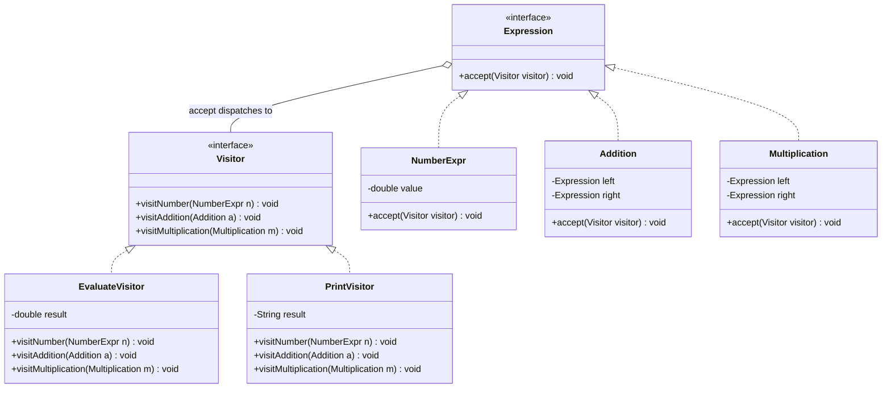

# Chapter 26 — Visitor Pattern

## What & Why

The **Visitor** pattern lets you **add new operations** to a set of objects **without modifying their classes**. You move the operation into a separate *visitor* object; each element accepts a visitor and calls back the right visit method. New operation = new visitor class; the element classes never change.

**Real-world analogy:** A tax auditor visiting different businesses. A restaurant, a farm, and a factory each "accept" the auditor, and the auditor knows how to compute tax for *each type* of business. To add a new kind of report (say, a safety inspection), you send a **different visitor** — you don't rewrite the businesses.

---

## The Problem: Adding Operations Means Editing Every Class

Suppose you have an expression tree — `Number`, `Addition`, `Multiplication` — and you want to `evaluate` it, `print` it, and later `optimize` it. Putting each operation *inside* the classes means editing all of them every time you add an operation:

```java
// BAD: every new operation adds a method to EVERY element class
class Addition {
    double evaluate() { ... }
    String print()    { ... }   // added later — edit this class
    Expression optimize() { ... } // added later — edit this class AGAIN
}
// ...and the same three methods duplicated in Number, Multiplication, ...
```

**Problems:**
- Each new operation forces edits across **all** element classes (violates OCP for operations).
- Element classes get **bloated** with unrelated concerns (eval + print + optimize + serialize...).
- Related operation logic is **scattered** across many classes instead of living together.

---

## The Solution: Double Dispatch via accept/visit

Move each operation into a **Visitor**. Every element implements `accept(visitor)`, which calls back the visitor's method for its own type — this two-step call is **double dispatch**:

```java
interface Expression {
    void accept(Visitor v);            // step 1: dynamic on the element type
}
interface Visitor {
    void visitNumber(NumberExpr n);
    void visitAddition(Addition a);
    void visitMultiplication(Multiplication m);
}

class Addition implements Expression {
    public void accept(Visitor v) {
        v.visitAddition(this);         // step 2: dynamic on the visitor type
    }
}
```

Now each operation is one visitor class; adding `PrintVisitor` or `OptimizeVisitor` touches **no** element class.

The **C++** version — the same `accept`/`visit` double dispatch:

```cpp
struct NumberExpr; struct Addition; struct Multiplication;   // forward declarations

struct Visitor {
    virtual ~Visitor() = default;
    virtual void visit_number(NumberExpr& n) = 0;
    virtual void visit_addition(Addition& a) = 0;
    virtual void visit_multiplication(Multiplication& m) = 0;
};

struct Expression {
    virtual ~Expression() = default;
    virtual void accept(Visitor& v) = 0;           // step 1: dynamic on the element type
};

struct Addition : Expression {
    std::unique_ptr<Expression> left, right;       // tree owns its children
    void accept(Visitor& v) override { v.visit_addition(*this); }   // step 2: dynamic on visitor
};
```

### C++ specifics

- **Both `Expression` and `Visitor` are pure-virtual bases with `virtual` destructors**; the element tree owns its children via `unique_ptr`. `accept` takes the visitor **by reference**.
- **Modern C++ alternative — `std::variant` + `std::visit`:** for a *closed* set of element types you can skip the accept/visit boilerplate entirely:
  ```cpp
  using Expr = std::variant<NumberExpr, Addition, Multiplication>;
  std::visit(overloaded{
      [](const NumberExpr& n)     { /* ... */ },
      [](const Addition& a)       { /* ... */ },
      [](const Multiplication& m) { /* ... */ },
  }, expr);
  ```
  `std::visit` gives you **compile-time double dispatch** with no `accept` methods. Use the classic Visitor when the hierarchy is **open/polymorphic** or elements are compiled separately; use `variant`/`visit` when the type set is **fixed and known**.

---

## Double Dispatch Explained

A normal method call is **single dispatch** — the method chosen depends on **one** type (the receiver). Visitor achieves **double dispatch** — the executed code depends on **two** types: the **element** *and* the **visitor**.

```
expr.accept(visitor)
   └─ resolves on expr's type   → Addition.accept(...)
        └─ calls visitor.visitAddition(this)
             └─ resolves on visitor's type → EvaluateVisitor.visitAddition(...)
```

The pair `(element type, visitor type)` selects the exact behavior — something languages without multiple dispatch can't do in a single call.

---

## Structure



**Roles:**
- **Element** (`Expression`) — declares `accept(visitor)`.
- **Concrete Elements** (`NumberExpr`, `Addition`, `Multiplication`) — implement `accept` by calling the matching `visit` method.
- **Visitor** — declares a `visit` method per concrete element type.
- **Concrete Visitors** (`EvaluateVisitor`, `PrintVisitor`) — implement an operation across all element types.
- **Object structure** — the tree/collection of elements the visitor traverses.

---

## Step-by-Step

1. **Define the Visitor interface** with one `visit` method per concrete element type.
2. **Add `accept(visitor)`** to the element interface; each element calls the visitor's matching method.
3. **Implement Concrete Visitors** — one per operation, handling every element type.
4. **Traverse** the structure, calling `accept` on each element (recursively for trees).
5. **Add new operations** by writing new visitors — no element changes needed.

---

## The Central Trade-off (add operations vs add types)

Visitor makes one axis easy and the other hard — understand this before using it:

| | Add a new **operation** | Add a new **element type** |
|---|---|---|
| **Visitor** | ✅ Easy — one new visitor class | ❌ Hard — must edit **every** visitor |
| **Methods on elements** | ❌ Hard — edit every element class | ✅ Easy — one new element class |

Use Visitor when the **set of element types is stable** but you keep **adding operations**. Avoid it when you frequently add new element types.

---

## When to Use

- The object structure has a **stable set of classes**, and you add **many operations** over them.
- Operations should be **grouped together** (all of "evaluate" in one place) rather than scattered.
- You want to keep unrelated concerns (eval, print, export) **out of** the element classes.
- You need behavior that depends on **both** the element and the operation (double dispatch).

## When NOT to Use

- The element hierarchy **changes often** — every new type breaks every visitor.
- There are only one or two operations — plain methods are simpler.
- Visitors need access the elements **hide** — Visitor tends to force wider access (breaks encapsulation).
- The language offers **pattern matching** over a closed type set (see Rust/Go notes) — often simpler than Visitor.

---

## Visitor vs Related Patterns

| Pattern | Relationship |
|---------|-------------|
| **Composite** (Ch12) | Visitor commonly traverses a Composite tree, applying an operation to each node. |
| **Iterator** (Ch19) | Iterator yields elements; Visitor performs a type-specific operation on each. |
| **Strategy** (Ch22) | Both externalize behavior; Visitor dispatches on element *type*, Strategy just swaps one algorithm. |
| **Interpreter** | An interpreter's evaluation is often implemented as a Visitor over the AST. |

---

## Common Pitfalls

1. **Adding element types is painful** — every new element forces a new method in every visitor. If types change often, don't use Visitor.
2. **Broken encapsulation** — visitors need enough access to elements' data to do their job, which can expose internals. Provide read accessors, not raw fields.
3. **Traversal coupling** — decide who walks the structure: the visitor, the elements' `accept`, or a separate iterator. Mixing them confuses control flow.
4. **Stateful visitors** — a visitor that accumulates results is fine but must be reset/reused carefully; don't share one across concurrent traversals.
5. **Overengineering** — Visitor adds a lot of ceremony; only use it when the add-operations-often condition truly holds.

---

## Real-World Examples

| Context | Visitor |
|---------|---------|
| **Compilers** | AST visitors: type-check, optimize, generate code — all over a stable node set |
| **Document models** | Export a DOM to HTML / PDF / Markdown via different visitors |
| **`javax.lang.model`** | Annotation processing uses element/type visitors |
| **Serialization** | A visitor walks an object graph to emit JSON/XML |
| **Static analysis / linters** | Visitors traverse the syntax tree checking rules |

---

## Language Notes

- **Java** — one `visit` overload per element type; `accept` calls the right one. Overloading makes the visitor read naturally.
- **C++** — same shape; `visit` can be **overloaded** (same name, different element type). Elements own their children via `unique_ptr`; resolve element↔visitor references with forward declarations.
- **Rust** — the classic trait-object visitor works (a `Visitor` trait with `visit_*` methods, elements call back via `accept`). But the **idiomatic Rust alternative** is an `enum` for the element types plus a `match` — pattern matching gives you the same "operation over a closed set of types" without the accept/visit ceremony. Our example shows the classic form and notes the enum alternative.
- **Go** — no method overloading, so visit methods are **named per type** (`VisitNumber`, `VisitAddition`, ...), which is exactly the Visitor shape. A **type switch** (`switch v := e.(type)`) is the lighter-weight Go alternative for a closed set.

Across all four: **the element picks the visit method (double dispatch); each visitor is one self-contained operation.**

> **Idiomatic note:** In Rust and Go, if your element set is *closed* (won't grow), prefer `match` / type switch over the full Visitor ceremony. Reach for classic Visitor when you have many operations over a stable hierarchy in an OOP-heavy codebase.

---

## What's Next

Study the code in `src/` — an expression tree (`Number`, `Addition`, `Multiplication`) visited by an `EvaluateVisitor` (computes the value) and a `PrintVisitor` (renders infix notation), with no operation logic inside the element classes. Then tackle the assignments (a shape-area/export visitor and a file-system reporting visitor).
