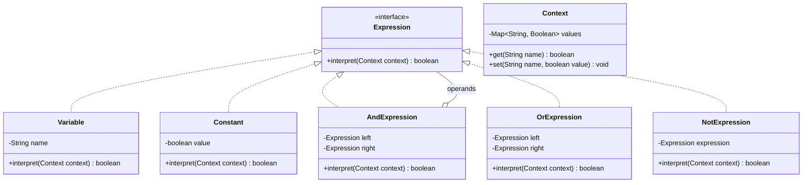

# Chapter 27 — Interpreter Pattern

## What & Why

The **Interpreter** pattern defines a **grammar** for a simple language and an **interpreter** that evaluates sentences in that language. Each grammar rule becomes a class; an expression is represented as a **tree of these rule objects**, and interpreting it means walking the tree.

**Real-world analogy:** A pocket phrasebook for a tiny language. Each rule ("A means X", "A and B means both") is a card. To understand a sentence, you assemble the relevant cards into a structure and follow them. Add a new grammar rule → add a new card; you never rewrite the existing cards.

**Note:** Interpreter is the **least commonly used** GoF pattern. For anything beyond a *simple* grammar, use a real parser/parser-generator. It's included here for completeness and because its structure (a Composite tree you evaluate) is genuinely useful for small DSLs and rule engines.

---

## The Problem: Evaluating a Mini-Language

You need to evaluate boolean rules like `(A OR B) AND (NOT C)` where the variables' values come from a runtime context. Hard-coding an evaluator with string parsing and nested conditionals is brittle and impossible to extend:

```java
// BAD: ad-hoc parsing + evaluation tangled together
boolean eval(String rule, Map<String,Boolean> vars) {
    // split on AND/OR/NOT, handle precedence, parentheses...
    // add a new operator → rewrite this whole mess
}
```

**Problems:**
- Parsing and evaluation are **tangled** and fragile.
- Adding an operator means **editing the monolithic evaluator** (violates OCP).
- Precedence, nesting, and reuse are hard to get right.
- The grammar isn't represented anywhere you can inspect or extend.

---

## The Solution: One Class Per Grammar Rule

Represent each grammar rule as a class implementing a common `interpret(context)` method. Compose them into an **abstract syntax tree (AST)**; interpreting = calling `interpret` on the root:

```java
interface Expression {
    boolean interpret(Context context);
}

// Terminal — a leaf of the grammar
class Variable implements Expression {
    private final String name;
    public boolean interpret(Context ctx) { return ctx.get(name); }
}

// Non-terminal — a rule composed of sub-expressions
class AndExpression implements Expression {
    private final Expression left, right;
    public boolean interpret(Context ctx) {
        return left.interpret(ctx) && right.interpret(ctx);
    }
}
```

Build `(A OR B) AND (NOT C)` as a tree and evaluate it against any context:

```java
Expression rule = new AndExpression(
    new OrExpression(new Variable("A"), new Variable("B")),
    new NotExpression(new Variable("C")));
rule.interpret(context);   // walks the tree
```

The **C++** version — non-terminals **own** their sub-expressions via `unique_ptr` (it's a Composite tree, Ch12):

```cpp
struct Expression {
    virtual ~Expression() = default;
    virtual bool interpret(const Context& ctx) const = 0;
};

// Terminal — a leaf of the grammar
class Variable : public Expression {
    std::string name_;
public:
    explicit Variable(std::string name) : name_(std::move(name)) {}
    bool interpret(const Context& ctx) const override { return ctx.get(name_); }
};

// Non-terminal — owns its sub-expressions
class AndExpression : public Expression {
    std::unique_ptr<Expression> left_, right_;
public:
    AndExpression(std::unique_ptr<Expression> l, std::unique_ptr<Expression> r)
        : left_(std::move(l)), right_(std::move(r)) {}
    bool interpret(const Context& ctx) const override {
        return left_->interpret(ctx) && right_->interpret(ctx);
    }
};

// Build (A OR B) AND (NOT C) as a tree:
auto rule = std::make_unique<AndExpression>(
    std::make_unique<OrExpression>(std::make_unique<Variable>("A"),
                                   std::make_unique<Variable>("B")),
    std::make_unique<NotExpression>(std::make_unique<Variable>("C")));
rule->interpret(context);   // walks the tree
```

### C++ specifics

- **Non-terminals own their sub-expressions via `std::unique_ptr<Expression>`** — the whole AST is freed recursively when the root is destroyed (RAII), exactly like the Composite chapter.
- **`interpret` is `const`** — evaluation reads the tree and the context without mutating them.
- **`Expression` base needs a `virtual` destructor.**
- For a **fixed operator set**, the `std::variant` + `std::visit` approach (Ch26) is a modern alternative to the class-per-rule hierarchy — but the classic tree shines when the grammar is open/extensible.

---

## Structure



**Roles:**
- **AbstractExpression** (`Expression`) — declares `interpret(context)`.
- **Terminal Expression** (`Variable`, `Constant`) — a leaf rule; interprets itself directly.
- **Non-terminal Expression** (`And`, `Or`, `Not`) — a rule built from sub-expressions; interprets by combining their results.
- **Context** — holds the external information interpretation needs (here, variable values).
- **Client** — builds the AST (by hand or via a parser) and invokes `interpret`.

---

## Step-by-Step

1. **Define the grammar** for your mini-language (the rules).
2. **Create the AbstractExpression** with an `interpret(context)` method.
3. **Make a Terminal Expression** class for each leaf rule (literals, variables).
4. **Make a Non-terminal Expression** class for each composite rule (AND, OR, sequences).
5. **Build the AST** (a Composite tree) and call `interpret` on the root, passing a context.

---

## Interpreter Is Built on Composite

An Interpreter's expression tree **is a Composite** (Ch12): terminals are leaves, non-terminals are composites holding child expressions. `interpret` recurses down the tree exactly like a composite operation. If you understood Composite, you already understand Interpreter's structure — Interpreter just adds the "each node is a grammar rule with an `interpret` method" meaning.

A separate concern is **parsing** (turning text like `"A AND B"` into the tree). The Interpreter pattern covers **evaluation**, not parsing — you build the tree by hand or with a separate parser, then interpret it.

---

## When to Use

- You have a **simple, well-defined grammar** to evaluate repeatedly.
- The grammar is **stable** and not too large (few rules).
- Efficiency isn't critical (tree-walking is not the fastest evaluation strategy).
- Examples: boolean rule engines, simple query/filter DSLs, format strings, calculators.

## When NOT to Use

- The grammar is **complex or changes often** — a class-per-rule explodes; use a **parser generator** (ANTLR, yacc) or a proper parsing library.
- You need **high performance** — compile to bytecode or use a table-driven parser instead.
- The "language" is really just configuration — a data structure may be simpler than a grammar.

---

## Interpreter vs Related Patterns

| Pattern | Relationship |
|---------|-------------|
| **Composite** (Ch12) | The AST *is* a Composite; Interpreter gives each node an `interpret` meaning. |
| **Visitor** (Ch26) | Instead of an `interpret` method per class, a Visitor can perform evaluation (and other operations) over the AST — useful when you have many operations. |
| **Iterator** (Ch19) | Can traverse the AST. |
| **Flyweight** (Ch15) | Terminal symbols (e.g., variables) are often shared as flyweights. |

**Interpreter vs Visitor:** if you have **one** operation (evaluate), put `interpret` on the nodes (Interpreter). If you'll have **many** operations over a stable node set (evaluate, print, optimize, type-check), a **Visitor** keeps each operation in one place. They're two ways to add behavior to an AST.

---

## Common Pitfalls

1. **Grammar growth** — every new rule is a new class; complex grammars become unmanageable. Know when to switch to a parser generator.
2. **Confusing parsing with interpreting** — Interpreter evaluates an existing tree; building the tree from text is a *separate* step.
3. **Fat context** — cramming unrelated data into the context couples rules to it; keep the context focused.
4. **Deep recursion** — very deep expression trees can overflow the stack.
5. **Reinventing a language** — before building a DSL, check whether an existing expression library or config format suffices.

---

## Real-World Examples

| Context | Interpreter |
|---------|-------------|
| **Regular expressions** | `java.util.regex.Pattern` compiles a regex into a matcher tree |
| **SQL / query engines** | Parse a query into an expression tree that's evaluated |
| **Rule engines** | Business rules as composable boolean expressions |
| **Spring Expression Language (SpEL)** | Evaluates expression strings at runtime |
| **Template / format languages** | Expand placeholders per a small grammar |
| **Math expression evaluators** | Calculators, spreadsheet formulas |

---

## Language Notes

- **Java** — each rule is a class implementing `Expression`; the tree is composed by the client (or a parser). Lambdas can serve as tiny terminal expressions.
- **C++** — expressions own their sub-expressions via `std::unique_ptr<Expression>`; `interpret` takes the context by const reference.
- **Rust** — the idiomatic representation of a grammar is an **`enum`** with a variant per rule, evaluated by a single `interpret` method using `match`. Our example uses the trait-object form (`Box<dyn Expression>`) to parallel the other languages, and notes the `enum` alternative — which is usually preferred in Rust.
- **Go** — an `Expression` interface with `Interpret(ctx)`; non-terminals hold child `Expression` values. A closure `func(*Context) bool` is a lightweight terminal.

Across all four: **each grammar rule is a node with an `interpret` method; evaluating a sentence walks the tree.**

---

## Phase 4 Complete

Interpreter is the last of the **11 behavioral patterns**. You've now covered all 23 Gang of Four patterns across creational, structural, and behavioral categories, in four languages. Next: **Phase 5 — real-world case studies**, where these patterns combine to design complete systems.

---

## What's Next

Study the code in `src/` — a boolean-expression interpreter evaluating rules like `(A OR B) AND (NOT C)` against a variable context. Then tackle the assignments (a Roman-numeral interpreter and a mini rule engine).
