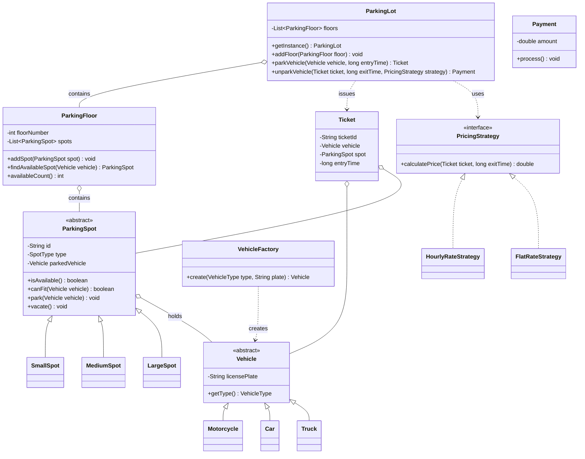

# Chapter 28 — Parking Lot System (Interview-Style Walkthrough)

> **Phase 5: Real-World Case Studies — interview format.** Each case study is written the way an actual LLD/design interview *flows*: the vague prompt, the clarifying questions you should ask, how you scope it, an incremental design, and — most importantly — the **follow-up questions** an interviewer throws at you and how you'd answer them. Code ships in **Java + C++**; the assignments are open design problems.
>
> **How to use this:** read it as a script. Cover the answers and try to produce the clarifying questions and the design yourself before reading on. The muscle you're building is *the conversation*, not memorizing one diagram.

---

## 1. The Prompt

> **Interviewer:** "Design a parking lot."

That's it. It's deliberately vague. **Do not start coding classes.** The first move in every LLD interview is to *scope the problem out loud*.

---

## 2. Clarifying Questions (ask these first)

Drive the ambiguity out before designing. Group your questions and state the assumptions you'll proceed with:

| Question | Typical answer (assumption we'll use) |
|----------|---------------------------------------|
| Multiple floors? | Yes — multi-floor, each with many spots |
| Vehicle types? | Motorcycle, car, truck (extensible) |
| Do vehicle types map to spot sizes? | Yes — bike fits any, car needs medium+, truck needs large |
| How is it priced? | Time-based (hourly), but pricing may change — keep it pluggable |
| Payment? | Assume payment succeeds; model the boundary, don't build a gateway |
| Ticketing? | Ticket on entry, pay on exit |
| One entrance/exit or many? | Start with one; be ready to extend to many |
| Concurrency? | Multiple cars may enter at once — flag it, handle in follow-up |
| Scale? | A single lot (hundreds–thousands of spots), not a nationwide chain |
| Out of scope? | Reservations, license-plate recognition, real payments — call these out |

> **What the interviewer is checking:** do you probe requirements, or do you dive into code on a half-understood problem? Asking good clarifying questions is often *half the score*.

---

## 3. Scope & Requirements (lock it down)

Restate what you'll build so you and the interviewer agree:

**Functional**
- Park a vehicle → find a suitable spot, occupy it, issue a ticket.
- Unpark → free the spot, compute the fee (pluggable), take payment.
- Fit rule: a spot fits a vehicle when `spot.size >= vehicle.size`.
- Query availability per floor / overall; reject entry when full.

**Non-functional**
- **Extensible (OCP):** new vehicle type, spot size, or pricing scheme = minimal change.
- **Single coordinator** as the source of truth for the lot's state.
- **Separation of concerns:** pricing, spot selection, and vehicle creation are independent.

**Explicitly out of scope (say this):** reservations, ANPR/plate reading, real payment processing, multi-lot/regional. *(These become follow-ups.)*

---

## 4. Approach / Plan (say this out loud)

> "Here's how I'll build it: first the **entities** (Vehicle, Spot, Floor, Lot), then the **public API** (`park`/`unpark`), then I'll **walk one park→exit flow**, and finally show where it **extends**. I anticipate a few patterns: a **Singleton** coordinator, a **Factory** for vehicles, and a **Strategy** for pricing so it's swappable."

Naming the patterns you expect *before* drawing them signals intent and keeps the design honest.

---

## 5. Core Entities

| Entity | Responsibility |
|--------|----------------|
| `ParkingLot` | Top-level coordinator (**Singleton**); holds floors, parks/unparks |
| `ParkingFloor` | A floor holding many spots; finds an available spot for a vehicle |
| `ParkingSpot` | An individual spot (abstract) with a size; `SmallSpot`/`MediumSpot`/`LargeSpot` |
| `Vehicle` | Abstract vehicle; `Motorcycle`/`Car`/`Truck` |
| `VehicleFactory` | Creates vehicles from a type (**Factory**) |
| `Ticket` | Records vehicle, spot, and entry time |
| `PricingStrategy` | Computes the fee (**Strategy**); `HourlyRateStrategy`/`FlatRateStrategy` |
| `Payment` | Processes the computed fee |
| `VehicleType` / `SpotType` | Size enums that drive fit logic |

### Public API (the two calls that matter)

```
Ticket  parkVehicle(Vehicle vehicle, long entryTime)
Payment unparkVehicle(Ticket ticket, long exitTime, PricingStrategy pricing)
```

Everything else exists to serve these two entry points.

---

## 6. Class Diagram



---

## 7. Patterns Applied

| Pattern | Where | Why |
|---------|-------|-----|
| **Singleton** (Ch08) | `ParkingLot` | One coordinator; global access to the lot's state |
| **Factory Method** (Ch05) | `VehicleFactory` | Create vehicles from a type without the client knowing concrete classes |
| **Strategy** (Ch22) | `PricingStrategy` | Swap fee calculation (hourly vs flat) at runtime |
| **Polymorphism / Template** | `Vehicle`, `ParkingSpot` hierarchies | Uniform handling of different vehicles/spots; fit logic in the base |
| **(State, optional)** | Spot availability | Could model `Free`/`Occupied` as State; here a simple flag suffices |

---

## 8. Walk the Main Flow

Talk the interviewer through one happy path end to end:

**Parking:**
```
lot.parkVehicle(car, entryTime)
  └─ for each floor: floor.findAvailableSpot(car)
        └─ first spot where spot.canFit(car)   (size >= car's size, and free)
  └─ spot.park(car); create Ticket(id, car, spot, entryTime); store it
```

**Unparking:**
```
lot.unparkVehicle(ticket, exitTime, hourlyStrategy)
  └─ price = strategy.calculatePrice(ticket, exitTime)   (Strategy decides the formula)
  └─ ticket.spot.vacate()
  └─ Payment(price).process()
```

---

## 9. Follow-up Questions (the interviewer pushes)

This is where the interview is really won or lost. Expect the interviewer to poke at edge cases and extensions. Each answer names the change *and* the principle that makes it cheap.

**Q: "How do you choose a spot for a truck vs a bike?"**
Fit is size-based: `spot.canFit(v)` is `spot.isFree() && spot.size >= v.size`, with sizes as ordered enum values. A bike fits any free spot; a truck needs a large one. First-fit across floors keeps it O(spots); see the next question to speed it up.

**Q: "Adding a new vehicle type — say a Bus?"**
One `Vehicle` subclass + a `VehicleType` value + a factory case. Spots and pricing don't change — that's the **Open/Closed Principle** paying off because fit is by *size*, not by type equality.

**Q: "Pricing needs to change — weekend rates, dynamic surge by occupancy."**
Pricing is a **Strategy** injected at exit. New scheme = new `PricingStrategy` class; the lot is untouched. For surge, the strategy needs occupancy — pass it (or a small read-only interface) into `calculatePrice`, *not* the whole lot, to avoid coupling.

**Q: "Two cars race for the last spot. What happens?"**
That's the real concurrency question. `findAvailableSpot` + `park` must be **atomic**, or both cars grab the same spot. Options, in order of sophistication:
- Synchronize the find-and-claim in the lot (simple, coarse — the Singleton becomes the lock holder).
- **Per-spot** locks / an atomic `compareAndSet` on spot status (finer, more throughput).
- Optimistic claim: try to `park`, and if the CAS fails, retry the search.
State the trade-off: coarse locking is simple but a bottleneck at scale; per-spot CAS scales but is more complex.

**Q: "10,000 spots — finding a spot by scanning is slow. Speed it up."**
Keep an index: a per-`SpotType` queue/stack of free spots per floor, so "get a free medium spot" is O(1) `poll()`. On `park` remove it; on `vacate` push it back. Now availability and allocation are constant-time; the scan was only fine for a small lot.

**Q: "How would you find the spot *nearest the entrance*?"**
Replace the free-spot queue with a **min-heap** keyed by distance-to-entrance (or per-entrance heaps). Allocation becomes "pop the closest free spot." This is a spot-selection *policy* — make it a **Strategy** (`SpotAllocationStrategy`) so first-fit vs nearest vs level-balancing are swappable.

**Q: "Add EV charging spots and reservations."**
EV: a `ParkingSpot` subtype (`ElectricSpot`) that only fits EVs but lets EVs fall back to normal spots. Reservations: a `ReservationManager` (SRP — not the lot) that marks a spot reserved so walk-ins skip it; releasing/expiring a reservation frees it. Spot status may graduate from a boolean to a small **State** (`Free`/`Reserved`/`Occupied`). *(This is the easy assignment.)*

**Q: "Multiple entrances/exits; make it feel like real hardware."**
Add `EntrancePanel`/`ExitPanel` as the I/O boundary; they call the one `ParkingLot`. The lot stays the single coordinator (Singleton), so panels don't duplicate state. Displays showing "FULL / SPACES" become **Observers** on the lot. *(This is the medium assignment.)*

**Q: "What if payment fails at exit?"**
Don't free the spot until payment succeeds, or free it but flag an unpaid ticket for recovery. Model `Payment` as returning success/failure and keep the spot's release transactional with it — same lock-then-commit discipline as the concurrency answer.

**Q: "Lost ticket?"**
A `LostTicketStrategy` (a fixed max-day penalty) — reinforces that pricing is fully pluggable and the exit flow doesn't care *which* strategy computed the amount.

---

## 10. Trade-offs & Talking Points

Volunteer these — they show senior judgment:

- **Size-based fit vs type→spot maps:** ordered sizes make `canFit` trivial and let large spots absorb anything, but they can't express odd rules ("this spot only fits electric compacts") — that needs a richer predicate or spot subtype.
- **First-fit vs nearest vs balanced:** first-fit is simple; nearest needs a heap; balanced spreads load across floors. Making allocation a **Strategy** defers the choice.
- **Singleton downside:** one coordinator is a clean source of truth but is a **global** — it hurts unit testing (hidden dependency) and becomes the concurrency bottleneck. In a real service you'd inject it, not use a static instance.
- **Scan vs index:** an in-memory scan is fine for a demo; production wants O(1) free-spot indexes and, at multi-lot scale, a database with row-level locking instead of process memory.
- **Time as `long`:** the demo uses whole-hour integers for determinism; production uses timestamps and handles partial hours/rounding in the pricing strategy.

---

## 11. Summary (what to say at the end)

> "The design centers on one **Singleton** `ParkingLot` coordinating floors and sized spots. Vehicle creation is a **Factory**, pricing is an injected **Strategy**, and fit is **size-based** so new vehicle/spot types are additive. The two APIs are `park` and `unpark`. The interesting production concerns are **concurrent spot allocation** (lock-then-claim or per-spot CAS), **fast allocation** (per-type free-spot indexes / a nearest-spot heap), and turning spot-selection and pricing into swappable strategies. EV/reservations, multiple panels, and displays slot in as new subtypes and observers without touching the core."

---

## 12. What's Next

Study the code in `src/java` and `src/cpp` — a full parking lot with floors, sized spots, a vehicle factory, and pluggable pricing. Then tackle the assignments, which are exactly the follow-ups above: extend it with an **EV-charging spot + reservation** (design), and add **surge pricing + multiple entrances with display observers**.

