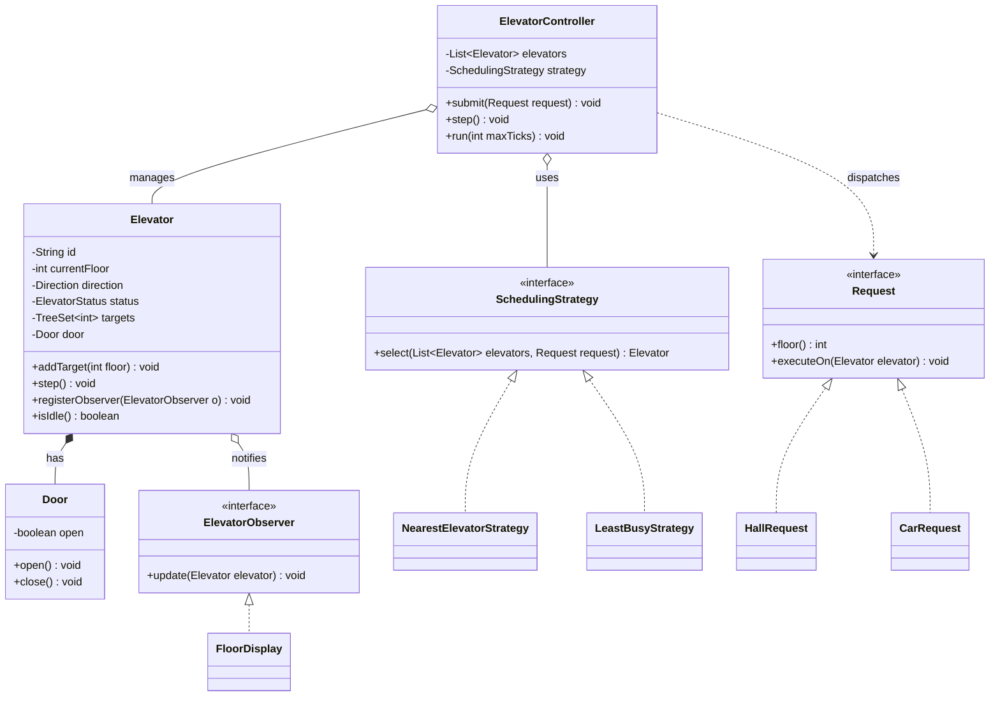

# Chapter 29 — Elevator System

> Phase 5 case study (Java + C++). Interview-style walkthrough.

## 1. The Prompt

> *"Design an elevator system for a building."*

Deliberately vague. One elevator or many? How many floors? Do we simulate movement or just model the domain? Surface these before designing.

---

## 2. Clarifying Questions

| Question | Assumed answer |
|----------|----------------|
| One elevator or a bank of them? | **Multiple** elevators, one controller coordinating them |
| What kinds of buttons exist? | **Hall calls** (up/down outside, on a floor) and **car requests** (a floor button inside a car) |
| Who decides which car serves an outside call? | A **controller** using a pluggable scheduling policy |
| How should a car order its stops? | Efficiently — the **LOOK / elevator algorithm**, not naive FIFO |
| Any displays/indicators? | Yes — each car has a floor/direction/status **display** updated live |
| Capacity, weight, fire-recall modes? | **Out of scope** for v1; note them as extensions |
| Real-time or simulated? | **Tick-based simulation** (`step()` advances time) so it's deterministic |

---

## 3. Scope & Requirements

**Functional**
- Multiple elevators serving many floors.
- **Hall call** `(floor, direction)` from outside → controller assigns an elevator.
- **Car request** `(targetFloor)` from inside → added to that specific elevator.
- Each elevator serves its pending stops via the LOOK algorithm, opening doors on arrival.
- **Displays** show current floor, direction, and status in real time.

**Non-functional**
- **Pluggable scheduling** — selection policy changes without touching elevators.
- **Loose coupling** — displays react without the elevator knowing display types.
- **Extensible** — new request types, states, and strategies are additive (OCP).

**Out of scope (v1):** capacity/weight limits, fire-recall/maintenance modes, persistence.

---

## 4. Approach / Plan

Think out loud before drawing classes:

1. An `Elevator` owns *how to move* — its current floor, direction, sorted target stops, and door.
2. An `ElevatorController` owns *who serves a call* — it holds the cars and delegates selection to a **Strategy**.
3. Model a call as a **Command** object (`Request`) so hall and car calls share one `executeOn(elevator)` abstraction and can be queued/logged.
4. **Displays are Observers** of an elevator so movement updates fan out without coupling.
5. The elevator's status (IDLE/MOVING/DOORS_OPEN) is a **State** — start as an enum, note the State-object refactor as a follow-up.

Anticipated patterns: **Strategy** (scheduling), **Observer** (displays), **Command** (requests), **State** (status).

---

## 5. Core Entities & Public API

| Entity | Responsibility |
|--------|----------------|
| `Elevator` | Moves between floors, serves target stops, controls its door; **subject** for displays |
| `Door` | Open/close state of a car |
| `ElevatorController` | Holds elevators, assigns hall calls via a strategy, drives simulation ticks |
| `Request` | A call as an object (**Command**); `HallRequest` / `CarRequest` |
| `SchedulingStrategy` | Chooses which elevator serves a hall call (**Strategy**); `Nearest` / `LeastBusy` |
| `ElevatorObserver` / `FloorDisplay` | React to elevator movement (**Observer**) |
| `Direction`, `ElevatorStatus` | Direction and the elevator's state (**State**, enum + transitions) |

```java
controller.submit(Request request);   // hall or car request
controller.step();                     // advance one tick
elevator.addTarget(int floor);
elevator.registerObserver(ElevatorObserver o);
```

---

## 6. Class Diagram



---

## 7. Patterns Applied

| Pattern | Where | Why |
|---------|-------|-----|
| **Strategy** (Ch22) | `SchedulingStrategy` | Swap elevator-selection policy (nearest vs least-busy) at runtime |
| **Observer** (Ch23) | `Elevator` → `FloorDisplay` | Displays react to floor/status changes without the elevator knowing them |
| **Command** (Ch18) | `Request` → `HallRequest` / `CarRequest` | A call is an object; `executeOn` applies it to the chosen elevator; requests can be queued/logged |
| **State** (Ch25) | `ElevatorStatus` (IDLE / MOVING / DOORS_OPEN) | Behavior differs per state; enum + transitions here (State-object refactor is the easy assignment) |

---

## 8. Walk the Main Flow

**LOOK movement:**
```
Elevator E (floor 2, direction UP, targets {5, 3})
  tick: not at a target → next UP target ≥ 2 is 3 → move up to 3
  tick: at 3 → doors open, remove 3, doors close → targets {5}
  tick: next UP target is 5 → move up to 4
  tick: move up to 5
  tick: at 5 → doors open, remove 5 → targets {} → IDLE
```

**Selecting an elevator for a hall call:**
```
controller.submit(HallRequest(3, UP))
  └─ strategy.select(elevators, request)     (Nearest: min |floor - 3|)
  └─ request.executeOn(chosenElevator)       (adds 3 to its targets)
```

---

## 9. Follow-up Questions (the interviewer pushes)

**Q: "How does one car decide the order of its stops?"**
The **LOOK algorithm**: keep targets in a sorted set; continue in the current direction serving all stops that way, then reverse. It beats FIFO (no ping-ponging) and is what real elevators do. Naive FIFO would send a car past a floor and back — bad.

**Q: "Two elevators are free — which one takes the call?"**
That's the **SchedulingStrategy**. `Nearest` minimizes `|car.floor - callFloor|`; `LeastBusy` picks the car with the fewest pending targets. Because selection is external, you can A/B new policies (minimize average wait, zone the building) without touching `Elevator` — pure OCP.

**Q: "A hall call and a car button — are they handled differently?"**
Same abstraction: both are `Request` objects with `executeOn(elevator)` (**Command**). A car request goes straight to its own car; a hall request is routed through the strategy first. The controller loop stays uniform, and requests become queueable/loggable.

**Q: "Add express elevators / VIP or emergency calls."**
New `Request` subtype (priority) and/or a scheduling strategy that respects priority — e.g., a priority request preempts the target set or reserves a car. Additive; the movement code is unchanged.

**Q: "The status enum is getting a lot of `if`s — clean it up."**
Formalize **State**: replace `ElevatorStatus` with `Idle`/`Moving`/`DoorsOpen` State classes, each defining `step()` behavior and legal transitions. Removes the conditionals and makes illegal transitions impossible. *(This is the easy assignment.)*

**Q: "How do you handle capacity / overweight?"**
Track passenger count/weight on the car; a car request is refused (or the car skips a pickup) when full. This is a guard in `Elevator` plus a signal back to the controller so it reassigns the waiting call.

**Q: "Thousands of calls per minute across 50 floors — does this scale?"**
Selection is O(cars) per call — fine. The real levers are the scheduling policy (zoning, sectoring, destination-dispatch where riders enter their floor at a lobby kiosk) and batching. The domain model doesn't change; you swap in a smarter Strategy.

**Q: "Fire/maintenance recall?"**
A controller mode that overrides normal dispatch: clear targets, send cars to a designated floor, hold doors. Model it as a high-priority Command plus a controller state — it *suppresses* strategy selection while active.

---

## 10. Trade-offs & Talking Points

- **Enum status vs State objects:** enum is compact and fine for a few states; State objects scale better as behavior-per-state grows and enforce legal transitions — at the cost of more classes.
- **Nearest vs least-busy vs destination-dispatch:** nearest minimizes *this* rider's wait but can starve balance; destination-dispatch optimizes throughput but needs lobby kiosks. Strategy keeps the choice deferrable.
- **Tick simulation vs real-time:** ticks make the design testable and deterministic; a real system is event/interrupt driven, but the same objects apply.
- **Central controller:** one controller is simple and a clean source of truth, but it's a single point of failure — in a real building you'd replicate it.

---

## 11. Summary (what to say at the end)

> "Each `Elevator` owns its movement using the **LOOK** algorithm over a sorted target set. An `ElevatorController` coordinates the bank and delegates car selection to a **Strategy** (nearest / least-busy). Calls are **Command** objects (`HallRequest`/`CarRequest`) sharing one `executeOn` abstraction, and `FloorDisplay`s are **Observers** of the cars. Status is a **State** — an enum now, refactorable to State classes. The extensible seams are scheduling policy, request types, and observers; scaling is a scheduling-strategy problem (zoning, destination-dispatch), not a redesign."

---

## 12. What's Next

Study the code in `src/java` and `src/cpp` — two elevators, a controller with pluggable scheduling, displays observing movement, requests as command objects. Then the assignments, which are the follow-ups above: refactor the status enum into the **State** pattern (easy), and add a smarter scheduling strategy + priority requests (medium).
