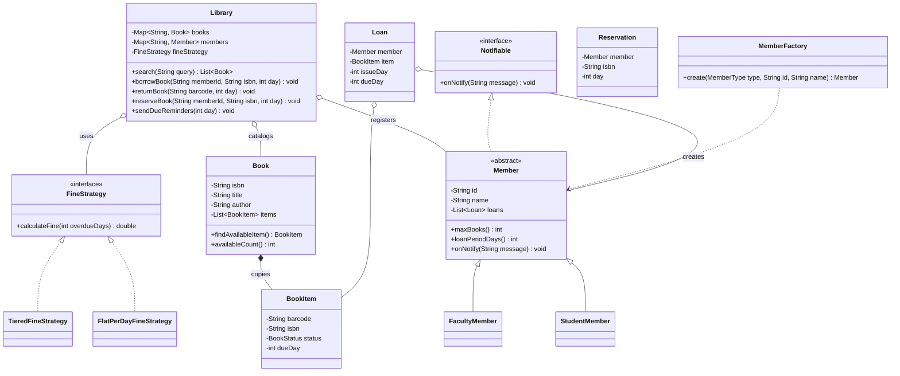

# Chapter 30 — Library Management System

> Phase 5 case study (Java + C++). Interview-style walkthrough.

## 1. The Prompt

> *"Design a library management system."*

Broad. Physical books, digital, or both? Do we handle just borrow/return, or the whole lifecycle — search, reservations, fines, member tiers? Pin the scope first.

---

## 2. Clarifying Questions

| Question | Assumed answer |
|----------|----------------|
| One copy per book or many? | **Many physical copies** per title |
| What operations must members do? | **Search, borrow, return, reserve** |
| Are there late fees? | Yes — **fines** for overdue returns, with a pluggable formula |
| Do all members have the same limits? | No — **member types** (Student 3/14d, Faculty 10/30d) |
| What happens when all copies are out? | A member can **reserve**; they're **notified** when a copy frees up |
| Notifications? | Reservation-available + due-date reminders |
| Digital books, payments, real dates? | **Out of scope** v1 (digital is an assignment); time is integer "days" |

---

## 3. Scope & Requirements

**Functional**
- **Catalog**: many titles, each with multiple physical **copies**; search by title or author.
- **Borrow**: enforce the member's borrow limit and loan period.
- **Return**: free the copy; compute a **fine** if overdue; hand the copy to the next reserver.
- **Reserve**: if all copies are out, a member reserves and is **notified** when one frees up.
- **Member types**: Student vs Faculty with different limits/periods.
- **Notifications**: reservation-available and due-date reminders.

**Non-functional**
- **Extensible member types** (Factory) and **pluggable fine rules** (Strategy).
- **Loose coupling** for notifications (Observer).
- Clear separation: catalog data vs loan/return workflow vs fine policy.

**Out of scope (v1):** digital books, real payments, ranking search, renewals.

---

## 4. Approach / Plan

1. Split **title vs copy**: `Book` is the catalog entry; `BookItem` is a physical copy with its own barcode/status. Search hits titles; borrowing operates on a copy.
2. Member policy (limit, loan period) varies by type → **subclasses** created via a **Factory**.
3. Fines vary → a **Strategy** the library holds, called during return.
4. Members implement a `Notifiable` interface → **Observer** for reservation/due alerts.
5. Reservations are a **FIFO queue** per title; on return the first reserver is notified.

Anticipated patterns: **Factory** (members), **Strategy** (fines), **Observer** (notifications), aggregation (`Book`→`BookItem`).

---

## 5. Core Entities & Public API

| Entity | Responsibility |
|--------|----------------|
| `Book` | Catalog entry (ISBN, title, author) owning its physical `BookItem` copies |
| `BookItem` | A single physical copy (barcode, status, due day) |
| `Member` | Abstract borrower with a limit + loan period; **Observer** for notifications |
| `StudentMember` / `FacultyMember` | Concrete member types with different policies |
| `MemberFactory` | Creates members from a `MemberType` (**Factory**) |
| `Loan` | An active borrowing (member, item, issue/due day) |
| `Reservation` | A member waiting for a title |
| `FineStrategy` | Computes the overdue fine (**Strategy**); flat vs tiered |
| `Notifiable` | Observer interface the library notifies |
| `Library` | Coordinator: search, borrow, return, reserve, notify |

```java
library.search(String query);
library.borrowBook(String memberId, String isbn, int day);
library.returnBook(String barcode, int day);
library.reserveBook(String memberId, String isbn, int day);
library.sendDueReminders(int day);
```

---

## 6. Class Diagram



---

## 7. Patterns Applied

| Pattern | Where | Why |
|---------|-------|-----|
| **Factory Method** (Ch05) | `MemberFactory` | Create member types from a token; adding a member type is one class |
| **Strategy** (Ch22) | `FineStrategy` | Swap the fine formula (flat vs tiered) without touching return logic |
| **Observer** (Ch23) | `Library` → `Member` (`Notifiable`) | Members are notified of available reservations / due dates without the library knowing channels |
| **Composite-ish ownership** | `Book` → `BookItem` | A title aggregates its physical copies; availability is derived |

---

## 8. Walk the Main Flow

**Borrow:**
```
library.borrowBook(memberId, isbn, day)
  ├─ member under maxBooks()?           (policy check)
  ├─ book.findAvailableItem()           (a free copy?)
  │     └─ none → suggest reserveBook(...)
  └─ item.status = LOANED; dueDay = day + member.loanPeriodDays(); create Loan
```

**Return (with fine + reservation handoff):**
```
library.returnBook(barcode, day)
  ├─ overdue = max(0, day - loan.dueDay)
  ├─ fine = fineStrategy.calculateFine(overdue)     (Strategy)
  ├─ item.status = AVAILABLE; close the loan
  └─ if someone reserved this title:
        └─ notify the next reserver (Observer); hold the copy for them
```

---

## 9. Follow-up Questions (the interviewer pushes)

**Q: "Why split `Book` and `BookItem`?"**
Because "the book" (a title in the catalog) and "a book" (a physical copy on a shelf) are different things. Search returns titles; borrowing consumes a specific copy with its own barcode, status, and due date. Conflating them breaks the moment a library owns three copies of one ISBN — this is exactly how real ILS systems model it.

**Q: "Students and faculty have different limits. Where does that live?"**
Overridable methods `maxBooks()` / `loanPeriodDays()` on `Member` subclasses, created via a `MemberFactory`. A new tier (`GuestMember`) is one class + a factory case — **OCP**. The borrow workflow just calls the polymorphic method.

**Q: "The late-fee rule keeps changing (grace days, escalating rates)."**
Fines are a **Strategy** the library holds; return computes `overdueDays` and delegates the amount. Flat-per-day, tiered, or grace-period rules are each a new strategy — the return code never changes.

**Q: "All copies are out. Now what?"**
A `Reservation` joins a **FIFO queue** per title. On return, the first reserver is notified (**Observer**) and the copy is held for them. Fair and simple; you can later add hold-expiry so an unclaimed hold rolls to the next person.

**Q: "How are members notified — email, SMS, push?"**
The library depends only on `Notifiable.onNotify(msg)`. Concrete channels are the observer's concern; you can wrap a member in a **Decorator** to fan out to email+SMS without the library knowing. That's the point of coding to the interface.

**Q: "Add digital books (e-books)."**
A `DigitalCopy` (or `BookItem` subtype) with effectively unlimited availability and no physical hold queue. Search and member policy are unchanged; only the availability rule differs. *(This is the easy assignment, together with renewals.)*

**Q: "Better search — by genre, ranking, full-text."**
Introduce a `SearchStrategy` so title/author/genre/full-text are swappable, or index the catalog. `Library.search` delegates rather than hardcoding the match. *(Part of the medium assignment.)*

**Q: "Two members try to borrow the last copy at once."**
Same concurrency discipline as the parking lot: claiming a `BookItem` must be atomic (lock the item or CAS its status from AVAILABLE→LOANED) so only one loan wins; the other falls through to reserve.

**Q: "This is in-memory — how does it become a real service?"**
Catalog, members, loans, reservations move to a database; the `Library` coordinator becomes a service layer; notifications go async via a queue. The domain objects survive; persistence and transactions get added at the boundary.

---

## 10. Trade-offs & Talking Points

- **Title/copy split:** more classes, but it's the only honest model of a multi-copy library; the alternative (a count field) can't track individual due dates or barcodes.
- **Subclass member types vs a config object:** subclasses are clear and type-safe but proliferate; a data-driven `MembershipPolicy` value scales better if tiers are many or admin-editable.
- **FIFO reservations:** fair and simple, but can't express priority holds (e.g., course reserves) without a priority queue.
- **Integer days:** deterministic for teaching; production needs real timestamps, time zones, and partial-day rounding in the fine strategy.
- **In-memory maps vs DB:** fine for a demo; real libraries need durability, concurrent access, and reporting.

---

## 11. Summary (what to say at the end)

> "I split the catalog into `Book` (title) and `BookItem` (physical copy) so borrowing and search operate on the right granularity. Member tiers are **subclasses via a Factory**, fines are a **Strategy** invoked on return, and members are **Observers** notified for reservations and due dates. Reservations are a per-title FIFO queue with copy handoff on return. The extensible seams are member types, fine policy, notification channels, and search — and the path to production is swapping the in-memory maps for a database with atomic copy-claiming."

---

## 12. What's Next

Study the code in `src/java` and `src/cpp` — a library with a searchable catalog, borrow/return with fines, reservations that notify waiting members, and member types via a factory. Then the assignments, which are the follow-ups above: add a digital-books tier + renewals (easy), and a pluggable search strategy + per-type fine policy (medium).
