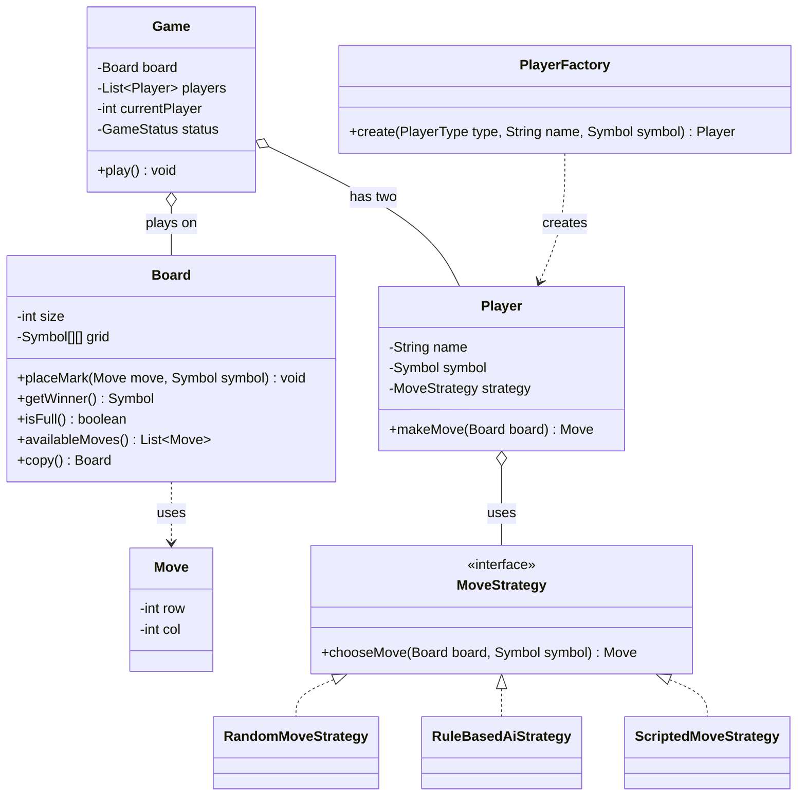

# Chapter 31 — Tic-Tac-Toe

> Phase 5 case study (Java + C++). Interview-style walkthrough.

## 1. The Prompt

> *"Design a Tic-Tac-Toe game."*

Looks trivial, but the interviewer is watching for extensibility. Fixed 3×3 or any N? Human-only or AI players? They want a design that grows, not a hardcoded 3×3 with nested `if`s.

---

## 2. Clarifying Questions

| Question | Assumed answer |
|----------|----------------|
| Board size? | **N×N** (3×3, 4×4, ...) — win-check must generalize |
| Who plays? | Two players; each can be **human or AI** |
| Different AI difficulties? | Yes — **pluggable move policy** (random, rule-based, later minimax) |
| What outcomes? | `IN_PROGRESS`, `X_WINS`, `O_WINS`, `DRAW` after every move |
| Interactive input? | A **scripted** stand-in for the demo; real stdin is an extension |
| Undo, networking, GUI? | **Out of scope** v1 |

---

## 3. Scope & Requirements

**Functional**
- N×N board; a win is a full row, column, or diagonal of one symbol.
- Two players alternate placing X / O.
- Each player decides its move via a **strategy** — human, random, or rule-based AI.
- After each move determine the status: `IN_PROGRESS`, a win, or a draw.
- Print the board and result.

**Non-functional**
- **Pluggable move policies** — a new AI is a new strategy class, no game changes (OCP).
- **Extensible board size** — the win-check works for any N.
- **Player creation decoupled** — a factory builds players with the right strategy.

**Out of scope (v1):** GUI, networking, undo/replay.

---

## 4. Approach / Plan

1. A `Player` is *a name + symbol + a move policy* — "human vs AI" is not two subclasses, it's the same `Player` with different **Strategy** objects.
2. `Board` owns the grid, mark placement, an N-generalized win-check, and a `copy()` for AI look-ahead.
3. Build players via a **Factory** from a `PlayerType` so wiring the right strategy is centralized.
4. Game status is derived after each move (**State** as an enum): winner → win, full → draw, else in progress.

Anticipated patterns: **Strategy** (moves), **Factory** (players), **State** (status).

---

## 5. Core Entities & Public API

| Entity | Responsibility |
|--------|----------------|
| `Board` | N×N grid; place marks, detect a winner, list available moves, copy for look-ahead |
| `Move` | A `(row, col)` coordinate |
| `Symbol` | `X` / `O` / `EMPTY` |
| `Player` | A name + symbol; delegates move choice to a `MoveStrategy` |
| `MoveStrategy` | How a player picks a move (**Strategy**); random / rule-based / scripted |
| `PlayerFactory` | Builds a player with the right strategy from a `PlayerType` (**Factory**) |
| `GameStatus` | `IN_PROGRESS` / `X_WINS` / `O_WINS` / `DRAW` (**State**, an enum) |
| `Game` | Orchestrates turns, updates status, prints the board |

```java
game.play();
board.placeMark(Move move, Symbol symbol);
board.getWinner();        // Symbol
board.availableMoves();   // List<Move>
player.makeMove(Board board);   // delegates to its MoveStrategy
```

---

## 6. Class Diagram



---

## 7. Patterns Applied

| Pattern | Where | Why |
|---------|-------|-----|
| **Strategy** (Ch22) | `MoveStrategy` | Swap how a player chooses a move — human, random, smart — without touching `Game` or `Player` |
| **Factory Method** (Ch05) | `PlayerFactory` | Build a player wired with the right strategy from a `PlayerType` token |
| **State** (Ch25) | `GameStatus` | The game's status governs whether play continues; an enum + transitions |

---

## 8. Walk the Main Flow

```
game.play()
  loop while status == IN_PROGRESS:
    player = players[current]
    move   = player.makeMove(board)      // delegates to its MoveStrategy
    board.placeMark(move, player.symbol)
    winner = board.getWinner()
    status = winner != EMPTY ? (winner wins)
             : board.isFull() ? DRAW
             : IN_PROGRESS
    current = 1 - current                 // alternate
  print result
```

The rule-based AI's `chooseMove` (each candidate simulated on a `copy()`):
```
1. any move that WINS now?               → take it
2. any move the opponent would win with? → block it
3. center free?                          → take center
4. a corner free?                        → take a corner
5. otherwise                             → first available
```

---

## 9. Follow-up Questions (the interviewer pushes)

**Q: "How do you support human vs AI without duplicating `Player`?"**
Don't subclass `Player`. A player *is* a symbol plus a `MoveStrategy`. Human, random, and rule-based are three strategy classes; the `Player` and `Game` code is identical for all. That's **Strategy** doing its exact job — vary the algorithm, not the class.

**Q: "Make the AI unbeatable."**
Add a `MinimaxMoveStrategy` — full game-tree search with minimax (alpha-beta pruning for speed). It plugs in via the same `MoveStrategy` interface; `Game` doesn't change. It relies on `Board.copy()` to simulate moves without mutating the real board. *(Part of the easy assignment.)*

**Q: "Does the win-check work on a 4×4 or 10×10 board?"**
Yes — rows, columns, and both diagonals are checked for a full line of one symbol, parameterized by N. Nothing is hardcoded to 3. For **K-in-a-row on an M×N board**, extract the win test into a `WinningStrategy` so the line length is configurable. *(This is the medium assignment.)*

**Q: "How does the AI look ahead without corrupting the board?"**
`Board.copy()` returns a deep copy; the AI simulates candidate moves on the copy, checks the outcome, and discards it. The real board is only mutated by `placeMark` on the actual turn — no side effects leak from evaluation.

**Q: "Where does 'whose turn / is it over' live?"**
Status is **derived in one place** after each move (`getWinner` → win; else `isFull` → draw; else in progress) and turn alternation is a single `current = 1 - current`. No status flags scattered across the code — one owner, no drift.

**Q: "Add real keyboard input."**
A `HumanMoveStrategy` that reads and validates stdin coordinates; the `PlayerFactory` gains a `HUMAN` case. The scripted strategy in the demo already stands in for this, so it's a drop-in. *(Part of the easy assignment.)*

**Q: "Three players, or Ultimate Tic-Tac-Toe?"**
The turn loop already indexes a player list, so 3-player is mostly extending the symbol set and win-check. Ultimate TTT nests boards — a `Board` of `Board`s — which the composition already invites. The strategies are reused unchanged.

**Q: "Undo / replay?"**
Record each move as a **Command** (Ch18) so you can pop the last move off a history stack. The `Move` objects already capture everything needed to reverse a placement.

---

## 10. Trade-offs & Talking Points

- **Strategy for players vs subclassing:** Strategy keeps `Player` a single class and makes AIs composable; subclassing would explode the class count and couple "who plays" with "how they play".
- **Rule-based vs minimax AI:** rule-based is O(1) and readable but not perfect; minimax is unbeatable but exponential (needs pruning). The interface lets you ship the cheap one and upgrade later.
- **`copy()` for look-ahead:** clean and side-effect-free, but allocates per candidate — fine for tiny boards; a make/undo-move scheme is cheaper for deep search.
- **Enum status vs State objects:** an enum is perfect here (few states, no per-state behavior); reach for State classes only if each status gained rich behavior.

---

## 11. Summary (what to say at the end)

> "A `Player` is a symbol plus a **MoveStrategy**, so human/random/AI players share one class and new AIs are additive. `Board` owns an N-generalized win-check and a `copy()` for side-effect-free look-ahead. Players are built by a **Factory**, and `GameStatus` is derived in one place after each move (**State** enum). The design scales to bigger boards, K-in-a-row (via a win-check strategy), stronger AI (minimax behind the same interface), and undo (moves as commands) — all without touching the game loop."

---

## 12. What's Next

Study the code in `src/java` and `src/cpp` — an N×N board, players driven by pluggable strategies, a rule-based AI, and status tracking. The demo runs a scripted match (human stand-in) and a Smart-AI-vs-Random game. Then the assignments, which are the follow-ups above: add interactive human input + an unbeatable minimax AI (easy), and generalize to K-in-a-row on an M×N board with a win-check strategy (medium).
