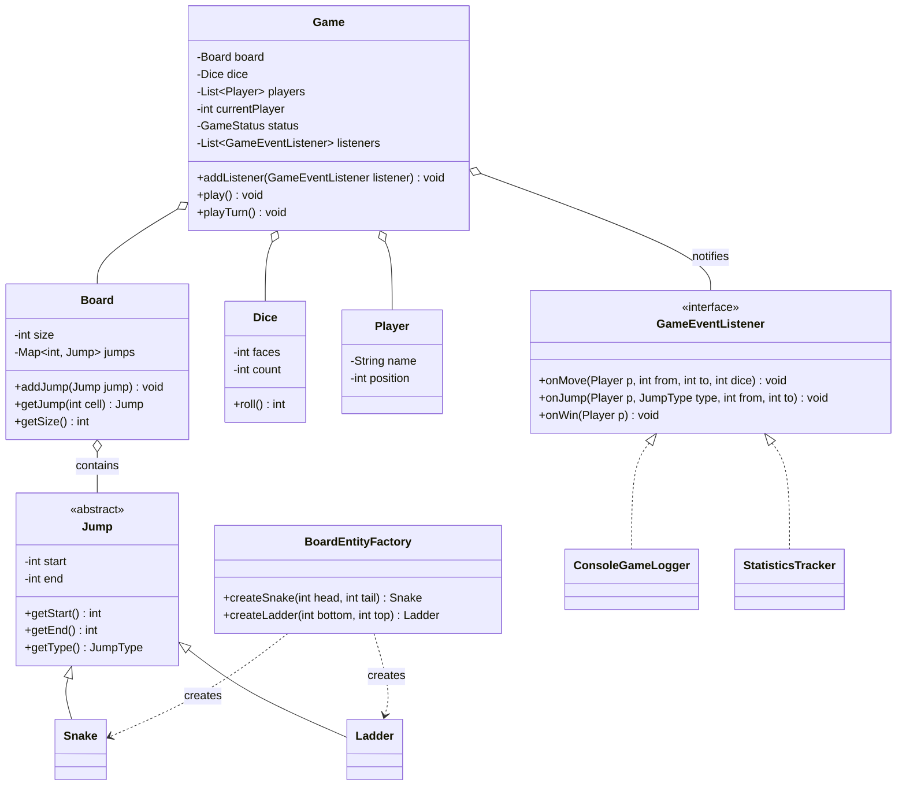

# Chapter 32 — Snake & Ladder Game

> Phase 5 case study (Java + C++). Interview-style walkthrough.

## 1. The Prompt

> *"Design the game Snake and Ladder."*

Simple rules, but the interviewer wants a **configurable, data-driven** design — not a hardcoded 100-cell board with a fixed snake list. Clarify board configurability, player count, and win rule.

---

## 2. Clarifying Questions

| Question | Assumed answer |
|----------|----------------|
| Fixed board or configurable? | **Configurable** size + arbitrary snakes/ladders (data-driven) |
| How many players? | **2+**, taking turns |
| Dice? | Configurable faces/count; **seeded** for a deterministic demo |
| Win condition? | Land **exactly** on the last cell; overshoot = stay put |
| Any reporting/logging? | Yes — broadcast events to **observers** (logger, stats) |
| Networking, GUI, persistence? | **Out of scope** v1 |

---

## 3. Scope & Requirements

**Functional**
- Configurable **board size** and arbitrary **snakes** and **ladders**.
- 2+ players take turns rolling a die (configurable faces/count).
- Ladder foot → jump to top; snake head → slide to tail.
- Winning requires an **exact** landing on the last cell; overshoot means stay.
- Emit events to observers as the game progresses.

**Non-functional**
- **Configurable / data-driven** board (no hardcoded snakes).
- **Factory-validated** board elements (a snake must go down, a ladder up).
- **Loose coupling** for reporting — observers subscribe; the game doesn't know their types.

**Out of scope (v1):** networking, GUI, save/resume.

---

## 4. Approach / Plan

1. Notice snakes and ladders are the **same abstraction** — a `Jump` from a `start` cell to an `end` cell. Store the board as a `cell → Jump` map.
2. Build jumps through a **Factory** that validates invariants (snake goes down, ladder goes up, both in bounds) so bad boards fail at construction.
3. Emit **typed events** instead of print statements; loggers and stats are **Observers**.
4. Model `GameStatus` (RUNNING/FINISHED) as a **State** enum; the turn loop reads it.

Anticipated patterns: **Factory** (validated jumps), **Observer** (event listeners), **State** (status).

---

## 5. Core Entities & Public API

| Entity | Responsibility |
|--------|----------------|
| `Board` | Holds size and a map of jumps (cell → destination) |
| `Jump` | A relocation from `start` to `end`; `Snake` (down) / `Ladder` (up) |
| `BoardEntityFactory` | Creates and **validates** snakes/ladders (**Factory**) |
| `Dice` | Rolls (configurable faces/count; seeded for determinism) |
| `Player` | Name + current position |
| `Game` | Runs turns, applies jumps, detects a win, updates status |
| `GameStatus` | `RUNNING` / `FINISHED` (**State**, an enum) |
| `GameEventListener` | Observer of game events; `ConsoleGameLogger` / `StatisticsTracker` |

```java
game.addListener(GameEventListener listener);
game.play();
game.playTurn();
board.getJump(int cell);   // Snake, Ladder, or null
dice.roll();
```

---

## 6. Class Diagram



---

## 7. Patterns Applied

| Pattern | Where | Why |
|---------|-------|-----|
| **Factory Method** (Ch05) | `BoardEntityFactory` | Create + **validate** snakes/ladders (down vs up, within bounds) in one place |
| **Observer** (Ch23) | `Game` → `GameEventListener` | Loggers and stats react to events without the game knowing them |
| **State** (Ch25) | `GameStatus` | Governs whether the turn loop continues; an enum |

---

## 8. Walk the Main Flow

```
game.playTurn()
  ├─ dice = dice.roll()
  ├─ target = player.position + dice
  ├─ if target > board.size     → overshoot: player stays (skip)
  └─ else:
        jump = board.getJump(target)          // snake, ladder, or none
        dest = jump != null ? jump.end : target
        player.position = dest
        emit onMove(player, from, target, dice)
        if jump != null: emit onJump(player, jump.type, target, dest)
        if dest == board.size: emit onWin(player); status = FINISHED
  └─ advance to next player
```

---

## 9. Follow-up Questions (the interviewer pushes)

**Q: "Why is there no `Snake` logic separate from `Ladder` logic?"**
Because both are the *same operation* — a `Jump` relocating a player from `start` to `end`. A snake has `end < start`, a ladder `end > start`; the board just stores a `cell → Jump` map and applies it uniformly. Two nearly-identical classes with duplicated move code would be a smell.

**Q: "What stops someone configuring a snake that goes *up*?"**
The **Factory**. `createSnake` rejects `tail >= head`, `createLadder` rejects `top <= bottom`, and both bounds-check. Invalid boards fail at construction, not with a weird mid-game bug. Validation lives in exactly one place.

**Q: "Add special cells — a teleporter, a 'skip a turn', a mine."**
A teleporter is just another `Jump` (any start→end). Skip-a-turn / mine need per-cell *behavior*, so introduce a `Cell` abstraction (or `Jump` subtypes) with an `onLand(player, game)` hook, built via the factory. The turn loop calls the hook; no special-casing. *(This is the easy assignment.)*

**Q: "The rules keep changing — roll-a-6-to-start, extra turn on max roll, non-exact win."**
Extract rules into a `RuleSet`/**Strategy**: `shouldStart`, `extraTurn(roll)`, `isWin(pos, size)`. The `Game` asks the rule set instead of hardcoding. Variants become new strategy objects. *(This is the medium assignment.)*

**Q: "How do you add a leaderboard / replay / network view?"**
Another `GameEventListener`. The game already emits `onMove` / `onJump` / `onWin`; a replay recorder serializes them, a network broadcaster forwards them, a GUI redraws — all with zero game changes. That's the payoff of events over `print`.

**Q: "Two dice, or weighted dice?"**
`Dice` already takes faces/count; two dice is `count=2`. A weighted die is a `Dice` subclass overriding `roll()`. Determinism comes from a seeded RNG so tests are reproducible.

**Q: "Is the game fair / can it loop forever?"**
Snake-and-ladder is a random walk; it terminates with probability 1. The only stall risk is the exact-win rule bouncing a player near the end — expected but finite. If an interviewer worries about it, mention the alternative "overshoot bounces back" rule as a configurable `RuleSet`.

**Q: "Make status handling more robust as states grow."**
Right now RUNNING/FINISHED as an enum is enough. If you added PAUSED, per-turn phases, etc., promote `GameStatus` to **State** objects with a `next()` transition — same bridge as the elevator.

---

## 10. Trade-offs & Talking Points

- **Unified `Jump` vs separate Snake/Ladder classes:** unification removes duplicate move logic; the tiny cost is a `type` label for reporting. Worth it.
- **Factory validation vs trusting input:** validating up front costs a little code but turns whole classes of runtime bugs into construction-time errors.
- **Events vs direct printing:** events decouple gameplay from presentation and enable stats/replay/UI; the cost is the listener plumbing.
- **Enum status vs State objects:** enum is right for two states; don't over-engineer until behavior-per-state appears.
- **Data-driven board:** flexible and testable, but needs validation (the factory) so the flexibility can't produce illegal boards.

---

## 11. Summary (what to say at the end)

> "The key insight is that snakes and ladders are one abstraction — a `Jump` in a `cell → Jump` map — so the board is data-driven and the move logic is uniform. A **Factory** validates every jump so illegal boards can't exist. The game emits typed events consumed by **Observers** (logger, stats), making replay/leaderboard/UI additive. Status is a **State** enum. Rule variants and special cells slot in via a `RuleSet` strategy and `Jump`/`Cell` subtypes without touching the turn loop."

---

## 12. What's Next

Study the code in `src/java` and `src/cpp` — a configurable board with factory-validated snakes and ladders, seeded dice, multiple players, and observers logging events and tracking stats. Then the assignments, which are the follow-ups above: add special cells + an extra-turn-on-max-roll rule (easy), and make the rules pluggable via a Strategy while recording a full replay (medium).
