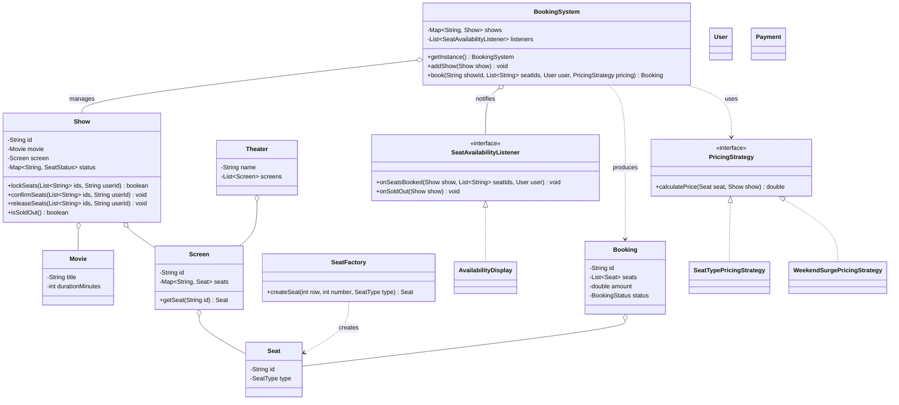

# Chapter 33 — BookMyShow (Movie Ticket Booking)

> Phase 5 case study (Java + C++). Interview-style walkthrough.

## 1. The Prompt

> *"Design a movie ticket booking system like BookMyShow."*

A classic. The interviewer is really probing two things: **how you model shows/seats** and **how you prevent double-booking** under concurrency. Nail the scope, then lead with the concurrency story.

---

## 2. Clarifying Questions

| Question | Assumed answer |
|----------|----------------|
| What's the booking unit? | A **show** = movie + screen + time; users book seats *for a show* |
| Are all seats the same? | No — **seat types** (regular/premium/recliner) with tiered pricing |
| Does price vary? | Yes — **pluggable pricing** (base tiers, weekend surge, discounts) |
| Multiple users, same seat? | Must **prevent double-booking** — the core concurrency requirement |
| Payment? | Modeled as a step that can succeed/fail (no real gateway) |
| Search/recommendations, refunds, seat maps UI? | **Out of scope** v1 |

---

## 3. Scope & Requirements

**Functional**
- Theaters have **screens**; each screen has a seat layout.
- A **show** = movie + screen + time; each show tracks **per-show** seat availability.
- Book one or more seats; price by **seat type** and **pricing rule**.
- **No double-booking**: concurrent attempts on the same seat must not both succeed.
- Notify observers when seats are booked or a show sells out.

**Non-functional**
- **One booking coordinator** (Singleton) as the source of truth.
- **Pluggable pricing** (Strategy) — base tiers, weekend surge, discounts.
- **Seat creation via a factory**; **loose-coupled notifications** (Observer).
- **Concurrency-safe** seat locking (guarded critical section).

**Out of scope (v1):** search/discovery, refunds/cancellation flows, real payment gateway.

---

## 4. Approach / Plan

1. Separate **layout from state**: a `Screen` owns the physical seat layout; a `Show` owns per-show `seatId → SeatStatus`, because the same seat is independently bookable across shows.
2. Booking is **lock → pay → confirm**: atomically lock seats, charge, then confirm (or release on failure). This is *the* answer to double-booking.
3. Make the **lock step the critical section** (synchronized / mutex) so exactly one racer wins a seat.
4. Pricing is a **Strategy** passed per booking; surge **wraps** a base strategy (composition).
5. Displays are **Observers** of booking/sell-out events.

Anticipated patterns: **Singleton** (coordinator), **Strategy** (pricing), **Factory** (seats), **Observer** (displays), composition for surge.

---

## 5. Core Entities & Public API

| Entity | Responsibility |
|--------|----------------|
| `Movie` | Title + duration |
| `Theater` / `Screen` | A venue and its screens; a screen owns a seat layout |
| `Seat` / `SeatType` | A seat with a type; `SeatFactory` builds them (**Factory**) |
| `Show` | Movie + screen + time; owns **per-show** seat status + locking |
| `SeatStatus` | `AVAILABLE` / `LOCKED` / `BOOKED` |
| `PricingStrategy` | Price a seat for a show (**Strategy**); tiered / weekend surge |
| `User`, `Booking`, `Payment` | Who books, the booking record, the charge |
| `SeatAvailabilityListener` | Observer of booking events; `AvailabilityDisplay` |
| `BookingSystem` | Coordinator (**Singleton**): lock → pay → confirm, and notify |

```java
BookingSystem.getInstance();
system.addShow(Show show);
system.book(String showId, List<String> seatIds, User user, PricingStrategy pricing);
show.lockSeats(List<String> ids, String userId);   // atomic, returns boolean
show.confirmSeats(...); show.releaseSeats(...);
```

---

## 6. Class Diagram



---

## 7. Patterns Applied

| Pattern | Where | Why |
|---------|-------|-----|
| **Singleton** (Ch08) | `BookingSystem` | One coordinator owning shows and the booking workflow |
| **Strategy** (Ch22) | `PricingStrategy` | Swap pricing (tiered, weekend surge, discounts) without touching booking |
| **Factory Method** (Ch05) | `SeatFactory` | Build seats (and layouts) without the caller wiring ids/types |
| **Observer** (Ch23) | `BookingSystem` → `SeatAvailabilityListener` | Displays react to bookings / sell-outs without the system knowing them |
| **Composition (Decorator-ish)** | `WeekendSurgePricingStrategy` wraps a base `PricingStrategy` | Surge is a multiplier over any base pricing |

---

## 8. Walk the Main Flow (double-booking-safe)

```
BookingSystem.book(showId, seatIds, user, pricing)
  ├─ show.lockSeats(seatIds, user)         // CRITICAL SECTION (atomic)
  │     └─ any seat not AVAILABLE? → return false → booking FAILED
  ├─ amount = Σ pricing.calculatePrice(seat, show)     // Strategy
  ├─ payment.process(amount)
  │     ├─ success → show.confirmSeats(...) ; booking CONFIRMED
  │     │            notify onSeatsBooked ; if sold out → onSoldOut
  │     └─ failure → show.releaseSeats(...) ; booking FAILED
  └─ return booking
```

Two users, same seat:
```
Alice.book(seat 5)  → lockSeats succeeds → CONFIRMED
Bob.book(seat 5)    → lockSeats fails (already booked) → FAILED (clean, no charge)
```

---

## 9. Follow-up Questions (the interviewer pushes)

**Q: "Two users click the same seat at the same instant — walk me through it."**
`lockSeats` is the **critical section**: guarded (synchronized in Java / mutex in C++), it checks every requested seat is AVAILABLE and flips them to LOCKED atomically. One racer's lock succeeds; the other finds a non-AVAILABLE seat and is rejected — cleanly, with no charge. This is the heart of the design.

**Q: "Why lock → pay → confirm instead of just booking?"**
Payment takes time and can fail. If you marked seats BOOKED first, a failed payment leaves them wrongly sold; if you charged first, you might charge for a seat someone else grabbed. Lock reserves atomically, payment happens against the reservation, then confirm commits or release rolls back. It's the two-phase discipline every booking system uses.

**Q: "Locked-but-never-paid seats — do they stay locked forever?"**
No — add **lock expiry**: a timer releases seats LOCKED longer than N minutes back to AVAILABLE (calls `releaseSeats`). This is why the LOCKED state is distinct from BOOKED. *(Part of the easy assignment.)*

**Q: "Weekend surge, member discounts, dynamic demand pricing."**
Pricing is a **Strategy** chosen per booking. Surge doesn't duplicate tier prices — `WeekendSurgePricingStrategy` *wraps* a base strategy and multiplies (composition/Decorator). Demand-based pricing is another wrapper reading current occupancy from the show. *(Dynamic pricing is the medium assignment.)*

**Q: "Why is seat status on the `Show`, not the `Seat`?"**
Because the same physical seat A5 is independently bookable for the 6pm and 9pm shows. The `Screen` owns the immutable *layout* (ids + types); each `Show` owns its own `seatId → SeatStatus` *state*. Putting status on the seat would conflate different shows.

**Q: "Add a waitlist for sold-out shows."**
An `Observer` on `onSoldOut` enqueues interested users; on a cancellation/expiry that frees a seat, notify the head of the waitlist. The event plumbing already exists — it's a new listener. *(Part of the easy assignment.)*

**Q: "This is a single process with a lock. How does it work across many servers?"**
The in-process mutex becomes a **distributed lock**: seat state in a database with row-level locking or optimistic **versioning** (compare-and-set on a version column), or a short-TTL lock in Redis. The lock→pay→confirm shape is identical; only the lock *mechanism* changes. *(Real concurrency is the medium assignment.)*

**Q: "New seat type — VIP, wheelchair-accessible."**
Add to `SeatType` + a `SeatFactory` case; pricing is data, so a tier price is config. Nothing in the booking flow changes.

**Q: "How do you notify displays / analytics without coupling?"**
`SeatAvailabilityListener` observers on `onSeatsBooked` / `onSoldOut`. A "seats filling fast" banner, SMS confirmation, or analytics sink are each a new observer — the coordinator is untouched.

---

## 10. Trade-offs & Talking Points

- **Coarse lock vs per-seat lock:** synchronizing the whole `lockSeats` is simple and correct but serializes bookings for a show; per-seat locks / optimistic versioning scale better at the cost of complexity. Start coarse, note the upgrade.
- **Pessimistic (lock) vs optimistic (version) concurrency:** locking is simple and avoids wasted work but can contend; optimistic scales for low-conflict but retries on conflict. Booking is high-conflict for hot shows → locking is defensible.
- **Singleton coordinator:** clean source of truth, but a global and a scaling chokepoint — in production it's a stateless service over a shared datastore, not an in-memory singleton.
- **LOCKED as a distinct state:** enables expiry and clean rollback; the cost is a timer/reaper to release stale locks.
- **Surge as a wrapper vs a flag:** wrapping composes cleanly (surge over discount over base); a boolean flag would tangle the pricing logic.

---

## 11. Summary (what to say at the end)

> "The unit is a **Show** owning per-show seat state; a **Screen** owns the layout. Booking is **lock → pay → confirm**, with the atomic `lockSeats` critical section preventing double-booking — one racer wins, the other is rejected without a charge. LOCKED is a distinct state so unpaid holds expire. Pricing is a **Strategy** with surge as a wrapper, seats come from a **Factory**, and a **Singleton** `BookingSystem` coordinates while **Observers** drive displays and waitlists. Scaling to many servers keeps the same flow but swaps the in-process lock for DB row-locks or optimistic versioning."

---

## 12. What's Next

Study the code in `src/java` and `src/cpp` — a booking system with factory-built seat layouts, per-show seat locking, tiered + weekend pricing, and availability observers, including a rejected double-booking. Then the assignments, which are the follow-ups above: add lock expiry + a waitlist (easy), and a dynamic demand-based pricing strategy with real concurrency (medium).
