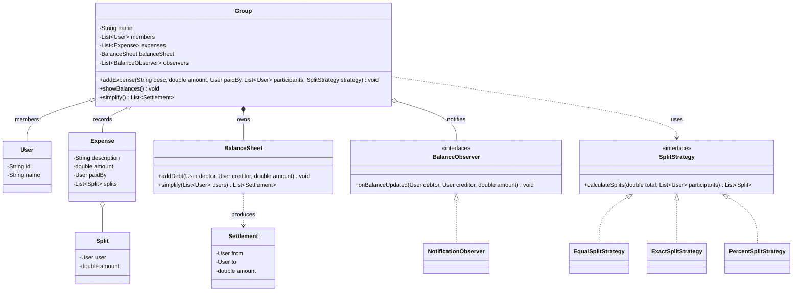

# Chapter 34 — Splitwise (Expense Sharing)

> Phase 5 case study (Java + C++). Interview-style walkthrough.

## 1. The Prompt

> *"Design an expense-sharing app like Splitwise."*

The interviewer wants the **balance model** (who owes whom), **flexible splitting**, and ideally **debt simplification**. Clarify the split types and whether simplification is in scope — it's the standout follow-up.

---

## 2. Clarifying Questions

| Question | Assumed answer |
|----------|----------------|
| Do users share in groups or 1:1? | **Groups** (a group tracks expenses + balances) |
| How is an expense split? | **Equal / exact / percentage** (pluggable rules) |
| Who pays? | One member fronts the money; others owe their share |
| What must the app show? | **Pairwise balances** (who owes whom), netted |
| Any "settle up" optimization? | Yes — **simplify** debts to the fewest transactions |
| Notifications? | Members **notified** on balance changes |
| Multi-currency, real payments, settle-up recording? | **Out of scope** v1 (currency/settle-up are extensions) |

---

## 3. Scope & Requirements

**Functional**
- Users belong to **groups**; a group tracks its expenses and balances.
- Add an expense: `description`, `amount`, `paidBy`, `participants`, and a **split rule**.
- **Split rules**: equal, exact (specific amounts), percentage.
- Maintain **pairwise balances** (who owes whom), netting opposing debts.
- **Notify** members when balances change.
- **Simplify** debts — reduce the balance graph to the minimum number of settlements.

**Non-functional**
- **Pluggable split rules** (Strategy).
- **Loose-coupled notifications** (Observer).
- Members don't settle directly — the **group coordinates** everything (Mediator).

**Out of scope (v1):** multi-currency, real payment gateway, receipts/itemization.

---

## 4. Approach / Plan

1. Splitting varies (equal/exact/percent) → a **Strategy** chosen per expense that turns a total into per-user `Split`s.
2. Route everything through the **group as a Mediator** so members never settle pairwise — a many-to-many mesh becomes a hub.
3. Store directed pairwise debts in a `BalanceSheet` that **nets** opposing debts.
4. **Simplify** is a separate operation: compute net balances and greedily match biggest creditor with biggest debtor (min-cash-flow).
5. Balance changes fan out via **Observers**.

Anticipated patterns: **Strategy** (splits), **Observer** (notifications), **Mediator** (group).

---

## 5. Core Entities & Public API

| Entity | Responsibility |
|--------|----------------|
| `User` | A person (id + name) |
| `Split` | One participant's share `(user, amount)` |
| `SplitStrategy` | Turns a total into per-user splits (**Strategy**); equal / exact / percent |
| `Expense` | An amount paid by one user, split among participants |
| `BalanceSheet` | Pairwise "who owes whom", with netting and debt **simplification** |
| `Settlement` | A single "A pays B $x" produced by simplification |
| `BalanceObserver` | Observer of balance changes; `NotificationObserver` |
| `Group` | **Mediator**: coordinates members, applies expenses, updates balances, notifies |

```java
group.addExpense(String desc, double amount, User paidBy,
                 List<User> participants, SplitStrategy strategy);
group.showBalances();
group.simplify();                              // List<Settlement>
strategy.calculateSplits(double total, List<User> participants);
```

---

## 6. Class Diagram



---

## 7. Patterns Applied

| Pattern | Where | Why |
|---------|-------|-----|
| **Strategy** (Ch22) | `SplitStrategy` | Swap how a total is split (equal / exact / percent) without changing `Group` |
| **Observer** (Ch23) | `Group` → `BalanceObserver` | Members/services react to balance updates without the group knowing them |
| **Mediator** (Ch20) | `Group` | Members don't settle pairwise; the group coordinates expenses and balances centrally |

---

## 8. Walk the Main Flow

**Adding an expense:**
```
group.addExpense(desc, amount, paidBy, participants, strategy)
  ├─ splits = strategy.calculateSplits(amount, participants)   // Strategy
  ├─ record Expense(paidBy, splits)
  └─ for each split where split.user != paidBy:
        balanceSheet.addDebt(split.user, paidBy, split.amount)  // net against opposites
        notify onBalanceUpdated(split.user, paidBy, split.amount)  // Observer
```

**Simplifying debts:**
```
balanceSheet.simplify(users)
  ├─ net[u] = (total owed to u) − (total u owes)
  ├─ creditors = users with net > 0 ; debtors = net < 0
  └─ greedily match largest creditor with largest debtor until all net ≈ 0
        → minimal list of Settlement(from debtor, to creditor, amount)
```

---

## 9. Follow-up Questions (the interviewer pushes)

**Q: "Support equal, exact, and percentage splits without a mess of `if`s."**
Each is a `SplitStrategy` passed into `addExpense`. Equal divides evenly, exact carries per-user amounts, percent carries percentages — each validates its own total (exact sums to the amount, percentages sum to 100). A new rule (by shares, itemized) is one class; `Group` never changes. That's **Strategy**.

**Q: "Why does a member never update another member's balance directly?"**
Because that's an N×N mesh of coupling. The `Group` is a **Mediator**: every expense routes through it, it computes splits, updates the shared `BalanceSheet`, and notifies. Members only know the group. Adding a member or a rule doesn't touch the others.

**Q: "A owes B, then B owes A — do you store both?"**
No — the `BalanceSheet` **nets** opposing debts, so the pair collapses to a single net direction. This keeps the graph minimal as expenses pile up and makes "show balances" trivial.

**Q: "Minimize the number of settlements — how?"**
`simplify()` computes each user's **net** (owed − owes), splits into creditors and debtors, and **greedily matches the largest creditor with the largest debtor**, emitting a `Settlement` each time until everyone nets to ~0. That's the classic min-cash-flow reduction — it yields at most N−1 transactions instead of the full pairwise set.

**Q: "Is greedy simplification optimal?"**
Minimizing transactions exactly is NP-hard (it's a variant of subset-partition), so greedy is the standard practical heuristic — near-minimal and O(N log N) per match. If pressed, I'd mention you can make simplification itself a **Strategy** (fewest-transactions vs preserve-direct-debts) since some users prefer seeing original debts.

**Q: "Record a settle-up (someone actually paid)."**
A settle-up is just a reverse debt: `addDebt(payer→payee)` reduces the existing balance, reusing the same netting. Model it as an `Expense`-like event so it shows in history. *(Part of the easy assignment.)*

**Q: "Multi-currency expenses."**
Attach a currency to each `Expense`; the `BalanceSheet` normalizes to a base currency via a conversion rate at record time (store the rate so history is stable). Splits happen in the expense currency, balances in the base. *(Part of the medium assignment.)*

**Q: "Non-group / friend-level balances?"**
The same `BalanceSheet` works without a group — the group only *scopes* membership. A friend balance is a two-person sheet. The model already supports it.

**Q: "Floating-point rounding on splits — $10 / 3?"**
Equal split of an indivisible amount must assign the remainder cent deterministically (e.g., give the extra cent to the first participant) so splits sum exactly to the total. Real systems store money as integer minor units (cents), not doubles, to avoid drift.

**Q: "How does this scale to millions of users?"**
Balances become rows in a datastore keyed by (group, debtor, creditor); expense writes are transactional; notifications go async. The domain model is unchanged — it's the persistence and the simplification job (run on demand or batched) that move to a service.

---

## 10. Trade-offs & Talking Points

- **Greedy vs optimal simplification:** exact minimization is NP-hard; greedy is fast and near-optimal. Making it a Strategy lets users choose "fewest transactions" vs "keep my direct debts".
- **Netting vs full ledger:** netting keeps balances minimal and readable but loses the individual expense trail — so keep the `Expense` history separately for auditing.
- **Doubles vs integer cents:** doubles are convenient but drift; production stores minor units to guarantee splits reconcile.
- **Mediator group:** centralizing in the group removes member-to-member coupling but makes the group a hotspot — fine in-memory, a service boundary at scale.
- **Strategy config on the object:** exact/percent strategies carry their own data — clean, but the caller must supply valid amounts/percentages; validate inside the strategy.

---

## 11. Summary (what to say at the end)

> "Users share expenses in a **Group** that acts as a **Mediator** — members never settle pairwise. Splitting is a **Strategy** (equal/exact/percent, extensible), balances live in a `BalanceSheet` that **nets** opposing debts, and `simplify()` runs a greedy **min-cash-flow** reduction to the fewest settlements. Balance changes fan out via **Observers**. The natural extensions — settle-up, multi-currency, alternative simplification goals, friend-level balances — all reuse the same balance sheet, and production just moves balances to a datastore with integer-cent money."

---

## 12. What's Next

Study the code in `src/java` and `src/cpp` — a group applying equal/exact/percent splits, netting pairwise balances, notifying on updates, and simplifying debts to minimal settlements. Then the assignments, which are the follow-ups above: add settle-up + a new split rule (easy), and multi-currency plus alternative simplification strategies (medium).
