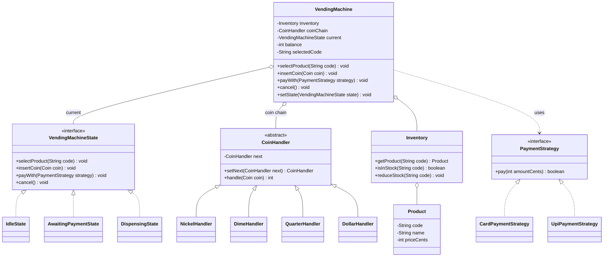

# Chapter 35 — Vending Machine

> Phase 5 case study (Java + C++). Interview-style walkthrough. This one puts **three** patterns to work together: **State** (lifecycle), **Chain of Responsibility** (coin acceptor), and **Strategy** (payment method).

## 1. The Prompt

> *"Design a vending machine."*

A favorite because it's a textbook **state machine**. The interviewer wants to see you model the lifecycle cleanly (not with a wall of `if`s), handle payment and coin validation, and deal with edge cases like cancel/refund and out-of-stock.

---

## 2. Clarifying Questions

| Question | Assumed answer |
|----------|----------------|
| Payment methods? | **Cash (coins)** and **card/UPI** (instant) |
| What about invalid coins? | Rejected and returned; only valid denominations accepted |
| Overpayment? | Machine returns **change** |
| Can the user cancel? | Yes — **cancel with refund** before dispensing |
| Out-of-stock selection? | Rejected up front |
| Multi-item cart, real change-making, maintenance mode? | **Out of scope** v1 (change-making + maintenance are extensions) |
| Money representation? | **Integer cents** to avoid float drift |

---

## 3. Scope & Requirements

**Functional**
- Products have a **price** and **stock**; selecting out-of-stock is rejected.
- **Cash**: insert coins; only valid denominations accepted, others returned.
- **Card**: pay the exact price in one tap.
- Dispense once enough money is collected; return **change** for overpayment.
- **Cancel** before dispensing → refund.

**Non-functional**
- Behavior depends on **state** — a real state machine, not scattered `if`s.
- **Coin validation** is a pluggable chain (denominations add/remove easily).
- **Payment method** is swappable (cash / card / UPI) without touching the lifecycle.

**Out of scope (v1):** multi-item cart, remote telemetry, bill (note) acceptor.

---

## 4. Approach / Plan

1. The machine's four actions (`selectProduct`, `insertCoin`, `payWith`, `cancel`) mean different things per lifecycle stage → model stages as **State** objects that own transitions.
2. Coin validation flows through a **Chain of Responsibility** of denomination handlers — accepted by one or rejected at the end.
3. Instant payment (card/UPI) is a **Strategy** so the lifecycle doesn't care which.
4. Money is **integer cents**; dispense is automatic once funded.

Anticipated patterns: **State** (lifecycle), **Chain of Responsibility** (coins), **Strategy** (payment).

---

## 5. Core Entities & Public API

| Entity | Responsibility |
|--------|----------------|
| `VendingMachine` | Context: holds inventory, balance, selection, and the current state |
| `VendingMachineState` | **State**: `Idle` / `AwaitingPayment` / `Dispensing` |
| `Coin` | Denominations (cents) |
| `CoinHandler` | **Chain of Responsibility**: validates an inserted coin by denomination |
| `PaymentStrategy` | **Strategy**: instant payment methods (`Card`, `UPI`) |
| `Product` / `Inventory` | Items with price and stock |

```java
machine.selectProduct(String code);
machine.insertCoin(Coin coin);
machine.payWith(PaymentStrategy strategy);
machine.cancel();
machine.setState(VendingMachineState state);   // states drive transitions
```

---

## 6. Class Diagram



---

## 7. Patterns Applied

| Pattern | Where | Why |
|---------|-------|-----|
| **State** (Ch25) | `VendingMachineState` (Idle / AwaitingPayment / Dispensing) | Each action means something different per state; states own transitions — no big conditionals |
| **Chain of Responsibility** (Ch17) | `CoinHandler` chain | An inserted coin flows through denomination handlers; accepted by one or rejected at the end |
| **Strategy** (Ch22) | `PaymentStrategy` (Card / UPI) | Swap the instant payment method without touching the state machine |

> This chapter uses **real State classes** (unlike Ch25's centralized enum variant) because the vending machine has several states, each with distinct behavior for four actions — exactly where the State pattern earns its keep.

---

## 8. Walk the Main Flow

```
Idle ── selectProduct(inStock) ──▶ AwaitingPayment
AwaitingPayment ── insertCoin (valid, chain accepts) ──▶ (balance += value)
                 ── payWith(card) ──▶ (balance += price)
                 ── balance ≥ price ──▶ Dispensing
                 ── cancel ──▶ refund ──▶ Idle
Dispensing ── dispense item + change ──▶ Idle
```

Coin insertion (Chain of Responsibility):
```
insertCoin(coin)
  └─ coinChain.handle(coin)
       Nickel? → Dime? → Quarter? → Dollar? → (none) → reject/return
     accepted → balance += value → dispense if funded
```

---

## 9. Follow-up Questions (the interviewer pushes)

**Q: "Why State objects instead of a status enum with `switch`es?"**
Because there are four actions × three states = twelve behaviors, and each state also decides its *next* state. Putting that in one method is a maintenance nightmare and lets illegal transitions slip through (e.g., inserting a coin while dispensing). With `IdleState` / `AwaitingPaymentState` / `DispensingState`, each rule is local and illegal actions are simply no-ops in the wrong state. This is the case where State clearly beats an enum (contrast Ch25's centralized variant).

**Q: "How do you validate coins, and add a new denomination later?"**
A **Chain of Responsibility**: the coin passes through `Nickel → Dime → Quarter → Dollar` handlers; the first that recognizes it accepts (adds its value), and if none do, it falls off the end and is returned. A half-dollar or €2 is **one new handler** inserted in the chain — no change to the machine or other handlers.

**Q: "Cash and card are very different — how do both fit?"**
`AwaitingPayment` supports both entry points: `insertCoin` (cash, incremental, via the chain) and `payWith(strategy)` (card/UPI, full price in one call). The instant methods are a **Strategy**, so adding an NFC wallet or QR pay is a new strategy class; the lifecycle is untouched.

**Q: "User overpays — how is change computed?"**
For the demo, change = balance − price returned as a lump. Real machines need a **ChangeStrategy** that makes change from available coins (greedy, or exact-with-fallback when it can't make exact change — in which case reject the sale or the coin). Making it a Strategy lets you swap greedy vs optimal. *(Part of the easy assignment.)*

**Q: "What happens on cancel mid-transaction?"**
`cancel` in `AwaitingPayment` refunds the collected balance and transitions back to `Idle`. In `Idle` it's a no-op; in `Dispensing` it's rejected (too late). Because each state defines `cancel`, these rules live where they belong — no guard conditions in the machine.

**Q: "Out of stock, or the machine can't make change — how are those handled?"**
Stock is checked at `selectProduct` (rejected before entering `AwaitingPayment`). Insufficient change is checked before dispensing; if it can't make change it refuses and refunds. Both are guard points, not scattered checks.

**Q: "Add a maintenance / out-of-service mode."**
A new `MaintenanceState` where selection and payment are refused and only a technician action exits it. Because states are objects, this is additive — no existing state changes. *(Part of the easy assignment.)*

**Q: "Notify when a product is low or sold out."**
An **Observer** over `Inventory`: on `reduceStock`, if the count crosses a threshold, notify a restock/monitoring listener. The dispense flow is unchanged. *(Part of the medium assignment.)*

**Q: "Concurrency — two people at one machine?"**
A physical machine is inherently single-user (one coin slot), so the state machine naturally serializes. For a software vending service (e.g., digital goods), you'd guard the select→pay→dispense transition the same way as the booking system's lock step.

---

## 10. Trade-offs & Talking Points

- **State objects vs enum+switch:** State objects shine here (many states, rich per-state behavior, transition safety); an enum would be simpler only for a trivial 2-state lifecycle. Right tool for the count of behaviors.
- **Chain of Responsibility vs a set/map of denominations:** a `Set<Coin>` lookup is simpler for pure validation; the chain earns its keep when handlers do *more* than membership (e.g., logging, wear counting, per-coin routing) and when order matters.
- **Strategy for payment vs branching:** Strategy isolates each tender type and makes new methods additive; branching would grow the state code.
- **Integer cents vs doubles:** cents guarantee exact currency math; doubles drift.
- **Auto-dispense when funded:** simple and user-friendly, but couples "money reached price" to dispensing — a `ChangeStrategy` check must sit in between so it can refuse when change is impossible.

---

## 11. Summary (what to say at the end)

> "The vending machine is a **State machine** — `Idle`, `AwaitingPayment`, `Dispensing` — where each state owns how the four actions behave and what transition follows, eliminating conditionals and illegal transitions. Coins are validated through a **Chain of Responsibility** so denominations are pluggable, and instant payment (card/UPI) is a **Strategy**. Money is integer cents, dispense is automatic once funded, and cancel refunds. Maintenance mode, change-making, and low-stock alerts slot in as a new state, a `ChangeStrategy`, and an inventory **Observer** — each additive."

---

## 12. What's Next

Study the code in `src/java` and `src/cpp` — a state-driven machine with a coin-acceptor chain and swappable card payment, handling a cash purchase (with a rejected penny), a card purchase, an out-of-stock selection, and a cancel/refund. Then the assignments, which are the follow-ups above: add change-making + a Maintenance state (easy), and a low-stock Observer + configurable coin/payment sets (medium).
