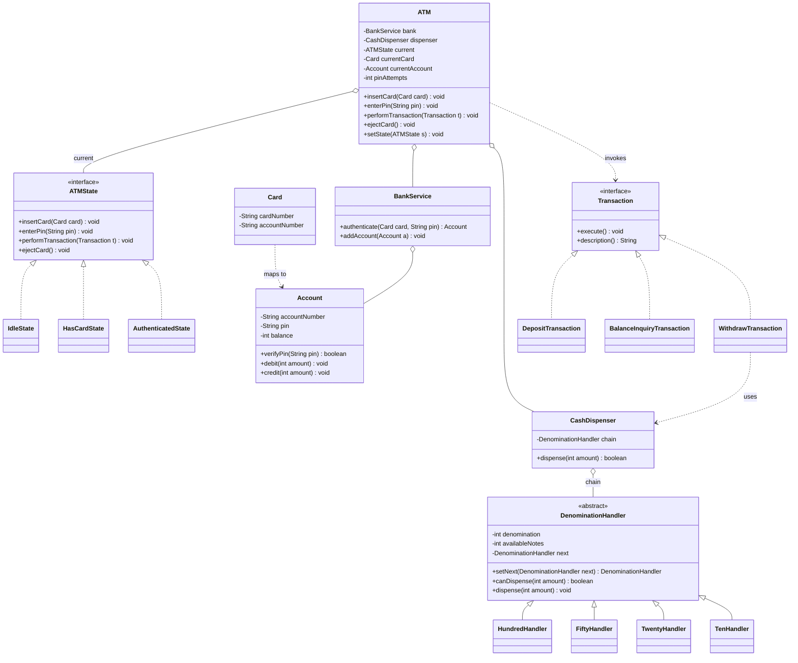

# Chapter 36 — ATM System

> Phase 5 case study (Java + C++). Interview-style walkthrough. This one combines **three** patterns: **State** (the ATM lifecycle), **Chain of Responsibility** (cash denomination dispensing), and **Command** (transactions).

## 1. The Prompt

> *"Design an ATM."*

Short and open. The interviewer wants to see a clean **state machine** (card → PIN → transact → eject), how you **dispense the right notes**, and how you model **different transaction types**. Clarify the flow and the boundaries before drawing.

---

## 2. Clarifying Questions

| Question | Assumed answer |
|----------|----------------|
| What's the interaction flow? | Insert card → enter PIN → pick a transaction → eject |
| Which transactions? | **Withdraw, deposit, balance inquiry** (extensible) |
| How is a withdrawal paid out? | In **notes** ($100/$50/$20/$10) — dispense the right combination |
| What if the PIN is wrong? | Limited retries, then **retain the card** |
| Where do balances live? | In a **bank service** the ATM talks to; the ATM is just a terminal |
| Withdraw more than the balance / more cash than the ATM holds? | Both rejected with clear messages |
| Real networking, receipt printing, multi-currency? | **Out of scope** v1 |
| Money representation? | Whole dollars (notes); no cents needed for cash |

---

## 3. Scope & Requirements

**Functional**
- Authenticate a card by **PIN** (limited attempts → card retained).
- **Withdraw**: check balance, dispense notes, debit the account.
- **Deposit** and **balance inquiry**.
- Dispense withdrawals as a valid **combination of notes**; reject if impossible.
- Eject the card and reset between sessions.

**Non-functional**
- ATM behavior depends on its **state** — a real state machine, not scattered flags.
- **Denomination logic** is a pluggable chain (add/remove note types easily).
- **Transactions** are objects — queueable, loggable, auditable, extensible.
- The ATM is a **terminal**; account state lives behind a `BankService`.

**Out of scope (v1):** real bank network, receipts, transfers/mini-statements (extensions), concurrency across ATMs.

---

## 4. Approach / Plan

Think out loud before classes:

1. The four user actions (`insertCard`, `enterPin`, `performTransaction`, `ejectCard`) mean different things depending on where we are in the flow → model the flow as **State** objects that own their transitions. Acting out of order (e.g., withdraw before PIN) is simply refused by the current state.
2. A withdrawal must break an amount into notes → a **Chain of Responsibility** of denomination handlers, each taking as many of its note as it can and forwarding the remainder.
3. Each transaction (withdraw/deposit/balance) is a **Command** object with `execute()`, so the ATM invokes them uniformly and new transaction types are additive.
4. Keep account data behind a `BankService` so the ATM stays a thin terminal (separation of concerns / testability).

Anticipated patterns: **State** (lifecycle), **Chain of Responsibility** (cash), **Command** (transactions).

---

## 5. Core Entities & Public API

| Entity | Responsibility |
|--------|----------------|
| `ATM` | Context: holds current state, the inserted card/account, the dispenser, and the bank; delegates actions to the state |
| `ATMState` | **State**: `Idle` / `HasCard` / `Authenticated` |
| `Card` | Card number + the account it maps to |
| `Account` | Account number, PIN, balance; debit/credit |
| `BankService` | Authenticates a card+PIN; owns accounts |
| `Transaction` | **Command**; `Withdraw` / `Deposit` / `BalanceInquiry` |
| `CashDispenser` | Validates an amount and drives the denomination chain |
| `DenominationHandler` | **Chain of Responsibility**: one note value; `Hundred`/`Fifty`/`Twenty`/`Ten` |

```java
atm.insertCard(Card card);
atm.enterPin(String pin);
atm.performTransaction(Transaction transaction);   // Command
atm.ejectCard();

dispenser.dispense(int amount);                     // drives the chain, returns boolean
handler.setNext(DenominationHandler next);          // build the chain
transaction.execute();                              // Command action
```

---

## 6. Class Diagram



---

## 7. Patterns Applied

| Pattern | Where | Why |
|---------|-------|-----|
| **State** (Ch23) | `ATMState` (Idle / HasCard / Authenticated) | Each action means something different per stage; states own transitions and refuse out-of-order actions — no giant conditionals |
| **Chain of Responsibility** (Ch17) | `DenominationHandler` chain | An amount flows through note handlers; each takes what it can and forwards the rest |
| **Command** (Ch18) | `Transaction` (Withdraw / Deposit / BalanceInquiry) | A transaction is an object with `execute()`; the ATM invokes them uniformly, and they're queueable/auditable |

> Like the vending machine (Ch35), this uses **real State classes** because there are several stages, each with distinct behavior for the same four actions.

---

## 8. Walk the Main Flow

```
Idle ── insertCard ──▶ HasCard
HasCard ── enterPin (correct) ──▶ Authenticated
        ── enterPin (wrong ×3) ──▶ retain card ──▶ Idle
        ── ejectCard ──▶ Idle
Authenticated ── performTransaction(txn) ──▶ txn.execute()
              ── ejectCard ──▶ reset ──▶ Idle
```

**Withdrawal (Command + Chain of Responsibility):**
```
atm.performTransaction(WithdrawTransaction(account, dispenser, 180))
  └─ txn.execute()
       ├─ amount > account.balance?           → reject (insufficient balance)
       ├─ dispenser.dispense(180)             // validate + walk the chain
       │     ├─ 180 % 10 == 0 and ≤ ATM cash and can make exact notes?
       │     └─ Hundred(1) → Fifty(1) → Twenty(1) → Ten(1)   // greedy
       └─ success → account.debit(180)        → new balance
```

**Note dispensing (Chain of Responsibility) for $180:**
```
Hundred: 180/100 = 1 note  → remaining 80  → forward
Fifty:    80/50 = 1 note   → remaining 30  → forward
Twenty:   30/20 = 1 note   → remaining 10  → forward
Ten:      10/10 = 1 note   → remaining  0  → done
```

---

## 9. Follow-up Questions (the interviewer pushes)

**Q: "Why State objects instead of a status flag with `if`s?"**
Because the same four actions behave differently at each stage and each stage decides the next one. `IdleState` accepts a card; `HasCardState` accepts a PIN; `AuthenticatedState` runs transactions. Trying to withdraw before entering a PIN is just a no-op in the wrong state — illegal transitions become impossible instead of guarded by scattered conditionals. This is the textbook case for **State**.

**Q: "Walk me through dispensing $180 — and what if you can't make it?"**
The amount flows through the **denomination chain** greedily: each handler takes as many of its note as it can and forwards the remainder. But greedy can fail even when total cash is enough (e.g., $30 with only $100/$50/$20 notes, no $10s). So the dispenser first runs a **non-mutating `canDispense` simulation**; only if it returns exactly zero remainder does it actually dispense. Otherwise it rejects cleanly without handing out partial cash.

**Q: "New note type — add $500, or switch to euros."**
One new `DenominationHandler` (its value + count) inserted in the chain, in descending order. No change to the dispenser or other handlers — pure **OCP**. Currency is just a different set of handlers.

**Q: "Add a new transaction — transfer, mini-statement, PIN change."**
A new `Transaction` (Command) with its own `execute()`. The ATM's `performTransaction` doesn't change — it just invokes `execute()`. Because transactions are objects, you also get an **audit log** for free (store the executed commands) and could support a queue or undo/reversal. *(Transfer + mini-statement are the assignments.)*

**Q: "Wrong PIN — how many tries, and then what?"**
A counter in the `HasCardState`: after N (say 3) failures, the card is **retained** and the ATM returns to `Idle`. The attempt count resets on a new session. Keeping this in the state means the rule lives exactly where PINs are entered.

**Q: "Two ways a withdrawal can fail — distinguish them."**
Two independent checks: **insufficient account balance** (the bank's money) vs **insufficient/undispensable ATM cash** (the terminal's notes). They're separate because they're different failure modes with different messages — one is the customer's problem, one is the machine's. Both are checked *before* any debit.

**Q: "Order of operations in a withdrawal — debit first or dispense first?"**
Check balance → **dispense** → then **debit**. If dispensing fails, we never debit, so the customer isn't charged for cash they didn't get. In a real networked ATM this becomes a two-phase, idempotent transaction (reserve/hold on the bank, dispense, confirm) so a mid-operation crash can't debit without dispensing or vice versa — the same lock→act→commit discipline as the booking system.

**Q: "Concurrency — the account is used at the ATM and online at the same time."**
The `Account` is the shared resource; balance updates must be atomic (a lock or an optimistic version/CAS on the balance) so two debits can't both read the old balance. The ATM itself is single-user (one card slot), so the terminal serializes naturally — the contention is at the account in the bank service.

**Q: "Where does the account state actually live?"**
Behind `BankService`, not in the ATM. The ATM is a thin terminal that authenticates and invokes transactions; the bank owns balances. This separation makes the ATM testable (mock the bank) and reflects reality — many ATMs, one bank.

**Q: "Security — anything you'd never do?"**
Never log or store the PIN in plaintext; authenticate against a hash, mask it in any output, and clear it from memory after use. PIN checks belong in the bank service, not the terminal. (Out of scope to implement, but worth stating.)

**Q: "Add an out-of-service / maintenance state."**
A new `ATMState` where all customer actions are refused and only a technician action exits it. Additive — no existing state changes, same as the vending machine's maintenance mode.

---

## 10. Trade-offs & Talking Points

- **State objects vs enum+switch:** State objects win here (three+ stages, rich per-stage behavior, transition safety); an enum would only suit a trivial two-stage flow.
- **Greedy chain vs optimal note selection:** greedy is simple and matches how real cassettes dispense, but can fail to make an amount that's technically fundable; the `canDispense` pre-check makes failure safe. True optimal change-making is a DP problem — mention it if pushed.
- **Command for transactions vs methods on the ATM:** Command makes transactions additive, auditable, and queueable at the cost of a small class per type; direct methods would bloat the ATM and couple it to every operation.
- **Thin terminal + BankService:** clean separation and testability, but introduces a network boundary in reality — which is exactly where you add retries, idempotency, and two-phase commit.
- **Dispense-then-debit ordering:** protects the customer, but in a distributed setting needs idempotent, reservable transactions so a crash between the two steps is recoverable.

---

## 11. Summary (what to say at the end)

> "The ATM is a **State machine** — `Idle`, `HasCard`, `Authenticated` — where each state owns how the four actions behave and what transition follows, so out-of-order actions are impossible without scattered guards. Withdrawals dispense notes through a **Chain of Responsibility** of denomination handlers, with a non-mutating `canDispense` pre-check so a withdrawal never pays out partial cash. Each transaction is a **Command** object, making new operations (transfer, mini-statement) additive and giving an audit trail for free. Account state lives behind a `BankService`, keeping the ATM a thin terminal; the real-world concerns are idempotent dispense-then-debit ordering and atomic balance updates under concurrency."

---

## 12. What's Next

Study the code in `src/java` and `src/cpp` — a state-driven ATM with a denomination-dispensing chain and transactions as command objects, running a successful withdrawal, a wrong-PIN retry, an insufficient-balance rejection, and an out-of-order action. Then the assignments, which are the follow-ups above: add a mini-statement + a PIN-change transaction (easy), and a fund transfer with an audit log plus an out-of-service state (medium).
