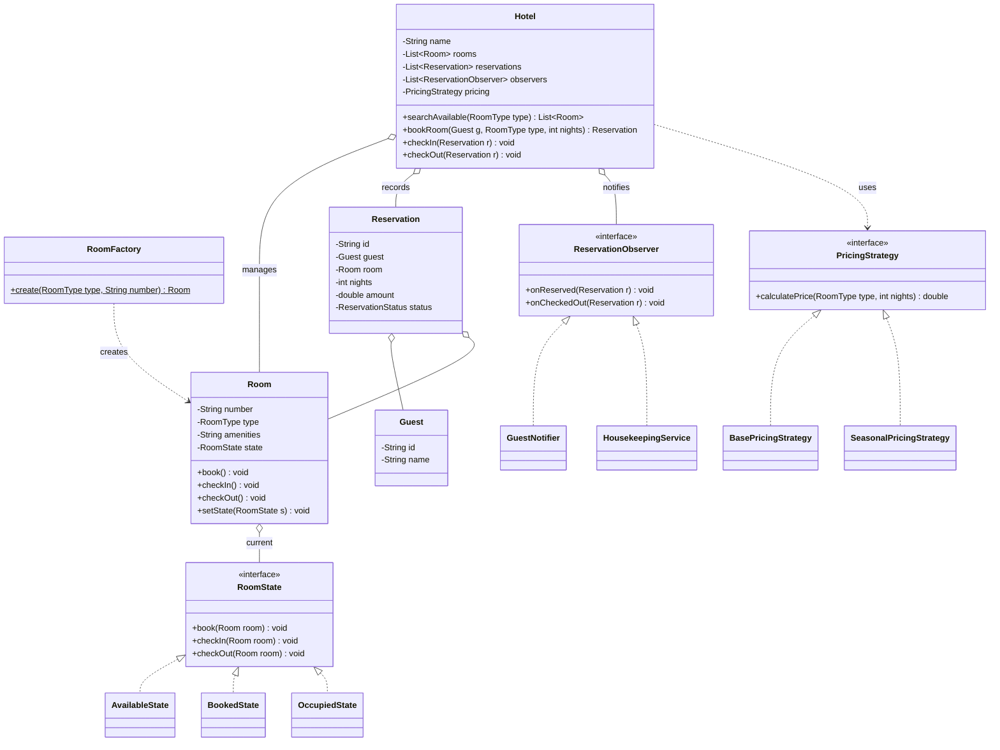

# Chapter 37 — Hotel Management System

> Phase 5 case study (Java + C++). Interview-style walkthrough. Combines **Factory** (room types), **State** (room lifecycle), **Strategy** (pricing), and **Observer** (reservation notifications).

## 1. The Prompt

> *"Design a hotel management / room booking system."*

Broad. One hotel or a chain? Just booking, or the whole stay lifecycle (reserve → check-in → check-out)? Do we book for *future date ranges* or just "is this room free now"? Pin the scope before drawing.

---

## 2. Clarifying Questions

| Question | Assumed answer |
|----------|----------------|
| One hotel or many? | **One hotel** for v1; multiple is an extension |
| What room variety? | **Room types** (Single/Double/Suite/Deluxe) with different base prices + amenities |
| What operations? | Search available rooms, **book**, **check-in**, **check-out** |
| Does price vary? | Yes — **pluggable pricing** (base, seasonal/peak) |
| Notifications? | Guests get booking confirmations; **housekeeping** is alerted on check-out |
| Date-range availability? | v1 tracks **current** room status; full calendar (book Aug 3–6) is a follow-up |
| Payments, reviews, loyalty, multi-hotel? | **Out of scope** v1 |

---

## 3. Scope & Requirements

**Functional**
- Hotel has rooms of different **types**, each with a price and amenities.
- **Search** available rooms by type.
- **Book** a room → it moves through a lifecycle (available → booked → occupied → available).
- **Check-in** and **check-out**.
- Price a stay by **type × nights × pricing rule**.
- **Notify**: guest on booking, housekeeping on check-out.

**Non-functional**
- Room lifecycle modeled as a real **state machine**, not status flags.
- **Pluggable pricing** (Strategy) and **room creation via a Factory**.
- **Loose-coupled notifications** (Observer).

**Out of scope (v1):** real payments, multi-hotel, reviews/loyalty, and **full date-range calendars** (v1 models "free now", see follow-ups).

---

## 4. Approach / Plan

1. A room's behavior depends on where it is in its lifecycle → model status as **State** objects (`Available`/`Booked`/`Occupied`) that own transitions; illegal actions (check-in a room nobody booked) are refused by the state.
2. Rooms differ by **type** (price, amenities) → build them through a **Factory** so creation is centralized.
3. Pricing varies → a **Strategy** the hotel holds and applies per booking.
4. Booking/check-out are events → **Observers** (guest notifier, housekeeping) react without the hotel knowing them.
5. A `Hotel` coordinator ties it together (search, book, check-in, check-out).

Anticipated patterns: **Factory** (rooms), **State** (room lifecycle), **Strategy** (pricing), **Observer** (notifications).

---

## 5. Core Entities & Public API

| Entity | Responsibility |
|--------|----------------|
| `Hotel` | Coordinator: rooms, observers, pricing; search/book/check-in/check-out |
| `Room` | A room with a type + amenities; delegates actions to its current **State** |
| `RoomState` | **State**: `Available` / `Booked` / `Occupied` (stateless singletons) |
| `RoomType` | Enum: `Single`/`Double`/`Suite`/`Deluxe` with base price |
| `RoomFactory` | Builds a room (amenities per type) from a `RoomType` (**Factory**) |
| `PricingStrategy` | Prices a stay (**Strategy**): base / seasonal |
| `Guest` | The person booking (id + name) |
| `Reservation` | A booking: guest, room, nights, amount, status |
| `ReservationObserver` | **Observer**: `GuestNotifier` / `HousekeepingService` |

```java
hotel.searchAvailable(RoomType type);              // List<Room>
hotel.bookRoom(Guest guest, RoomType type, int nights);   // Reservation
hotel.checkIn(Reservation r);
hotel.checkOut(Reservation r);
room.book(); room.checkIn(); room.checkOut();      // delegate to state
```

---

## 6. Class Diagram



---

## 7. Patterns Applied

| Pattern | Where | Why |
|---------|-------|-----|
| **Factory Method** (Ch05) | `RoomFactory` | Build a room with type-specific amenities/price without the caller wiring it |
| **State** (Ch23) | `RoomState` (Available/Booked/Occupied) | Each action means something different per stage; states own transitions and refuse illegal ones |
| **Strategy** (Ch24) | `PricingStrategy` | Swap pricing (base, seasonal/peak) without touching booking |
| **Observer** (Ch22) | `Hotel` → `ReservationObserver` | Guest notifications and housekeeping react to events without the hotel knowing them |

> Room states are **stateless singletons** (one shared `Available`, `Booked`, `Occupied`) — every room points at the same three state objects. That avoids a state object per room and sidesteps the C++ context↔state definition cycle.

---

## 8. Walk the Main Flow

```
Available ── book ──▶ Booked ── checkIn ──▶ Occupied ── checkOut ──▶ Available
```

**Booking (Factory already built the room; State + Strategy + Observer here):**
```
hotel.bookRoom(guest, DOUBLE, 3)
  ├─ search rooms where type == DOUBLE and state == AVAILABLE
  │     └─ none → reject
  ├─ room.book()                          // State: Available -> Booked
  ├─ amount = pricing.calculatePrice(DOUBLE, 3)   // Strategy
  ├─ create Reservation(guest, room, 3, amount)
  └─ for each observer: onReserved(reservation)   // Observer (guest SMS)
```

**Check-out:**
```
hotel.checkOut(reservation)
  ├─ reservation.room.checkOut()          // State: Occupied -> Available
  ├─ reservation.status = COMPLETED
  └─ for each observer: onCheckedOut(reservation)  // Observer (housekeeping cleans)
```

---

## 9. Follow-up Questions (the interviewer pushes)

**Q: "Why model room status as State objects instead of an enum?"**
Because the same three actions (`book`, `checkIn`, `checkOut`) behave differently per stage *and* each stage decides the next. `AvailableState.book()` → Booked; `BookedState.checkIn()` → Occupied; checking in a room nobody booked is just refused in `AvailableState`. That kills the `if (status == …)` sprawl and makes illegal transitions impossible.

**Q: "The big one — how do you book a room for *specific future dates* (Aug 3–6)?"**
This is the honest limitation of v1: a single `RoomState` only models "free right now," not a calendar. For real bookings you need **per-room availability over date ranges** — e.g., an interval set / calendar per room, and `isAvailable(room, checkIn, checkOut)` checks for overlap. Two reservations on the same room are allowed if their date ranges don't overlap. The State pattern still models the *physical* lifecycle on the day of stay, but *availability* becomes a date-range query, not a single flag. *(This is the medium assignment.)*

**Q: "Two guests try to book the last Double at once."**
The claim (search-available → `book`) must be **atomic**, or both get it — the same race as the parking lot / BookMyShow. Lock the room (or CAS its status Available→Booked) so exactly one wins; the other falls through to "no rooms available." At scale this becomes a DB row-lock or a short-TTL hold.

**Q: "Seasonal rates, weekend surcharges, dynamic demand pricing."**
Pricing is a **Strategy** the hotel holds and passes the type + nights. Base, seasonal (a multiplier), weekend, or occupancy-based demand pricing are each a new strategy — booking code never changes. Demand pricing needs current occupancy, so pass a small read-only view, not the whole hotel. *(Weekend/dynamic pricing is part of the assignments.)*

**Q: "Add a Maintenance / out-of-service state."**
A new `RoomState` (`Maintenance`) where booking is refused and only a "mark ready" action returns it to Available. Additive — no existing state changes, exactly like the vending machine's maintenance mode. *(This is the easy assignment.)*

**Q: "Handle no-shows and cancellations."**
Cancellation is a `Booked → Available` transition (free the room, mark the reservation Cancelled, maybe charge a fee via a `CancellationStrategy`). A no-show is a timed cancellation — if check-in doesn't happen by a cutoff, auto-cancel. The reservation status enum already carries `CANCELLED`.

**Q: "Room upgrades / downgrades."**
Since rooms are built by a **Factory** and priced by a **Strategy**, an upgrade is: release the old room (State → Available), book a higher type, re-price. No special-casing in the core.

**Q: "Why a Factory when `new Room(type)` would do?"**
Because each type carries **type-specific setup** (amenities, and could be bed count, view, cleaning SLA). The factory centralizes that so a caller can't create a Suite without a jacuzzi. Adding a `Penthouse` type is one factory case + one enum value.

**Q: "Notify guests by SMS, email, and alert housekeeping — without coupling?"**
`ReservationObserver` observers on `onReserved` / `onCheckedOut`. `GuestNotifier` messages the guest; `HousekeepingService` schedules cleaning on check-out; an analytics sink or a channel-manager sync is just another observer. The hotel fires events and doesn't care who listens.

**Q: "Multiple hotels / a chain?"**
Each `Hotel` is already a self-contained coordinator; a `HotelChain` holds many and routes a search across them. Rooms, states, and strategies are unchanged — you add a layer above, not rework the core.

---

## 10. Trade-offs & Talking Points

- **State object vs enum:** State shines here (several stages, per-stage behavior, transition safety); an enum would suit only a trivial two-state room.
- **Stateless singleton states vs per-room state objects:** shared singletons save memory (three objects, not three-per-room) and keep transitions simple; the price is states can't hold per-room data (they take `Room&` as a parameter instead).
- **Single status vs date-range calendar:** the single-`RoomState` model is simple and correct for "now," but *cannot* express future bookings — a real system needs per-room interval availability. Call this out; it's the design's main simplification.
- **Factory value:** centralizes type setup and enforces invariants; the cost is one more class, justified as types grow.
- **Strategy pricing:** defers the pricing decision and makes new schemes additive; keep the strategy fed only the data it needs (type, nights, occupancy) to avoid coupling to the whole hotel.

---

## 11. Summary (what to say at the end)

> "Rooms are built by a **Factory** (type-specific amenities/price), and each room's lifecycle is a **State** machine — `Available → Booked → Occupied → Available` — so illegal actions are refused without status flags. The `Hotel` coordinator prices stays with a pluggable **Strategy** (base/seasonal) and fires events to **Observers** (guest SMS, housekeeping) on booking and check-out. The states are shared stateless singletons. The honest limitation is that v1 models 'available now,' not date ranges — real reservations need per-room calendar availability and atomic claiming, which slot in without disturbing the state/strategy/observer structure."

---

## 12. What's Next

Study the code in `src/java` and `src/cpp` — a hotel with factory-built typed rooms, a room state machine, seasonal pricing, and guest/housekeeping observers, running a book → check-in → check-out flow plus a seasonal-priced booking and a sold-out type. Then the assignments, which are the follow-ups above: add a **Maintenance state + weekend pricing** (easy), and **date-range availability + cancellation with a fee strategy** (medium).
