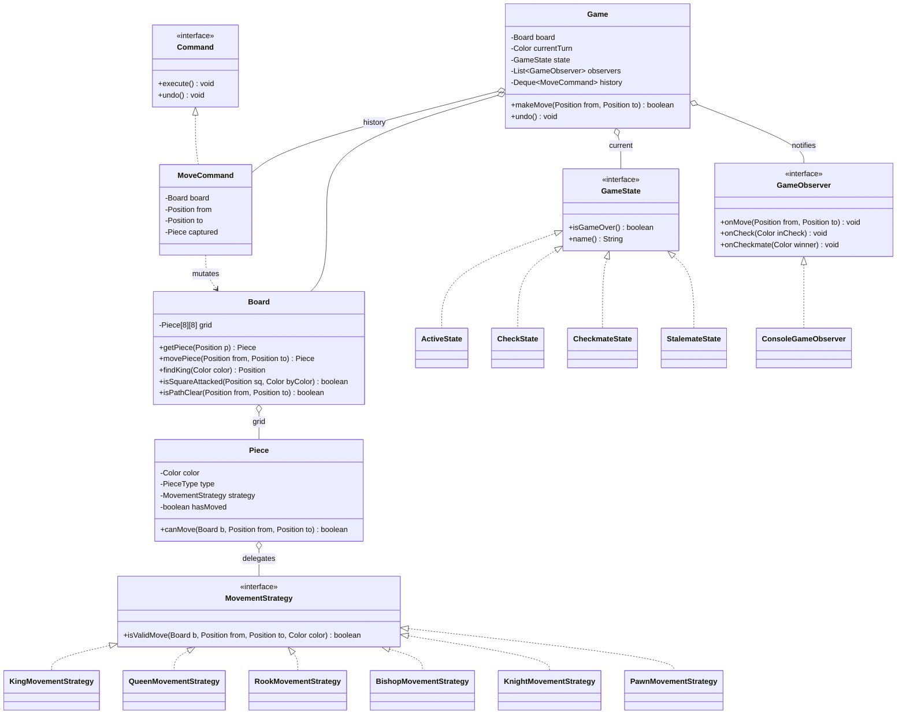

# Chapter 38 — Chess Game

> Phase 5 case study (Java + C++). Interview-style walkthrough. A real move-validating engine combining **Strategy** (per-piece movement), **Command** (moves with undo), **State** (game status), and **Observer** (check/checkmate notifications).

## 1. The Prompt

> *"Design a chess game."*

Huge surface area. Are we validating moves fully (check, checkmate) or just modeling the board? Two-player only or an AI? Do we need undo, notation, special moves (castling, en passant, promotion)? Scope hard before drawing — chess can swallow an entire interview.

---

## 2. Clarifying Questions

| Question | Assumed answer |
|----------|----------------|
| Full move validation or just the board? | **Full legal-move validation**: piece rules, path blocking, can't-leave-own-king-in-check |
| Detect check / checkmate / stalemate? | **Yes** — that's the interesting part |
| Special moves (castling, en passant, promotion)? | **Out of scope** v1 → assignments (they're the classic follow-ups) |
| Undo moves? | **Yes** — moves are reversible |
| AI opponent? | **Out of scope** v1 (minimax, like Tic-Tac-Toe) → follow-up |
| Notation (PGN), clocks, networking? | **Out of scope** v1 |

---

## 3. Scope & Requirements

**Functional**
- 8×8 board with the six piece types, standard starting position.
- **Legal move validation**: correct movement per piece, blocked paths, no capturing your own pieces.
- **King safety**: a move that leaves your own king in check is illegal.
- Detect **check**, **checkmate**, and **stalemate** after every move.
- **Undo** the last move.
- Notify listeners on move / check / checkmate.

**Non-functional**
- Each piece's movement is a **pluggable rule** (Strategy) — testable in isolation, no giant `switch`.
- Moves are **Command** objects so undo (and later redo / history / AI search) is clean.
- Game status is a **State** so "game over" logic isn't scattered.
- Check detection is **decoupled** via Observer.

**Out of scope (v1):** castling, en passant, promotion, draw-by-repetition/50-move, AI, clocks, network, PGN.

---

## 4. Approach / Plan

Think out loud:

1. Each piece type moves differently → make movement a **Strategy** (`KingMovement`, `RookMovement`, …). A `Piece` holds a strategy and delegates `canMove`. This keeps the six rule-sets separate and unit-testable, and lets check-detection reuse them.
2. A move is more than a mutation — I want **undo** and later search/AI, so wrap it as a **Command** (`MoveCommand`) with `execute()`/`undo()`, remembering the captured piece.
3. "Is this move legal?" = the piece can geometrically move there **and** it doesn't leave my own king in check. I test the second part by **simulating** with the command (execute → check king → undo).
4. **Check / checkmate / stalemate** = "is my king attacked?" + "do I have any legal move?" — computed by trying every move. Status becomes a **State** (`Active`/`Check`/`Checkmate`/`Stalemate`).
5. Check and game-over events fan out via **Observer**.

Anticipated patterns: **Strategy** (movement), **Command** (moves/undo), **State** (status), **Observer** (notifications).

---

## 5. Core Entities & Public API

| Entity | Responsibility |
|--------|----------------|
| `Board` | 8×8 grid of pieces; move/get/set, path-clear, `findKing`, `isSquareAttacked` |
| `Piece` | Color + type + a `MovementStrategy`; `canMove` delegates to the strategy |
| `MovementStrategy` | **Strategy**: `isValidMove(board, from, to)` per piece type (King/Queen/Rook/Bishop/Knight/Pawn) |
| `PieceFactory` | Wires a piece to its movement strategy |
| `Position` | A `(row, col)` square (0–7), prints as `e4` |
| `Command` / `MoveCommand` | **Command**: `execute()` / `undo()`, remembers the captured piece |
| `GameState` | **State**: `Active` / `Check` / `Checkmate` / `Stalemate` |
| `GameObserver` | **Observer**: `onMove` / `onCheck` / `onCheckmate` / `onStalemate` |
| `Game` | Coordinator: turn order, `makeMove`, `undo`, legality + status updates |

```java
game.makeMove(Position from, Position to);   // validates, applies, updates status, notifies
game.undo();
board.isSquareAttacked(Position square, Color byColor);   // check detection
board.findKing(Color color);
piece.canMove(Board board, Position from, Position to);    // delegates to strategy
```

---

## 6. Class Diagram



---

## 7. Patterns Applied

| Pattern | Where | Why |
|---------|-------|-----|
| **Strategy** (Ch22) | `MovementStrategy` per piece type | Isolate the six movement rule-sets; testable, reused by check detection, no giant `switch` |
| **Command** (Ch18) | `MoveCommand` (`execute`/`undo`) | Reversible moves → undo now, redo/history/AI-search later; remembers the captured piece |
| **State** (Ch25) | `GameState` (Active/Check/Checkmate/Stalemate) | "Game over?" lives in the state, not scattered flags; rejects moves once terminal |
| **Observer** (Ch23) | `Game` → `GameObserver` | Check/checkmate/move events fan out to UI/log without the game knowing listeners |

> Movement strategies and game states are **stateless singletons** (one shared `RookMovement`, one shared `ActiveState`, …) — every rook shares one movement object; the game points at one state object.

---

## 8. Walk the Main Flow

**Making a move (Strategy + Command + king-safety simulation):**
```
game.makeMove(from, to)
  ├─ state.isGameOver()? → reject (Checkmate/Stalemate)
  ├─ piece at from is the current player's?           (turn check)
  ├─ destination not my own piece?
  ├─ piece.canMove(board, from, to)                   // Strategy: geometry + path + capture rule
  ├─ simulate: cmd.execute()                          // Command applies the move
  │     └─ board.isSquareAttacked(findKing(me), opponent)?
  │           └─ yes → cmd.undo(); reject             // can't leave own king in check
  ├─ commit: push cmd to history; notify onMove
  ├─ switch turn
  └─ update status for the player to move:
        inCheck = king attacked?  hasMove = any legal move?
        ├─ inCheck && !hasMove → Checkmate  (notify winner)
        ├─ !inCheck && !hasMove → Stalemate
        ├─ inCheck             → Check       (notify)
        └─ else                → Active
```

**Undo:** `game.undo()` pops the last `MoveCommand`, calls `undo()` (restores the moved piece *and* any captured piece), and flips the turn back.

---

## 9. Follow-up Questions (the interviewer pushes)

**Q: "Why make movement a Strategy instead of `Piece` subclasses?"**
Either works, but Strategy keeps the *movement rule* separate from the *piece identity*, so each rule is a small, independently unit-testable class, and **check detection reuses the exact same rules** (`isSquareAttacked` just asks every enemy piece `canMove(... kingSquare)`). Subclassing `Piece` would tangle movement with the piece's other responsibilities. It also makes fairy-chess variants (a piece with custom movement) a matter of swapping a strategy.

**Q: "How do you know a move doesn't leave your own king in check?"**
You can't judge it geometrically — you **simulate**. Apply the move via the `MoveCommand`, then ask `isSquareAttacked(myKingSquare, opponent)`; if the king is attacked, `undo()` and reject. Doing it through the Command means the board is always restored exactly, captured piece included.

**Q: "How is checkmate different from check?"**
**Check** = my king is attacked *now*. **Checkmate** = my king is attacked **and I have no legal move** to escape it. **Stalemate** = I'm **not** in check but still have **no legal move** (a draw). So both terminal states reduce to one function — `hasAnyLegalMove(color)` — which tries every pseudo-legal move, simulates it, and keeps only those that leave the king safe.

**Q: "Isn't trying every move to detect checkmate slow?"**
It's O(pieces × 64) move attempts, each an execute/undo — fine for a single position (a few thousand simple ops). Real engines speed this up with **incremental attack maps**, **bitboards**, and generating only king-relevant moves when in check. The design doesn't change; you'd optimize `hasAnyLegalMove` and `isSquareAttacked` behind the same interface.

**Q: "Add castling, en passant, and promotion."**
Each is a **special move**, and the `Command` abstraction is exactly why they fit cleanly:
- **Castling** = a `CastlingCommand` that moves king **and** rook, gated on "neither has moved, path clear, king not passing through check" (that's why `Piece.hasMoved` exists).
- **En passant** = a `PawnCapture` variant whose captured pawn isn't on the destination square; needs the last move (the history/`Command` stack already has it).
- **Promotion** = a `MoveCommand` subtype that swaps the pawn for a chosen piece on the back rank.
Each is a new Command + a small rule; the core loop is untouched. *(These are the assignments.)*

**Q: "Undo/redo a whole game?"**
Undo already works (pop the `MoveCommand`, call `undo()`). **Redo** = keep a second stack of undone commands and re-`execute()`. Because every move is a first-class Command with its captured piece recorded, full history navigation is free.

**Q: "Add an AI opponent."**
Reuse the Tic-Tac-Toe idea (Ch31): **minimax with alpha-beta**, driving the same `makeMove`/`undo` to search the tree, plus a board-evaluation function (material + position). The engine's `Command` undo is what makes deep search cheap — you make/unmake moves instead of copying the board.

**Q: "Why a State object for the game status?"**
So "the game is over" isn't a boolean checked in ten places. `makeMove` just asks `state.isGameOver()`; `CheckmateState`/`StalemateState` return true and refuse further moves. Adding a `DrawState` (50-move, repetition) is a new state, not new `if`s.

**Q: "Two players over a network / concurrency?"**
The `Game` is the single source of truth; a move is validated server-side. Concurrency is light (turn-based — only one player moves at a time), but you'd still guard `makeMove` so a stale client can't move out of turn. Same "one coordinator validates" shape as the other case studies.

---

## 10. Trade-offs & Talking Points

- **Strategy vs `Piece` subclasses:** Strategy isolates and reuses movement rules (great for check detection and variants); subclassing is fine for a toy but couples movement to the piece.
- **Simulate-to-test-check vs incremental attack maps:** simulation is simple and obviously correct; attack maps are faster but complex. Ship correctness first, optimize the hot path behind the same API.
- **Command undo (make/unmake) vs copying the board:** make/unmake is memory-cheap and essential for AI search; copying is simpler but wasteful. The `MoveCommand` remembering the captured piece is the key.
- **State objects vs an enum:** State cleanly encapsulates "game over" and its move-rejection; an enum would push that logic back into the game. With four+ statuses and a `DrawState` looming, State wins.
- **Pseudo-legal + filter vs fully-legal generation:** generating pseudo-legal moves then filtering king-safety is simpler and standard; fully-legal generation up front is faster but far more code.

---

## 11. Summary (what to say at the end)

> "Each piece delegates movement to a **Strategy**, so the six rule-sets are isolated and *reused* by check detection (`isSquareAttacked` just asks enemy pieces if they can move to the king's square). Moves are **Command** objects with `execute`/`undo` that remember the captured piece, so king-safety is tested by simulate-then-undo, and undo/redo/AI-search come for free. **Checkmate** and **stalemate** both reduce to 'king attacked?' + 'any legal move?', and the game status is a **State** that refuses moves once terminal. Check and game-over events fan out via **Observer**. Castling, en passant, promotion, and an AI all slot in as new Commands/strategies without touching the core loop."

---

## 12. What's Next

Study the code in `src/java` and `src/cpp` — a full engine: six movement strategies, a board with path-clearing and attack detection, moves as reversible commands, State-based status, and observers. The demo plays **Scholar's Mate** (a 4-move checkmate), showing check detection, an illegal move that would expose the king (rejected), an undo, and the final checkmate. Then the assignments, which are the follow-ups above: add **castling + pawn promotion** (easy), and **en passant + a minimax AI** (medium).
