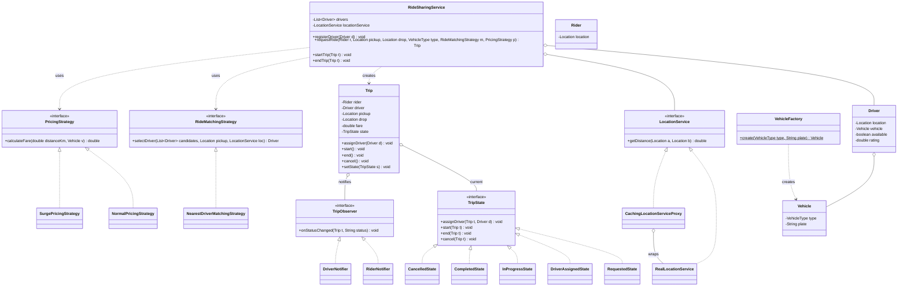

# Chapter 39 — Ride-Sharing System (Uber / Ola)

> Phase 5 case study (Java + C++). Interview-style walkthrough. The first case study to use **five** patterns: **Strategy** (matching + pricing), **State** (trip lifecycle), **Factory** (vehicle types), **Observer** (trip-status notifications), and **Proxy** (a caching location service).

## 1. The Prompt

> *"Design a ride-sharing service like Uber."*

Enormous. Are we matching riders to drivers, tracking a trip, pricing it, or all of it? Real-time GPS or a snapshot? One city or global? Scope hard — this is a "show me you can carve a huge system into pieces" prompt.

---

## 2. Clarifying Questions

| Question | Assumed answer |
|----------|----------------|
| Core flow? | Rider requests → **match a nearby driver** → trip runs → fare + payment |
| How is a driver chosen? | Pluggable **matching** (nearest driver v1; ETA/rating later) |
| Does price vary? | Yes — **pluggable pricing** (normal + surge) |
| Vehicle options? | **Types** (Bike/Auto/Sedan/SUV) with different rates |
| Trip lifecycle? | Requested → Assigned → In-Progress → Completed / Cancelled |
| Notifications? | Rider and driver **notified** on every status change |
| Location lookups? | Behind a **service** that's expensive → cache it |
| Real-time GPS streaming, maps/routing, multi-city sharding? | **Out of scope** v1 (noted as scaling follow-ups) |

---

## 3. Scope & Requirements

**Functional**
- Riders and drivers have **locations**; drivers have a **vehicle** of some type.
- **Request a ride**: pick a vehicle type, match an available driver, quote a fare.
- **Trip lifecycle**: assign → start → end (or cancel), with correct legal transitions.
- **Fare** = distance × vehicle rate × pricing rule.
- **Notify** rider and driver on each status change.

**Non-functional**
- **Pluggable matching and pricing** (Strategy).
- **Vehicle creation via a Factory** (rate per type).
- Trip status as a real **State** machine.
- Location lookups behind a **Proxy** that caches expensive calls.
- Loose-coupled **Observer** notifications.

**Out of scope (v1):** real GPS streaming, map routing/ETA, geosharding, driver onboarding, refunds.

---

## 4. Approach / Plan

1. **Matching** and **pricing** both vary → make each a **Strategy** the service is given per request (nearest-driver, normal/surge). New policies are new classes.
2. Vehicles differ by **type** (rate) → build them via a **Factory**.
3. A trip moves through stages with legal transitions → model status as a **State** machine (`Requested`/`Assigned`/`InProgress`/`Completed`/`Cancelled`); illegal actions (start before assign) are refused.
4. Rider + driver must hear about status changes → **Observer** (`RiderNotifier`, `DriverNotifier`).
5. Finding the nearest driver hammers a **location service** → wrap it in a **caching Proxy** so repeated distance lookups don't recompute.

Anticipated patterns: **Strategy**, **State**, **Factory**, **Observer**, **Proxy**.

---

## 5. Core Entities & Public API

| Entity | Responsibility |
|--------|----------------|
| `RideSharingService` | Coordinator: register drivers, request a ride, drive the trip |
| `Rider` / `Driver` | People + their `Location`; a driver has a `Vehicle`, availability, rating |
| `Vehicle` / `VehicleType` | A vehicle with a per-km rate; `VehicleFactory` builds it |
| `Location` | `(x, y)` with a distance function |
| `LocationService` | **Proxy**: `getDistance(a, b)`; `Real…` computes, `Caching…Proxy` memoizes |
| `RideMatchingStrategy` | **Strategy**: pick a driver (`NearestDriver`) |
| `PricingStrategy` | **Strategy**: fare (`Normal`, `Surge`) |
| `Trip` | Context: rider, driver, pickup/drop, fare, status |
| `TripState` | **State**: `Requested`/`DriverAssigned`/`InProgress`/`Completed`/`Cancelled` |
| `TripObserver` | **Observer**: `RiderNotifier`, `DriverNotifier` |

```java
service.registerDriver(Driver d);
service.requestRide(Rider r, Location pickup, Location drop, VehicleType type,
                    RideMatchingStrategy matching, PricingStrategy pricing);   // Trip
service.startTrip(Trip t);
service.endTrip(Trip t);
trip.assignDriver(Driver d); trip.start(); trip.end(); trip.cancel();          // delegate to State
```

---

## 6. Class Diagram



---

## 7. Patterns Applied

| Pattern | Where | Why |
|---------|-------|-----|
| **Strategy** (Ch22) | `RideMatchingStrategy`, `PricingStrategy` | Swap how a driver is chosen and how fare is computed without touching the service |
| **State** (Ch25) | `TripState` (Requested→…→Completed/Cancelled) | Legal transitions per stage; illegal actions (start before assign) refused, no status flags |
| **Factory** (Ch05) | `VehicleFactory` | Build a vehicle with the right per-km rate from a `VehicleType` |
| **Observer** (Ch23) | `Trip` → `TripObserver` | Rider and driver react to status changes without the trip knowing them |
| **Proxy** (Ch16) | `CachingLocationServiceProxy` | Cache expensive distance lookups; the service codes against `LocationService`, unaware it's cached |

> Trip states and strategies are **stateless singletons**; the caching proxy wraps the real service behind the same `LocationService` interface, so swapping it in is invisible to callers.

---

## 8. Walk the Main Flow

```
Requested ── assignDriver ──▶ DriverAssigned ── start ──▶ InProgress ── end ──▶ Completed
     │                              │
     └──────── cancel ──────────────┴──▶ Cancelled
```

**Requesting a ride (Factory already built vehicles; Strategy + Proxy + State + Observer here):**
```
service.requestRide(rider, pickup, drop, SEDAN, nearest, surge)
  ├─ candidates = available drivers with a SEDAN
  ├─ driver = matching.selectDriver(candidates, pickup, locationService)   // Strategy
  │     └─ for each candidate: locationService.getDistance(pickup, driver.loc)  // Proxy caches
  │     └─ none? → reject
  ├─ trip = new Trip(rider, pickup, drop)
  ├─ trip.assignDriver(driver)          // State: Requested -> DriverAssigned; notify rider+driver
  ├─ driver.available = false
  ├─ km = locationService.getDistance(pickup, drop)      // Proxy (cache hit if seen before)
  └─ trip.fare = pricing.calculateFare(km, driver.vehicle)   // Strategy
```

**Start / end:** `service.startTrip(trip)` → `InProgress`; `service.endTrip(trip)` → `Completed`, frees the driver, charges the fare. Each transition **notifies** rider and driver.

---

## 9. Follow-up Questions (the interviewer pushes)

**Q: "How do you find the nearest driver among *thousands*?"**
v1 scans available drivers and asks the `LocationService` for each distance — O(drivers), fine for a demo. At real scale you don't scan: you index driver locations in a **geospatial structure** — a **quadtree**, **geohash buckets**, or an **R-tree / S2 cells** — and query only the cell(s) around the pickup. The matching **Strategy** interface stays the same; you swap the implementation behind it. This is *the* core Uber scaling question.

**Q: "Why wrap the location service in a Proxy?"**
Distance/ETA lookups are expensive (map/routing calls) and repeated — during matching you query the same pickup against many drivers, and the same pickup→drop for the quote. The **caching Proxy** memoizes results behind the `LocationService` interface, so the service never knows caching exists. Swapping `RealLocationService` for the proxy is a one-line change (Ch16). A **remote proxy** variant would make it an RPC to a maps service.

**Q: "The cache will go stale — drivers move!"**
Exactly the trade-off. A caching proxy is safe for **immutable** inputs (a fixed pickup→drop distance) but dangerous for **live** driver positions. So you'd cache pickup→drop fares/distance but give driver-location lookups a **short TTL** (or skip caching them). Naming this shows you understand caching invalidation, not just that caching is "faster."

**Q: "Two riders request the last nearby driver at the same instant."**
Classic race — the same driver could be assigned twice. Assigning must be **atomic**: lock the driver (or CAS `available` from true→false) so exactly one request wins; the other re-matches. Same lock-then-claim discipline as the parking lot / BookMyShow.

**Q: "Surge pricing?"**
`PricingStrategy` — `NormalPricing` is `distance × rate`; `SurgePricing` multiplies by a demand factor. The multiplier itself comes from supply/demand in an area (few drivers, many requests). Swappable per request; the service doesn't change. Time-of-day, per-city, or promo pricing are more strategies.

**Q: "Match by ETA or rating, not just straight-line distance."**
A new `RideMatchingStrategy`: `NearestByEtaStrategy` (uses routing time, not Euclidean distance), `HighestRatedNearbyStrategy`, or a blended score. Straight-line distance is a v1 simplification — real matching uses **road ETA** from the routing service (behind the same location Proxy).

**Q: "Walk the trip lifecycle and an illegal action."**
`TripState` enforces it: you can only `start` from `DriverAssigned`, only `end` from `InProgress`. Calling `start` on a `Requested` trip (no driver yet) is refused by `RequestedState`. `Completed`/`Cancelled` are terminal. No `if (status == …)` sprawl — each state owns its legal moves.

**Q: "Cancellation and no-shows?"**
`cancel` is legal from `Requested` or `DriverAssigned` → `Cancelled`, freeing the driver; add a `CancellationFeeStrategy` if a driver was already assigned/en route. A no-show is a timed cancel. In-progress trips can't be cancelled (only ended).

**Q: "Payment fails at the end of the trip?"**
End the trip (state → Completed) but mark the fare **unpaid** and retry/settle asynchronously, rather than blocking the car. Model `Payment` as a step that can fail; keep the driver freed regardless (they've done the work). Same "don't couple the physical action to the payment" idea as the ATM.

**Q: "Ratings?"**
After `Completed`, rider rates driver (and vice versa); the driver's rolling average feeds rating-based matching strategies. It's a post-trip event — a natural **Observer** hook.

---

## 10. Trade-offs & Talking Points

- **Linear scan vs geospatial index for matching:** scanning is trivial and fine small; production needs a quadtree/geohash so matching is O(nearby), not O(all). Strategy keeps the swap clean.
- **Caching proxy: immutable vs live data:** caching a fixed pickup→drop distance is a pure win; caching live driver positions needs a TTL or you match to stale locations. Know *what* is safe to cache.
- **Straight-line vs road ETA:** Euclidean distance is a demo simplification; real matching/pricing uses routing time. Both hide behind the same `LocationService`.
- **State objects vs enum:** with five statuses and per-stage legality, State is cleaner than an enum + guards; an enum would push transition rules back into the service.
- **Assignment atomicity:** the correctness crux — without locking/CAS on the driver, you double-book. Simple in one process; a distributed lock at scale.

---

## 11. Summary (what to say at the end)

> "A `RideSharingService` coordinates the flow. **Matching** and **pricing** are **Strategies** (nearest-driver, normal/surge) chosen per request; vehicles come from a **Factory** with per-type rates. A `Trip` is a **State** machine (Requested→Assigned→InProgress→Completed/Cancelled) that refuses illegal transitions, and rider/driver are **Observers** of its status. Expensive distance lookups sit behind a caching **Proxy** on the `LocationService`. The real-world hard parts are **geospatial matching at scale** (quadtree/geohash behind the matching Strategy), **atomic driver assignment** to avoid double-booking, and **cache staleness** for live positions — all of which slot into this structure without reshaping it."

---

## 12. What's Next

Study the code in `src/java` and `src/cpp` — a service that registers drivers, matches the nearest available one via a caching location proxy, prices with normal/surge strategies, runs a trip through its state machine, and notifies rider and driver. The demo requests a ride (showing a proxy cache hit), completes it, then shows a surge-priced request and a cancellation. Then the assignments, which are the follow-ups above: add **ETA/rating matching + a cancellation fee** (easy), and a **geospatial (grid/quadtree) driver index + short-TTL location caching** (medium).
