# Chapter 40 — Food Delivery System (Zomato / Swiggy)

> Phase 5 case study (Java + C++). Interview-style walkthrough. Combines **Factory** (payment methods), **State** (order lifecycle), **Strategy** (delivery assignment + pricing), and **Observer** (multi-party order tracking).

## 1. The Prompt

> *"Design a food delivery app like Swiggy / Zomato."*

Big. Browsing restaurants, placing an order, paying, assigning a delivery agent, tracking to the door — which slice? The interesting engine is **order → payment → assignment → lifecycle tracking**, so scope there.

> This system shares DNA with ride-sharing (Ch39): match an agent, price it, run a lifecycle, notify parties. The **new** elements to lean into are the **payment Factory**, a **longer lifecycle** with a restaurant prep stage, and **three-party** tracking (customer + restaurant + agent).

---

## 2. Clarifying Questions

| Question | Assumed answer |
|----------|----------------|
| Core flow? | Customer orders from a restaurant → pay → restaurant preps → agent delivers |
| Payment options? | **Multiple** (Card / UPI / Wallet / COD) — built via a **Factory** |
| Order lifecycle stages? | Placed → Confirmed → Preparing → OutForDelivery → Delivered / Cancelled |
| Who is notified? | **Customer, restaurant, and delivery agent** track status |
| How is an agent chosen? | Pluggable **assignment** (nearest free agent v1) |
| Delivery fee? | Pluggable **pricing** (distance-based; free above a threshold) |
| Real-time GPS, ETAs, restaurant search, ratings? | **Out of scope** v1 (noted as follow-ups) |

---

## 3. Scope & Requirements

**Functional**
- Restaurants have a **menu**; a customer orders items with quantities.
- **Pay** via a chosen method (Card/UPI/Wallet/COD).
- **Order lifecycle**: placed → confirmed → preparing → out-for-delivery → delivered (or cancelled), with legal transitions.
- **Assign** a delivery agent when the order is dispatched.
- **Delivery fee** = pluggable pricing over distance/subtotal.
- **Notify** customer, restaurant, and agent on each status change.

**Non-functional**
- **Payment methods via a Factory** (add a method = one class).
- **Pluggable assignment and pricing** (Strategy).
- Order status as a real **State** machine.
- Loose-coupled **Observer** notifications to multiple parties.

**Out of scope (v1):** restaurant search/discovery, real GPS/ETA, order batching, refunds, ratings.

---

## 4. Approach / Plan

1. **Payment** methods vary and grow → build them with a **Factory** from a `PaymentType`; each method is a `PaymentMethod` with `pay(amount)`.
2. An order moves through a **longer lifecycle** (note the restaurant **Preparing** stage) → model it as a **State** machine with legal transitions; illegal actions (deliver before dispatch) refused.
3. **Agent assignment** and **delivery pricing** vary → **Strategies** the service is given.
4. Three parties care about status → **Observers** (`CustomerNotifier`, `RestaurantNotifier`, `DeliveryAgentNotifier`); the agent observer is added when an agent is assigned.
5. A `FoodDeliveryService` coordinates: place → pay (Factory) → run the lifecycle, notifying at each step.

Anticipated patterns: **Factory** (payment), **State** (order), **Strategy** (assignment + pricing), **Observer** (tracking).

---

## 5. Core Entities & Public API

| Entity | Responsibility |
|--------|----------------|
| `FoodDeliveryService` | Coordinator: register restaurants/agents, place & advance orders |
| `Restaurant` / `Menu` / `MenuItem` | A restaurant with a menu of priced items |
| `Customer` / `DeliveryAgent` | People + `Location`; an agent has availability |
| `OrderItem` | A menu item + quantity |
| `Order` | Context: customer, restaurant, items, agent, total, status |
| `OrderState` | **State**: Placed / Confirmed / Preparing / OutForDelivery / Delivered / Cancelled |
| `PaymentMethod` / `PaymentFactory` | **Factory**: `Card` / `Upi` / `Wallet` / `Cod`, each `pay(amount)` |
| `DeliveryAssignmentStrategy` | **Strategy**: pick an agent (`NearestAgent`) |
| `DeliveryPricingStrategy` | **Strategy**: fee (`DistanceBased`, `FreeAboveThreshold`) |
| `OrderObserver` | **Observer**: `Customer` / `Restaurant` / `DeliveryAgent` notifiers |

```java
service.placeOrder(customer, restaurant, items, pricing, PaymentType.UPI);   // Order
service.confirmOrder(order);
service.prepareOrder(order);
service.dispatchOrder(order, assignmentStrategy);    // picks + assigns an agent
service.deliverOrder(order);
order.confirm(); order.prepare(); order.dispatch(agent); order.deliver(); order.cancel();  // delegate to State
```

---

## 6. Class Diagram

```mermaid
classDiagram
    class FoodDeliveryService {
        -List~Restaurant~ restaurants
        -List~DeliveryAgent~ agents
        +placeOrder(Customer c, Restaurant r, List~OrderItem~ items, DeliveryPricingStrategy p, PaymentType pt) Order
        +confirmOrder(Order o) void
        +prepareOrder(Order o) void
        +dispatchOrder(Order o, DeliveryAssignmentStrategy a) void
        +deliverOrder(Order o) void
    }

    class Order {
        -Customer customer
        -Restaurant restaurant
        -List~OrderItem~ items
        -DeliveryAgent agent
        -double total
        -OrderState state
        +confirm() void
        +prepare() void
        +dispatch(DeliveryAgent a) void
        +deliver() void
        +cancel() void
        +setState(OrderState s) void
    }

    class OrderState {
        <<interface>>
        +confirm(Order o) void
        +prepare(Order o) void
        +dispatch(Order o, DeliveryAgent a) void
        +deliver(Order o) void
        +cancel(Order o) void
    }
    class PlacedState
    class ConfirmedState
    class PreparingState
    class OutForDeliveryState
    class DeliveredState
    class CancelledState

    class PaymentMethod {
        <<interface>>
        +pay(double amount) boolean
    }
    class CardPayment
    class UpiPayment
    class WalletPayment
    class CodPayment
    class PaymentFactory {
        +create(PaymentType type)$ PaymentMethod
    }

    class DeliveryAssignmentStrategy {
        <<interface>>
        +selectAgent(List~DeliveryAgent~ agents, Location from) DeliveryAgent
    }
    class NearestAgentAssignmentStrategy

    class DeliveryPricingStrategy {
        <<interface>>
        +calculateFee(double distanceKm, double subtotal) double
    }
    class DistanceBasedPricingStrategy
    class FreeAboveThresholdPricingStrategy

    class OrderObserver {
        <<interface>>
        +onStatusChanged(Order o, String status) void
    }
    class CustomerNotifier
    class RestaurantNotifier
    class DeliveryAgentNotifier

    class Restaurant {
        -Menu menu
        -Location location
    }
    class Menu {
        -List~MenuItem~ items
    }
    class OrderItem {
        -MenuItem item
        -int quantity
    }

    FoodDeliveryService o-- Restaurant
    FoodDeliveryService o-- DeliveryAgent
    FoodDeliveryService ..> Order : creates
    FoodDeliveryService ..> PaymentFactory : uses
    Order o-- OrderState : current
    Order o-- OrderObserver : notifies
    Order o-- OrderItem
    OrderState <|.. PlacedState
    OrderState <|.. ConfirmedState
    OrderState <|.. PreparingState
    OrderState <|.. OutForDeliveryState
    OrderState <|.. DeliveredState
    OrderState <|.. CancelledState
    PaymentMethod <|.. CardPayment
    PaymentMethod <|.. UpiPayment
    PaymentMethod <|.. WalletPayment
    PaymentMethod <|.. CodPayment
    PaymentFactory ..> PaymentMethod : creates
    DeliveryAssignmentStrategy <|.. NearestAgentAssignmentStrategy
    DeliveryPricingStrategy <|.. DistanceBasedPricingStrategy
    DeliveryPricingStrategy <|.. FreeAboveThresholdPricingStrategy
    OrderObserver <|.. CustomerNotifier
    OrderObserver <|.. RestaurantNotifier
    OrderObserver <|.. DeliveryAgentNotifier
    Restaurant o-- Menu
    Menu o-- MenuItem
```



---

## 7. Patterns Applied

| Pattern | Where | Why |
|---------|-------|-----|
| **Factory** (Ch05) | `PaymentFactory` | Build a `PaymentMethod` from a `PaymentType`; a new method (e.g., NetBanking) is one class |
| **State** (Ch25) | `OrderState` (Placed→…→Delivered/Cancelled) | Legal transitions per stage; illegal actions refused; the prep stage lives here |
| **Strategy** (Ch22) | `DeliveryAssignmentStrategy`, `DeliveryPricingStrategy` | Swap agent selection and delivery-fee rules without touching the service |
| **Observer** (Ch23) | `Order` → `OrderObserver` | Customer, restaurant, and agent all track status without the order knowing them |

> Order states are **stateless singletons**; the agent observer is attached at **dispatch** (once an agent exists), so all three parties get updates from then on.

---

## 8. Walk the Main Flow

```
Placed ── confirm ──▶ Confirmed ── prepare ──▶ Preparing ── dispatch(agent) ──▶ OutForDelivery ── deliver ──▶ Delivered
   │                       │
   └──── cancel ───────────┴──▶ Cancelled          (cancel allowed only before Preparing)
```

**Placing an order (Factory + Strategy + State + Observer):**
```
service.placeOrder(customer, restaurant, items, pricing, UPI)
  ├─ subtotal = Σ item.price × qty
  ├─ distance = customer.loc.distanceTo(restaurant.loc)
  ├─ fee = pricing.calculateFee(distance, subtotal)          // Strategy
  ├─ payment = PaymentFactory.create(UPI)                     // Factory
  ├─ payment.pay(subtotal + fee)
  ├─ order = new Order(...); state = Placed
  ├─ order.addObserver(customerNotifier, restaurantNotifier)  // Observer
  └─ notify "PLACED"
```

**Dispatch (Strategy picks the agent, State transitions, agent joins tracking):**
```
service.dispatchOrder(order, nearest)
  ├─ agent = nearest.selectAgent(freeAgents, restaurant.loc)  // Strategy
  ├─ order.addObserver(new DeliveryAgentNotifier())           // agent now tracks
  ├─ order.dispatch(agent)     // State: Preparing -> OutForDelivery; notify all 3 parties
  └─ agent.available = false
```

**Deliver:** `order.deliver()` → `Delivered`, frees the agent, notifies everyone.

---

## 9. Follow-up Questions (the interviewer pushes)

**Q: "Why a Factory for payments instead of a `switch`?"**
Payment methods are the part most likely to grow (NetBanking, Apple Pay, gift cards, split payment). A `PaymentFactory` centralizes creation so the ordering flow just calls `paymentMethod.pay(total)` — adding a method is **one class + one factory case**, and the service never changes. A `switch` in the order flow would violate OCP and scatter payment concerns.

**Q: "Walk the order lifecycle — what's different from ride-sharing?"**
The extra **Preparing** stage (the restaurant cooks) and a **three-party** cast. `OrderState` enforces the sequence: you can't `dispatch` until `Preparing`, can't `deliver` until `OutForDelivery`. Cancellation is allowed **only before Preparing** (once the kitchen starts, food is committed) — a rule that lives naturally in each state. Delivered/Cancelled are terminal.

**Q: "Who gets notified, and when does the agent start tracking?"**
Customer and restaurant are **Observers** from placement. The **agent** observer is added at **dispatch** — there's no agent before then. So the same `notify(status)` call fans out to two parties early and three once assigned. New channels (SMS/push/email) or a live-map view are just more observers.

**Q: "How do you assign an agent among thousands?"**
v1 scans free agents for the nearest to the restaurant — O(agents). At scale it's the **same geospatial-index problem as Uber** (Ch39): quadtree/geohash buckets so you only consider nearby agents, behind the same `DeliveryAssignmentStrategy` interface. You'd also weight by **agent direction, current load, and ETA**, not just distance.

**Q: "Batch multiple orders onto one agent (the real Swiggy optimization)."**
A `BatchingAssignmentStrategy`: if an agent already has an order from the same/near restaurant heading the same direction, add the new order to their run instead of dispatching a new agent. This is a new Strategy + an agent that holds a small order list — the order/state model doesn't change.

**Q: "Delivery fee variations — surge, free above ₹X, distance tiers."**
`DeliveryPricingStrategy`: `DistanceBased` (per-km), `FreeAboveThreshold` (free if subtotal ≥ threshold, else flat), plus surge/peak as more strategies. Swappable per order; the service is untouched. (Demo shows free-above-threshold kicking in.)

**Q: "Payment fails at checkout?"**
`pay(total)` returns success/failure; on failure the order isn't placed (no state created) and the customer retries or picks another method. Because payment is a **Factory-built** object behind an interface, retry-with-a-different-method is trivial. Contrast the ATM: there, physical dispensing couples to payment; here, nothing is committed until payment succeeds.

**Q: "Restaurant rejects the order (out of stock, too busy)?"**
A transition from `Placed`/`Confirmed` → `Cancelled` (or a dedicated `RejectedState`) triggered by the restaurant, refunding the payment and notifying the customer. It's a new state edge, not a rewrite — the State machine absorbs it.

**Q: "Real-time tracking on a map?"**
The Observer plumbing already emits status events; live location is a higher-frequency stream — the agent pushes GPS updates that the customer's client subscribes to (websocket). Same publish/subscribe shape as the status observers, just a faster channel.

**Q: "ETA estimation?"**
Prep time (restaurant) + travel time (agent → customer via routing). Both are inputs to an ETA service; expose it as a value on the order updated as the agent moves. Out of scope to compute, but it slots onto the existing entities.

---

## 10. Trade-offs & Talking Points

- **Factory for payments:** centralizes creation and makes methods additive; the tiny cost is one factory class. Clearly worth it given how often payment options change.
- **Cancellation window in State:** encoding "cancel only before Preparing" per-state is clean and self-documenting; a global `if (status …)` check would drift. The trade-off is more state classes.
- **Nearest vs batched assignment:** nearest is simple and fast to reason about; batching cuts delivery cost but needs direction/load logic. Strategy keeps both swappable.
- **Three-party Observer:** decouples notifications but means an event fans out to several listeners — fine at this scale; at massive scale you'd push to a queue/topic rather than call listeners inline.
- **Shared shape with ride-sharing:** deliberately similar (match + price + lifecycle + notify). Reusing that mental model is a strength — but call out the deltas (payment factory, prep stage) so you're not just repeating Uber.

---

## 11. Summary (what to say at the end)

> "A `FoodDeliveryService` coordinates the flow. Payment methods are built by a **Factory** (Card/UPI/Wallet/COD, extensible), so checkout just calls `pay(total)`. An `Order` is a **State** machine — Placed→Confirmed→Preparing→OutForDelivery→Delivered/Cancelled — that enforces the sequence and the 'cancel only before the kitchen starts' rule. Agent **assignment** and delivery **pricing** are **Strategies**, and customer/restaurant/agent are **Observers** that track status (the agent joining at dispatch). It shares the match-price-lifecycle-notify skeleton with ride-sharing; the deltas are the payment Factory, the restaurant prep stage, and three-party tracking. Scaling hits the same points — geospatial agent assignment, order batching, and real-time tracking over a stream — all of which fit this structure."

---

## 12. What's Next

Study the code in `src/java` and `src/cpp` — a service that places an order (paying via a factory-built method), runs it through its state machine, assigns the nearest agent at dispatch, prices delivery with swappable strategies, and notifies customer/restaurant/agent. The demo places a COD order end to end, a second order where free-above-threshold pricing waives the fee, a cancellation, and an illegal action on a delivered order. Then the assignments, which are the follow-ups above: add a **NetBanking payment + a restaurant-reject transition** (easy), and **order batching onto one agent + geospatial assignment** (medium).
