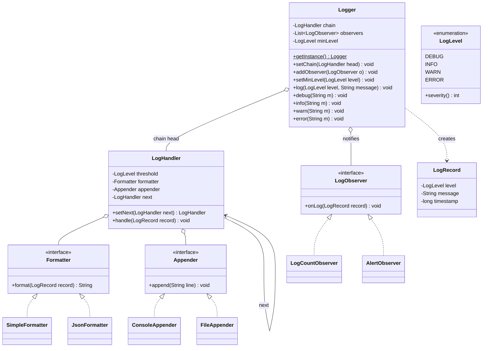

# Chapter 41 — Logging Framework

> Phase 5 case study (Java + C++). Interview-style walkthrough. A logging library combining **Singleton** (one global logger), **Chain of Responsibility** (level-threshold handlers routing to destinations), and **Observer** (log listeners like metrics/alerting), with pluggable **Formatter** and **Appender** pieces (Strategy).

## 1. The Prompt

> *"Design a logging framework (like log4j / SLF4J)."*

Deceptively deep. Levels, multiple destinations (console/file), formatting, one shared instance, performance under load, thread safety. Clarify how far to go — the interesting core is **route a message by severity to the right destinations, plus let listeners react**.

---

## 2. Clarifying Questions

| Question | Assumed answer |
|----------|----------------|
| Log levels? | **DEBUG < INFO < WARN < ERROR** (severity order) |
| One logger or many? | **One global `Logger`** (Singleton) as the entry point |
| Multiple destinations? | Yes — console, file, etc., each with a **min-severity threshold** |
| How is routing done? | A **Chain of Responsibility**: a record flows through handlers, each writes if the record meets its threshold |
| Can other code react to logs? | Yes — **Observers** (metrics counter, alerting on ERROR) |
| Formatting? | Pluggable **Formatter** (plain text / JSON) |
| Async, rotation, sampling, thread safety? | **Noted as follow-ups**; v1 is synchronous |

---

## 3. Scope & Requirements

**Functional**
- A single global `Logger` with `debug/info/warn/error(message)`.
- A **global minimum level** — messages below it are dropped early.
- Route each accepted record through **handlers**, each writing to its **appender** if the
  record's level meets the handler's **threshold** (console = everything, file = WARN+, etc.).
- Format records via a pluggable **Formatter**.
- Notify **observers** (e.g., an error counter, an alerter) on every accepted record.

**Non-functional**
- **One instance** (Singleton) reachable everywhere.
- **Pluggable destinations** (Appender) and **formatting** (Formatter) — add one = one class.
- **Extensible routing** — a new handler/threshold is additive (Chain of Responsibility).
- **Decoupled reactions** — listeners don't touch the logger's routing (Observer).

**Out of scope (v1):** async/non-blocking logging, log rotation, sampling/rate-limiting,
distributed correlation IDs, real file I/O (simulated).

---

## 4. Approach / Plan

1. One shared entry point everywhere → a **Singleton** `Logger`.
2. A record must reach **several destinations**, each caring only about messages **at or above
   its severity** → a **Chain of Responsibility** of handlers, each `(threshold, appender,
   formatter)`; the record flows through and each writes if eligible, then forwards.
3. *What* a line looks like (text vs JSON) and *where* it goes (console/file) are orthogonal →
   pluggable **Formatter** and **Appender** (Strategy).
4. Other subsystems want to react to logs (count errors, fire alerts) without being in the
   write path → **Observers** notified per record.
5. A global min-level gate drops sub-threshold messages before any work.

Anticipated patterns: **Singleton** (logger), **Chain of Responsibility** (handlers),
**Observer** (listeners), + **Strategy** (formatter/appender).

---

## 5. Core Entities & Public API

| Entity | Responsibility |
|--------|----------------|
| `Logger` | **Singleton** entry point; holds the handler chain, observers, global level; `log(level, msg)` |
| `LogLevel` | `DEBUG`/`INFO`/`WARN`/`ERROR` with a severity number |
| `LogRecord` | An immutable record: level, message, timestamp |
| `LogHandler` | **Chain of Responsibility** node: a threshold + a formatter + an appender + `next` |
| `Formatter` | **Strategy**: `format(record) → String`; `Simple` / `Json` |
| `Appender` | **Strategy** destination: `append(line)`; `Console` / `File` |
| `LogObserver` | **Observer**: `onLog(record)`; `LogCountObserver` / `AlertObserver` |

```java
Logger log = Logger.getInstance();
log.setMinLevel(LogLevel.DEBUG);
log.setChain(consoleHandler);       // console -> file -> error, linked via setNext
log.addObserver(new LogCountObserver());
log.info("server started");
log.error("db connection failed");  // routed by severity + observers fire
```

---

## 6. Class Diagram



---

## 7. Patterns Applied

| Pattern | Where | Why |
|---------|-------|-----|
| **Singleton** (Ch08) | `Logger` | One shared logger reachable from anywhere; configured once |
| **Chain of Responsibility** (Ch17) | `LogHandler` chain | A record flows through handlers; each writes if it meets its threshold, then forwards — new destinations/thresholds are additive |
| **Observer** (Ch23) | `Logger` → `LogObserver` | Metrics/alerting react to every record without sitting in the write path |
| **Strategy** (Ch22) | `Formatter`, `Appender` | Swap *how* a line looks (text/JSON) and *where* it goes (console/file) independently |

> The chain routes by **severity threshold**: console handler (DEBUG) writes everything, file handler (WARN) writes warnings and errors, an error handler (ERROR) handles only errors. One record, fanned out by eligibility.

---

## 8. Walk the Main Flow

```
log.error("db down")
  ├─ ERROR.severity >= minLevel?           (global gate; else drop)
  ├─ record = LogRecord(ERROR, "db down", now)
  ├─ chain.handle(record)                   // Chain of Responsibility
  │    ├─ ConsoleHandler(DEBUG): ERROR>=DEBUG → append(format(record)) → forward
  │    ├─ FileHandler(WARN):     ERROR>=WARN  → append(...)            → forward
  │    └─ ErrorHandler(ERROR):   ERROR>=ERROR → append(...)            → (end)
  └─ for each observer: onLog(record)        // Observer (count++, alert!)
```

A `DEBUG` record with the same chain: ConsoleHandler writes it, FileHandler skips (DEBUG < WARN), ErrorHandler skips — routed to exactly the right destinations by threshold.

---

## 9. Follow-up Questions (the interviewer pushes)

**Q: "Why a Singleton for the logger — and what's the downside?"**
Logging is a **cross-cutting concern** every class needs, with **shared config and destinations**; a Singleton gives one reachable, consistently-configured instance without threading it through every constructor. The downside is the usual Singleton tax: it's a **global** that hurts unit testing (hidden dependency) and can hide config coupling. Real frameworks (SLF4J) soften this with a `LoggerFactory.getLogger(Class)` that returns per-class named loggers sharing global config — a compromise between "one global" and "inject everywhere."

**Q: "Is this thread-safe? Many threads log at once."**
Two concerns: (1) **Singleton creation** — use lazy-but-safe init (Bill Pugh in Java, Meyer's in C++), covered in Ch08. (2) **Concurrent `log()` calls** — appenders writing to the same console/file must be synchronized (a lock around the append, or a thread-safe/queued appender), or lines interleave. State the fix: guard the write, or hand off to a single writer.

**Q: "Logging on the request path is slow (disk I/O). Make it fast."**
Go **asynchronous**: `log()` just enqueues the `LogRecord` on a lock-free/bounded queue and returns; a **background thread** drains the queue and runs the handler chain. This decouples the caller from I/O latency (the big win in high-throughput services). Trade-offs: possible **loss on crash** (records still in the queue) and **ordering/backpressure** to manage. The design barely changes — the queue sits between `log()` and `chain.handle()`.

**Q: "Why Chain of Responsibility instead of just a list of appenders?"**
Honest answer: real frameworks (log4j) mostly use a **list of appenders each with a level filter** — functionally the same fan-out. The **Chain** framing makes the *ordering* and *forwarding* explicit and lets a handler **stop propagation** (e.g., a security handler that redacts and halts) or transform the record before passing it on — things a flat list can't express as naturally. If the interviewer prefers, a `List<Appender>` with per-appender thresholds is a perfectly valid simplification.

**Q: "Structured logging / JSON output?"**
That's the **Formatter** Strategy: a `JsonFormatter` emits `{"level":"ERROR","msg":...,"ts":...}` while `SimpleFormatter` emits text. Because formatting is separate from destination, the *same* console/file appender can emit either — swap the formatter, nothing else changes.

**Q: "Change the log level at runtime (turn on DEBUG in prod)?"**
The global `minLevel` (and per-handler thresholds) are just fields — expose setters. A record is gated before any handler runs, so flipping to DEBUG immediately starts admitting debug records. Real systems watch a config file / admin endpoint and update the level live.

**Q: "Rate-limit or sample noisy logs?"**
A `SamplingHandler` in the chain (log 1 in N of a repeated message) or a token-bucket per logger. Because it's a chain node, it can **drop** a record (not forward) — a clean place to enforce rate limits without touching call sites.

**Q: "Log rotation for the file destination?"**
A concern of the **`FileAppender`**: roll to a new file at a size/time boundary and archive the old one. It's encapsulated in the appender — the handler and logger are unaware. That's the payoff of `Appender` being a separate Strategy.

**Q: "Who are the Observers vs the handlers — aren't both 'reacting to logs'?"**
Different roles. **Handlers** are the *write path* — they format and emit to destinations (their job is output). **Observers** are *side-channel reactions* — count errors for a metrics dashboard, fire a pager alert on ERROR, feed an anomaly detector. Keeping them separate means a metrics observer doesn't accidentally become a destination, and destinations don't get entangled with alerting logic.

---

## 10. Trade-offs & Talking Points

- **Singleton vs injected logger:** Singleton is ergonomic for a cross-cutting concern but is a global (testing/coupling cost); named per-class loggers over shared config is the industry compromise.
- **Sync vs async:** synchronous is simple and loss-free but couples callers to I/O latency; async is fast but risks loss on crash and needs backpressure. Most high-throughput systems go async.
- **Chain vs list of appenders:** the chain expresses ordering, forwarding, transformation, and short-circuit; a flat list is simpler and matches log4j. Pick based on whether you need those behaviors.
- **Formatter/Appender split:** orthogonal axes (how vs where) — separating them avoids an M×N explosion of "JSON-to-file", "text-to-console" classes.
- **Observers separate from handlers:** keeps the write path and the reaction path independent; the cost is two extension mechanisms to understand.

---

## 11. Summary (what to say at the end)

> "A **Singleton** `Logger` is the global entry point. Each message becomes a `LogRecord`, gated by a global min-level, then routed through a **Chain of Responsibility** of handlers — each writes to its **Appender** via a **Formatter** if the record meets the handler's severity **threshold**, so console gets everything, file gets warnings+, an error handler gets errors. **Observers** (metrics counter, alerter) react to every record off the write path. Formatting and destinations are pluggable **Strategies**. The production concerns — **thread-safe concurrent writes**, **async logging** for throughput, level changes, rotation, and sampling — all slot into this structure: a queue before the chain, thresholds and formatters as config, rotation inside the appender."

---

## 12. What's Next

Study the code in `src/java` and `src/cpp` — a Singleton logger with a console→file→error handler chain routing by severity, pluggable simple/JSON formatters, console/file appenders, and observers counting records and alerting on errors. The demo logs at every level and shows how each is routed to different destinations, an error firing an alert, and a runtime level change dropping debug logs. Then the assignments, which are the follow-ups above: add a **JSON formatter + a per-message sampling handler** (easy), and **asynchronous (queued) logging with a thread-safe appender** (medium).
