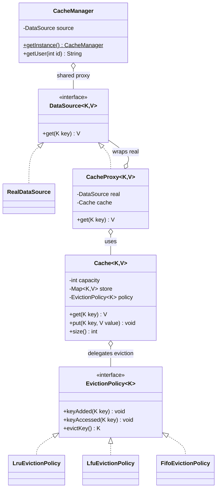

# Chapter 42 — Cache Design (LRU Cache)

> Phase 5 case study (Java + C++) — the final Phase 5 design. A cache combining **Strategy** (pluggable eviction: LRU / LFU / FIFO), **Proxy** (a caching proxy in front of a slow data source), and **Singleton** (one shared cache instance).

## 1. The Prompt

> *"Design an LRU cache."* (often extended to *"…make the eviction policy pluggable"*)

Two layers: the **data structure** question (LRU with O(1) get/put) and the **design** question (make eviction a strategy, put the cache in front of a slow source, share one instance). A strong answer nails the O(1) LRU *and* generalizes it.

---

## 2. Clarifying Questions

| Question | Assumed answer |
|----------|----------------|
| Fixed capacity? | Yes — evict when full |
| Which eviction policy? | **LRU** primary, but make it **pluggable** (LFU, FIFO too) |
| Required complexity? | **O(1)** `get` and `put` for LRU |
| What sits behind the cache? | A **slow data source** (DB/service); the cache fronts it (Proxy) |
| One cache or many? | **One shared instance** reachable globally (Singleton) |
| Thread-safe? | Note as a follow-up; v1 is single-threaded |
| TTL / expiry, distributed cache, write policies? | **Out of scope** v1 (follow-ups) |

---

## 3. Scope & Requirements

**Functional**
- Fixed-capacity cache with `get(key)` and `put(key, value)`.
- **Evict** when full, per a **pluggable policy** (LRU / LFU / FIFO).
- LRU `get`/`put` in **O(1)**.
- A **caching proxy** over a slow `DataSource`: hit → return; miss → fetch, cache, return.
- One **shared** cache instance (Singleton) for global access.

**Non-functional**
- **Pluggable eviction** — a new policy is one class, no cache change (Strategy).
- **Transparent caching** — the client uses the same `DataSource` interface (Proxy).
- **Storage decoupled from policy** — the cache stores key→value; the policy only tracks ordering/bookkeeping.

**Out of scope (v1):** thread safety, TTL/expiry, write-through/back, distributed sharding.

---

## 4. Approach / Plan

1. **Separate storage from eviction.** The `Cache` owns the key→value map; a pluggable **EvictionPolicy** owns only the bookkeeping to answer "which key to evict." That makes eviction a **Strategy** (LRU/LFU/FIFO) with zero change to the cache.
2. **LRU in O(1)** — the classic **hashmap + doubly-linked list**: the list keeps keys in recency order (front = most recent, back = least), the map gives O(1) access to a node so `keyAccessed` can splice it to the front in O(1). (In Java, `LinkedHashSet`/`LinkedHashMap` gives this for free; in C++, `std::list` + `unordered_map<K, list::iterator>`.)
3. **Front the slow source with a caching Proxy** — same `DataSource` interface; on miss it fetches from the real source and populates the cache.
4. **One shared cache** — a **Singleton** `CacheManager` vends the configured cache/proxy.

Anticipated patterns: **Strategy** (eviction), **Proxy** (caching), **Singleton** (shared cache).

---

## 5. Core Entities & Public API

| Entity | Responsibility |
|--------|----------------|
| `Cache<K,V>` | Fixed-capacity store; `get`/`put`; delegates eviction choice to the policy |
| `EvictionPolicy<K>` | **Strategy**: `keyAdded` / `keyAccessed` / `evictKey`; `Lru` / `Lfu` / `Fifo` |
| `DataSource<K,V>` | The thing being cached; `get(key)` |
| `RealDataSource` | The slow backing store (simulated DB) |
| `CacheProxy<K,V>` | **Proxy**: same `DataSource` interface; checks cache, fetches on miss |
| `CacheManager` | **Singleton**: global access to a configured cache-backed source |

```java
Cache<Integer,String> cache = new Cache<>(3, new LruEvictionPolicy<>());
cache.put(1, "a");
cache.get(1);                       // marks 1 as most-recently-used

DataSource<Integer,String> src = new CacheProxy<>(new RealDataSource(), cache);
src.get(42);                        // miss -> DB fetch -> cached
src.get(42);                        // hit -> from cache

CacheManager.getInstance().getUser(7);   // shared instance
```

---

## 6. Class Diagram



---

## 7. Patterns Applied

| Pattern | Where | Why |
|---------|-------|-----|
| **Strategy** (Ch22) | `EvictionPolicy` (LRU/LFU/FIFO) | Swap the eviction algorithm without touching the cache; storage and policy are decoupled |
| **Proxy** (Ch16) | `CacheProxy` over `DataSource` | Transparent caching in front of a slow source; the client uses the same interface (a *caching proxy*) |
| **Singleton** (Ch08) | `CacheManager` | One shared, configured cache reachable globally |

> The design's cleanest idea: the `Cache` holds the data; the `EvictionPolicy` holds *only* the ordering bookkeeping. That split is what makes LRU→LFU→FIFO a one-line swap.

---

## 8. Walk the Main Flow

**LRU cache (capacity 3):**
```
put(1,a) put(2,b) put(3,c)      order (MRU..LRU): 3,2,1
get(1)                          access 1 -> order: 1,3,2
put(4,d)                        full -> evict LRU = 2 -> order: 4,1,3
get(2)                          MISS (2 was evicted)
```

**Caching proxy over the slow source:**
```
proxy.get(42)
  ├─ cache.get(42) -> miss
  ├─ real.get(42)  -> "[DB] fetching 42"   (slow)
  ├─ cache.put(42, value)
  └─ return value
proxy.get(42)
  └─ cache.get(42) -> HIT -> return (no DB call)
```

**put with eviction (Strategy in action):**
```
cache.put(k, v)
  ├─ key present? -> update + policy.keyAccessed(k)
  └─ else: full? -> victim = policy.evictKey(); store.remove(victim)
           store.put(k,v); policy.keyAdded(k)
```

---

## 9. Follow-up Questions (the interviewer pushes)

**Q: "How do you make LRU `get` and `put` O(1)?"**
**Hashmap + doubly-linked list.** The map is `key → node`; the list orders nodes by recency (front = MRU, back = LRU). `get`: map lookup O(1), then **splice** that node to the front O(1). `put` on a full cache: remove the **tail** node (LRU) O(1), insert new at front O(1). The doubly-linked list is essential — a singly-linked list can't remove an arbitrary node in O(1). (Java's `LinkedHashMap(accessOrder=true)` implements exactly this; my `LruEvictionPolicy` uses an ordered set / list+iterator map.)

**Q: "Why separate the `Cache` from the `EvictionPolicy`?"**
So eviction is a **Strategy**. The cache's job is store + lookup; the policy's job is "given accesses and inserts, tell me who to evict." Decoupling them means LRU, LFU, and FIFO are interchangeable classes — the cache code is identical for all three. Baking LRU into the cache would force a rewrite to support LFU.

**Q: "LRU vs LFU vs FIFO — when does each win?"**
- **LRU** (recency): great for temporal locality — recently used likely used again. The common default.
- **LFU** (frequency): better when some items are *persistently* hot regardless of recency, but it can keep stale-but-once-popular items and needs frequency bookkeeping (and aging to forget old popularity).
- **FIFO** (insertion order): simplest, ignores access — cheap but evicts hot items that were merely inserted early. Rarely optimal, sometimes fine.
Being a Strategy lets you A/B them against real traffic.

**Q: "Make it thread-safe."**
Concurrent `get`/`put` mutate both the map and the policy's list — a data race. Options: (1) a single **lock** around cache ops (simple, but a contention bottleneck since even `get` mutates recency order); (2) **lock striping** (partition keys into segments, lock per segment) for better throughput; (3) concurrent structures (e.g., Java `ConcurrentHashMap` + a lock-free-ish approximation of LRU). Note the subtlety: **LRU reads are writes** (they reorder), so a plain read-write lock doesn't help — that pushes real systems toward *approximate* LRU (sampled/second-chance) under high concurrency.

**Q: "Add TTL / expiry."**
Store an expiry timestamp per entry; on `get`, treat an expired entry as a miss (and lazily evict it), plus optionally a background sweeper for proactive cleanup. TTL is orthogonal to the eviction policy — both can coexist (evict on expiry *or* on capacity).

**Q: "Why a Proxy in front of the data source?"**
The **caching proxy** gives the client the *same* `DataSource.get(key)` interface while transparently serving hits from memory and only hitting the slow source on a miss (Ch16). The client doesn't know or care caching exists — you can add/remove the cache by swapping the implementation. A **remote proxy** variant would make the backing source an RPC to a DB.

**Q: "Cache stampede — many misses for the same hot key at once?"**
The **thundering herd**: a popular key expires and N requests all miss and hit the DB simultaneously. Fixes: a **per-key lock** so only the first request fetches while others wait for the result; **request coalescing** (single-flight); or serving slightly stale data while one refresh runs. Worth naming even if not implemented.

**Q: "Write policies — how do writes interact with the cache?"**
- **Write-through**: write to cache *and* source synchronously (consistent, slower writes).
- **Write-back**: write to cache, flush to source later (fast, risks loss on crash).
- **Write-around**: write straight to source, skip the cache (avoids polluting cache with write-once data).
Pick per workload; each is a variation of the proxy's `put` path.

**Q: "Scale beyond one box — distributed cache?"**
Shard keys across nodes with **consistent hashing** (so adding/removing a node moves minimal keys); this is Redis/Memcached territory. The single-node cache design (map + policy) becomes one shard; a client-side or proxy layer routes keys to shards.

**Q: "The Singleton cache — downside?"**
Same global tax as any Singleton: hard to isolate in tests, one shared config. In practice you'd inject the cache (or a `CacheManager` that vends **named** caches with independent capacities/policies) rather than a single hard global.

---

## 10. Trade-offs & Talking Points

- **DLL + hashmap vs a `LinkedHashMap`:** rolling your own DLL shows you understand the O(1) mechanics; `LinkedHashMap(accessOrder=true)` is the pragmatic production choice. Know both.
- **Storage/policy split:** more classes, but it's what makes eviction pluggable; a monolithic LRU cache can't become LFU without surgery.
- **LRU reads are writes:** the reordering on `get` is why LRU is awkward to make lock-free; production caches often use **approximate LRU** (sampling, second-chance/CLOCK) to avoid the contention.
- **Exact LFU cost:** tracking frequencies (and aging them) is more state and more work than LRU; often not worth it unless the workload is clearly frequency-skewed.
- **Singleton vs injected/named caches:** a global is convenient but inflexible; named caches over a manager scale to many independent caches and are testable.

---

## 11. Summary (what to say at the end)

> "The cache stores key→value and delegates the *who-to-evict* decision to a pluggable **EvictionPolicy** Strategy, so LRU/LFU/FIFO are interchangeable. LRU itself is O(1) via a **hashmap + doubly-linked list** — the map finds a node, the list splices it to the front on access and drops the tail on eviction. A **caching Proxy** fronts the slow `DataSource` with the same interface, serving hits from memory and fetching only on a miss, and a **Singleton** `CacheManager` shares one configured instance. The production concerns — **thread safety** (LRU reads are writes, so approximate LRU under contention), **TTL**, **cache stampede** (single-flight), **write policies**, and **distributed sharding** (consistent hashing) — all extend this structure without changing the core storage/policy split."

---

## 12. What's Next

Study the code in `src/java` and `src/cpp` — a generic capacity-bounded `Cache` with pluggable LRU/LFU/FIFO eviction, a caching `CacheProxy` over a slow `RealDataSource`, and a `CacheManager` Singleton. The demo shows LRU eviction order, the *same* access pattern evicting a **different** key under FIFO vs LFU (Strategy), a proxy miss-then-hit, and the shared singleton. Then the assignments, which are the follow-ups above: add **TTL expiry + a `LinkedHashMap`-based LRU variant** (easy), and **thread-safe concurrent access (lock striping) + single-flight to prevent cache stampede** (medium).

---

> **Phase 5 complete.** With this chapter, all 15 real-world case studies (Ch28–42) are done. Next is Phase 6 — Advanced Topics (Concurrency, Refactoring, Testing, Interview Strategies).
