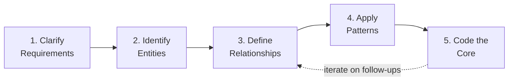
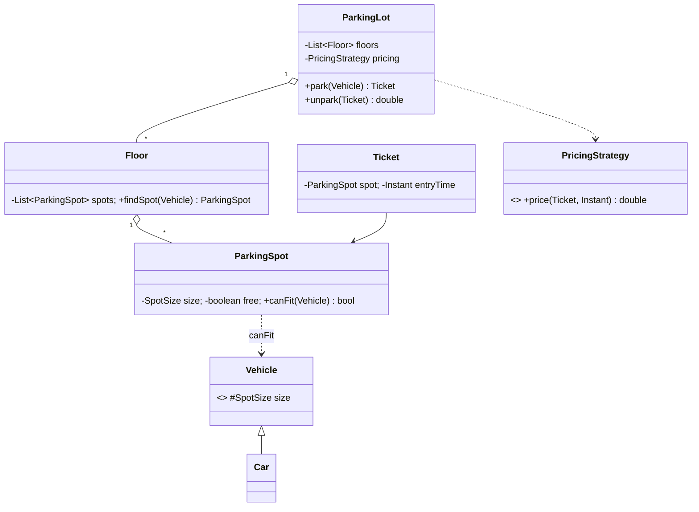

# Chapter 46 — LLD Interview Strategies (Capstone)

> **Phase 6 — Advanced Topics. The final chapter.** This isn't about a new pattern — it's about
> *how to use everything from Ch01–45 under pressure, in ~45 minutes, out loud.* The LLD
> interview doesn't test whether you know 23 patterns. It tests whether you can turn a vague
> prompt ("Design a parking lot") into a clean, extensible object model while **thinking aloud**.

---

## What the interviewer is actually grading

You are being scored on **process**, not on producing the "one right answer" (there isn't one):

| Signal | What they watch for |
|--------|---------------------|
| **Requirements clarification** | Do you ask before you code, or dive in and build the wrong thing? |
| **Structured decomposition** | Nouns → classes, verbs → methods; clear responsibilities (SRP) |
| **Relationships & abstractions** | Interfaces at the seams, composition over inheritance, program to abstractions |
| **Pattern judgment** | Do you reach for a pattern *because it fits*, or bolt one on to show off? |
| **Extensibility** | "How would you add X?" — does your design bend or break? (OCP) |
| **Communication** | Do you narrate trade-offs, or go silent and scribble? |

The candidate who says *"I'll make `DiscountPolicy` an interface so we can add new discounts
without touching checkout"* beats the one who silently writes a perfect class.

---

## The 5-Step Framework (memorize this)

A repeatable spine for **any** LLD prompt. Roughly maps to the time budget of a 45-min round.



### Step 1 — Clarify Requirements (~5 min)
Never start coding. Pin down **scope** first — the prompt is deliberately vague.
- **Functional:** what must it *do*? List 3–5 core use cases. ("Park/unpark a vehicle, find a
  free spot, calculate the fee.")
- **Out of scope:** say what you're *not* building. ("I'll skip payments/persistence and focus
  on the spot-allocation model — okay?") This shows judgment and saves time.
- **Scale/constraints:** single vs multi-floor? concurrency? just enough to shape the design.
- **Write the agreed use cases down.** They become your checklist and your class-diagram driver.

### Step 2 — Identify Entities (~5 min)
**Nouns become candidate classes.** From "a *vehicle* parks in a *spot* on a *floor*, gets a
*ticket*, pays a *fee*" → `Vehicle`, `ParkingSpot`, `Floor`, `Ticket`, `Fee/PricingStrategy`,
`ParkingLot`. Group them, drop duplicates, name them well (no abbreviations).

### Step 3 — Define Relationships (~5 min)
For each pair ask: **is-a, has-a, or uses-a?**
- **has-a → composition** (`ParkingLot` has `Floor`s has `Spot`s). Default choice.
- **is-a → inheritance / interface** — only for genuine substitutability (`Car`/`Bike` *is-a*
  `Vehicle`). Prefer an **interface** at every seam you'll want to swap.
- **uses-a → association** (a `FeeCalculator` *uses* a `Ticket`).
- Draw the **class diagram now** (even rough). It's your shared artifact — narrate as you draw.

### Step 4 — Apply Patterns (~5 min, woven into Step 5)
Introduce a pattern **only when a specific force demands it** — and *say the force out loud*:
- *"Multiple pricing schemes"* → **Strategy** (`PricingStrategy`).
- *"Create the right `Vehicle`/product from a type"* → **Factory**.
- *"One `ParkingLot` instance"* → **Singleton** (mention thread-safety).
- *"Display board reacts to spot changes"* → **Observer**.
- *"Object behaves differently by lifecycle stage"* → **State**.
Don't force-fit. "No pattern needed here, a plain class is clearer" is a *strong* answer.

### Step 5 — Code the Core (~15–20 min)
Code the **skeleton of the interesting part**, not every getter.
- Interfaces + key classes + the one or two methods that carry the core algorithm.
- Leave obvious boilerplate as `// getters/setters` and say so.
- Keep it compiling in your head; use real names; show one end-to-end path
  (`park() → assignSpot() → issueTicket()`).
- **Reserve ~5 min** for follow-ups/trade-offs — that's where senior signal lives.

---

## Time management (45-min round, rough)

| Phase | Time | Trap to avoid |
|-------|------|---------------|
| Clarify | 5 | Diving into code with unstated assumptions |
| Entities + relationships + diagram | 10 | Over-modeling — 20 classes for a 6-class problem |
| Patterns + core code | 20 | Gold-plating; writing every trivial getter |
| Follow-ups & trade-offs | 10 | Running out of time before the "how would you extend it?" |

If you're sinking, **cut scope out loud**: *"To stay on time I'll model single-floor first,
then note the multi-floor extension."* Controlled scope-cutting is a senior move.

---

## Communication framework — think aloud

Silence is the #1 killer. Narrate a running commentary:
- **State assumptions:** *"I'll assume one entry gate for now."*
- **Announce decisions + the why:** *"I'm making this an interface so we can add types via OCP."*
- **Offer trade-offs:** *"Singleton is simplest but hurts testability — I'd inject it in prod."*
- **Invite steering:** *"Want me to go deeper on pricing or on concurrency?"*
- **Handle pushback gracefully:** if challenged, reason about it — don't get defensive. Changing
  your mind with good reasoning is a *plus*.

---

## Worked example — "Design a Parking Lot" in the framework

**1. Clarify.** Use cases: park a vehicle, find nearest free spot for its size, unpark, compute
fee by duration. Scope: multi-floor, single entry; skip payment gateway + persistence.
Vehicle sizes: Bike/Car/Truck ↔ spot sizes.

**2. Entities.** `Vehicle` (abstract) → `Bike`/`Car`/`Truck`; `ParkingSpot` (with size);
`Floor`; `Ticket`; `PricingStrategy`; `ParkingLot`.

**3. Relationships.**


**4. Patterns (with the force):**
- `PricingStrategy` interface (`FlatRate`, `PerHour`) → **Strategy**: pricing changes independently.
- `VehicleFactory.create(type)` → **Factory**: centralize creation, add types via OCP.
- `ParkingLot` single instance → **Singleton** (thread-safe; note DI alternative for testing).
- `DisplayBoard` observes free-count → **Observer** (mention if time allows).

**5. Core code (skeleton):**
```java
interface PricingStrategy { double price(Ticket t, Instant exit); }

class ParkingLot {                       // Singleton in prod; inject in tests
    private final List<Floor> floors;
    private final PricingStrategy pricing;
    Ticket park(Vehicle v) {
        ParkingSpot spot = floors.stream()
            .map(f -> f.findSpot(v)).filter(Objects::nonNull)
            .findFirst().orElseThrow(() -> new NoSpotException());
        spot.occupy(v);
        return new Ticket(spot, Instant.now());   // note: inject Clock for testability (Ch45!)
    }
    double unpark(Ticket t) {
        double fee = pricing.price(t, Instant.now());
        t.spot().release();
        return fee;
    }
}
```
Narrate: *"`park` returns null-free via the stream; I'd inject a `Clock` instead of
`Instant.now()` so fee logic is testable — straight from the testing chapter."*

---

## Pattern-selection cheat sheet (trigger → pattern)

When you hear the **cue**, reach for the **pattern**:

| Cue in the prompt | Pattern | Chapter |
|-------------------|---------|---------|
| "Different algorithms / interchangeable behavior" | **Strategy** | 20 |
| "Create objects without hard-coding the class" | **Factory / Abstract Factory** | 05–06 |
| "Many optional construction params" | **Builder** | 07 |
| "Exactly one instance" | **Singleton** | 08 |
| "Add responsibilities at runtime" | **Decorator** | 13 |
| "Incompatible interface to bridge" | **Adapter** | 10 |
| "Tree / part-whole hierarchy" | **Composite** | 12 |
| "One-to-many notify on change" | **Observer** | 24 |
| "Behavior changes by lifecycle state" | **State** | 25 |
| "Encapsulate a request / undo" | **Command** | 17 |
| "Step skeleton, vary steps" | **Template Method** | 22 |
| "Control access / lazy / cache" | **Proxy** | 15 |

## Common LLD prompts → what they really test

| Prompt | Core patterns | Chapter to revisit |
|--------|---------------|---------------------|
| Parking Lot | Strategy, Factory, Singleton | 28 |
| Vending Machine | **State**, Strategy | 30 |
| Elevator System | State, Strategy (scheduling) | 33 |
| Splitwise | Strategy (split), Observer | 36-style |
| Chess / Tic-Tac-Toe | State, Strategy, Factory | 38 |
| Notification Service | Observer, Strategy, Factory | 41 |
| LRU Cache | Strategy (eviction), Proxy | 42 |
| Ride-Sharing | Strategy, Observer, State, Proxy | 39 |

---

## Red flags to avoid
- **Coding before clarifying** — the #1 rejection cause.
- **God class** — one `Manager` that does everything (Ch44 smell).
- **Pattern-dropping** — forcing Visitor into a 3-class problem to look clever.
- **Going silent** — the interviewer can't grade thoughts they can't hear.
- **Ignoring extensibility** — hard-coded `if/switch` on type instead of polymorphism (Ch03 OCP).
- **No abstractions** — concrete classes wired directly, nothing swappable (Ch03 DIP).

## Green flags that signal senior
- Explicitly scoping and **cutting** scope to fit time.
- Naming the **force** before the pattern ("because pricing varies independently…").
- Volunteering **trade-offs** (Singleton vs DI, inheritance vs composition).
- Designing for the **follow-up** you can see coming ("this interface lets us add X later").
- Tying testability to design (inject a `Clock`, program to interfaces) — Ch45.

---

## Course wrap-up

You've gone from **OOP + SOLID (Ch01–04)** → all **23 GoF patterns (Ch05–27)** → **15 real-world
case studies (Ch28–42)** → **advanced topics: concurrency, refactoring, testing (Ch43–45)** →
and now the **interview method** that turns all of it into a performance. The framework here is
the glue: *Clarify → Entities → Relationships → Patterns → Code*, narrated out loud, with
trade-offs. Practice it on the prompts below until the spine is automatic — then the patterns
just fall into the slots. **That completes the course. Congratulations.**
